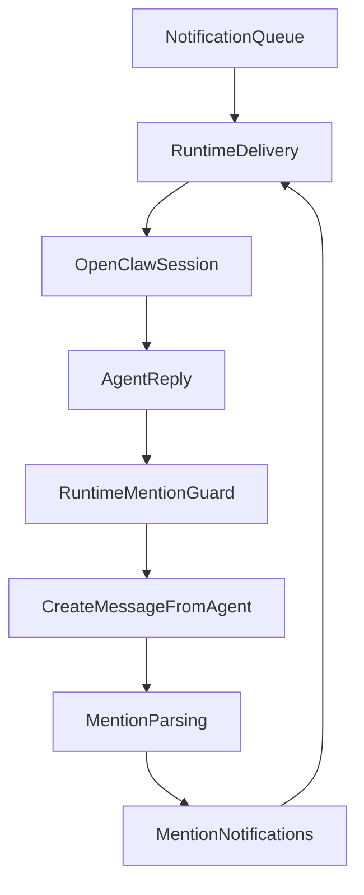

# Agent Mentions Follow-Up Loop Plan

## 1. Context & goal

We want orchestrator replies to reliably trigger follow‑up from the right agents using @mentions, while preserving existing loop‑prevention rules. The plan adds a mentionable agent roster to the OpenClaw prompt, explicitly instructs the orchestrator to @mention relevant agents, and adds a conservative auto‑mention fallback for assigned agents when the orchestrator forgets to mention anyone. This keeps discussion inside the single task thread, which matches the project’s core collaboration model.

User stories:

- As an orchestrator agent, I can see a list of mentionable agents (slug/name/role) in the prompt so I can @mention the right people.
- As an orchestrator agent, if I reply without any @mention, assigned agents still receive a notification so iteration continues.
- As a team, we avoid agent‑to‑agent loops and keep all work in the task thread.

Acceptance criteria:

- When the orchestrator replies to a `thread_update` from an agent and includes **no** @mentions, assigned agents receive a **mention** notification (auto‑mention fallback).
- When the orchestrator explicitly @mentions any agent (assigned or not), that agent receives a **mention** notification and the fallback is not applied.
- Existing loop prevention still blocks `thread_update` → `thread_update` cascades between agents.
- Orchestrator prompt includes a list of mentionable agents with clear @mention syntax.

Constraints:

- Preserve loop‑prevention behavior in `shouldDeliverToAgent`.
- No cross‑account data exposure when listing mentionable agents.
- Runtime delivery remains idempotent (no duplicate messages).
- Keep prompt size manageable even with larger agent rosters.
- Add JSDoc for any new helper functions (project rule).

## 2. Codebase research summary

Files inspected:

- [apps/runtime/src/delivery.ts](/Users/guillaumedieudonne/Desktop/mission-control/apps/runtime/src/delivery.ts)
- [apps/runtime/src/heartbeat.ts](/Users/guillaumedieudonne/Desktop/mission-control/apps/runtime/src/heartbeat.ts)
- [packages/backend/convex/service/notifications.ts](/Users/guillaumedieudonne/Desktop/mission-control/packages/backend/convex/service/notifications.ts)
- [packages/backend/convex/lib/mentions.ts](/Users/guillaumedieudonne/Desktop/mission-control/packages/backend/convex/lib/mentions.ts)
- [packages/backend/convex/messages.ts](/Users/guillaumedieudonne/Desktop/mission-control/packages/backend/convex/messages.ts)
- [packages/backend/convex/service/messages.ts](/Users/guillaumedieudonne/Desktop/mission-control/packages/backend/convex/service/messages.ts)
- [packages/backend/convex/lib/notifications.ts](/Users/guillaumedieudonne/Desktop/mission-control/packages/backend/convex/lib/notifications.ts)
- [apps/web/src/components/tasks/TaskThread.tsx](/Users/guillaumedieudonne/Desktop/mission-control/apps/web/src/components/tasks/TaskThread.tsx)
- [apps/web/src/components/tasks/MessageInput.tsx](/Users/guillaumedieudonne/Desktop/mission-control/apps/web/src/components/tasks/MessageInput.tsx)
- [docs/runtime/AGENTS.md](/Users/guillaumedieudonne/Desktop/mission-control/docs/runtime/AGENTS.md)
- [docs/concept/openclaw-mission-control-initial-article.md](/Users/guillaumedieudonne/Desktop/mission-control/docs/concept/openclaw-mission-control-initial-article.md)

Key behaviors to preserve:

- Mention parsing uses this regex and supports quoted names:

```20:39:packages/backend/convex/lib/mentions.ts
export function extractMentionStrings(content: string): string[] {
  const pattern = /@(\w+(?:-\w+)*|"[^"]+")/g;
  const matches = content.match(pattern) || [];
  ...
}
```

- Agent‑to‑agent loops are blocked when the source notification is also a `thread_update`:

```215:249:apps/runtime/src/delivery.ts
function shouldDeliverToAgent(context: any): boolean {
  ...
  if (sourceNotificationType === "thread_update") {
    return false;
  }
  ...
}
```

- If an agent is explicitly mentioned, `thread_update` notifications for agents are skipped, so mentions are the correct follow‑up mechanism:

```72:104:packages/backend/convex/lib/notifications.ts
for (const subscription of subscriptions) {
  if (hasAgentMentions && subscription.subscriberType === "agent") continue;
  ...
}
```

## 3. High-level design

### Summary

- Extend the delivery context with a **mentionable agent roster** and **assigned agents** list.
- Update the orchestrator prompt to include the roster and explicit @mention guidance.
- Add a conservative auto‑mention fallback for assigned agents when the orchestrator forgets to mention anyone.

### Data flow (with mention fallback)



### Auto‑mention fallback rules

Apply the fallback **only** when all of the following are true:

- `context.notification.type === "thread_update"`
- `context.message.authorType === "agent"` (replying to another agent)
- `context.notification.recipientId === context.orchestratorAgentId`
- The orchestrator reply has **no** explicit @mentions
- There is at least one assigned agent who is not the orchestrator

### Data shape to add to delivery context

Use minimal fields to avoid large payloads:

```
mentionableAgents: Array<{
  id: Id<"agents">;
  slug: string;
  name: string;
  role: string;
}>;
assignedAgents: Array<{
  id: Id<"agents">;
  slug: string;
  name: string;
  role: string;
}>;
```

## 4. File & module changes

### Backend (Convex)

- [packages/backend/convex/service/notifications.ts](/Users/guillaumedieudonne/Desktop/mission-control/packages/backend/convex/service/notifications.ts)
  - In `getForDelivery`, build `mentionableAgents` from the account‑scoped agents query already used for thread names.
  - Build `assignedAgents` by filtering `mentionableAgents` using `task.assignedAgentIds` (empty array if task is missing).
  - Include both arrays in the return payload.
  - Add JSDoc for any new helper functions.

### Runtime

- [apps/runtime/src/delivery.ts](/Users/guillaumedieudonne/Desktop/mission-control/apps/runtime/src/delivery.ts)
  - Update `formatNotificationMessage()` to include:
    - A section listing mentionable agents as `@slug — Name (Role)`.
    - A short instruction: “If you want another agent to act, @mention them by slug from the list below.”
  - Add helper functions (with JSDoc) at top-level:
    - `hasExplicitMentions(content: string): boolean` using the same regex as `extractMentionStrings`.
    - `buildAutoMentionPrefix(assignedAgents, orchestratorAgentId): string` that:
      - excludes the orchestrator,
      - prefers `@slug`,
      - falls back to `@"Full Name"` if slug missing,
      - returns a trailing blank line to preserve the reply format.
    - `applyAutoMentionFallback(content, context): string` that only applies under the strict rules above.
  - Apply `applyAutoMentionFallback` before calling `createMessageFromAgent`.
  - Add a debug log when auto‑mention is applied (include taskId + mentioned agent ids).

### Docs

- [docs/runtime/AGENTS.md](/Users/guillaumedieudonne/Desktop/mission-control/docs/runtime/AGENTS.md)
  - Add a “Mentions (Orchestrator)” subsection under **Communication rules**:
    - “Use @mentions to request follow‑ups from specific agents.”
    - “Choose agents from the roster list in your prompt.”
    - “Mention only agents who add value; avoid @all unless necessary.”
  - Include a short example reply using `@agent-slug`.

## 5. Step-by-step tasks

1. **Backend: extend delivery context**

- In `getForDelivery` ([packages/backend/convex/service/notifications.ts](/Users/guillaumedieudonne/Desktop/mission-control/packages/backend/convex/service/notifications.ts)):
  - Build `mentionableAgents` from the existing agents query (reuse results; do not add a new query).
  - Sort by `slug` (fallback to `name`), for stable prompt ordering.
  - Build `assignedAgents` by filtering with `task.assignedAgentIds`.
  - Add both to the return object.

1. **Runtime: add roster section to prompt**

- In `formatNotificationMessage()` ([apps/runtime/src/delivery.ts](/Users/guillaumedieudonne/Desktop/mission-control/apps/runtime/src/delivery.ts)):
  - Add a “Mentionable agents” section that renders a capped list (e.g., 25 max).
  - If more than the cap, append “and N more” to the list.
  - Add a short guidance line instructing orchestrator to use @mentions for follow‑ups.

1. **Runtime: add mention detection + prefix helpers**

- Add JSDoc‑documented helpers in `delivery.ts`:
  - `hasExplicitMentions()` with the same regex pattern as backend.
  - `buildAutoMentionPrefix()` for assigned agents excluding orchestrator.
  - `applyAutoMentionFallback()` for the orchestrator + thread_update condition.

1. **Runtime: apply auto‑mention before write‑back**

- In the delivery loop where `responseText` is returned:
  - `const trimmed = responseText.trim();`
  - `const finalContent = applyAutoMentionFallback(trimmed, context);`
  - Use `finalContent` in `createMessageFromAgent`.
- Add a debug log for when `finalContent !== trimmed`.

1. **Docs: update orchestrator guidance**

- Add a concise “Mentions (Orchestrator)” section to [docs/runtime/AGENTS.md](/Users/guillaumedieudonne/Desktop/mission-control/docs/runtime/AGENTS.md) with a short example.

1. **Manual QA**

- Run the checklist in section 7 and confirm expected behavior in logs and UI.

## 6. Edge cases & risks

- **No assigned agents:** `assignedAgents` empty → auto‑mention fallback returns original content.
- **Orchestrator also assigned:** Ensure orchestrator is excluded from the prefix list.
- **Large rosters:** Cap the prompt list and append “and N more”.
- **Duplicate mentions:** If the reply already contains any @mention, do not auto‑prefix.
- **Missing slug:** Fall back to `@"Full Name"` (parser supports quotes).
- **Loop prevention:** Do not modify `shouldDeliverToAgent`; mentions already create the correct notifications.

## 7. Testing strategy

Unit tests (optional; only if runtime test harness exists):

- `hasExplicitMentions()` detects `@slug` and `@"Full Name"` and ignores plain text.
- `buildAutoMentionPrefix()` excludes orchestrator and falls back to quoted name when slug missing.

Manual QA (primary):

1. Create a task and assign agent A.
2. Agent A replies; orchestrator replies **without** @mentions.

- Expect: assigned agent A receives a **mention** notification and responds.

1. Orchestrator replies **with** `@agent-b` (not assigned).

- Expect: agent B receives a **mention** notification.

1. Confirm no agent‑to‑agent loops (no repeated replies beyond intended).
2. Verify mention badges appear in the task thread UI.

## 8. Rollout / migration

- No data migration needed.
- Optional future flag: runtime config toggle to disable auto‑mention fallback if needed.
- Add debug logs for auto‑mention application to help verify in early rollout.

## 9. TODO checklist

- **Backend**
  - Extend `getForDelivery` to return `mentionableAgents` and `assignedAgents`.
  - Ensure lists are account‑scoped, minimal fields only, and sorted for stable prompts.
- **Runtime**
  - Render mention roster + guidance in `formatNotificationMessage()` with a size cap.
  - Add JSDoc‑documented helpers for mention detection + prefix building.
  - Apply auto‑mention fallback before `createMessageFromAgent`.
  - Add debug log when auto‑mention is applied.
- **Docs**
  - Add “Mentions (Orchestrator)” guidance and example to `docs/runtime/AGENTS.md`.
- **QA**
  - Run the manual QA checklist for fallback and explicit mentions.
  - Confirm mention badges in the task thread UI.
