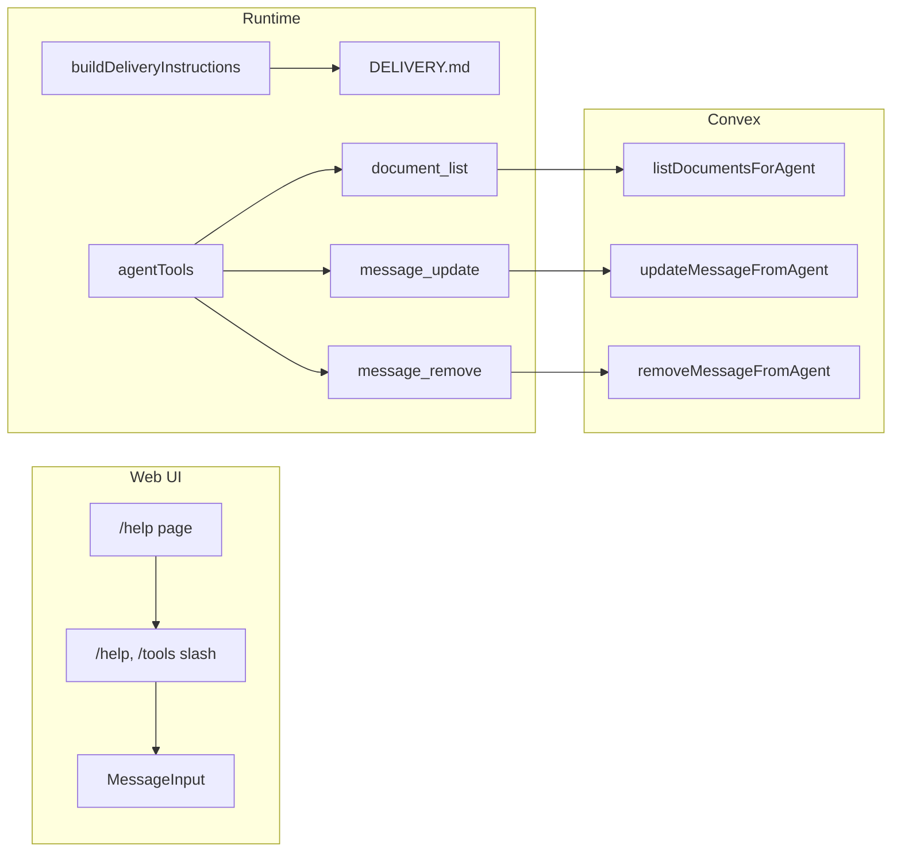

# Agent-Native Audit Recommendations — Implementation Plan

> **For Claude:** REQUIRED SUB-SKILL: Use superpowers:executing-plans to implement this plan task-by-task.

**Goal:** Implement the highest-impact recommendations from [docs/AGENT_NATIVE_AUDIT_REPORT.md](docs/AGENT_NATIVE_AUDIT_REPORT.md) to improve action parity, capability discovery, context injection, and prompt-native behavior without changing existing working flows.

**Architecture:** Add backend service actions and runtime tools where the audit identified gaps; introduce a single DELIVERY.md (or embedded template) for delivery instruction text so behavior is editable via content; add a real /help route and /help, /tools slash commands; wire stored agent config (systemPromptPrefix, contextConfig) into runtime prompt building. All changes preserve Convex as single source of truth and existing useQuery reactivity.

**Tech Stack:** Convex (service actions, internal queries), TypeScript, Next.js App Router (help page), existing runtime tooling in [apps/runtime/src/tooling/agentTools.ts](apps/runtime/src/tooling/agentTools.ts), delivery prompt in [apps/runtime/src/delivery/prompt.ts](apps/runtime/src/delivery/prompt.ts).

---

## Enhancement Summary

**Deepened on:** 2026-02-20  
**Sections enhanced:** 5 phases + Execution and scope  
**Research agents used:** explore (5), agent-native-reviewer, architecture-strategist, security-sentinel, performance-oracle, kieran-typescript-reviewer, convex-reviewer, best-practices-researcher, framework-docs-researcher

### Key Improvements

1. **Service auth and scope:** Every new service action must take `serviceToken` in args, call `requireServiceAuth(ctx, args.serviceToken)`, and enforce `serviceContext.accountId === args.accountId`. Task 1.3 must use an **internal** document-list query from `getForDelivery`, not the public action (getForDelivery cannot call actions).
2. **Performance:** Cache delivery template in memory (no file read per request); use index + `.take(limit)` for document list; no `Date.now()` in any new query.
3. **Security:** Escape placeholder values for DELIVERY.md (newline/control strip, length cap); treat `systemPromptPrefix` as admin-trusted or escape; replace only full `{{PLACEHOLDER}}` tokens so user content cannot break template. Message update/remove: allow only when message author is requesting agent or caller is orchestrator; enforce in internal mutations.
4. **Types and contracts:** Export `ListDocumentsForAgentResult`; extend `DeliveryContext.agent` with `openclawConfig` (systemPromptPrefix, contextConfig); use single args object and Convex validators for all new actions; add `returns` validators.
5. **Capability discovery sync:** Single source of truth for "what agents can do"; update /help content and AGENTS.md in the same PR when adding tools. Prefer navigating to /help for both /help and /tools.

### New Considerations Discovered

- **Out of scope (follow-up):** document_soft_delete, document_duplicate (audit #10), activity_feed (TOOLS_AUDIT P1). Add to Execution and scope.
- **Message auth:** update = author only; remove = author or orchestrator (align with UI: author or admin). Internal mutations must resolve orchestrator server-side.
- **DELIVERY.md:** Document full placeholder set; warn when a known placeholder is missing; assert no remaining `{{...}}` after replace. Default to runtime-bundled or embedded template; document path resolution for dev vs prod.
- **contextConfig:** When includeTaskContext/includeTeamContext is false, still include at least taskId and agent identity; document "minimal context" behavior. Merge nested contextConfig in updateOpenclawConfig (do not replace whole openclawConfig).
- **Help page:** Use `params: Promise<{ accountSlug: string }>` and `await params` (Next.js 15); one `<h1>`, semantic sections; same dashboard auth as other account routes. Use Vitest (not Jest) for slashCommands tests.

---

## Phase 1: document_list tool (Action Parity + Context)

**Reference:** [docs/runtime/TOOLS_AUDIT.md](docs/runtime/TOOLS_AUDIT.md) P1; audit recommendation #1.

### Task 1.1: Backend service action for listing documents

**Files:**

- Modify: [packages/backend/convex/service/actions.ts](packages/backend/convex/service/actions.ts) (add action after existing document-related actions)
- Test: [packages/backend/convex/service/actions.test.ts](packages/backend/convex/service/actions.test.ts) or add in existing test file if present

**Step 1: Write the failing test**

Add a test that calls a new service action `listDocumentsForAgent` with `accountId`, optional `taskId`, optional `type`, `limit` (default 50), and asserts returned list shape (e.g. `{ documents: Array<{ _id, title, type, taskId?, updatedAt }> }`). Use `requireServiceAuth` pattern; test with valid service token.

**Step 2: Run test to verify it fails**

Run: `npm test -- packages/backend -- --testPathPattern=actions` (or project test script for convex service).
Expected: FAIL (action or test does not exist).

**Step 3: Implement service action**

In `service/actions.ts`: Add `listDocumentsForAgent` action that:

- Takes args: `serviceToken: v.string()`, `accountId: v.id("accounts")`, optional `taskId` (v.optional(v.id("tasks"))), optional `type` (v.optional(documentTypeValidator)), optional `limit` (v.optional(v.number()), cap at 100 in handler). Add explicit `returns` validator for the response shape.
- Calls `requireServiceAuth(ctx, args.serviceToken)`; then enforces `serviceContext.accountId === args.accountId`. Use only `serviceContext.accountId` (or validated args.accountId) for the query.
- Calls an **internal** query (e.g. in `service/documents.ts`: `listForService` or `listForAgentTool`) that reads from `documents` using index `by_account_updated` when no taskId (`.order("desc").take(limit)`), or `by_task` when taskId provided; filter out soft-deleted in memory; **do not use Date.now()** in the query. Return `{ documents: Array<{ _id, title, type, taskId?, updatedAt }> }` (no content).
- Export a named return type `ListDocumentsForAgentResult` and use it for the handler return type.

Add internal query in [packages/backend/convex/service/documents.ts](packages/backend/convex/service/documents.ts) (or equivalent); do not call the public `documents.list` from the action—use a service-only internal query with no user auth.

**Step 4: Run test to verify it passes**

Same command as Step 2. Expected: PASS.

**Step 5: Commit**

```bash
git add packages/backend/convex/service/actions.ts packages/backend/convex/documents.ts
git commit -m "feat(backend): add listDocumentsForAgent service action for agent document discovery"
```

---

### Task 1.2: Runtime document_list tool schema and execution

**Files:**

- Modify: [apps/runtime/src/tooling/agentTools.ts](apps/runtime/src/tooling/agentTools.ts) (add DOCUMENT_LIST_TOOL_SCHEMA, execution branch in executeAgentTool, include in getToolCapabilitiesAndSchemas when canCreateDocuments or hasTaskContext)
- Test: Add or extend test in apps/runtime for executeAgentTool with name "document_list"

**Step 1: Write the failing test**

In runtime tests (e.g. [apps/runtime/src/delivery.test.ts](apps/runtime/src/delivery.test.ts) or a dedicated agentTools test file), add test: call executeAgentTool with tool name "document_list", valid accountId/taskId, mock Convex that returns listDocumentsForAgent; assert result contains documents array.

**Step 2: Run test to verify it fails**

Run: `npm test -- apps/runtime -- --testPathPattern=agentTools|delivery` (or equivalent).
Expected: FAIL (document_list not implemented).

**Step 3: Implement tool**

- Define `DOCUMENT_LIST_TOOL_SCHEMA` (name "document_list", description: list documents for account/task to discover existing docs; params: optional taskId, optional type, optional limit).
- In `executeAgentTool`, add case for "document_list": call Convex `api.service.actions.listDocumentsForAgent` with accountId from context, taskId, type, limit; return normalized result.
- In `getToolCapabilitiesAndSchemas`, add document_list when `canCreateDocuments === true` **or** `hasTaskContext === true` (so agents can list/reference docs without create permission). Add capability label "List documents (document_list)".

**Step 4: Run test to verify it passes**

Same as Step 2. Expected: PASS.

**Step 5: Commit**

```bash
git add apps/runtime/src/tooling/agentTools.ts
git commit -m "feat(runtime): add document_list agent tool for document discovery"
```

---

### Task 1.3: Optional document list snippet in delivery context

**Files:**

- Modify: [packages/backend/convex/service/notifications.ts](packages/backend/convex/service/notifications.ts) (getForDelivery: when canCreateDocuments or task context, optionally include short documentListSummary from listDocumentsForAgent with limit 10)
- Modify: [apps/runtime/src/delivery/prompt.ts](apps/runtime/src/delivery/prompt.ts) (in buildNotificationInput or buildDeliveryInstructions, if context has documentListSummary, add "Available documents:" block)

**Steps:** Implement only if Phase 1 scope includes context injection; otherwise defer. If implementing: (1) Add optional field to GetForDeliveryResult for documentListSummary. (2) In getForDelivery, call an **internal** query (e.g. `internal.service.documents.listForService`) with accountId/taskId and limit 10—**getForDelivery is an internal query and cannot call a service action**; use the same internal document-list logic as the action. Map to titles/ids, attach to result. (3) In prompt.ts, if present, append short "Available documents:" bullet list to instructions or input. (4) Test with delivery test that mocks getForDelivery with documentListSummary. (5) Commit: "feat(delivery): inject available documents snippet when canCreateDocuments or task context".

### Research Insights (Phase 1)

**Best practices:** Use index `by_account_updated` with `.order("desc").take(limit)` for account-wide list; when taskId provided, use `by_task` then in-memory filter by accountId and !deletedAt, sort by updatedAt desc, slice to limit. Return minimal list shape (no content). Cap limit at 100; default 50. Empty list returns `{ documents: [] }`; invalid taskId or wrong account → return [] or throw "Forbidden" without leaking existence.

**Performance:** Do not use `.collect()` then slice without an index; do not use `Date.now()` in any new query (Convex caching/reactivity). Single indexed read with take(limit) keeps reads bounded.

**Edge cases:** Invalid taskId → validate task exists and task.accountId === serviceContext.accountId before using for document list. Limit 0 or negative → clamp to default or minimum 1.

**References:** Convex [Internal Functions](https://docs.convex.dev/functions/internal-functions), [Indexes](https://docs.convex.dev/database/reading-data/indexes); in-repo `service/tasks.ts` listForTool pattern, `lib/service_auth.ts` requireServiceAuth.

---

## Phase 2: /help route and /help, /tools slash commands (Capability Discovery)

**Reference:** Audit recommendations #2 and #8; Capability Discovery 71%.

### Task 2.1: Help page route and content

**Files:**

- Create: [apps/web/src/app/(dashboard)/[accountSlug]/help/page.tsx](<apps/web/src/app/(dashboard)/[accountSlug]/help/page.tsx>)
- Modify: [apps/web/src/lib/clerk-theme.ts](apps/web/src/lib/clerk-theme.ts) or env: ensure helpPageUrl points to account-scoped help (e.g. `/${accountSlug}/help`) if configurable

**Step 1: Implement help page**

- Create Server Component: `export default async function HelpPage({ params }: { params: Promise<{ accountSlug: string }> }) { const { accountSlug } = await params; ... }`. Use existing dashboard layout (sidebar, AccountProvider). One `<h1>` ("Help"), sections with `<h2>`: "What agents can do", "Slash commands", "How to get help". Content aligned with capability labels / AGENTS.md so help and runtime stay in sync. Do not add a second `<main>`; stay inside layout. Ensure route is behind same dashboard auth as other `[accountSlug]` routes.

**Step 2: Verify route**

Open in browser or run e2e: `/[accountSlug]/help` returns 200 and shows content.

**Step 3: Commit**

```bash
git add apps/web/src/app/\(dashboard\)/\[accountSlug\]/help/page.tsx
git commit -m "feat(web): add account-scoped /help page for capability discovery"
```

---

### Task 2.2: /help and /tools slash commands

**Files:**

- Modify: [apps/web/src/components/tasks/slashCommands.ts](apps/web/src/components/tasks/slashCommands.ts) (add help and tools to SLASH_COMMANDS, extend parseSlashCommand)
- Modify: [apps/web/src/components/tasks/MessageInput.tsx](apps/web/src/components/tasks/MessageInput.tsx) (handle "help" and "tools" commands: e.g. insert placeholder text with capability summary, or navigate to help route, or open modal)
- Test: [apps/web/src/components/tasks/slashCommands.test.ts](apps/web/src/components/tasks/slashCommands.test.ts) (add tests for /help and /tools parsing)

**Step 1: Write failing test**

In slashCommands.test.ts: assert parseSlashCommand("/help") returns { command: "help" }, parseSlashCommand("/tools") returns { command: "tools" }.

**Step 2: Run test to verify it fails**

Run: `npm test -- apps/web -- slashCommands` (project uses **Vitest**, not Jest).
Expected: FAIL (command "help" / "tools" not parsed).

**Step 3: Implement slash commands**

- In slashCommands.ts: Add to SLASH_COMMANDS array `{ id: "help", label: "help", description: "Show help and what agents can do" }`, `{ id: "tools", label: "tools", description: "List agent tools and capabilities" }`. In parseSlashCommand, add branches for `/help` and `/tools` (with optional trailing space). Update SlashCommandId type.

**Step 4: Run test to verify it passes**

Same command. Expected: PASS.

**Step 5: Handle in MessageInput**

In MessageInput, when command is "help" or "tools", navigate to `/${accountSlug}/help` (use router.push; get accountSlug from useParams() or useAccount().account?.slug), clear input, and return without sending a message. **Prefer navigating to /help for both** so one canonical help page lists capabilities and slash commands; avoid maintaining a separate inline tool list in the app that can drift from runtime.

**Step 6: Commit**

```bash
git add apps/web/src/components/tasks/slashCommands.ts apps/web/src/components/tasks/slashCommands.test.ts apps/web/src/components/tasks/MessageInput.tsx
git commit -m "feat(web): add /help and /tools slash commands for capability discovery"
```

**Capability discovery sync:** When adding a new tool (e.g. document_list, message_update, message_remove), update /help content and [docs/runtime/AGENTS.md](docs/runtime/AGENTS.md) in the same PR so "what agents can do" stays the single source of truth.

### Research Insights (Phase 2)

**Best practices:** Account-scoped help at `[accountSlug]/help` reuses layout and AccountProvider; no extra account fetch for shell. Use semantic sections and one `<h1>`; avoid multiple `<main>`. Clerk `helpPageUrl` currently "/help"—either make it dynamic per account (e.g. `/${accountSlug}/help`) or add a redirect from `/help` to current account's help.

**Slash commands:** Add tests for `/help`, `/help` , `/tools`, `/tools` ; optional trailing text policy (ignore or parse). Ensure accountSlug is available before router.push (useParams or useAccount).

**References:** Next.js [Dynamic Routes](https://nextjs.org/docs/app/building-your-application/routing/dynamic-routes), [Server Components](https://nextjs.org/docs/app/getting-started/server-and-client-components); params are Promise in Next.js 15.

---

## Phase 3: DELIVERY.md and prompt interpolation (Prompt-Native)

**Reference:** Audit recommendation #3; delivery instruction text currently in [apps/runtime/src/delivery/prompt.ts](apps/runtime/src/delivery/prompt.ts) (buildDeliveryInstructions).

### Task 3.1: Delivery instruction template and loader

**Files:**

- Create: [docs/runtime/DELIVERY.md](docs/runtime/DELIVERY.md) (or [apps/runtime/src/delivery/DELIVERY_TEMPLATE.md](apps/runtime/src/delivery/DELIVERY_TEMPLATE.md) if runtime must ship with default)
- Modify: [apps/runtime/src/delivery/prompt.ts](apps/runtime/src/delivery/prompt.ts) (add loadDeliveryTemplate(): read file from disk or embedded string; export placeholders list, e.g. {{AGENT_NAME}}, {{STATUS_INSTRUCTIONS}}, {{CAPABILITIES_BLOCK}})

**Step 1: Create DELIVERY.md template**

Single markdown file with clear sections and placeholders: e.g. "You are replying as: **{{AGENT_NAME}}** ({{AGENT_ROLE}}).", "{{STATUS_INSTRUCTIONS}}", "{{CAPABILITIES_BLOCK}}", "{{TASK_CREATE_INSTRUCTIONS}}", "{{DOCUMENT_INSTRUCTIONS}}", "{{RESPONSE_REQUEST_INSTRUCTIONS}}", "{{ORCHESTRATOR_INSTRUCTIONS}}", "{{ASSIGNMENT_ACK}}", etc. Match current buildDeliveryInstructions structure so 1:1 replacement is possible.

**Step 2: Implement loader**

In delivery/prompt.ts (or delivery/template.ts): function loadDeliveryTemplate(): string. **Must cache the template in memory** (lazy load on first use or at startup)—do not read file on every buildDeliveryInstructions call (performance). Use same path resolution as [apps/runtime/src/config.ts](apps/runtime/src/config.ts) (candidate paths: e.g. `/app/docs/runtime/DELIVERY.md`, `path.resolve(process.cwd(), "docs/runtime", "DELIVERY.md")). If no file found or read fails, return DEFAULT_DELIVERY_TEMPLATE (embedded string). Document that editing DELIVERY.md requires process restart to take effect when cached. Export a constant list of placeholder keys (e.g. DELIVERY_PLACEHOLDER_KEYS) for type-safe replacement and tests.

**Step 3: Commit**

```bash
git add docs/runtime/DELIVERY.md apps/runtime/src/delivery/prompt.ts
git commit -m "feat(runtime): add DELIVERY.md template and loader for prompt-native delivery instructions"
```

---

### Task 3.2: buildDeliveryInstructions uses template

**Files:**

- Modify: [apps/runtime/src/delivery/prompt.ts](apps/runtime/src/delivery/prompt.ts) (buildDeliveryInstructions: build same key-value map as now, call loadDeliveryTemplate(), replace placeholders, return result; keep fallback if placeholder missing = use current inline string)

**Step 1: Add placeholder replacement**

Compute all current instruction fragments into a Map. Load template (cached); replace only **full** `{{PLACEHOLDER}}` tokens (e.g. regex `/\{\{(\w+)\}\}/g`) so user-controlled values cannot break template structure. Use map.get(key) ?? currentFallback per placeholder. **Escape values** that go into instructions: trim, length cap, replace newlines/control chars with space for AGENT*NAME, AGENT_ROLE, task-derived text (prevents prompt injection). Do not put user-authored content (notification body, message content) into instruction placeholders. After replace, assert no remaining `{{...}}` (or log warning). Emit a warning when a known placeholder is missing from template or map. Document full placeholder set (AGENT_NAME, AGENT_ROLE, STATUS_INSTRUCTIONS, CAPABILITIES_BLOCK, TASK_CREATE_INSTRUCTIONS, DOCUMENT_INSTRUCTIONS, RESPONSE_REQUEST_INSTRUCTIONS, ORCHESTRATOR*\*, ASSIGNMENT_ACK, etc.).

**Step 2: Test**

Run existing buildDeliveryInstructions tests; assert output still matches expected shape and contains same substantive text (or update snapshots if wording moves to template). Ensure no regression for orchestrator vs non-orchestrator, with/without task, etc.

**Step 3: Commit**

```bash
git add apps/runtime/src/delivery/prompt.ts
git commit -m "feat(runtime): buildDeliveryInstructions interpolates from DELIVERY.md template"
```

### Research Insights (Phase 3)

**Best practices:** Use `{{PLACEHOLDER}}` syntax; restrict placeholder names to `[A-Z0-9_]+`. Replace only full tokens so values containing `}}` or `{{` do not alter structure. Single source of truth: template content; code defines which placeholders exist and how they are computed (and escaped).

**Security:** Treat all values substituted into instructions as untrusted: escape (newline/control strip, length cap) for AGENT_NAME, AGENT_ROLE, task title. Do not put notification.body, message.content, or task description into instruction template—keep user content in input only. systemPromptPrefix (Phase 5) is high risk: document as admin-trusted and/or apply same escaping and length cap.

**Performance:** Cache template in memory; no file read per request. Log once at startup whether template was loaded from file or default.

**Testing:** Snapshot or string assertions for interpolated output; test that no `{{...}}` remains after replace; optional test that every key in DELIVERY_PLACEHOLDER_KEYS is supplied or has fallback.

**References:** [apps/runtime/src/config.ts](apps/runtime/src/config.ts) resolveRuntimeManualPath pattern for candidate paths.

---

## Phase 4: message_update and message_remove tools (Action Parity)

**Reference:** Audit recommendation #4; UI has message update/remove in [packages/backend/convex/messages.ts](packages/backend/convex/messages.ts).

### Task 4.1: Backend service actions for message update and remove

**Files:**

- Modify: [packages/backend/convex/service/actions.ts](packages/backend/convex/service/actions.ts) (add updateMessageFromAgent, removeMessageFromAgent)
- Modify: [packages/backend/convex/messages.ts](packages/backend/convex/messages.ts) (internal mutation for update/remove with auth; service calls internal)

**Step 1: Write failing test**

Test that service actions updateMessageFromAgent and removeMessageFromAgent succeed with valid service token and accountId; assert message belongs to account and only author or orchestrator can update/remove. Test: orchestrator can remove another agent's message; non-orchestrator cannot update/remove others' messages.

**Step 2: Implement**

- **Service actions:** Take args: `serviceToken: v.string()`, `accountId: v.id("accounts")`, `agentId: v.id("agents")`, `messageId: v.id("messages")`, and for update `content: v.string()`. Call `requireServiceAuth(ctx, args.serviceToken)`; enforce `serviceContext.accountId === args.accountId`. Validate agent belongs to account; then call internal mutation. Do not allow client to pass "isOrchestrator"—resolve server-side from account settings.
- **Internal mutations** (e.g. in service/messages.ts): `updateFromAgent`, `removeFromAgent` with args messageId, agentId, accountId, and for update content. Load message and task; enforce `message.accountId === args.accountId` and `task.accountId === args.accountId`. **Authorization:** Allow only if `message.authorType === "agent"` and (`message.authorId === args.agentId` **or** `args.agentId === orchestratorAgentId` from account settings). For remove, orchestrator can remove any message in the account; for update, same (author or orchestrator). Enforce content length (e.g. MESSAGE_CONTENT_MAX_LENGTH from validators). Return typed result; add `returns` validators to actions.

**Step 3: Run tests**

Expected: PASS.

**Step 4: Commit**

```bash
git add packages/backend/convex/service/actions.ts packages/backend/convex/messages.ts
git commit -m "feat(backend): add updateMessageFromAgent and removeMessageFromAgent service actions"
```

---

### Task 4.2: Runtime message_update and message_remove tools

**Files:**

- Modify: [apps/runtime/src/tooling/agentTools.ts](apps/runtime/src/tooling/agentTools.ts) (add MESSAGE_UPDATE_TOOL_SCHEMA, MESSAGE_REMOVE_TOOL_SCHEMA; execution in executeAgentTool; add to getToolCapabilitiesAndSchemas when agent has task context and is author or orchestrator—align with UI policy)

**Step 1: Implement schemas and execution**

- message_update: taskId, messageId, content (string). Only allow if message’s author is current agent or orchestrator. Call service action updateMessageFromAgent.
- message_remove: taskId, messageId. Same auth; call removeMessageFromAgent. Add capability labels and include in tool list when appropriate (e.g. same as task_message: orchestrator or message author).

**Step 2: Test**

Extend runtime tests: executeAgentTool("message_update", ...), executeAgentTool("message_remove", ...) with mocked Convex. Assert success and correct payload.

**Step 3: Commit**

```bash
git add apps/runtime/src/tooling/agentTools.ts
git commit -m "feat(runtime): add message_update and message_remove agent tools"
```

### Research Insights (Phase 4)

**Auth:** Service action must take `serviceToken` and `accountId`; call `requireServiceAuth(ctx, args.serviceToken)` and enforce `serviceContext.accountId === args.accountId`. Internal mutations do not use user auth; they assume the calling action has validated. Resolve orchestrator from account settings server-side; allow update/remove only when message.authorType === "agent" and (message.authorId === agentId or agentId === orchestratorAgentId).

**Edge cases:** Message already deleted (hard: get returns null → "Not found"; soft: if you add deletedAt, reject). Message from another account → "Not found" or "Forbidden" without leaking. Content length: enforce MESSAGE_CONTENT_MAX_LENGTH in both action and internal mutation. Empty content: decide policy (allow or reject).

**Optional:** Soft-delete (deletedAt) for audit vs hard delete; log activity (message_updated / message_removed) with actorType "agent".

**References:** Existing createMessageFromAgent, deleteTaskFromAgent in service/actions.ts; messages.update/remove in messages.ts (user path); lib/validators.ts MESSAGE_CONTENT_MAX_LENGTH.

---

## Phase 5: systemPromptPrefix and contextConfig wiring (Context Injection)

**Reference:** Audit recommendation #5; schema stores openclawConfig.systemPromptPrefix and contextConfig (includeTaskContext, includeTeamContext, maxHistoryMessages).

### Task 5.1: Apply systemPromptPrefix in delivery and heartbeat

**Files:**

- Modify: [apps/runtime/src/delivery/prompt.ts](apps/runtime/src/delivery/prompt.ts) (buildDeliveryInstructions: accept optional systemPromptPrefix from context.agent.openclawConfig; if present, prepend to instructions string)
- Modify: [apps/runtime/src/heartbeat.ts](apps/runtime/src/heartbeat.ts) or heartbeat prompt builder (same: prepend systemPromptPrefix when building instructions)

**Step 1: Pass prefix from context**

Extend **DeliveryContext.agent** in [apps/runtime/src/delivery/types.ts](apps/runtime/src/delivery/types.ts) with `openclawConfig?: { systemPromptPrefix?: string; contextConfig?: { maxHistoryMessages?: number; includeTaskContext?: boolean; includeTeamContext?: boolean } }` (or use shared OpenClawConfig type). GetForDeliveryResult already returns full agent; only the runtime type needs updating. In buildDeliveryInstructions: `const prefix = (context.agent?.openclawConfig?.systemPromptPrefix ?? "").trim()`; if non-empty, optionally cap length (e.g. 2000 chars) to avoid context overflow; then `return prefix ?` ${prefix}\n\n${rest} `: rest`. Do not add extra newline when prefix is empty.

**Step 2: Test**

Unit test buildDeliveryInstructions with context that has systemPromptPrefix; assert instructions start with that prefix.

**Step 3: Commit**

```bash
git add apps/runtime/src/delivery/prompt.ts apps/runtime/src/heartbeat.ts
git commit -m "feat(runtime): apply agent systemPromptPrefix in delivery and heartbeat instructions"
```

---

### Task 5.2: Respect contextConfig in delivery (optional caps)

**Files:**

- Modify: [packages/backend/convex/service/notifications.ts](packages/backend/convex/service/notifications.ts) (getForDelivery: read contextConfig from agent; when building thread context or task overview, respect includeTaskContext, includeTeamContext, maxHistoryMessages if present)
- Modify: [apps/runtime/src/delivery/prompt.ts](apps/runtime/src/delivery/prompt.ts) (formatThreadContext, formatTaskOverview: accept optional maxMessages/maxChars from context; when contextConfig.maxHistoryMessages is set, cap thread messages)

**Step 1: Implement**

- getForDelivery already returns agent with openclawConfig; ensure DeliveryContext.agent includes contextConfig. In delivery/prompt.ts, formatThreadContext accepts optional maxMessages (from contextConfig?.maxHistoryMessages ?? THREAD_MAX_MESSAGES). If includeTaskContext === false, omit task block; if includeTeamContext === false, omit mentionable agents block (or document as “minimal context” mode).

**Step 2: Test**

Delivery test with contextConfig.maxHistoryMessages = 5; assert thread has at most 5 messages. Optional test for includeTaskContext false.

**Step 3: Commit**

```bash
git add packages/backend/convex/service/notifications.ts apps/runtime/src/delivery/prompt.ts
git commit -m "feat(runtime): respect contextConfig maxHistoryMessages and includeTask/TeamContext in delivery"
```

### Research Insights (Phase 5)

**systemPromptPrefix:** Order: prefix first, then identity/rest. Trim; if empty do not prepend. Enforce max length at write (e.g. 2000) in updateOpenclawConfig and optionally truncate at runtime. Document as admin-trusted; ensure only authorized roles can set it. For heartbeat, apply prefix where SOUL content is produced (e.g. openclaw-profiles when writing SOUL.md).

**contextConfig:** Default missing to current behavior (includeTaskContext/includeTeamContext true, maxHistoryMessages 25). formatThreadContext: pass maxMessages from context; cap in runtime (Option B) so backend can keep returning full thread. updateOpenclawConfig: merge contextConfig with existing (e.g. `contextConfig: { ...current?.contextConfig, ...args.config?.contextConfig }`) so partial updates do not wipe other keys. Validate maxHistoryMessages range (e.g. 1–500) and booleans.

**Types:** DeliveryAgentSnapshot or extend DeliveryContext.agent with openclawConfig so buildDeliveryInstructions and formatThreadContext are type-safe.

**References:** packages/backend/convex/schema.ts openclawConfig; packages/shared OpenClawConfig; updateOpenclawConfig in agents.ts.

---

## Execution and scope

- **Order:** Execute phases 1–5 in sequence; within each phase, tasks in order.
- **Deferrals:** Task 1.3 (document list snippet in prompt) and Task 5.2 (contextConfig) can be deferred if scope is tight; document as optional. Prefer implementing Task 1.3 for context gain.
- **Out of scope (follow-up):** document_soft_delete, document_duplicate (audit #10); activity_feed (TOOLS_AUDIT P1). Recommend a follow-up PR for document_soft_delete and optionally document_duplicate.
- **Service actions checklist:** For every new service action: (1) args include `serviceToken: v.string()` and `accountId` where appropriate; (2) call `requireServiceAuth(ctx, args.serviceToken)`; (3) enforce `serviceContext.accountId === args.accountId`; (4) use token-derived account for all scope checks; (5) add explicit `returns` validator.
- **Docs:** After Phase 1, update [docs/runtime/TOOLS_AUDIT.md](docs/runtime/TOOLS_AUDIT.md) (document_list done) and [docs/runtime/AGENTS.md](docs/runtime/AGENTS.md) (document_list in capabilities). After Phase 4, update AGENTS.md and TOOLS_AUDIT.md with message_update and message_remove (when available: task context + author or orchestrator).
- **Verification:** Run full test suite and typecheck after each phase; run agent-native audit again after all phases. Confirm capability map: document_list, message_update, message_remove appear in getToolCapabilitiesAndSchemas for the right flags and in /help and AGENTS.md.

---

## Diagram: Agent-native flow after changes


