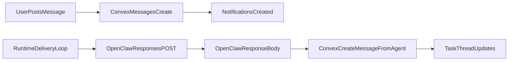

# OpenClaw Response Write-back Plan

## 1. Context & goal

Make agent replies show up in the Mission Control task thread by capturing the OpenClaw response from the runtime’s `/v1/responses` call and writing it back to Convex as an agent message. This keeps the “shared brain” and traceability described in `docs/` while avoiding noisy heartbeat posts. Constraints: per-account runtime isolation, service-token auth for runtime calls, at‑least‑once delivery with idempotency, and agent updates formatted per `docs/runtime/AGENTS.md`.

## 2. Codebase research summary

Inspected:

- `apps/runtime/src/delivery.ts` — polls undelivered agent notifications and sends them to OpenClaw, but doesn’t write responses back.
- `apps/runtime/src/gateway.ts` — sends to `/v1/responses` and has a placeholder `receiveFromOpenClaw` with no HTTP wiring.
- `apps/runtime/src/heartbeat.ts` — sends heartbeat messages without any task context.
- `apps/runtime/src/config.ts` — env config patterns for runtime.
- `packages/backend/convex/service/actions.ts` — service actions used by runtime, including `createMessageFromAgent`.
- `packages/backend/convex/service/messages.ts` — internal mutation to create agent messages in task threads.
- `packages/backend/convex/schema.ts` — messages schema (no idempotency key yet).
- `docs/runtime/AGENTS.md`, `docs/runtime/HEARTBEAT.md`, `docs/concept/mission-control-initial-article.md` — “shared brain,” thread traceability, and required agent update format.

Key takeaways:

- The runtime already has all Convex service actions needed to create agent messages.
- Current delivery loop is one‑way (Convex → OpenClaw) and lacks response write-back.
- Messages don’t currently include an idempotency key; at‑least‑once delivery risks duplicates.
- Heartbeats are intended to be silent unless they actually act (`HEARTBEAT.md`).

## 3. High-level design

**Approach:** Use the synchronous HTTP response body from `POST {OPENCLAW_GATEWAY_URL}/v1/responses` to extract the agent’s reply, then write it to the task thread via `api.service.actions.createMessageFromAgent`. Only do this for notifications with a `taskId` (skip heartbeats and any notification without task context). Add an optional idempotency field (`sourceNotificationId`) to messages to prevent duplicate posts if delivery retries.

**Data flow (sync write-back):**

**Spirit alignment:**

- Messages are posted into the task thread (shared brain), not just in the OpenClaw UI.
- The runtime will include a short instruction in the notification prompt reminding the agent to answer in the `AGENTS.md` thread-update format.
- Heartbeats remain quiet unless tied to a task.

## 4. File & module changes

### Runtime

- `apps/runtime/src/gateway.ts`
  - Add a response parser for `/v1/responses` results (`output_text` or `output[]` content).
  - Extend `sendToOpenClaw` to return the response text (or `null` when unavailable).
  - Add a request option to force non‑streaming responses (e.g., `stream: false`) so the body is available.
  - Optional: make request timeout configurable via env (e.g., `OPENCLAW_REQUEST_TIMEOUT_MS`).
- `apps/runtime/src/delivery.ts`
  - When delivering a notification, capture the OpenClaw response text.
  - If the notification has a `taskId` and response text is non‑empty, call `createMessageFromAgent` with `sourceNotificationId` for idempotency.
  - Only mark the notification delivered after the message is successfully created.
  - Update `formatNotificationMessage` to include an instruction to reply in the `AGENTS.md` format.
- `apps/runtime/src/heartbeat.ts`
  - Keep heartbeat flow send‑only; do **not** write responses back (matches user choice).
- `apps/runtime/src/config.ts` and `apps/runtime/.env.example`
  - If adding configurable timeout, parse and document `OPENCLAW_REQUEST_TIMEOUT_MS`.

### Convex backend

- `packages/backend/convex/schema.ts`
  - Add optional `sourceNotificationId: v.optional(v.id("notifications"))` to `messages`.
  - Add index for idempotency lookup, e.g. `by_account_source_notification`.
- `packages/backend/convex/service/messages.ts`
  - Accept optional `sourceNotificationId` and check for existing message by that key before insert.
- `packages/backend/convex/service/actions.ts`
  - Extend `createMessageFromAgent` action args to include optional `sourceNotificationId` and pass through to internal mutation.

### Docs (spirit + behavior)

- `docs/runtime/runtime-docker-compose.md` and/or `apps/runtime/README.md`
  - Note that agent responses from OpenClaw are written back to task threads for notification-triggered runs.
  - Document any new env var (timeout) if added.

## 5. Step-by-step tasks

1. **Runtime response parsing**
  - Implement a response-extraction helper in `apps/runtime/src/gateway.ts` to normalize OpenClaw response JSON to a single string.
  - Make `sendToOpenClaw` return `string | null` and include `stream: false` in request body.
2. **Delivery loop write-back**
  - In `apps/runtime/src/delivery.ts`, after `sendToOpenClaw`, call `api.service.actions.createMessageFromAgent` when `taskId` exists.
  - Pass `sourceNotificationId` and only mark delivered after message creation succeeds.
  - Update `formatNotificationMessage` to instruct the agent to reply in the `AGENTS.md` format.
3. **Schema + idempotency**
  - Update `packages/backend/convex/schema.ts` with optional `sourceNotificationId` and an index.
  - Update `packages/backend/convex/service/messages.ts` to no‑op (return existing message id) when a message with the same `sourceNotificationId` already exists.
4. **Service action plumbing**
  - Extend `packages/backend/convex/service/actions.ts` `createMessageFromAgent` action args and pass through `sourceNotificationId`.
5. **Docs update**
  - Update runtime docs to describe response write-back behavior and any new env var.
6. **Manual QA**
  - Run runtime + OpenClaw locally and verify end‑to‑end: mention agent → OpenClaw reply → message appears in task thread.

## 6. Edge cases & risks

- **Unknown response shape**: OpenClaw may return different JSON; parser should handle `output_text`, `output[]`, or fall back to stringifying.
- **Duplicate messages**: Retries can create duplicates; mitigate with `sourceNotificationId` idempotency.
- **Timeouts**: Large responses may exceed 15s; consider configurable timeout and non‑streaming responses.
- **Empty response**: If response text is empty or whitespace, skip posting and log.
- **No taskId**: Some notifications may not include a task; skip posting to avoid orphan messages.
- **Mentions loop**: Posting agent replies with mentions will create new notifications; ensure this is intended (fits collaboration model).

## 7. Testing strategy

- **Manual QA**
  - Create a task, post `@agent` message, confirm agent reply appears in the same task thread.
  - Verify the reply format matches `AGENTS.md` structure.
  - Confirm no thread message is posted for heartbeat-only runs.
  - Retry scenario: simulate delivery retry and ensure no duplicate message (idempotency).
- **Optional unit tests (if desired later)**
  - Response parser: feed sample OpenClaw responses and assert extracted text.
  - Idempotency: create message twice with same `sourceNotificationId` and assert only one message exists.

## 8. Rollout / migration

- **Schema migration**: Convex push to add `sourceNotificationId` field + index.
- **No data backfill** needed (new field optional).
- **Deploy runtime** with updated response parsing before relying on thread write-back in prod.

## 9. TODO checklist

**Runtime**

- Add OpenClaw response parser + `stream: false` request support in `apps/runtime/src/gateway.ts`.
- Return response text from `sendToOpenClaw` (or `null` when unavailable).
- Update `apps/runtime/src/delivery.ts` to post agent responses to Convex with `sourceNotificationId` and mark delivered after success.
- Keep heartbeats send-only in `apps/runtime/src/heartbeat.ts` (no write-back).
- Add optional `OPENCLAW_REQUEST_TIMEOUT_MS` support in `apps/runtime/src/config.ts` and `apps/runtime/.env.example` (if needed).

**Backend (Convex)**

- Add `sourceNotificationId` to `messages` in `packages/backend/convex/schema.ts` and index for lookup.
- Update `packages/backend/convex/service/messages.ts` to de-dupe by `sourceNotificationId`.
- Extend `createMessageFromAgent` action args in `packages/backend/convex/service/actions.ts` to accept `sourceNotificationId`.

**Docs**

- Update `docs/runtime/runtime-docker-compose.md` and/or `apps/runtime/README.md` to document response write-back behavior and any new env var.

**QA**

- Manual test: mention agent → OpenClaw reply → message appears in task thread.
- Manual test: heartbeat runs do not create thread messages.
- Manual test: retry delivery does not create duplicate messages.

