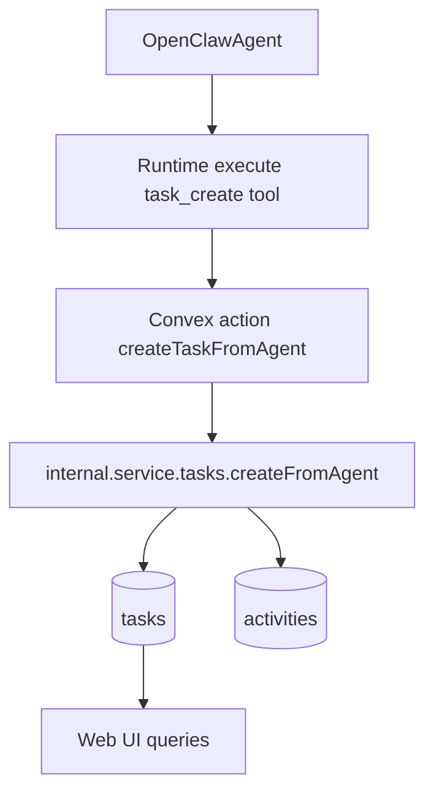

# Agent Behavior Flags Enablement Plan

## 1. Context & goal

Implement full behavior-flag support for agents (create tasks, modify task status, create documents, mention agents) using **OpenResponses client-side tools** executed by the runtime, backed by Convex service actions. The goal is to make the OpenClaw admin behavior flags real, add per-agent overrides with account-default fallback, update the UI to edit overrides, and document the tools so agents use them safely. Constraints: Convex service auth, strict workflow validation, and tool availability must be enforced via OpenClaw tool schema + allow/deny policies (tools must appear in both system prompt and schema to be callable).

## 2. Codebase research summary

Files inspected and patterns to reuse:

- `[apps/runtime/src/health.ts](apps/runtime/src/health.ts)` — local-only `/agent/task-status` endpoint pattern for session-key auth and service action calls.

```209:304:apps/runtime/src/health.ts
    if (req.url === "/agent/task-status") {
      if (req.method !== "POST") {
        res.writeHead(405, { Allow: "POST" });
        res.end("Method Not Allowed");
        return;
      }

      if (!isLocalAddress(req.socket.remoteAddress)) {
        sendJson(res, 403, {
          success: false,
          error: "Forbidden: endpoint is local-only",
        });
        return;
      }

      const sessionHeader = req.headers["x-openclaw-session-key"];
      const sessionKey = Array.isArray(sessionHeader)
        ? sessionHeader[0]
        : sessionHeader;
      if (!sessionKey) {
        sendJson(res, 401, {
          success: false,
          error: "Missing x-openclaw-session-key header",
        });
        return;
      }

      const agentId = getAgentIdForSessionKey(sessionKey);
      if (!agentId) {
        sendJson(res, 401, { success: false, error: "Unknown session key" });
        return;
      }

      if (!runtimeConfig) {
        sendJson(res, 500, { success: false, error: "Runtime not configured" });
        return;
      }

      let body: { taskId?: string; status?: string; blockedReason?: string };
      try {
        body = await readJsonBody<{
          taskId?: string;
          status?: string;
          blockedReason?: string;
        }>(req);
      } catch (error) {
        sendJson(res, 400, { success: false, error: "Invalid JSON body" });
        return;
      }

      if (
        !body ||
        typeof body.taskId !== "string" ||
        typeof body.status !== "string"
      ) {
        sendJson(res, 400, {
          success: false,
          error: "Missing required fields: taskId, status",
        });
        return;
      }

      const allowedStatuses = new Set([
        "in_progress",
        "review",
        "done",
        "blocked",
      ]);
      if (!allowedStatuses.has(body.status)) {
        sendJson(res, 422, {
          success: false,
          error:
            "Invalid status: must be in_progress, review, done, or blocked",
        });
        return;
      }

      if (body.status === "blocked" && !body.blockedReason?.trim()) {
        sendJson(res, 422, {
          success: false,
          error: "blockedReason is required when status is blocked",
        });
        return;
      }

      try {
        const client = getConvexClient();
        await client.action(api.service.actions.updateTaskStatusFromAgent, {
          accountId: runtimeConfig.accountId,
          serviceToken: runtimeConfig.serviceToken,
          agentId,
          taskId: body.taskId as Id<"tasks">,
          status: body.status as "in_progress" | "review" | "done" | "blocked",
          blockedReason: body.blockedReason,
        });
        sendJson(res, 200, { success: true });
      } catch (error) {
        const message = error instanceof Error ? error.message : String(error);
        const mapped = mapTaskStatusError(message);
        sendJson(res, mapped.status, { success: false, error: mapped.message });
      }
      return;
    }
```

- `[packages/backend/convex/service/actions.ts](packages/backend/convex/service/actions.ts)` — service action pattern with service-token validation and internal mutation call.

```422:484:packages/backend/convex/service/actions.ts
export const updateTaskStatusFromAgent = action({
  args: {
    taskId: v.id("tasks"),
    agentId: v.id("agents"),
    status: taskStatusValidator,
    blockedReason: v.optional(v.string()),
    expectedStatus: v.optional(taskStatusValidator),
    serviceToken: v.string(),
    accountId: v.id("accounts"),
  },
  handler: async (ctx, args): Promise<{ success: true }> => {
    const serviceContext = await requireServiceAuth(ctx, args.serviceToken);

    if (serviceContext.accountId !== args.accountId) {
      throw new Error("Forbidden: Service token does not match account");
    }

    const allowedStatuses = new Set([
      "in_progress",
      "review",
      "done",
      "blocked",
    ]);
    if (!allowedStatuses.has(args.status)) {
      throw new Error(
        "Invalid status: must be in_progress, review, done, or blocked",
      );
    }

    const agent = await ctx.runQuery(internal.service.agents.getInternal, {
      agentId: args.agentId,
    });
    if (!agent) {
      throw new Error("Not found: Agent does not exist");
    }
    if (agent.accountId !== args.accountId) {
      throw new Error("Forbidden: Agent belongs to different account");
    }

    const task = await ctx.runQuery(internal.service.tasks.getInternal, {
      taskId: args.taskId,
    });
    if (!task) {
      throw new Error("Not found: Task does not exist");
    }
    if (task.accountId !== args.accountId) {
      throw new Error("Forbidden: Task belongs to different account");
    }

    await ctx.runMutation(internal.service.tasks.updateStatusFromAgent, {
      taskId: args.taskId,
      agentId: args.agentId,
      status: args.status,
      blockedReason: args.blockedReason,
      expectedStatus: args.expectedStatus,
    });

    return { success: true };
  },
});
```

- `[packages/backend/convex/tasks.ts](packages/backend/convex/tasks.ts)` — user task creation logic to mirror for agent-created tasks.

```159:209:packages/backend/convex/tasks.ts
export const create = mutation({
  args: {
    accountId: v.id("accounts"),
    title: v.string(),
    description: v.optional(v.string()),
    priority: v.optional(v.number()),
    labels: v.optional(v.array(v.string())),
    dueDate: v.optional(v.number()),
  },
  handler: async (ctx, args) => {
    const { userId, userName } = await requireAccountMember(
      ctx,
      args.accountId,
    );

    const now = Date.now();

    const taskId = await ctx.db.insert("tasks", {
      accountId: args.accountId,
      title: args.title,
      description: args.description,
      status: "inbox",
      priority: args.priority ?? 3, // Default medium priority
      assignedUserIds: [],
      assignedAgentIds: [],
      labels: args.labels ?? [],
      dueDate: args.dueDate,
      createdBy: userId,
      createdAt: now,
      updatedAt: now,
    });

    // Log activity
    await logActivity({
      ctx,
      accountId: args.accountId,
      type: "task_created",
      actorType: "user",
      actorId: userId,
      actorName: userName,
      targetType: "task",
      targetId: taskId,
      targetName: args.title,
    });

    await ensureOrchestratorSubscribed(ctx, args.accountId, taskId);

    return taskId;
  },
});
```

- `[apps/runtime/src/delivery.ts](apps/runtime/src/delivery.ts)` — prompt construction and notification delivery; add tool availability and tool instructions.
- `[apps/runtime/src/gateway.ts](apps/runtime/src/gateway.ts)` — OpenResponses request/response handling; currently parses text only, needs tool call handling.
- OpenClaw OpenResponses API docs — supports client-side `tools` and `function_call_output` for turn-based tool execution.

```201:243:apps/runtime/src/delivery.ts
function shouldDeliverToAgent(context: any): boolean {
  const notificationType = context?.notification?.type;
  const messageAuthorType = context?.message?.authorType;

  if (notificationType === "thread_update" && messageAuthorType === "agent") {
    const taskStatus = context?.task?.status;
    const recipientId = context?.notification?.recipientId;
    const assignedAgentIds = context?.task?.assignedAgentIds;
    const sourceNotificationType = context?.sourceNotificationType;
    const orchestratorAgentId = context?.orchestratorAgentId;
    const agentRole = context?.agent?.role;
    if (taskStatus === "done") {
      return false;
    }
    if (sourceNotificationType === "thread_update") {
      return false;
    }
    if (orchestratorAgentId != null && recipientId === orchestratorAgentId) {
      return true;
    }
    if (taskStatus === "review" && isReviewerRole(agentRole)) {
      return true;
    }
    if (!Array.isArray(assignedAgentIds)) return false;
    return assignedAgentIds.includes(recipientId);
  }

  return true;
}

function isReviewerRole(role: string | undefined): boolean {
  if (!role) return false;
  return /squad lead|qa|review/i.test(role);
}
```

Other relevant references:

- `[apps/web/src/app/(dashboard)/[accountSlug]/admin/openclaw/page.tsx](apps/web/src/app/(dashboard)/[accountSlug]/admin/openclaw/page.tsx)` — admin UI for behavior flags (`canCreateTasks`, etc.).
- `[packages/backend/convex/accounts.ts](packages/backend/convex/accounts.ts)` and `[packages/backend/convex/schema.ts](packages/backend/convex/schema.ts)` — account `settings.agentDefaults.behaviorFlags` shape.
- `[apps/web/src/app/(dashboard)/[accountSlug]/agents/[agentId]/page.tsx](apps/web/src/app/(dashboard)/[accountSlug]/agents/[agentId]/page.tsx)` — agent detail UI where per-agent overrides can live.
- `[packages/backend/convex/agents.ts](packages/backend/convex/agents.ts)` — `updateOpenclawConfig` mutation and default OpenClaw config generation.
- `[packages/backend/convex/service/messages.ts](packages/backend/convex/service/messages.ts)` — agent message creation, mention parsing, and notifications.
- `[packages/backend/convex/lib/mentions.ts](packages/backend/convex/lib/mentions.ts)` — mention regex and resolution logic.
- `[packages/backend/convex/service/documents.ts](packages/backend/convex/service/documents.ts)` — agent document create/update internal mutation (no service action yet).
- `[apps/runtime/src/gateway.ts](apps/runtime/src/gateway.ts)` and `[apps/runtime/src/delivery.ts](apps/runtime/src/delivery.ts)` — agent message write-back and delivery prompts.
- `[docs/runtime/AGENTS.md](docs/runtime/AGENTS.md)` — current task-status tool instructions.
- `[packages/backend/convex/lib/task_workflow.ts](packages/backend/convex/lib/task_workflow.ts)` — status requirements and validation.

## 3. High-level design

### V1 (this plan)

- Implement OpenResponses **client-side tools** executed by the runtime (primary path):
  - `task_create` — create tasks
  - `task_status` — update task status (reuse existing service action, now gated)
  - `document_upsert` — create/update docs
- Attach tool schemas only when the agent is allowed by `behaviorFlags` (tool must appear in system prompt + schema to be callable).
- Add service actions to gate behavior flags and call internal mutations:
  - `service.actions.createTaskFromAgent`
  - `service.actions.createDocumentFromAgent` (wrapper around `service.documents.createOrUpdateFromAgent`)
  - Update `service.actions.updateTaskStatusFromAgent` to gate `canModifyTaskStatus`
  - Update `service.actions.createMessageFromAgent` to gate `canMentionAgents`
- Add/adjust internal mutations:
  - `internal.service.tasks.createFromAgent` to insert tasks, log `task_created`, ensure subscriptions
  - Update `internal.service.messages.createFromAgent` to accept a boolean `allowAgentMentions` and filter mention resolution accordingly
- Keep local-only HTTP endpoints as **optional fallback** for manual calls (e.g., `/agent/task-status`), but prefer tool-based path for agent flows.
- Add per-agent override UI on the agent detail page, with a “Use account defaults” toggle that clears `openclawConfig.behaviorFlags` when enabled.
- Update runtime prompts + `docs/runtime/AGENTS.md` to document tool usage and remind agents to check capabilities.

**Data flows (V1):**

- **Task create:** Agent tool call → runtime executes `task_create` → `service.actions.createTaskFromAgent` → `internal.service.tasks.createFromAgent` → `tasks` insert + `activities` log + orchestrator subscription → UI updates via `tasks.list`/`listByStatus`.
- **Document create/update:** Agent tool call → runtime executes `document_upsert` → `service.actions.createDocumentFromAgent` → `internal.service.documents.createOrUpdateFromAgent` → `documents` insert/update + `activities` log → UI updates in docs + task detail.
- **Status update:** Agent tool call → runtime executes `task_status` → `service.actions.updateTaskStatusFromAgent` → `internal.service.tasks.updateStatusFromAgent` → `activities` log + notifications.
- **Message + mentions:** OpenClaw response → runtime `createMessageFromAgent` → mention filtering (if `canMentionAgents=false`) → notifications/subscriptions.



### V2 suggestion (regex removal)

Replace regex-based reviewer detection in `[apps/runtime/src/delivery.ts](apps/runtime/src/delivery.ts)` with explicit data:

- Add an explicit reviewer list on the account (e.g., `settings.reviewerAgentIds: Id<"agents">[]`) or a per-agent `isReviewer` flag.
- Update `packages/backend/convex/schema.ts` and `packages/backend/convex/accounts.ts` validators to allow the new reviewer config.
- Update the Agents UI to manage reviewer status explicitly (checkbox in agent detail page or a reviewer list in admin OpenClaw settings).
- Update `packages/backend/convex/service/notifications.ts` to include reviewer config in `getForDelivery` context so runtime can decide without regex.
- Replace `isReviewerRole()` regex in `[apps/runtime/src/delivery.ts](apps/runtime/src/delivery.ts)` with explicit reviewer checks.
- Add a one-time migration (or seed update) to mark the existing squad lead as a reviewer.

## 4. File & module changes

### Existing files to touch

- `[apps/runtime/src/gateway.ts](apps/runtime/src/gateway.ts)`
  - Extend OpenResponses request body to include `tools` + `tool_choice`.
  - Parse `function_call` items from responses and return structured tool calls.
  - Send follow-up `function_call_output` to complete the turn after tool execution.
- `[apps/runtime/src/delivery.ts](apps/runtime/src/delivery.ts)`
  - Add a short “Capabilities” block (flags + allowed tools) in the OpenClaw prompt.
  - Include `Task ID` in the prompt when a task exists.
  - Attach tool schemas only when the agent is allowed (behavior flags).
- `[apps/runtime/src/health.ts](apps/runtime/src/health.ts)` (optional fallback)
  - Keep `/agent/task-status` and optionally add `/agent/task-create` + `/agent/document` for manual/CLI use.
  - These are not the primary agent path; tool-based calls are preferred.
- `[packages/backend/convex/service/actions.ts](packages/backend/convex/service/actions.ts)`
  - Add `createTaskFromAgent` and `createDocumentFromAgent` actions.
  - Update `updateTaskStatusFromAgent` to gate `canModifyTaskStatus`.
  - Update `createMessageFromAgent` to gate `canMentionAgents` and pass an `allowAgentMentions` flag.
  - Add a shared helper to compute effective behavior flags (agent override → account defaults → shared defaults).
- `[packages/backend/convex/service/tasks.ts](packages/backend/convex/service/tasks.ts)`
  - Add `createFromAgent` internal mutation to insert tasks, enforce workflow requirements, set timestamps, log `task_created`, ensure subscriptions.
- `[packages/backend/convex/service/documents.ts](packages/backend/convex/service/documents.ts)`
  - Reuse `createOrUpdateFromAgent`; add optional validation that `taskId` belongs to the same account (if provided).
- `[packages/backend/convex/service/messages.ts](packages/backend/convex/service/messages.ts)`
  - Accept `allowAgentMentions` in args and filter mentions to exclude agents when false.
- `[packages/backend/convex/agents.ts](packages/backend/convex/agents.ts)`
  - Apply account `agentDefaults` when creating new agents and allow behavior flags to be omitted for “inherit defaults”.
- `[apps/web/src/app/(dashboard)/[accountSlug]/agents/[agentId]/page.tsx](apps/web/src/app/(dashboard)/[accountSlug]/agents/[agentId]/page.tsx)`
  - Add a behavior-flags override card with “Use account defaults” toggle and Save button.
- `[apps/web/src/app/(dashboard)/[accountSlug]/admin/openclaw/page.tsx](apps/web/src/app/(dashboard)/[accountSlug]/admin/openclaw/page.tsx)`
  - Clarify these are account-level defaults and link to per-agent overrides.
- `[docs/runtime/AGENTS.md](docs/runtime/AGENTS.md)`
  - Document the tool-based flow (task_create, task_status, document_upsert) and the fallback HTTP endpoints.
  - Add a note on mention gating (agent mentions are ignored when `canMentionAgents=false`).
- `[docs/concept/openclaw-mission-control-cursor-core-instructions.md](docs/concept/openclaw-mission-control-cursor-core-instructions.md)`
  - Add `service.tasks.createFromAgent` and `service.documents.createOrUpdateFromAgent` to the service-only list.

### New files to create

- `[apps/runtime/src/tooling/agentTools.ts](apps/runtime/src/tooling/agentTools.ts)`
  - Define OpenResponses tool schemas (`task_create`, `task_status`, `document_upsert`).
  - Provide execution helpers that call the Convex service actions and return tool outputs.
- `[apps/web/src/app/(dashboard)/[accountSlug]/agents/[agentId]/_components/AgentBehaviorFlagsCard.tsx](apps/web/src/app/(dashboard)/[accountSlug]/agents/[agentId]/_components/AgentBehaviorFlagsCard.tsx)`
  - UI card for per-agent behavior flags, includes “inherit defaults” toggle, checkboxes, and Save action.
  - Uses `api.agents.updateOpenclawConfig` and merges existing `openclawConfig` fields so only behavior flags change.

## 5. Step-by-step tasks

1. **Define behavior-flag resolution (single source of truth)**

- In `[packages/backend/convex/service/actions.ts](packages/backend/convex/service/actions.ts)`, add a helper function, e.g. `resolveBehaviorFlags({ agent, account })`, that returns a full `behaviorFlags` object.
- Fallback order: `agent.openclawConfig?.behaviorFlags` → `account.settings?.agentDefaults?.behaviorFlags` → `DEFAULT_OPENCLAW_CONFIG.behaviorFlags` from `[packages/shared/src/constants/index.ts](packages/shared/src/constants/index.ts)`.
- Use this helper in all agent-facing actions to enforce `canCreateTasks`, `canModifyTaskStatus`, `canCreateDocuments`, `canMentionAgents`.

1. **Add internal mutation: create task from agent**

- In `[packages/backend/convex/service/tasks.ts](packages/backend/convex/service/tasks.ts)`, add `createFromAgent` internal mutation with args:
  - `agentId`, `title`, `description?`, `priority?`, `labels?`, `dueDate?`, `status?`, `blockedReason?`.
- Status rules (explicit): allow any `TaskStatus` value, but validate requirements via `validateStatusRequirements`.
- Auto-assignment rule (based on user choice “allow status”): if `status` is `assigned` or `in_progress` and there are no assignees, set `assignedAgentIds = [agentId]` to satisfy workflow requirements. Do **not** allow agents to assign users in V1.
- Insert the task with `createdBy = agentId`, `createdAt`, `updatedAt`, `priority` default 3, `labels` default `[]`, and computed `assignedAgentIds/assignedUserIds`.
- Call `ensureOrchestratorSubscribed(ctx, accountId, taskId)` and `ensureSubscribed` for the creating agent when auto-assigned.
- Log `task_created` activity with `actorType: "agent"` and `actorName: agent.name`.

1. **Add service action: createTaskFromAgent**

- In `[packages/backend/convex/service/actions.ts](packages/backend/convex/service/actions.ts)`, add `createTaskFromAgent` action:
  - Validate service token + account match.
  - Load agent via `internal.service.agents.getInternal` and account via `internal.accounts.getInternal`.
  - Compute effective `canCreateTasks`; throw `Forbidden` if false.
  - Call `internal.service.tasks.createFromAgent` and return `{ taskId }`.

1. **Add service action: createDocumentFromAgent**

- Add `createDocumentFromAgent` action in `[packages/backend/convex/service/actions.ts](packages/backend/convex/service/actions.ts)`:
  - Validate service token + account match.
  - Compute effective `canCreateDocuments`; throw `Forbidden` if false.
  - Validate `title`, `content`, and `type` (use same allowed values as `documentTypeValidator`).
  - If `taskId` is provided, verify the task exists and belongs to the account (add a small internal query in `service/tasks.ts` or validate in `service/documents.ts`).
  - Call `internal.service.documents.createOrUpdateFromAgent` and return `{ documentId }`.

1. **Gate task status updates**

- Update `updateTaskStatusFromAgent` action to check `canModifyTaskStatus` using the helper; throw `Forbidden` when false.

1. **Gate agent mentions**

- Update `createMessageFromAgent` action to compute `allowAgentMentions = canMentionAgents`.
- Update `[packages/backend/convex/service/messages.ts](packages/backend/convex/service/messages.ts)` `createFromAgent` args to include `allowAgentMentions: v.boolean()`.
- If `allowAgentMentions=false`, filter resolved mentions to **users only** before creating notifications/subscriptions (keep message content unchanged).
- For `@all`, still mention users, but exclude agents.

1. **Runtime tool wiring (OpenResponses client-side tools)**

- Define OpenResponses tool schemas for `task_create`, `task_status`, `document_upsert` in `[apps/runtime/src/tooling/agentTools.ts](apps/runtime/src/tooling/agentTools.ts)`.
- Update `[apps/runtime/src/delivery.ts](apps/runtime/src/delivery.ts)` to pass tool schemas + `tool_choice` only when the agent’s effective `behaviorFlags` allow it and a task context exists.
- Update `[apps/runtime/src/gateway.ts](apps/runtime/src/gateway.ts)` to:
  - Accept `tools` + `tool_choice` in the request body.
  - Parse `function_call` output items from OpenResponses.
  - Execute tool calls via the helper and send `function_call_output` back to OpenClaw.
  - Post only the final reply after tool execution.
- Optional fallback: keep `/agent/task-status` (and add `/agent/task-create` + `/agent/document` only if you want manual/CLI usage); these are not the primary agent path.

1. **Apply account defaults + allow per-agent overrides**

- In `[packages/backend/convex/agents.ts](packages/backend/convex/agents.ts)`, update `create` to merge account `settings.agentDefaults` into the base config.
- Allow behavior flags to be **omitted** for agents that should inherit defaults (so account defaults can change without rewriting each agent).
- Ensure update paths still validate `openclawConfig` schema.

1. **UI: per-agent behavior flags**

- Create `[apps/web/src/app/(dashboard)/[accountSlug]/agents/[agentId]/_components/AgentBehaviorFlagsCard.tsx](apps/web/src/app/(dashboard)/[accountSlug]/agents/[agentId]/_components/AgentBehaviorFlagsCard.tsx)` with:
  - “Use account defaults” toggle (when on, checkboxes are disabled and show account defaults).
  - Four checkboxes: `canCreateTasks`, `canModifyTaskStatus`, `canCreateDocuments`, `canMentionAgents`.
  - Save button that calls `api.agents.updateOpenclawConfig` with **merged** config (preserve `model`, `temperature`, `skillIds`, `contextConfig`, `rateLimits`).
  - When “Use account defaults” is enabled, omit `behaviorFlags` from the config payload to allow fallback.
- Mount the card in `[apps/web/src/app/(dashboard)/[accountSlug]/agents/[agentId]/page.tsx](apps/web/src/app/(dashboard)/[accountSlug]/agents/[agentId]/page.tsx)` under the agent info cards.

1. **UI: admin defaults**

- In `[apps/web/src/app/(dashboard)/[accountSlug]/admin/openclaw/page.tsx](apps/web/src/app/(dashboard)/[accountSlug]/admin/openclaw/page.tsx)`, add a small callout: “These are defaults. Individual agents can override in their detail page.”

1. **Docs + prompt updates**

- Update `[docs/runtime/AGENTS.md](docs/runtime/AGENTS.md)` with:
  - “How to create tasks” and “How to create/update documents” via tool calls.
  - Optional fallback examples using the local HTTP endpoints.
  - Mention gating: “Agent mentions are ignored if `canMentionAgents=false`.”
- Update `[apps/runtime/src/delivery.ts](apps/runtime/src/delivery.ts)` prompt block to list capabilities and tool availability.
- Update `[docs/concept/openclaw-mission-control-cursor-core-instructions.md](docs/concept/openclaw-mission-control-cursor-core-instructions.md)` service-only function list to include the new actions.

## 6. Edge cases & risks

- **Permission mismatch:** Each action should return `Forbidden` when its flag is disabled (`canCreateTasks`, `canModifyTaskStatus`, `canCreateDocuments`, `canMentionAgents`).
- **Tool exposure:** If a tool is not exposed (flags disabled), the agent cannot call it; prompt should instruct the agent to report `BLOCKED` instead of pretending to update status.
- **Tool execution errors:** When tool execution fails (validation/Forbidden), return a structured error in `function_call_output` and let the agent explain in the final reply.
- **Mention gating:** When `canMentionAgents=false`, ensure no agent notifications are created (including `@all`).
- **Task creation status:** Allowing `review`/`done` at creation might bypass workflow expectations. Keep a clear rule and document it.
- **Assignments + status:** If `status` implies assignees, auto-assign the creating agent or reject; do not allow agent to assign users in V1.
- **Document taskId validation:** If `taskId` is provided, verify the task belongs to the same account.
- **Ambiguous creator:** Tasks store `createdBy` as string; without `createdByType`, UI won’t distinguish user vs agent (optional V2).
- **Idempotency:** No idempotency key for create tasks/docs; retries can duplicate.

## 7. Testing strategy

- **Manual QA**
  - **UI defaults:** In `/[accountSlug]/admin/openclaw`, toggle each behavior flag and save. Verify values persist.
  - **Per-agent overrides:** In `/[accountSlug]/agents/[agentId]`, toggle “Use account defaults” and verify checkboxes reflect defaults; save overrides and re-open page to confirm persistence.
- **Create task (allowed):** Agent calls `task_create` tool with `{ title }` → task appears in Inbox and `task_created` activity shows agent name.
- **Create task (blocked):** Agent calls `task_create` with `status=blocked` and no `blockedReason` → tool returns validation error; agent explains failure.
- **Create task (disallowed):** Disable `canCreateTasks` → tool not exposed; agent reports blocked.
- **Modify status (disallowed):** Disable `canModifyTaskStatus` → `task_status` tool not exposed; agent reports blocked.
- **Create document (allowed):** Agent calls `document_upsert` with `{ title, content, type }` → document exists; activity shows `document_created`.
- **Create document (disallowed):** Disable `canCreateDocuments` → tool not exposed; agent reports blocked.
  - **Mentions (disallowed):** Disable `canMentionAgents`; post agent message containing `@agentSlug` or `@all` and verify **no agent mention notifications** are created, but user mentions still work.
  - **Orchestrator subscription:** Confirm orchestrator is subscribed on newly created tasks.
- **(Optional) Unit tests**
  - Add tests for behavior-flag gating in service actions once test infra is available.

## 8. Rollout / migration

- No required data migration for V1.
- If you want **all agents to inherit account defaults**, add a one-time script or manual UI step to clear `openclawConfig.behaviorFlags` on existing agents.
- Deploy backend Convex changes first, then restart runtime service to load new endpoints.
- Document the new tools and gating rules in `docs/runtime/AGENTS.md`.
- V2 (regex removal): introduce explicit reviewer flags and remove `isReviewerRole` regex in runtime delivery.

## 9. TODO checklist

- **Backend**
  - Add behavior-flag resolution helper in `packages/backend/convex/service/actions.ts`.
  - Add `internal.service.tasks.createFromAgent` with status rules, auto-assign, and activity logging.
  - Add `service.actions.createTaskFromAgent` and `service.actions.createDocumentFromAgent` with gating.
  - Gate `updateTaskStatusFromAgent` by `canModifyTaskStatus`.
  - Gate `createMessageFromAgent` by `canMentionAgents` and pass `allowAgentMentions`.
  - Update `service/messages.createFromAgent` to filter agent mentions when disallowed.
  - Update `agents.create` to apply defaults and allow behaviorFlags to be omitted.
- **Runtime**
  - Add OpenResponses tool schemas + execution helpers in `apps/runtime/src/tooling/agentTools.ts`.
  - Update `apps/runtime/src/gateway.ts` to support `tools`, parse `function_call`, and send `function_call_output`.
  - Update `apps/runtime/src/delivery.ts` to list capabilities, include Task ID, and attach tools only when allowed.
  - Optional fallback: keep `/agent/task-status` and add `/agent/task-create` + `/agent/document` in `apps/runtime/src/health.ts`.
- **Frontend**
  - Add `AgentBehaviorFlagsCard` component and mount it in agent detail page.
  - Update OpenClaw admin page copy to clarify defaults vs overrides.
- **Docs**
  - Update `docs/runtime/AGENTS.md` with task-create + document tool instructions and mention gating.
  - Update `docs/concept/openclaw-mission-control-cursor-core-instructions.md` service function list.
- **QA**
  - Run the manual QA checklist for all flags and UI overrides.
