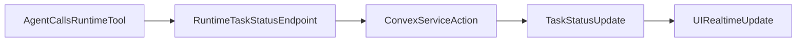

# Agent Status Updates via Runtime Tool

#### 1. Context & goal

Agents must update task status explicitly (no reply parsing), consistent with the concept doc’s direct Convex status updates. We will introduce a runtime-owned tool (invokable by OpenClaw agents) that calls a Convex service action to update task status with full validation, activity logging, and notifications. Auto-move on assignment stays server-side. This aligns with Convex best practices for access control and trusted service actions.

#### 2. Codebase research summary

Files inspected and patterns to reuse:

- `[docs/concept/openclaw-mission-control-initial-article.md](docs/concept/openclaw-mission-control-initial-article.md)` — conceptual status update is an explicit Convex call.
- `[packages/backend/convex/tasks.ts](packages/backend/convex/tasks.ts)` — workflow validation (`updateStatus`), current assignment flow (`assign`).
- `[packages/backend/convex/lib/task_workflow.ts](packages/backend/convex/lib/task_workflow.ts)` — allowed transitions and requirements.
- `[packages/backend/convex/lib/notifications.ts](packages/backend/convex/lib/notifications.ts)` — status change notifications.
- `[packages/backend/convex/service/actions.ts](packages/backend/convex/service/actions.ts)` — service-auth actions used by runtime.
- `[apps/runtime/src/health.ts](apps/runtime/src/health.ts)` — runtime HTTP server where we can add a local-only tool endpoint.
- `[apps/runtime/src/gateway.ts](apps/runtime/src/gateway.ts)` — tracks sessionKey→agentId mapping needed to authenticate tool calls.
- `[docs/runtime/AGENTS.md](docs/runtime/AGENTS.md)` — operating rules to update status when starting work / review / done / blocked.

Existing patterns to reuse:

- `requireServiceAuth` for service actions
- `logActivity` for audit trail
- `createStatusChangeNotification` for status notifications
- `isValidTransition` + `validateStatusRequirements` for workflow checks

#### 3. High-level design

**Backend (Convex)**

- Add a service-only mutation `updateStatusFromAgent` and a service action `updateTaskStatusFromAgent` that validate transitions, enforce account scope, and log activity/notifications.
- Enhance `tasks.assign` to auto-transition `inbox → assigned` (and revert `assigned → inbox` when all assignees removed), with activity logging.

**Runtime Tool**

- Add a local-only HTTP endpoint (e.g. `POST /agent/task-status`) to the runtime health server.
- The endpoint reads an OpenClaw session key from a header, resolves it to `agentId` via the gateway session map, and calls `api.service.actions.updateTaskStatusFromAgent` using the runtime’s service token.
- This avoids parsing agent reply text and keeps the update explicit.

**Agent UX**

- Update runtime notification prompts and AGENTS instructions to call the tool explicitly when changing status (e.g., before posting a review summary, call the tool with status `review`).

Mermaid flow:

#### 4. File & module changes

**Backend**

- `[packages/backend/convex/service/tasks.ts](packages/backend/convex/service/tasks.ts)`
  - Add `updateStatusFromAgent` internal mutation with:
    - args: `taskId`, `agentId`, `status`, `blockedReason?`
    - transition validation (`isValidTransition`, `validateStatusRequirements`)
    - idempotency (return early if status unchanged)
    - `logActivity` with `actorType: "agent"`
    - `createStatusChangeNotification` for assigned users/agents
- `[packages/backend/convex/service/actions.ts](packages/backend/convex/service/actions.ts)`
  - Add `updateTaskStatusFromAgent` action:
    - validate service token
    - verify agent/task belong to the account
    - call `internal.service.tasks.updateStatusFromAgent`
- `[packages/backend/convex/tasks.ts](packages/backend/convex/tasks.ts)`
  - In `assign`, compute final assignees and:
    - set status to `assigned` when `inbox` and assignees exist
    - revert to `inbox` when `assigned` and no assignees remain
  - log `task_status_changed` activity for auto transitions

**Runtime**

- `[apps/runtime/src/gateway.ts](apps/runtime/src/gateway.ts)`
  - Export a helper (e.g., `getAgentIdForSessionKey(sessionKey)`) to resolve OpenClaw session key → `agentId`.
- `[apps/runtime/src/health.ts](apps/runtime/src/health.ts)`
  - Add a `POST /agent/task-status` handler:
    - require local requests (bind only to `healthHost`)
    - read `x-openclaw-session-key`
    - parse JSON body `{ taskId, status, blockedReason? }`
    - resolve agent id via gateway helper
    - call `api.service.actions.updateTaskStatusFromAgent` with service token
    - respond with success or error JSON
- `[apps/runtime/src/delivery.ts](apps/runtime/src/delivery.ts)`
  - Update `formatNotificationMessage` to instruct explicit tool usage:
    - “Call the status tool to set `in_progress`, `review`, `done`, or `blocked` before posting.”

**Docs / Instructions**

- `[docs/runtime/AGENTS.md](docs/runtime/AGENTS.md)`
  - Add a clear section for “How to update task status” with the tool call format.

#### 5. Step-by-step tasks

1. Add `updateStatusFromAgent` internal mutation in `[packages/backend/convex/service/tasks.ts](packages/backend/convex/service/tasks.ts)` and validate transitions + log activity.
2. Add `updateTaskStatusFromAgent` service action in `[packages/backend/convex/service/actions.ts](packages/backend/convex/service/actions.ts)`.
3. Update `assign` in `[packages/backend/convex/tasks.ts](packages/backend/convex/tasks.ts)` for auto `inbox → assigned` and `assigned → inbox` transitions.
4. Expose sessionKey→agentId resolver in `[apps/runtime/src/gateway.ts](apps/runtime/src/gateway.ts)`.
5. Add `POST /agent/task-status` handler in `[apps/runtime/src/health.ts](apps/runtime/src/health.ts)` (local-only), calling the Convex service action.
6. Update agent prompt in `[apps/runtime/src/delivery.ts](apps/runtime/src/delivery.ts)` to use the tool for status updates.
7. Update `[docs/runtime/AGENTS.md](docs/runtime/AGENTS.md)` with explicit tool usage instructions.
8. Run `npx convex dev --once`, then `npm run typecheck`.

#### 6. Edge cases & risks

- **Invalid transitions**: service mutation rejects and returns clear error; runtime tool must surface errors without breaking agent message writeback.
- **Blocked without reason**: rejected by `validateStatusRequirements`.
- **Session spoofing**: require `x-openclaw-session-key` and resolve to agentId; only accept local requests via `healthHost`.
- **Unassign revert**: only revert when current status is `assigned` to avoid regressions.

#### 7. Testing strategy

- **Manual QA**
  - Call the runtime endpoint with a valid session key + taskId to set status to `review` and verify UI update.
  - Remove all assignees from an `assigned` task and confirm it reverts to `inbox`.
  - Try invalid transition (e.g., `inbox → done`) and confirm error response.

#### 8. Rollout / migration

- No schema changes or migrations required.
- Roll out by deploying runtime + Convex changes together; older runtimes simply won’t expose the tool.

#### 9. TODO checklist

- Add `updateStatusFromAgent` internal mutation (Convex)
- Add `updateTaskStatusFromAgent` service action (Convex)
- Update `tasks.assign` for auto status transitions (Convex)
- Add gateway sessionKey→agentId resolver (Runtime)
- Add `/agent/task-status` endpoint (Runtime)
- Update runtime prompt to instruct explicit tool usage
- Update `docs/runtime/AGENTS.md` with tool usage
- Run `npx convex dev --once` and `npm run typecheck`
