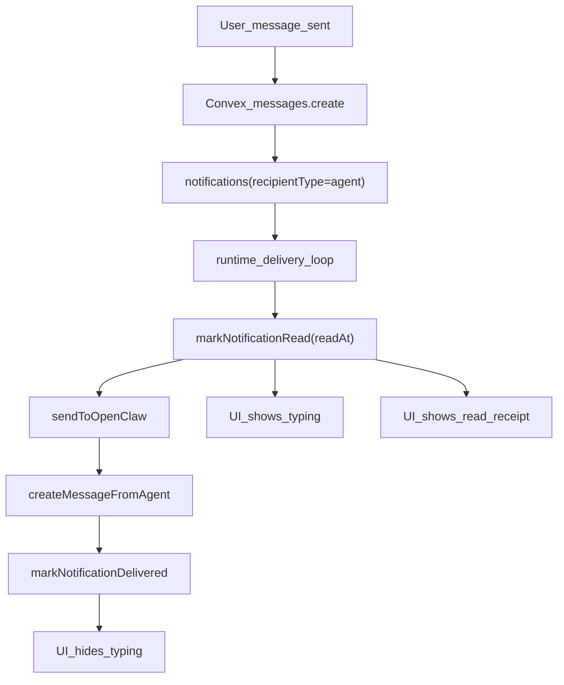

# Agent Typing + Read Indicators Plan

## 1. Context & goal

Add visible “agent is typing …” and “agent read” indicators in the task thread chat so users know when the runtime picked up their message and when an agent is actively responding. This must work with existing Convex realtime subscriptions, preserve multi-tenancy, and avoid breaking notification delivery semantics. Assumptions: the “chat” is the task thread UI at `[apps/web/src/app/(dashboard)/[accountSlug]/tasks/[taskId]/page.tsx](apps/web/src/app/(dashboard)/[accountSlug]/tasks/[taskId]/page.tsx)`, and “read” means the runtime has started processing a notification (best available signal without streaming). OpenClaw’s built-in typing indicators apply to external chat channels; for the Mission Control web UI we’ll surface status via Convex data instead.

### Definitions & UX rules (must follow)

- **Chat surface**: only the task thread UI (no changes to external channels).
- **Read** = runtime started processing the agent notification; implemented as `notifications.readAt` for `recipientType="agent"`.
- **Typing** = `readAt` is set, `deliveredAt` is empty, and `readAt` is recent (within a short window).
- **Typing indicator location**: a single row above the input, not inline per message.
- **Read receipt location**: show for the most recent **user-authored** message only (reduces clutter).
- **Text rules**:
  - 1 agent → “{AgentName} is typing…”
  - 2+ agents → “{N} agents are typing…”
  - Read receipt → “Seen by {Agent1}, {Agent2}”
- **Timeout window**: 120 seconds default (use constant in `TaskThread.tsx`), so stale indicators disappear on delivery failure.
- **Fallback names**: if agent name missing, use “Agent”.
- **Scope**: only notifications that have a `taskId` and `messageId` and `recipientType="agent"`.

### Acceptance criteria (for juniors to self-check)

- When a user sends a message that triggers agent notifications, the typing indicator appears within 1–2 polling cycles of runtime marking `readAt`.
- Once the agent reply is written and `deliveredAt` is set, typing indicator disappears.
- “Seen by …” is shown for the latest user message once any agent notification for that message has `readAt`.
- No typing indicator appears for messages that do not create agent notifications.

## 2. Codebase research summary

- `[apps/web/src/components/tasks/TaskThread.tsx](apps/web/src/components/tasks/TaskThread.tsx)` renders message list + input and already uses `useQuery(api.messages.listByTask)` for realtime updates.
- `[apps/web/src/components/tasks/MessageItem.tsx](apps/web/src/components/tasks/MessageItem.tsx)` renders individual messages, author badges, and timestamps.
- `[apps/web/src/components/tasks/MessageInput.tsx](apps/web/src/components/tasks/MessageInput.tsx)` handles send UX and @mention parsing.
- `[packages/backend/convex/messages.ts](packages/backend/convex/messages.ts)` creates messages, mentions, and thread notifications.
- `[packages/backend/convex/lib/notifications.ts](packages/backend/convex/lib/notifications.ts)` creates mention/thread_update notifications with `messageId` and `taskId`.
- `[packages/backend/convex/notifications.ts](packages/backend/convex/notifications.ts)` exposes user-facing notification read APIs; no agent-read flow yet.
- `[packages/backend/convex/service/notifications.ts](packages/backend/convex/service/notifications.ts)` and `[packages/backend/convex/service/actions.ts](packages/backend/convex/service/actions.ts)` handle service-only delivery and `deliveredAt` updates.
- `[apps/runtime/src/delivery.ts](apps/runtime/src/delivery.ts)` delivers agent notifications to OpenClaw and marks delivered after response.
- `[apps/runtime/src/gateway.ts](apps/runtime/src/gateway.ts)` uses non-streaming OpenClaw `/v1/responses` (no live typing events).
- `[packages/backend/convex/schema.ts](packages/backend/convex/schema.ts)` already includes `readAt` and `deliveredAt` on notifications.
- Docs reviewed: `[docs/concept/openclaw-mission-control-cursor-core-instructions.md](docs/concept/openclaw-mission-control-cursor-core-instructions.md)`, `[docs/concept/openclaw-mission-control-initial-article.md](docs/concept/openclaw-mission-control-initial-article.md)`, `[docs/build/00-orchestrator.md](docs/build/00-orchestrator.md)`.

## 3. High-level design

We will treat `notifications.readAt` for `recipientType="agent"` as the “agent read / started processing” signal and keep `deliveredAt` as the existing “delivery complete” signal. The runtime will set `readAt` right before `sendToOpenClaw`, and the UI will show typing while `readAt` is set but `deliveredAt` is still empty (bounded by a short time window to avoid stale indicators on failures). Read receipts will be shown for user-authored messages when their corresponding agent notifications have `readAt` set.

Mermaid flow (simplified):



Key data flow:

- User sends a message → `messages.create` writes message + agent notification(s).
- Runtime picks up notification → marks `readAt` (service-only) → calls OpenClaw.
- After response → `createMessageFromAgent` → `markNotificationDelivered`.
- Web UI uses realtime queries to show typing (readAt && !deliveredAt) and read receipts (readAt set on notifications that reference each message).

### Detailed logic (exact, reduce mistakes)

**New query output shape (UI expects this):**

```
type AgentReceipt = {
  _id: Id<"notifications">;
  recipientId: string; // agent id as string
  messageId?: Id<"messages">;
  type: "mention" | "thread_update" | "assignment" | "status_change" | "member_added" | "member_removed" | "role_changed";
  readAt?: number;
  deliveredAt?: number;
  createdAt: number;
};
```

**Typing evaluation (in `TaskThread.tsx`):**

```
const TYPING_WINDOW_MS = 120_000;
const now = useState(Date.now()) + useInterval(1000);
const isTyping = receipt.readAt && !receipt.deliveredAt && now - receipt.readAt <= TYPING_WINDOW_MS;
```

**Read receipts (latest user message only):**

```
const latestUserMessageId = last message where message.authorType === "user";
const readAgentIds = receipts
  .filter(r => r.messageId === latestUserMessageId && r.readAt)
  .map(r => r.recipientId);
```

**Agent names mapping:**

```
const name = agentsByAuthorId?.[agentId]?.name ?? "Agent";
```

## 4. File & module changes

### Backend (Convex)

- `[packages/backend/convex/notifications.ts](packages/backend/convex/notifications.ts)`
  - Add `listAgentReceiptsByTask` query with args `{ taskId: Id<"tasks"> }`.
  - Validate task exists; call `requireAccountMember(ctx, task.accountId)` first.
  - Query `notifications` with `withIndex("by_task", q => q.eq("taskId", args.taskId))`.
  - Filter to `recipientType === "agent"` and `accountId === task.accountId` (defensive safety).
  - Return **only**: `_id`, `recipientId`, `messageId`, `type`, `readAt`, `deliveredAt`, `createdAt`.
  - Add JSDoc for new query export.
- `[packages/backend/convex/service/notifications.ts](packages/backend/convex/service/notifications.ts)`
  - Add internal mutation `markRead` (service-only) to set `readAt` if empty.
  - Must be idempotent: if `readAt` already set, do nothing.
  - Keep semantics of `deliveredAt` unchanged.
  - Add JSDoc for new mutation.
- `[packages/backend/convex/service/actions.ts](packages/backend/convex/service/actions.ts)`
  - Add action `markNotificationRead` validating service token + account.
  - Verify the notification belongs to the same `accountId` (use `internal.service.notifications.getForDelivery` or `ctx.db.get` via internal query).
  - Call `internal.service.notifications.markRead`.
  - Add JSDoc for new action.

### Runtime

- `[apps/runtime/src/delivery.ts](apps/runtime/src/delivery.ts)`
  - Before calling `sendToOpenClaw` (after `shouldDeliverToAgent` passes), call `api.service.actions.markNotificationRead` with `notificationId`, `serviceToken`, `accountId`.
  - If the call fails, log and continue to avoid blocking delivery.
  - Do not mark read for skipped deliveries (missing task / `shouldDeliverToAgent` false).

### Web UI

- `[apps/web/src/components/tasks/TaskThread.tsx](apps/web/src/components/tasks/TaskThread.tsx)`
  - Add `useQuery(api.notifications.listAgentReceiptsByTask, { taskId })`.
  - Build `readByMessageId` map and `typingAgents` list using `agentsByAuthorId` for names.
  - Add a small “typing” row above the input when `typingAgents.length > 0` (e.g., “Jarvis is typing…” or “2 agents are typing…”), with animated ellipsis.
  - Use a short time window for typing (e.g., 90–120s) to avoid stale indicators if delivery fails; use `useInterval` from `usehooks-ts` to re-evaluate `Date.now()`.
- `[apps/web/src/components/tasks/MessageItem.tsx](apps/web/src/components/tasks/MessageItem.tsx)`
  - Add optional prop `readByAgents?: string[]` for user-authored messages.
  - Render a small “Seen by …” line when provided and non-empty.
  - Keep imports at top; add JSDoc for any new exported types/props if introduced.

## 5. Step-by-step tasks

1. **Add service-side read marker (Convex service)**

   - Implement `markRead` in `[packages/backend/convex/service/notifications.ts](packages/backend/convex/service/notifications.ts)`.
   - Add `markNotificationRead` action in `[packages/backend/convex/service/actions.ts](packages/backend/convex/service/actions.ts)` with account ownership validation.

2. **Expose agent receipt query (Convex public)**

   - Add `listAgentReceiptsByTask` in `[packages/backend/convex/notifications.ts](packages/backend/convex/notifications.ts)` using `withIndex("by_task")` and `requireAccountMember`.
   - Ensure returned fields match the exact shape above.

3. **Runtime integration (mark read before send)**

   - Update `[apps/runtime/src/delivery.ts](apps/runtime/src/delivery.ts)` to call `markNotificationRead` immediately before `sendToOpenClaw`.
   - Wrap in try/catch; log warning and continue on failure.

4. **UI typing indicator (thread-level)**

   - Add `useQuery(api.notifications.listAgentReceiptsByTask, { taskId })` to `TaskThread`.
   - Use `usehooks-ts` `useInterval` to update a `now` state every 1s for typing timeout.
   - Compute `typingAgents` from receipts using `readAt` + `deliveredAt` + `TYPING_WINDOW_MS`.
   - Render a single line above input; no per-message typing rows.

5. **UI read receipts (latest user message only)**

   - Add optional prop `readByAgents?: string[]` to `MessageItem`.
   - In `TaskThread`, find latest user-authored message and pass `readByAgents` only to that message.
   - Sort agent names alphabetically to keep stable display.

6. **Polish + docs**

   - Ensure JSDoc on new exports and keep imports at top (project rule).
   - Add brief note to `docs/runtime/AGENTS.md` (optional) describing read/typing semantics as runtime signals, not human read receipts.

## 6. Edge cases & risks

- **Stale typing indicators**: If runtime fails before `markNotificationDelivered`, `readAt` may persist; mitigate by time-window filtering in UI.
- **Multiple agents**: Show aggregated text (“2 agents are typing”) to avoid clutter; ensure agent names are resolved via `agentsByAuthorId`.
- **Skipped deliveries**: `shouldDeliverToAgent` can skip; only mark read when a delivery is actually attempted.
- **No reply**: OpenClaw may return an empty response; `deliveredAt` will still be set, so typing should clear even if no agent message appears.
- **Auth/tenancy**: The new query must validate task ownership and use `withIndex` to avoid full scans.

## 7. Testing strategy

- **Unit**: Add a Convex test (if harness exists) to verify `listAgentReceiptsByTask` filters agent notifications and respects account membership.
- **Integration**: Run local Convex + runtime; post a user message with an agent mention and verify:
  - typing indicator appears while runtime waits for OpenClaw,
  - “Seen by …” appears once `readAt` is set,
  - typing indicator disappears after response/delivery.
- **Manual QA**:
  - Send a message without agent mention; ensure no typing indicator if no agent notifications are created.
  - Send message with agent mention; observe typing then response.
  - Simulate OpenClaw timeout and confirm typing disappears after timeout window.

## 8. Rollout / migration (if relevant)

- **Migration**: None; uses existing `notifications.readAt` field.
- **Rollout**: Ship behind a small UI toggle if you want (optional); otherwise safe to enable by default.
- **V2 suggestion**: Integrate OpenClaw streaming + typing events for true live indicators (switch `stream: true` in `[apps/runtime/src/gateway.ts](apps/runtime/src/gateway.ts)` and surface partial blocks via a `message_streams` table). This would allow real-time “typing” and incremental message rendering instead of timestamp heuristics. Use a dedicated table keyed by `{ taskId, agentId, messageId? }` and a TTL cleanup job to prevent stale stream rows.

## 9. TODO checklist

- [ ] **Backend**: add `markRead` internal mutation in `[packages/backend/convex/service/notifications.ts](packages/backend/convex/service/notifications.ts)`.
- [ ] **Backend**: add `markNotificationRead` action in `[packages/backend/convex/service/actions.ts](packages/backend/convex/service/actions.ts)`.
- [ ] **Backend**: add `listAgentReceiptsByTask` query in `[packages/backend/convex/notifications.ts](packages/backend/convex/notifications.ts)`.
- [ ] **Runtime**: call `markNotificationRead` before `sendToOpenClaw` in `[apps/runtime/src/delivery.ts](apps/runtime/src/delivery.ts)`.
- [ ] **Frontend**: compute `typingAgents` + `readByMessageId` in `[apps/web/src/components/tasks/TaskThread.tsx](apps/web/src/components/tasks/TaskThread.tsx)`.
- [ ] **Frontend**: render typing indicator row and pass `readByAgents` into `[apps/web/src/components/tasks/MessageItem.tsx](apps/web/src/components/tasks/MessageItem.tsx)`.
- [ ] **Tests/QA**: manual verification of typing/read behavior in task thread.
