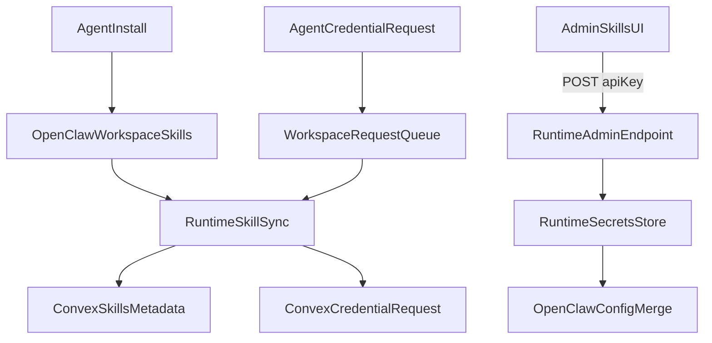

# Agent-Managed Skills POC + Runtime Alignment

## Assumptions & scope

- **Scope choice (per your answer):** cover everything, but prioritize skills persistence + API-key UI.
- **Assumption A:** For the POC, OpenClaw uses a **shared workspace** (`/root/clawd`) for all agents; per-agent workspaces are deferred.
- **Assumption B:** Secrets are **stored only on the runtime host** (not in Convex), using a persistent file in the OpenClaw data volume; Convex stores **references + status only**.
- **Assumption C:** Runtime is reachable from the web app (public IP/HTTPS) so the UI can send secrets directly to runtime.
- **Assumption D:** Skill installs use **Clawdhub/OpenClaw-compatible skills**; other sources (like `skills.sh`) are documented as discovery only until validated for OpenClaw compatibility.

## 1. Context & goal

We need a POC where agents can install and persist skills themselves, while humans can securely provide required API keys through the UI. This must fit the OpenClaw Mission Control “team + traceable work” spirit from the concept docs, maintain tenant isolation, and avoid storing plaintext secrets in Convex. We will also align runtime/docker behavior with the upstream clawdbot-docker patterns and add open‑source readiness items.

**Value to the project:**

- Reduces manual ops for skill installation while keeping auditability.
- Keeps secrets off the shared brain (Convex) and scoped to the runtime host.
- Aligns local/prod OpenClaw setup with proven upstream patterns to reduce drift.
- Improves readiness for open sourcing (documentation and security hygiene).

## 2. Codebase research summary

**Files inspected:**

- Skills schema and CRUD: [packages/backend/convex/schema.ts](packages/backend/convex/schema.ts), [packages/backend/convex/skills.ts](packages/backend/convex/skills.ts)
- Agent skill assignment: [packages/backend/convex/agents.ts](packages/backend/convex/agents.ts)
- Runtime OpenClaw config + boot merge: [apps/runtime/openclaw/openclaw.json.template](apps/runtime/openclaw/openclaw.json.template), [apps/runtime/openclaw/start-openclaw.sh](apps/runtime/openclaw/start-openclaw.sh)
- Runtime sync/health: [apps/runtime/src/agent-sync.ts](apps/runtime/src/agent-sync.ts), [apps/runtime/src/health.ts](apps/runtime/src/health.ts), [apps/runtime/src/index.ts](apps/runtime/src/index.ts), [apps/runtime/src/config.ts](apps/runtime/src/config.ts)
- Docker Compose: [apps/runtime/docker-compose.runtime.yml](apps/runtime/docker-compose.runtime.yml)
- OpenClaw admin page: [apps/web/src/app/(dashboard)/[accountSlug]/admin/openclaw/page.tsx](apps/web/src/app/(dashboard)/[accountSlug]/admin/openclaw/page.tsx)
- OpenClaw local dev docs: [docs/runtime/runtime-docker-compose.md](docs/runtime/runtime-docker-compose.md)
- Missing features list: [docs/roadmap/missing-features.md](docs/roadmap/missing-features.md)

**Key findings:**

- Skills are modeled in Convex and can be assigned to agents, but **OpenClaw config is hardcoded** on boot; there’s no runtime skill sync.
- Agent sync already exists and avoids restarts for new agents.
- OpenClaw config and workspace already persist via volumes in local Compose.
- There is a strong admin “OpenClaw Configuration” page but no skills/credentials UI.

## 3. High-level design

### Architecture summary

- **Agent skill install (OpenClaw workspace):** Agents install skills into `/root/clawd/skills` (persisted volume).
- **Runtime SkillSync:** A new runtime loop scans installed skills + pending credential requests and updates Convex metadata (no secrets).
- **Credential requests:** Agents drop a request file in the workspace or call a minimal runtime helper; runtime writes a `skillCredentials` record in Convex for UI visibility.
- **API key entry:** Admin UI sends key **directly to runtime**; runtime stores it on disk and updates OpenClaw config on the host (no Convex plaintext).
- **OpenClaw config merge:** Startup script merges runtime secrets into `clawdbot.json` and optionally supports hot‑reload (or triggers a controlled restart).

### Main data flows

### How this fits the repo

- Reuse existing Convex auth patterns and `service.actions.*` for runtime calls.
- Extend runtime sync loop pattern (`agent-sync`) for skill sync.
- Extend the existing OpenClaw admin page to present “Skills & Credentials”.
- Align Docker and OpenClaw config with [clawdbot-docker](https://github.com/CrocSwap/clawdbot-docker) guidance.

## 4. File & module changes

### Backend (Convex)

- [packages/backend/convex/schema.ts](packages/backend/convex/schema.ts)
  - Add `skillCredentials` table:
    - `accountId`, `skillId` (optional if unknown), `skillSlug`, `keyName`, `credentialRef`, `status` (`pending|active|revoked`), `requestedByAgentId` (optional), `createdAt`, `updatedAt`.
  - Add indexes by `accountId` and `status`.
  - Add activity types for skill/credential events (audit trail).
- [packages/backend/convex/skills.ts](packages/backend/convex/skills.ts)
  - Add helper query to list skills with credential status (join by `skillSlug` or `skillId`).
- [packages/backend/convex/service/actions.ts](packages/backend/convex/service/actions.ts)
  - Add `requestSkillCredential` action (runtime only) to create `skillCredentials` rows.
  - Add `markSkillCredentialActive` action (runtime only) for when a secret is stored.
  - Add `listSkillCredentials` action (admin UI) to render pending/active credentials.
- [packages/backend/convex/service/skills.ts](packages/backend/convex/service/skills.ts) (new)
  - Internal queries/mutations called by service actions above.

### Runtime

- [apps/runtime/src/skill-sync.ts](apps/runtime/src/skill-sync.ts) (new)
  - Periodically scan `/root/clawd/skills` and upsert Convex skill metadata (slug, description if available).
  - Scan a workspace request queue (e.g., `/root/clawd/requests/skill-credentials/*.json`) to create credential requests via service action.
  - Expose sync state for health.
- [apps/runtime/src/config.ts](apps/runtime/src/config.ts)
  - Add envs: `SKILL_SYNC_INTERVAL`, `OPENCLAW_DATA_DIR`, `OPENCLAW_WORKSPACE_DIR`, `RUNTIME_SECRETS_FILE`, `CLERK_JWKS_URL`.
- [apps/runtime/src/health.ts](apps/runtime/src/health.ts)
  - Add `skillSync` status (lastSyncAt, lastError, counts).
  - Add a **new admin endpoint** in the same server:
    - `POST /admin/skills/credentials` with Clerk JWT + accountId + `credentialRef` + secret.
    - Validate Clerk JWT and membership via Convex service action; then store secret to file and mark credential active.
- [apps/runtime/openclaw/start-openclaw.sh](apps/runtime/openclaw/start-openclaw.sh)
  - Merge runtime secrets file into `skills.entries.<key>.env` or `.apiKey` during config merge.
  - Respect `OPENCLAW_BIND_HOST` and `CLAWDBOT_GATEWAY_TOKEN` like upstream.
  - Optionally add a lightweight reload mechanism (flag file + restart gateway process).
- [apps/runtime/openclaw/openclaw.json.template](apps/runtime/openclaw/openclaw.json.template)
  - Make default skills minimal; leave skill install/enablement to agent-managed workflow.
  - Ensure browser config matches doc defaults; add `skills.install` and `skills.load` defaults.
- [apps/runtime/docker-compose.runtime.yml](apps/runtime/docker-compose.runtime.yml)
  - Add `shm_size: '2gb'` for Chromium stability (matches upstream).
  - Add `OPENCLAW_BIND_HOST` env + port mapping to support secure remote access.
  - Mount the OpenClaw data/workspace volumes **into runtime** so it can read/write secrets and scan skills.
  - Add build args for `EXTRA_APT_PACKAGES` to openclaw build (matches upstream).

### Web UI

- [apps/web/src/app/(dashboard)/[accountSlug]/admin/openclaw/page.tsx](apps/web/src/app/(dashboard)/[accountSlug]/admin/openclaw/page.tsx)
  - Add a new tab “Skills & Credentials”:
    - List skills (from Convex) and credential status.
    - Show pending credential requests.
    - Provide secure input + submit to runtime endpoint (Clerk JWT).
- [apps/web/src/components/skills/SkillCredentialList.tsx](apps/web/src/components/skills/SkillCredentialList.tsx) (new)
  - Table/list of pending/active credentials with input + status.
- [apps/web/src/components/skills/SkillInstallDocs.tsx](apps/web/src/components/skills/SkillInstallDocs.tsx) (new)
  - Short “How agents install skills” + links to Clawdhub and discovery sources (e.g., [skills.sh](https://skills.sh/)).

### Docs / OSS readiness

- [docs/runtime/runtime-docker-compose.md](docs/runtime/runtime-docker-compose.md)
  - Document new env vars, bind host behavior, secrets flow, and skill sync.
- [apps/runtime/README.md](apps/runtime/README.md)
  - Add “Skill management + credentials” section with POC caveats.
- [docs/runtime/AGENTS.md](docs/runtime/AGENTS.md)
  - Add instructions for agents to install skills and request credentials via workspace request files.
- Add missing OSS files (if not present): `SECURITY.md`, `CODE_OF_CONDUCT.md`, and an `ARCHITECTURE.md` summary.

## 5. Step-by-step tasks

1. **Schema + service actions**
  - Add `skillCredentials` table and activity types in [packages/backend/convex/schema.ts](packages/backend/convex/schema.ts).
  - Implement internal queries/mutations in [packages/backend/convex/service/skills.ts](packages/backend/convex/service/skills.ts).
  - Add service actions in [packages/backend/convex/service/actions.ts](packages/backend/convex/service/actions.ts).
2. **Runtime SkillSync loop**
  - Create [apps/runtime/src/skill-sync.ts](apps/runtime/src/skill-sync.ts) to scan `/root/clawd/skills` and request queue.
  - Wire into startup/shutdown in [apps/runtime/src/index.ts](apps/runtime/src/index.ts).
  - Add config options in [apps/runtime/src/config.ts](apps/runtime/src/config.ts).
  - Expose state in [apps/runtime/src/health.ts](apps/runtime/src/health.ts).
3. **Runtime admin endpoint + secret store**
  - Extend [apps/runtime/src/health.ts](apps/runtime/src/health.ts) with `POST /admin/skills/credentials`.
  - Validate Clerk JWT via `CLERK_JWKS_URL`, then verify admin role via a new service action.
  - Persist secrets to a file in OpenClaw data volume (`RUNTIME_SECRETS_FILE`).
  - Mark credential `active` in Convex after storing.
4. **OpenClaw config merge updates**
  - Update [apps/runtime/openclaw/start-openclaw.sh](apps/runtime/openclaw/start-openclaw.sh) to inject secrets into `skills.entries.*.env`.
  - Update [apps/runtime/openclaw/openclaw.json.template](apps/runtime/openclaw/openclaw.json.template) to reduce hardcoded skill list and align defaults.
5. **Docker/compose alignment with clawdbot-docker**
  - Update [apps/runtime/docker-compose.runtime.yml](apps/runtime/docker-compose.runtime.yml) with `shm_size`, `OPENCLAW_BIND_HOST`, and build args.
  - Mount OpenClaw data/workspace volumes into runtime for sync + secrets.
  - Document in [docs/runtime/runtime-docker-compose.md](docs/runtime/runtime-docker-compose.md).
6. **Admin UI for credentials**
  - Add a “Skills & Credentials” tab to [apps/web/src/app/(dashboard)/[accountSlug]/admin/openclaw/page.tsx](apps/web/src/app/(dashboard)/[accountSlug]/admin/openclaw/page.tsx).
  - Create components to list credential requests and submit keys to runtime.
  - Show success/error states and prompt for restart if needed.
7. **Docs for agent self‑service skills**
  - Update [docs/runtime/AGENTS.md](docs/runtime/AGENTS.md) with steps to install skills and request keys.
  - Add discovery links (Clawdhub + skills.sh) and compatibility notes.
8. **Open‑source readiness sweep**
  - Add `SECURITY.md`, `CODE_OF_CONDUCT.md`, `ARCHITECTURE.md` with minimal project posture.
  - Cross‑link in [README.md](README.md) and [CONTRIBUTING.md](CONTRIBUTING.md).

## 6. Edge cases & risks

- **Unauthorized secret submission:** Runtime must verify Clerk JWT and account admin role; reject otherwise.
- **Runtime unreachable:** UI should surface “runtime offline” and queue nothing (no secret upload).
- **Config reload lag:** If OpenClaw doesn’t hot‑reload env, guide UI to request restart or implement a controlled gateway reload.
- **Prompt bloat:** Too many skills will increase prompt size; encourage agent-specific installs and document this.
- **Skill name conflicts:** Workspace skills override bundled/managed; document precedence.
- **Cross-account leakage:** Always key credentialRefs by accountId; enforce in runtime before writing.

## 7. Testing strategy

- **Unit tests**
  - Skill sync parsing (directory scan, request file parsing) in [apps/runtime/src/skill-sync.ts](apps/runtime/src/skill-sync.ts).
  - Credential request validation and Convex actions in [packages/backend/convex/service/skills.ts](packages/backend/convex/service/skills.ts).
- **Integration tests**
  - Admin submits key → runtime stores secret → Convex marks `active`.
  - Skill install in workspace → Convex `skills` metadata updated.
- **Manual QA checklist**
  - Install a skill in OpenClaw workspace and confirm it persists after restart.
  - Create a credential request file and verify it appears in UI.
  - Submit key in UI and confirm status updates without storing plaintext in Convex.
  - Verify runtime health shows skill sync status.

## 8. Rollout / migration

- **Feature flags:** Gate new UI tab and runtime admin endpoint behind a `skills_poc_enabled` flag in `systemConfig`.
- **Gradual rollout:** Enable only for internal/test accounts first.
- **Observability:** Add logs for secret writes (no values), skill sync results, and admin endpoint rejections.

## 9. TODO checklist

**Backend**

- Add `skillCredentials` table + activity types in schema
- Implement internal Convex mutations/queries for credential requests
- Add service actions for runtime + admin UI

**Runtime**

- Implement `skill-sync` loop and wire into runtime lifecycle
- Add admin endpoint for credential submission with Clerk JWT validation
- Implement secrets store file + config merge
- Expose skill sync state in `/health`

**Frontend**

- Add “Skills & Credentials” tab to OpenClaw admin page
- Build credential list/input components with error states
- Display runtime status + guidance when offline

**Docs / OSS**

- Update runtime docs and AGENTS.md for self‑service skill install
- Add `SECURITY.md`, `CODE_OF_CONDUCT.md`, `ARCHITECTURE.md`
- Add README/CONTRIBUTING cross‑links and POC caveats

**Infra / DevOps**

- Update Compose to mount volumes for runtime sync + add `shm_size`
- Add env support for `OPENCLAW_BIND_HOST` + build args
- Document production bind‑host + gateway token guidance

