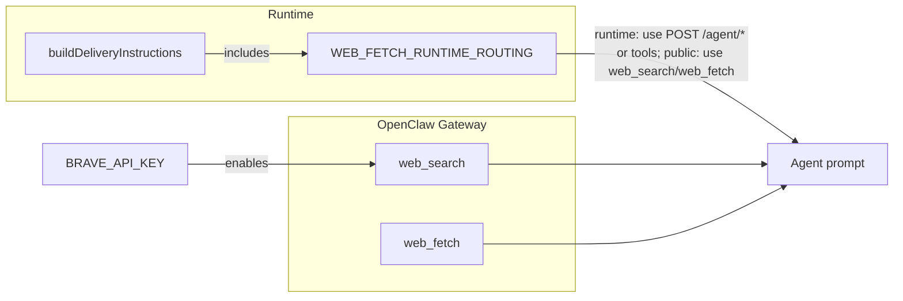

# Agent Web Search and URL Fetch — Implementation Plan

> **For Claude:** REQUIRED SUB-SKILL: Use superpowers:executing-plans to implement this plan task-by-task.

## User intent (alignment)

**Goal:** Agents can use web search and web_fetch when they need them; both work when used correctly.

- **web_search:** Available when the gateway has `BRAVE_API_KEY` set. We document the env var and where to set it so operators enable it; then agents can use it when needed.
- **web_fetch:** Works for public URLs. For the runtime base URL and internal hosts the platform blocks it (SSRF), so we tell agents to use POST /agent/\* or runtime tools for those URLs only. For all other URLs they use web_search and web_fetch as needed. Outcome: agents can use web search and fetch whenever needed; for runtime they use the working path.

**Architecture:** No OpenClaw config or SSRF changes. Gateway exposes web_search (when Brave key is set) and web_fetch (default). We add one routing line in the delivery prompt (use POST /agent/\* or tools for runtime/internal; use web_search and web_fetch for the rest) and document how to enable web search so both work when agents use them.

**Tech Stack:** TypeScript (runtime), Jest (delivery tests), Markdown (README, .env.example).

**Source:** [docs/brainstorms/2026-02-21-agent-web-search-and-fetch-brainstorm.md](docs/brainstorms/2026-02-21-agent-web-search-and-fetch-brainstorm.md)

---

## Task 1: Add test that delivery instructions include web_fetch/runtime routing

**Files:**

- Modify: [apps/runtime/src/delivery.test.ts](apps/runtime/src/delivery.test.ts) (in `describe("buildDeliveryInstructions")`)

**Step 1: Write the failing test**

Add a new test that asserts the built instructions contain the routing instruction so agents use the right method per URL. Reuse an existing `buildDeliveryInstructions` call pattern (e.g. with `ctx`, `"http://runtime:3000"`, and `toolCapabilities` with `hasTaskContext: true`). Assert that the returned string includes the constant you will add (e.g. `WEB_FETCH_RUNTIME_ROUTING` from `../prompt-fragments`). Place the test after the existing "includes assignment ack-only rule..." test in the same describe block.

Example shape:

```ts
it("includes web_fetch/runtime routing so agents use HTTP fallback for runtime and web_fetch for public URLs", () => {
  const ctx = buildContext({ ... });
  const toolCapabilities = getToolCapabilitiesAndSchemas({ ... });
  const instructions = buildDeliveryInstructions(ctx, "http://runtime:3000", toolCapabilities);
  expect(instructions).toContain(WEB_FETCH_RUNTIME_ROUTING);
});
```

**Step 2: Run test to verify it fails**

From repo root or `apps/runtime`:

```bash
npm test -- --testPathPattern=delivery.test.ts --testNamePattern="includes web_fetch/runtime routing"
```

Expected: FAIL (reference to `WEB_FETCH_RUNTIME_ROUTING` and/or missing text in instructions).

---

## Task 2: Add prompt fragment and inject into delivery prompt

**Files:**

- Modify: [apps/runtime/src/prompt-fragments.ts](apps/runtime/src/prompt-fragments.ts)
- Modify: [apps/runtime/src/delivery/prompt.ts](apps/runtime/src/delivery/prompt.ts)

**Step 3: Add fragment and injection**

1. In [apps/runtime/src/prompt-fragments.ts](apps/runtime/src/prompt-fragments.ts): After `ASSIGNMENT_SCOPE_ACK_ONLY_RULE`, add a JSDoc and export. Wording: routing only (use POST /agent/\* or tools for runtime/internal; use web_search and web_fetch for the rest when needed).

```ts
/**
 * Routing so agents use the right method per URL: runtime/internal → POST /agent/* or runtime tools; everything else → web_search and web_fetch when needed.
 * Used in buildDeliveryInstructions so runtime calls succeed and web search/fetch remain available for public URLs.
 */
export const WEB_FETCH_RUNTIME_ROUTING =
  "For the runtime base URL and internal hosts (e.g. http://runtime:..., localhost, 127.0.0.1), use POST /agent/* with header x-openclaw-session-key or the runtime tools (task_status, task_update, etc.). For all other URLs, use web_search and web_fetch when you need to search or fetch the web.";
```

1. In [apps/runtime/src/delivery/prompt.ts](apps/runtime/src/delivery/prompt.ts): Import `WEB_FETCH_RUNTIME_ROUTING` from `"../prompt-fragments"`. In `operationalBlock`, add it as the first element so it appears whenever instructions are built (we always have `runtimeBaseUrl`). Prepend a new entry to the array:

```ts
WEB_FETCH_RUNTIME_ROUTING,
```

So the first two elements of `operationalBlock` become: the new constant string, then the existing conditional `!hasRuntimeTools ? \`HTTP fallbacks: ...` (or the conditional first and the routing immediately after; either way the routing instruction must be in the block and always present).

**Step 4: Run test to verify it passes**

```bash
npm test -- --testPathPattern=delivery.test.ts --testNamePattern="includes web_fetch/runtime routing"
```

Expected: PASS.

Run the full delivery test suite to avoid regressions:

```bash
npm test -- --testPathPattern=delivery.test.ts
```

Expected: All delivery tests PASS.

**Step 5: Commit**

```bash
git add apps/runtime/src/prompt-fragments.ts apps/runtime/src/delivery/prompt.ts apps/runtime/src/delivery.test.ts
git commit -m "feat(runtime): route runtime URLs to HTTP fallback so web_fetch works when used

- Add WEB_FETCH_RUNTIME_ROUTING so agents use POST /agent/* for runtime, web_fetch for public URLs
- Inject into buildDeliveryInstructions operational block
- Test that instructions include the routing"
```

---

## Task 3: Document web search and fetch so they work when used

**Files:**

- Modify: [apps/runtime/README.md](apps/runtime/README.md)
- Modify: [apps/runtime/.env.example](apps/runtime/.env.example) (optional)

**Step 6: Update README**

In [apps/runtime/README.md](apps/runtime/README.md), in the env table row for `BRAVE_API_KEY` (around line 63), keep the existing description. Add a short subsection or bullet under "Docker" / "Running locally" (e.g. after the "For the gateway, set VERCEL_AI_GATEWAY_API_KEY..." sentence around line 134) that states:

- **Web search:** Set `BRAVE_API_KEY` in the gateway environment (e.g. Docker `.env` or gateway container env) so agents can use **web_search** when needed.
- **Web fetch:** Agents can use **web_fetch** for public URLs when needed. For the runtime base URL and internal hosts they use POST /agent/\* or runtime tools (platform blocks fetch there), so both options work when used.

Optional: one line that Perplexity/OpenRouter can be used for AI-synthesized search (see OpenClaw docs); no implementation in this plan.

**Step 7: Optional .env.example tweak**

In [apps/runtime/.env.example](apps/runtime/.env.example), the comment for `BRAVE_API_KEY` (around line 100) already says "OpenClaw web_search". Optionally add: "Set this so agent web search works; leave unset to disable."

**Step 8: Commit**

```bash
git add apps/runtime/README.md apps/runtime/.env.example
git commit -m "docs(runtime): document how to make agent web search and fetch work

- README: BRAVE_API_KEY enables web_search; routing for runtime vs public URLs
- .env.example: clarify setting key for web search"
```

---

## Flow summary



---

## Verification

- `npm test -- apps/runtime/src/delivery.test.ts` passes.
- `yarn typecheck` (or repo typecheck) passes.
- Manual: Start runtime + gateway with `BRAVE_API_KEY` set; trigger a delivery; confirm agents can use web_search and web_fetch when needed and that runtime URLs use POST /agent/\* or tools.
