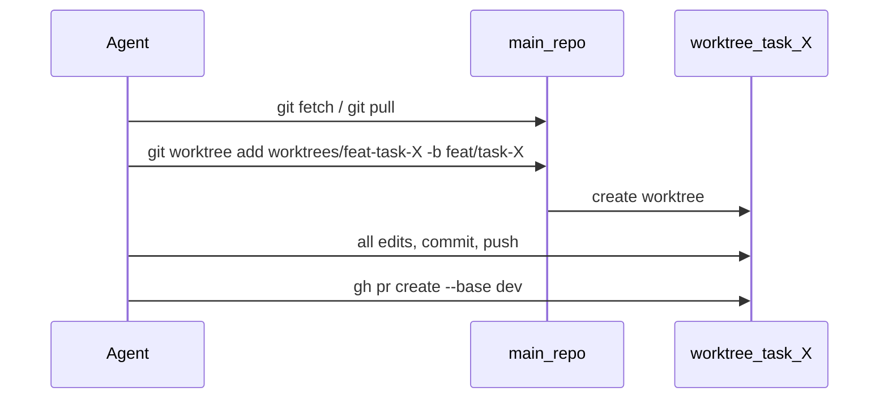
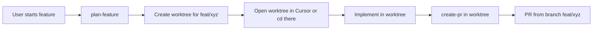

# Agent work isolation: worktrees instead of shared folder

## 1. Context and goal

**Problem:** All agents currently use a single writable clone (`/root/clawd/repos/openclaw-mission-control` for runtime; Cursor uses the repo root). Enforcing “one branch per task” was not enough: working in the same directory leads to mixed PRs (uncommitted changes, wrong branch checked out, or concurrent edits). We need **local work organisation**: each task/feature must use a **dedicated working directory**, not the shared repo folder.

**Goal:** Ensure agents never code in the same folder. Use **git worktrees** as the standard (one worktree per branch/task). This keeps one main repo, shared object store, and avoids full clones while giving full isolation per task/feature.

**Constraints:** No breaking change for existing “one branch per task” rule; worktrees extend it with “and work only in that branch’s worktree”. Runtime agents are bound to `/root/clawd`; Cursor can use worktrees next to the repo or in a sibling directory.

---

## 2. Codebase research summary

**Files and modules inspected:**

| Path                                                                                                             | Relevance                                                                                                    |
| ---------------------------------------------------------------------------------------------------------------- | ------------------------------------------------------------------------------------------------------------ |
| [docs/runtime/AGENTS.md](docs/runtime/AGENTS.md)                                                                 | Runtime agent manual: primary repo path, “Creating a PR”, “One branch per task”. Single path for all agents. |
| [apps/runtime/openclaw/start-openclaw.sh](apps/runtime/openclaw/start-openclaw.sh)                               | Creates `WRITABLE_REPO_DIR`, clones once, syncs AGENTS.md/HEARTBEAT.md. No worktree setup.                   |
| [apps/runtime/src/delivery/prompt.ts](apps/runtime/src/delivery/prompt.ts)                                       | Injects repo hint and task-branch rule into delivery prompt; hardcodes repo path.                            |
| [apps/runtime/src/openclaw-profiles.ts](apps/runtime/src/openclaw-profiles.ts)                                   | Embeds `DEFAULT_AGENTS_MD` with repo path and branch rule; used when no file-based AGENTS.md.                |
| [.cursor/skills/plan-feature/SKILL.md](.cursor/skills/plan-feature/SKILL.md)                                     | Phase 0: “Feature branch created (if applicable)”; no workspace isolation.                                   |
| [.cursor/skills/create-pr/SKILL.md](.cursor/skills/create-pr/SKILL.md)                                           | Branch creation and PR flow; assumes “current” directory is the repo; no worktree mention.                   |
| [packages/backend/convex/seed-skills/sprint-planning.md](packages/backend/convex/seed-skills/sprint-planning.md) | Refers to “dedicated worktree (created by brainstorming skill)” — worktree already a concept elsewhere.      |

**Patterns to follow:**

- Runtime: single source of truth for agent instructions is [docs/runtime/AGENTS.md](docs/runtime/AGENTS.md); it is synced into workspace and duplicated in [apps/runtime/src/openclaw-profiles.ts](apps/runtime/src/openclaw-profiles.ts) as `DEFAULT_AGENTS_MD`. Delivery prompt in [apps/runtime/src/delivery/prompt.ts](apps/runtime/src/delivery/prompt.ts) reinforces repo path and branch rule.
- Cursor: plan-feature defines phases and checklists; create-pr defines branch naming and `gh pr create`. Neither currently mentions working directory or worktrees.

**Why worktrees (not a tmp full clone):**

- Same `.git` and refs: one `git fetch` benefits all worktrees; less disk and faster than multiple full clones.
- One worktree per branch: natural fit for “one branch per task” and avoids two agents touching the same working tree.
- Git-native and well-supported; no custom clone management or cleanup of multiple repos.

---

## 3. High-level design

**Runtime (OpenClaw agents):**

- **Main repo:** Stays at `/root/clawd/repos/openclaw-mission-control` (e.g. kept on `dev`). Used only for: `git fetch` / `git pull`, and `git worktree add/remove`.
- **Worktree root:** New directory `/root/clawd/worktrees`. Each task gets a worktree at `/root/clawd/worktrees/feat-task-<taskId>` for branch `feat/task-<taskId>`.
- **Agent workflow:** On starting a task, agent ensures a worktree exists for that task (create if missing), then performs **all** code edits, commits, push, and `gh pr create` from the worktree path. They must not run code edits or commits in the main repo path.
- **Bootstrap:** [start-openclaw.sh](apps/runtime/openclaw/start-openclaw.sh) creates `$WORKSPACE_DIR/worktrees` so agents can run `git worktree add ...` without failing on missing parent dir.

**Cursor (plan-feature / create-pr):**

- **plan-feature:** Add a **Phase 0: Workspace isolation** step: create a worktree for the feature (branch + path derived from feature name/slug), then either open that path in Cursor or run all implementation steps with `cd <worktree_path>` so that all edits and commits happen in the worktree.
- **create-pr:** Clarify that the command must be run from the **feature worktree** (the isolated folder for this feature), not from the main repo root, so the PR is created from the correct branch and directory.

**Data flow (runtime):**

**Data flow (Cursor):**

---

## 4. File and module changes

**Existing files to change:**

| File                                                                               | Changes                                                                                                                                                                                                                                                                                                                                                                                                                                                                                                                                                                                                                                                                                                                                                                                           |
| ---------------------------------------------------------------------------------- | ------------------------------------------------------------------------------------------------------------------------------------------------------------------------------------------------------------------------------------------------------------------------------------------------------------------------------------------------------------------------------------------------------------------------------------------------------------------------------------------------------------------------------------------------------------------------------------------------------------------------------------------------------------------------------------------------------------------------------------------------------------------------------------------------- |
| [docs/runtime/AGENTS.md](docs/runtime/AGENTS.md)                                   | **Primary repository:** Replace “use the writable clone for all work” with: main repo is for fetch/pull and worktree management only; **code work** must happen in a **task worktree**. Add subsection **Task worktree (required)** with: path pattern `/root/clawd/worktrees/feat-task-<taskId>`, commands to create/use worktree (from main repo: `git worktree add /root/clawd/worktrees/feat-task-<taskId> -b feat/task-<taskId>` or `git worktree add ... feat/task-<taskId>` if branch exists), and “All read/write of code, commit, push, and gh pr create must be from the worktree directory.” Update **Workspace boundaries** to list `/root/clawd/worktrees` as allowed. In **Creating a PR**, state that PR is created from the worktree (run `gh pr create` from the worktree path). |
| [apps/runtime/openclaw/start-openclaw.sh](apps/runtime/openclaw/start-openclaw.sh) | Create worktree root: add `"$WORKSPACE_DIR/worktrees"` to the `mkdir -p` list (with `memory`, `deliverables`, `repos`, etc.) so agents can add worktrees without ENOENT.                                                                                                                                                                                                                                                                                                                                                                                                                                                                                                                                                                                                                          |
| [apps/runtime/src/delivery/prompt.ts](apps/runtime/src/delivery/prompt.ts)         | Extend `localRepoHint` and task-branch block to state: use the **task worktree** for all code work; path `/root/clawd/worktrees/feat-task-<taskId>`; create it from the main repo if missing (one-time), then run all file edits, git commit, push, and `gh pr create` from the worktree. Keep main repo path for “where to run git fetch and git worktree add”.                                                                                                                                                                                                                                                                                                                                                                                                                                  |
| [apps/runtime/src/openclaw-profiles.ts](apps/runtime/src/openclaw-profiles.ts)     | Update `DEFAULT_AGENTS_MD` to match AGENTS.md: primary repo for fetch/pull and worktree add; task worktree at `/root/clawd/worktrees/feat-task-<taskId>` for all code work and PR creation.                                                                                                                                                                                                                                                                                                                                                                                                                                                                                                                                                                                                       |
| [.cursor/skills/plan-feature/SKILL.md](.cursor/skills/plan-feature/SKILL.md)       | **Phase 0:** Add **Workspace isolation** before “Feature branch created”: (1) Create a worktree for this feature: from repo root, `git worktree add <path> -b <branch>`, e.g. `../mission-control--feat-<slug>` or `./.worktrees/feat-<slug>`, branch `feat/<slug>`. (2) Instruct: “All planning and implementation must happen in this worktree (open the worktree folder in Cursor or run all commands from that path). Do not implement in the main repo folder.” Add to Feature setup checklist: “[ ] Worktree created and Cursor/terminal using worktree path”.                                                                                                                                                                                                                              |
| [.cursor/skills/create-pr/SKILL.md](.cursor/skills/create-pr/SKILL.md)             | Add at top of workflow (e.g. in “Analyze Current State”): “Run this command from the **feature worktree** (the isolated folder for this feature/branch), not from the main repo root. If you are in the main repo, switch to the correct worktree directory first.” No code logic change; clarification so PR is created from the right directory.                                                                                                                                                                                                                                                                                                                                                                                                                                                |

**New file (optional but recommended):**

| File                                                                                            | Purpose                                                                                                                                                                                                                                                                                                                                      |
| ----------------------------------------------------------------------------------------------- | -------------------------------------------------------------------------------------------------------------------------------------------------------------------------------------------------------------------------------------------------------------------------------------------------------------------------------------------- |
| [.cursor/rules/06-worktree-isolation.mdc](.cursor/rules/06-worktree-isolation.mdc) (or similar) | Short rule: when working on a feature or task, use a **dedicated worktree** (or dedicated tmp folder if worktrees are not possible). Do not perform feature work in the main repo directory when multiple features or agents may be in progress. How to create: `git worktree add <path> -b <branch>`. Reference plan-feature and AGENTS.md. |

**No new Convex or API surface.** No change to branch naming (`feat/task-<taskId>` / `feat/<slug>`).

---

## 5. Step-by-step tasks

1. **Runtime: create worktree directory**
   In [apps/runtime/openclaw/start-openclaw.sh](apps/runtime/openclaw/start-openclaw.sh), add `"$WORKSPACE_DIR/worktrees"` to the existing `mkdir -p` so `/root/clawd/worktrees` exists on startup.
2. **Runtime: update AGENTS.md**
   In [docs/runtime/AGENTS.md](docs/runtime/AGENTS.md):

- In **Primary repository**, state that the writable clone is for `git fetch`, `git pull`, and `git worktree add/remove` only.
- Add **Task worktree (required)**: path `/root/clawd/worktrees/feat-task-<taskId>`, command to create worktree from main repo (create branch or use existing), and rule that all code edits, commit, push, and `gh pr create` run from the worktree.
- Add `/root/clawd/worktrees` to **Workspace boundaries**.
- In **Creating a PR**, say to run `gh pr create` from the worktree directory.

1. **Runtime: update delivery prompt**
   In [apps/runtime/src/delivery/prompt.ts](apps/runtime/src/delivery/prompt.ts), extend the repo/task block so that when `taskBranchName` is set, the instructions require using the task worktree path for all code work and PR creation, and creating the worktree from the main repo if it does not exist.
2. **Runtime: update embedded DEFAULT_AGENTS_MD**
   In [apps/runtime/src/openclaw-profiles.ts](apps/runtime/src/openclaw-profiles.ts), align the primary-repo and branch/worktree wording with the new AGENTS.md (worktree path, “all code work in worktree”).
3. **Cursor: plan-feature workspace isolation**
   In [.cursor/skills/plan-feature/SKILL.md](.cursor/skills/plan-feature/SKILL.md):

- In Phase 0, add **Workspace isolation**: create a worktree (path and branch from feature name/slug); require that all planning and implementation happen in that worktree (open in Cursor or run from that path).
- Add checklist item: worktree created and Cursor/terminal using worktree path.

1. **Cursor: create-pr run-from-worktree**
   In [.cursor/skills/create-pr/SKILL.md](.cursor/skills/create-pr/SKILL.md), add an explicit note at the start: run the command from the feature worktree directory, not from the main repo root.
2. **Cursor rule (optional)**
   Add [.cursor/rules/06-worktree-isolation.mdc](.cursor/rules/06-worktree-isolation.mdc) (or equivalent) stating: use a worktree (or dedicated tmp folder) for feature/task work; do not use the main repo folder when multiple features/agents are in progress; reference plan-feature and AGENTS.md.
3. **Docs and tests**

- Update [apps/runtime/README.md](apps/runtime/README.md) or [docs/runtime/runtime-docker-compose.md](docs/runtime/runtime-docker-compose.md) to mention that agents use per-task worktrees under `worktrees/`.
- If any test or script assumes a single clone path, adjust or add a note (e.g. openclaw-profiles tests that assert AGENTS.md content should expect the new worktree wording).

---

## 6. Edge cases and risks

- **Worktree already exists (branch already created):** Agents should use `git worktree add <path> feat/task-<taskId>` (no `-b`) when the branch exists. Document in AGENTS.md and prompt.
- **Disk space:** Worktrees are cheap; optional cleanup can be documented (e.g. `git worktree remove` after PR merge or after N days). No automatic deletion in this plan.
- **Concurrent worktree add:** Two agents creating worktrees for different tasks do not conflict (different paths and branches). Same task assigned to two agents is a process/orchestration issue; worktree does not solve that.
- **Cursor: user ignores worktree:** If the user does not open the worktree folder, plan-feature and create-pr still run in the main repo; the rule and skill text reduce that risk but cannot enforce it. Optional: add a one-line check in create-pr skill: “If `git rev-parse --is-inside-work-tree` and current dir is the main repo root, warn to switch to the feature worktree.”
- **Backward compatibility:** Existing agents that only ever use one task at a time may keep working in the main repo until they re-read AGENTS.md; after sync they will follow worktree instructions. No API or schema change.

---

## 7. Testing strategy

- **Unit:** If [apps/runtime/src/openclaw-profiles.test.ts](apps/runtime/src/openclaw-profiles.test.ts) (or similar) asserts on the content of generated AGENTS.md, update expectations to include worktree path and “all code work in worktree” wording.
- **Integration:** Manual: start runtime, assign a task to an agent, verify it creates a worktree under `/root/clawd/worktrees` and that edits/commits happen in that path (e.g. by checking `git status` and file paths in thread/artifacts).
- **Cursor:** Manual: run plan-feature for a new feature, create worktree, open it in Cursor, implement one step, run create-pr from that folder; confirm PR is from the correct branch and no changes from other features appear.
- **QA checklist:** (1) Runtime: one agent on task A, another on task B; each has own worktree; PRs contain only the intended task’s commits. (2) Cursor: two features in parallel in two worktrees; create-pr in each worktree produces the correct PR. (3) Worktree list: run `git worktree list` from main repo and see expected worktrees.

---

## 8. Rollout / migration

- **Deploy:** Ship AGENTS.md, prompt, and DEFAULT_AGENTS_MD together so agents get consistent instructions after restart. No feature flag required.
- **Migration:** No data migration. Existing worktrees (if any) remain. New tasks get worktrees from first agent run after deploy.
- **Observability:** Optional: log or metric when a worktree is created (e.g. from runtime if we add an explicit “ensure worktree” helper later). Not in initial scope.

---

## 9. TODO checklist

**Runtime**

- Add `$WORKSPACE_DIR/worktrees` to `mkdir -p` in [apps/runtime/openclaw/start-openclaw.sh](apps/runtime/openclaw/start-openclaw.sh).
- Update [docs/runtime/AGENTS.md](docs/runtime/AGENTS.md): primary repo for fetch/pull/worktree only; add Task worktree (required) with path and commands; add `/root/clawd/worktrees` to allowed paths; PR from worktree.
- Update [apps/runtime/src/delivery/prompt.ts](apps/runtime/src/delivery/prompt.ts): task worktree path and “all code work in worktree” when task branch is set.
- Update `DEFAULT_AGENTS_MD` in [apps/runtime/src/openclaw-profiles.ts](apps/runtime/src/openclaw-profiles.ts) to match AGENTS.md worktree instructions.
- Update [apps/runtime/README.md](apps/runtime/README.md) or [docs/runtime/runtime-docker-compose.md](docs/runtime/runtime-docker-compose.md) to document worktree usage.
- Adjust [apps/runtime/src/openclaw-profiles.test.ts](apps/runtime/src/openclaw-profiles.test.ts) if it asserts on AGENTS.md content.

**Cursor**

- Update [.cursor/skills/plan-feature/SKILL.md](.cursor/skills/plan-feature/SKILL.md): Phase 0 workspace isolation (create worktree, work only there); add checklist item.
- Update [.cursor/skills/create-pr/SKILL.md](.cursor/skills/create-pr/SKILL.md): note to run from feature worktree.
- Add [.cursor/rules/06-worktree-isolation.mdc](.cursor/rules/06-worktree-isolation.mdc) (or equivalent) for worktree-first feature work.

**Verification**

- Manual: runtime agent creates and uses worktree for a task; PR from worktree.
- Manual: plan-feature + create-pr from Cursor worktree; PR correct and isolated.
