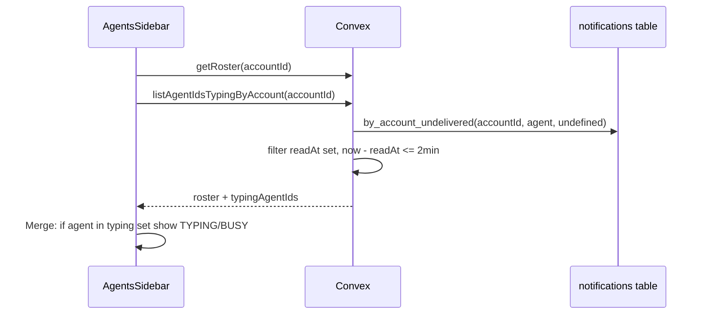

# Agents Sidebar: Show Real-Time Typing Status

## 1. Context and goal

**Problem:** [AgentsSidebar.tsx](apps/web/src/components/tasks/AgentsSidebar.tsx) always shows agents as "ONLINE" (or whatever is stored in the `agents.status` field), even when an agent is actively working on a task and appears as "typing" in the task thread view.

**Root cause:** The sidebar only reads `api.agents.getRoster`, which returns persisted `agent.status`. That status is updated by the runtime heartbeat (which always sets `"online"`) and by manual override; the runtime does **not** set `"busy"` or typing when it delivers a notification to OpenClaw. The task thread, by contrast, already derives "typing" from notification **receipts**: `readAt` set, `deliveredAt` null, within a 2-minute window (see [TaskThread.tsx](apps/web/src/components/tasks/TaskThread.tsx) and [notifications.listAgentReceiptsByTask](packages/backend/convex/notifications.ts)).

**Goal:** Reuse the same receipt-based typing semantics at **account level** and show typing (or a "busy replying" state) in the Agents sidebar so it stays in sync with what the user sees in the task thread.

**Constraints:** No schema changes; no new runtime behavior required. Use existing Convex indexes and the same 2-minute typing window as TaskThread.

---

## 2. Codebase research summary

**Files inspected:**

- **[apps/web/src/components/tasks/AgentsSidebar.tsx](apps/web/src/components/tasks/AgentsSidebar.tsx)** — Renders roster from `api.agents.getRoster`; displays status via `STATUS_CONFIG` (online, busy, idle, offline, error). No receipt or typing data.
- **[apps/web/src/components/tasks/TaskThread.tsx](apps/web/src/components/tasks/TaskThread.tsx)** — Uses `api.notifications.listAgentReceiptsByTask({ taskId })` and derives `typingAgents` from receipts where `readAt != null`, `deliveredAt == null`, and `now - readAt <= TYPING_WINDOW_MS` (120s). Refreshes `now` every 1s while there are receipts in the typing window.
- **[packages/backend/convex/notifications.ts](packages/backend/convex/notifications.ts)** — `listAgentReceiptsByTask` returns agent notifications for a task with `readAt`, `deliveredAt`, etc. No account-level "agents currently typing" query.
- **[packages/backend/convex/service/notifications.ts](packages/backend/convex/service/notifications.ts)** — Runtime calls `markRead` before sending to OpenClaw and `markDelivered` after. So "read + not delivered" = agent is in the reply window.
- **[packages/backend/convex/schema.ts](packages/backend/convex/schema.ts)** — `notifications` has index `by_account_undelivered`: `["accountId", "recipientType", "deliveredAt"]`. Querying `eq(accountId), eq(recipientType, "agent"), eq(deliveredAt, undefined)` returns all undelivered agent notifications; we can then filter in memory by `readAt != null` and `now - readAt <= 2 * 60 * 1000`.
- **[packages/backend/convex/agents.ts](packages/backend/convex/agents.ts)** — `getRoster` returns agents with `currentTask`; no typing info.
- **[packages/shared/src/types/index.ts](packages/shared/src/types/index.ts)** — `AgentStatus` is `"online" | "busy" | "idle" | "offline" | "error"`. No "typing" in schema; we will show typing as a **derived** UI state (e.g. label "TYPING" or "BUSY") without changing the stored status.

**Pattern to follow:** TaskThread’s typing logic (receipt-based, same window). Reuse existing auth: `requireAccountMember` for any new user-facing query.

---

## 3. High-level design

- **Backend:** Add a single user-facing query in `notifications.ts`: **listAgentIdsTypingByAccount(accountId)**. It uses the existing `by_account_undelivered` index, then filters by `readAt != null` and `now - readAt <= TYPING_WINDOW_MS`, and returns distinct `recipientId` (agent IDs). Use the same window as TaskThread (2 minutes); consider a shared constant later if desired.
- **Frontend:** AgentsSidebar calls `getRoster` and `listAgentIdsTypingByAccount`. For each agent, if `agent._id` is in the typing set, show a "TYPING" (or "BUSY") label and optional styling; otherwise keep current status from roster. Optionally refresh a local `now` every 1s while there are typing agents (same pattern as TaskThread) so the 2-minute window counts down correctly.

No changes to runtime, schema, or agent status mutations.

---

## 4. File and module changes

**Existing files to modify:**

- **[packages/backend/convex/notifications.ts](packages/backend/convex/notifications.ts)**
  - Add query **listAgentIdsTypingByAccount**: args `{ accountId }`. Use `requireAccountMember`. Query notifications with `by_account_undelivered(accountId, "agent", undefined)`, limit (e.g. 200). Filter: `n.recipientType === "agent"`, `n.readAt != null`, `n.deliveredAt == null`, `Date.now() - n.readAt <= 2 * 60 * 1000`. Return array of distinct `n.recipientId` (agent IDs). JSDoc: for typing indicators in sidebar/roster.
- **[apps/web/src/components/tasks/AgentsSidebar.tsx](apps/web/src/components/tasks/AgentsSidebar.tsx)**
  - Add `useQuery(api.notifications.listAgentIdsTypingByAccount, accountId ? { accountId } : "skip")`.
  - Add optional local `now` state and 1s interval when there are typing agents (mirror TaskThread) so the typing window countdown is accurate.
  - Pass typing set (e.g. `Set` of agent IDs) into `AgentItem` (or derive inside parent). In `AgentItem`: if agent is in typing set, show "TYPING" (or reuse "BUSY" label) and apply distinct styling (e.g. pulse or different color) while still showing the same status dot if desired; otherwise keep current `STATUS_CONFIG[agent.status]` behavior.
  - Ensure `AgentItem` receives something like `isTyping: boolean` (or `typingAgentIds: Set<string>`) so it can render the typing state without changing `Doc<"agents">` shape.

**New files:** None.

**Constants:** Use `2 * 60 * 1000` in the new Convex query (or a shared constant in `packages/shared` if you prefer a single source of truth for the typing window; TaskThread currently has `120_000` locally).

---

## 5. Step-by-step tasks

1. **Backend: Add listAgentIdsTypingByAccount**

- In [packages/backend/convex/notifications.ts](packages/backend/convex/notifications.ts), add a query that:
  - Takes `accountId` (v.id("accounts")).
  - Calls `requireAccountMember(ctx, accountId)`.
  - Queries `notifications` with index `by_account_undelivered`: `accountId`, `recipientType: "agent"`, `deliveredAt: undefined`; take up to 200.
  - Filter in memory: `readAt != null`, `deliveredAt == null`, `Date.now() - readAt <= 2 * 60 * 1000`.
  - Return `Array.from(new Set(notifications.map(n => n.recipientId)))` (distinct agent IDs).
- Add short JSDoc explaining use for sidebar typing indicators.

1. **Frontend: Subscribe to typing data and optional now tick**

- In [apps/web/src/components/tasks/AgentsSidebar.tsx](apps/web/src/components/tasks/AgentsSidebar.tsx), add `useQuery(api.notifications.listAgentIdsTypingByAccount, accountId ? { accountId } : "skip")`.
- Optionally: when `typingAgentIds?.length > 0`, run a 1s interval to update local `now` (useState + useEffect) so the 2-minute window countdown matches TaskThread; when no typing agents, clear the interval.

1. **Frontend: Show typing state in AgentItem**

- Pass `typingAgentIds` (e.g. `Set<string>` or array) and agent id into each `AgentItem`. In `AgentItem`, if agent is in the typing set, render "TYPING" (or "BUSY") with a distinct style (e.g. same as existing "BUSY" in STATUS_CONFIG, or a dedicated style) and optional subtle animation; otherwise keep existing status label and color from `STATUS_CONFIG[agent.status]`.
- Keep existing behavior for "All Agents" and active count (optional: include typing agents in "active" if not already covered by online/busy).

1. **Manual QA**

- Open tasks page with Agents sidebar; trigger a notification to an agent so runtime marks it read (and not yet delivered); confirm that agent shows as typing in the sidebar. Open task thread and confirm same agent shows as typing there. After delivery (or after 2 minutes), confirm both views clear typing.

---

## 6. Edge cases and risks

- **Stale typing:** If the backend query runs with a cached `Date.now()`, typing might disappear a bit early or late. The frontend 1s refresh of `now` only affects the **frontend** display; the Convex query uses server time. To avoid divergence, the query must use `Date.now()` at query execution time (Convex runs on the server). Subscriptions will re-run the query when notifications change (e.g. when `deliveredAt` is set), so typing will clear as soon as the receipt is updated.
- **Many undelivered notifications:** Limiting to 200 and filtering by 2-minute window keeps the result set small. If an account has a large backlog of undelivered notifications, we still only return agents that have at least one receipt in the typing window.
- **No schema change:** We do not add a "typing" value to `AgentStatus` in the schema or shared types; typing is a derived UI state only. If later the runtime sets `status: "busy"` during delivery, the sidebar can still prefer "TYPING" when the agent is in the typing set.
- **Auth:** `listAgentIdsTypingByAccount` must use `requireAccountMember(ctx, accountId)` so only members of the account see which agents are typing.

---

## 7. Testing strategy

- **Unit:** Not strictly required for a single query and UI merge; Convex subscription behavior is hard to unit test in isolation. Optional: small test that the query returns only agent IDs with readAt in window and deliveredAt null.
- **Integration / E2E:** Manual flow: create task, assign agent, post message so agent gets notification; runtime marks read; confirm sidebar shows agent as typing; after delivery or 2 min, confirm typing clears. Optionally add a Cypress/Playwright step for "sidebar shows typing when task thread shows typing."
- **Manual QA:** Same as step 4 in Section 5; verify with multiple agents and multiple tasks.

---

## 8. Rollout / migration

- No migration or feature flag required. New query is additive; sidebar change is backward-compatible (if query fails or returns empty, sidebar behaves as today).
- No new env vars or runtime config.

---

## 9. TODO checklist

**Backend**

- Add `listAgentIdsTypingByAccount(accountId)` in [packages/backend/convex/notifications.ts](packages/backend/convex/notifications.ts) with `requireAccountMember`, index `by_account_undelivered`, 2-min window filter, return distinct agent IDs; add JSDoc.

**Frontend**

- In [apps/web/src/components/tasks/AgentsSidebar.tsx](apps/web/src/components/tasks/AgentsSidebar.tsx), add `useQuery(api.notifications.listAgentIdsTypingByAccount, ...)` and derive typing set (e.g. `Set` of agent IDs).
- Optionally add 1s interval to refresh `now` while there are typing agents.
- Pass typing set into `AgentItem`; in `AgentItem` show "TYPING" (or "BUSY") and styling when agent is in the set, else keep `STATUS_CONFIG[agent.status]`.
- Verify "All Agents" / active count still makes sense with typing agents.

**QA**

- Manual: trigger agent notification, confirm sidebar and task thread both show typing; after delivery or 2 min, confirm typing clears.
