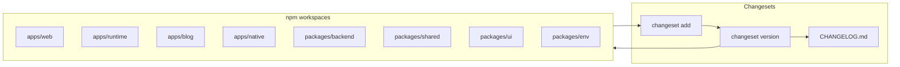

# Changesets setup for apps

## 1. Context and goal

Changesets is already wired at the repo root and uses npm workspaces (`apps/*`, `packages/*`). All workspace members are **discovered automatically** by Changesets (via the workspace definition); there is no config that limits versioning to `packages/*` only. The gap is **documentation and clarity**: releasing docs and contributor guidance mention "packages" and only name `apps/web` and `packages/backend`, so it’s unclear that **all four apps** (web, runtime, blog, native) are versioned and should get changesets when changed.

**Goal:** Make it explicit that apps are part of the versioning story, document all versioned workspace members, and ensure config and PR flow encourage changesets for app changes.

**Constraints:** No change to release workflow trigger (e.g. branch); keep existing `privatePackages` and changelog generator.

---

## 2. Codebase research summary

**Files inspected:**

- [package.json](package.json) — `workspaces: ["apps/*", "packages/*"]`; scripts `version` and `release` call Changesets.
- [.changeset/config.json](.changeset/config.json) — `changelog`, `commit`, `fixed`, `linked`, `privatePackages`, `baseBranch`; **no `ignore**`(so default`[]`).
- [docs/releasing.md](docs/releasing.md) — Lists only "apps/web, packages/backend, or other workspace packages"; does not list all apps.
- [CONTRIBUTING.md](CONTRIBUTING.md) — Refers to "versioned package" and links to releasing; does not list apps.
- [.github/workflows/release.yml](.github/workflows/release.yml) — Runs `changesets/action` with `publish: npm run release`; no package filtering.
- [.github/PULL_REQUEST_TEMPLATE.md](.github/PULL_REQUEST_TEMPLATE.md) — No changeset reminder.
- [apps/\*/package.json](apps/web/package.json), [packages/\*/package.json](packages/shared/package.json) — All apps are `private: true`; names: `web-app`, `runtime-service`, `@apps/blog`, `native`; packages: `@packages/backend`, `@packages/shared`, `@packages/ui`, `@packages/env`.
- [packages/backend/CHANGELOG.md](packages/backend/CHANGELOG.md), [apps/web/CHANGELOG.md](apps/web/CHANGELOG.md) — Only these two have CHANGELOGs today; others get one on first `changeset version` when included in a changeset.

**Findings:**

- Changesets discovers packages from **npm workspaces** only; there is no "packages-only" filter. With `workspaces: ["apps/*", "packages/*"]`, all 8 workspace members (4 apps + 4 packages) are included unless listed in `ignore`. Config has no `ignore`, so all are versioned.
- [Config file options](https://github.com/changesets/changesets/blob/main/docs/config-file-options.md): `ignore` (default `[]`) excludes packages from publishing; `privatePackages.version: true` means private packages get version bumps and changelog updates. Current config already versions private apps.
- Existing changeset files (e.g. [.changeset/default-models-feature.md](.changeset/default-models-feature.md)) only reference `@packages/shared`; no app names. That’s a usage pattern, not a technical exclusion.

---

## 3. High-level design

- **Discovery:** `npx changeset add` (and `changeset version`) uses the workspace list; every app and package in `apps/*` and `packages/*` appears in the prompt and is versioned when selected in a changeset.
- **Config:** Keep `privatePackages: { version: true, tag: false }` so private apps get versions and changelogs; optionally add explicit `"ignore": []` for clarity.
- **Docs and PR:** Update releasing and CONTRIBUTING to list all versioned workspace members (all 4 apps + 4 packages) and add a PR checklist item to add a changeset when changing any of them.

No new scripts or workflows; only config clarity, documentation, and PR template.

---

## 4. File and module changes

| File                                                                 | Change                                                                                                                                                                                                                  |
| -------------------------------------------------------------------- | ----------------------------------------------------------------------------------------------------------------------------------------------------------------------------------------------------------------------- |
| [.changeset/config.json](.changeset/config.json)                     | Optionally add `"ignore": []` so it’s explicit that no workspace package is ignored.                                                                                                                                    |
| [docs/releasing.md](docs/releasing.md)                               | List all versioned workspace members (4 apps + 4 packages by name). Replace "versioned packages (apps/web, packages/backend, or other...)" with a clear list and state that changes to any of them require a changeset. |
| [CONTRIBUTING.md](CONTRIBUTING.md)                                   | In the Changesets bullet, say "versioned packages **and apps**" and reference the full list in releasing.md (or repeat the list).                                                                                       |
| [.github/PULL_REQUEST_TEMPLATE.md](.github/PULL_REQUEST_TEMPLATE.md) | Add a checklist item: "If my change touches a versioned app or package, I added a changeset (`npx changeset`)."                                                                                                         |
| [.changeset/README.md](.changeset/README.md)                         | Optional: one line stating that both `apps/*` and `packages/*` are versioned.                                                                                                                                           |

**No new files.** No code changes in apps or packages.

---

## 5. Step-by-step tasks

1. **Config (optional)**
   In [.changeset/config.json](.changeset/config.json), add `"ignore": []` if the schema supports it and you want to make "no ignores" explicit. If the default is already `[]` and the schema doesn’t show it, this step can be skipped.
2. **Releasing docs**
   In [docs/releasing.md](docs/releasing.md):

- Add a short "Versioned workspace members" section listing all 8: **Apps:** `web-app`, `runtime-service`, `@apps/blog`, `native`; **Packages:** `@packages/backend`, `@packages/shared`, `@packages/ui`, `@packages/env`.
- In "Adding a changeset", replace the phrase that only names `apps/web` and `packages/backend` with: when your PR changes any of the versioned apps or packages listed above, run `npx changeset`, choose the affected app(s)/package(s), and commit the new file under `.changeset/`.

3. **CONTRIBUTING**
   In [CONTRIBUTING.md](CONTRIBUTING.md), update the Changesets sentence to say that when a change affects a **versioned package or app**, add a changeset and point to [docs/releasing.md](docs/releasing.md) for the list.
4. **PR template**
   In [.github/PULL_REQUEST_TEMPLATE.md](.github/PULL_REQUEST_TEMPLATE.md), add under Checklist:  
    `- [ ] If my change touches a versioned app or package, I added a changeset (npx changeset).`
5. **.changeset/README.md (optional)**
   Add one line: "Both `apps/*` and `packages/*` in this repo are versioned; add a changeset when you change any of them."
6. **Verification**
   From repo root run `npx changeset add` and confirm the interactive list includes all 4 apps (e.g. web-app, runtime-service, @apps/blog, native) and all 4 packages. If any app is missing, the cause is workspace or tooling (e.g. npm version); fix workspace or tooling first, then re-run.

---

## 6. Edge cases and risks

- **Ignore config:** Adding `"ignore": []` is redundant if that’s the default; ensure the schema allows it so the file remains valid.
- **Release workflow branch:** [release.yml](.github/workflows/release.yml) triggers on `master`; [.changeset/config.json](.changeset/config.json) has `baseBranch: "dev"`. No change in this plan; document or align in a separate change if desired.
- **Apps without CHANGELOG yet:** runtime, blog, native don’t have CHANGELOG.md today. They will get one the first time they are included in a changeset and `changeset version` runs. No manual CHANGELOG creation required.

---

## 7. Testing strategy

- **Manual:** Run `npx changeset add`, select an app (e.g. `web-app`), add a patch summary, then run `npm run version` and confirm `apps/web/CHANGELOG.md` (and version in `apps/web/package.json`) is updated. Optionally create a dummy changeset that touches only an app and merge it in a test branch to confirm the Release workflow updates that app’s version and changelog.
- **Docs:** Quick read-through of [docs/releasing.md](docs/releasing.md) and [CONTRIBUTING.md](CONTRIBUTING.md) to ensure the list and instructions are correct.

---

## 8. Rollout / migration

Not applicable. No data migration or feature flags. Deploy docs and template with the next PR; config change (if any) is additive.

---

## 9. TODO checklist

- **Config:** Add `"ignore": []` to [.changeset/config.json](.changeset/config.json) if desired and schema-valid.
- **Docs:** Update [docs/releasing.md](docs/releasing.md) with full list of versioned apps and packages and clear "adding a changeset" instructions.
- **CONTRIBUTING:** Update Changesets bullet to mention "versioned packages and apps" and link to releasing.md.
- **PR template:** Add changeset checklist item in [.github/PULL_REQUEST_TEMPLATE.md](.github/PULL_REQUEST_TEMPLATE.md).
- **Optional:** Add one-line note in [.changeset/README.md](.changeset/README.md) that apps and packages are versioned.
- **Verify:** Run `npx changeset add` and confirm all 4 apps and 4 packages appear in the selection list.
