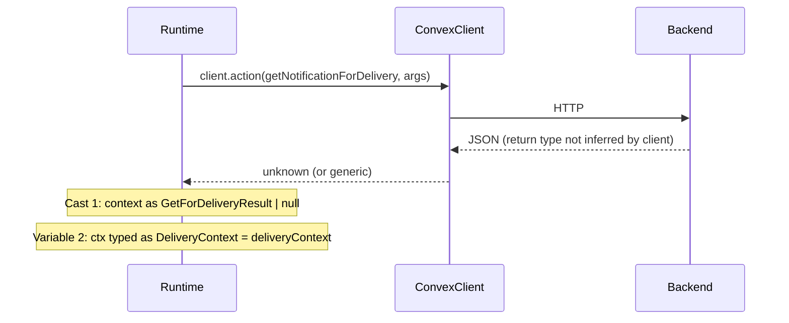

# Clean delivery context type mismatch (deepened)

## Enhancement Summary

**Deepened on:** 2026-02-20  
**Sections enhanced:** Goal, Approach, Tasks 1–4, Summary  
**Research agents used:** best-practices-researcher, framework-docs-researcher, kieran-typescript-reviewer, code-simplicity-reviewer, convex-reviewer, architecture-strategist

### Key improvements

1. **Implementation order:** Do **Task 3 (test cast + single buildContext) before Task 1** so that when you switch to `DeliveryContext = GetForDeliveryResult`, test fixtures already use `as unknown as DeliveryContext` and typecheck. (Task 1 was previously reverted because minimal fixtures did not satisfy full `Doc<>` before the test cast was in place.)
2. **Optional pre-step:** Try `FunctionReturnType<typeof api.service.actions.getNotificationForDelivery>` at the call site; if it infers the real type, you can avoid the cast entirely. If it is `any`/`unknown`, proceed with the wrapper or inline cast.
3. **Wrapper vs inline cast:** The plan’s “typed wrapper” is optional. **Minimal alternative:** keep one inline cast in [apps/runtime/src/delivery.ts](apps/runtime/src/delivery.ts) (`const ctx = context as DeliveryContext | null`) and skip the new helper; type alias + test cast still give a single type at the boundary.
4. **Single test helper:** Consolidate on one `buildContext` in [apps/runtime/src/test-helpers/deliveryContext.ts](apps/runtime/src/test-helpers/deliveryContext.ts); have [apps/runtime/src/delivery/policy.test.ts](apps/runtime/src/delivery/policy.test.ts) import it and use overrides instead of defining its own, so there is one cast site and one place to maintain the minimal fixture shape.
5. **Wrapper design (if used):** Use an options object for the wrapper (e.g. `{ client, notificationId, accountId, serviceToken }`), treat the raw result as `unknown` then cast to `DeliveryContext | null`, and add a one-line JSDoc that the cast is required because the Convex client does not propagate the action return type.

### New considerations

- Convex does not document a way for `ConvexHttpClient.action()` to infer return types; a typed wrapper with one cast is the standard approach.
- Backend owns the type; runtime only aliases it — no Convex pitfalls with `Doc<>` in this monorepo.
- After the alias, `effectiveBehaviorFlags` becomes required on `DeliveryContext`; production and test helper already provide it (e.g. `{}`), so no change needed.

---

## Why there are two types and two steps today

- **Cast 1:** `client.action()` does not expose the backend action’s return type to the runtime, so the result is effectively `unknown`. The code casts it to `GetForDeliveryResult | null`.
- **Second type:** The code then assigns that value to a variable typed as `DeliveryContext`. Today `DeliveryContext` is a separate interface (minimal shape); `GetForDeliveryResult` is the backend type (full `Doc<>`). So we have two names for the same boundary type.

### Research insights

**Convex / framework:** In a monorepo, type flow from backend to client is not guaranteed; the filtered `api` may widen references so `FunctionReturnType<Action>` is `any`. Making the cast explicit in one place (wrapper or call site) is the reliable pattern.

**Best practices:** Single source of truth (backend type), one cast at the boundary, typed wrapper or single inline cast, and one cast in the test helper for minimal fixtures — the plan aligns with these.

---

## Goal

- **Single type** at the boundary: one canonical type for “context returned by getNotificationForDelivery”.
- **No double cast in production** in [apps/runtime/src/delivery.ts](apps/runtime/src/delivery.ts): either a typed wrapper (zero casts at call site) or one inline cast; remove the current two-step cast.
- **Tests:** One cast in one place (shared test helper) so minimal fixtures remain valid.

### Research insights

**Type alias vs interface:** Use a **type alias** `DeliveryContext = GetForDeliveryResult` so the runtime cannot drift from the backend shape. An interface would be a second shape that could get out of sync.

---

## Approach

1. **Single type:** Define `DeliveryContext` as the backend type: re-export `GetForDeliveryResult` as `DeliveryContext` in the runtime so backend and runtime use the same type.
2. **Typed boundary:** Either (A) add a function that calls `getNotificationForDelivery` and returns `Promise<DeliveryContext | null>` with one cast inside, or (B) keep a single inline cast in the delivery loop (`context as DeliveryContext | null`). Option A gives zero casts at the call site; Option B is minimal and avoids a new module.
3. **Tests:** Consolidate on one `buildContext` (test-helpers); use a single cast (`as unknown as DeliveryContext`) there. Do this **before** switching to the type alias so that after Task 1, tests already type-check.

### Research insights

**Implementation order:** Do **Task 3 before Task 1**. In a previous attempt, Task 1 (type alias) was reverted because minimal test fixtures did not satisfy full `GetForDeliveryResult`. Adding the test cast and consolidating `buildContext` first ensures that after the alias change, the only cast for fixtures is in the helper.

**Optional pre-step:** In the runtime, try typing the result as `FunctionReturnType<typeof api.service.actions.getNotificationForDelivery>`. If that resolves to the real type, you can type the variable and omit the cast. If it is `any`/`unknown`, use the wrapper or inline cast.

**Wrapper design (if choosing Option A):** Prefer an options object for the wrapper; treat raw result as `unknown` then cast to `DeliveryContext | null`; add JSDoc that the cast is required because the Convex client does not propagate the action return type. You can put the helper in [apps/runtime/src/delivery.ts](apps/runtime/src/delivery.ts) or a small module under `delivery/`; avoid a new file only for a one-liner if you prefer minimal surface area (code-simplicity preference).

---

## Task 0 (optional): Check if return type already flows

**File:** [apps/runtime/src/delivery.ts](apps/runtime/src/delivery.ts) (or a scratch file)

- Add: `import type { FunctionReturnType } from "convex/server";` and define  
  `type Inferred = FunctionReturnType<typeof api.service.actions.getNotificationForDelivery>`.
- If `Inferred` is `GetForDeliveryResult | null` (or the real backend type), you can type the variable and remove the cast. If it is `any` or `unknown`, proceed with Task 1–4 as below.

---

## Task 1: Single type — DeliveryContext = GetForDeliveryResult

**File:** [apps/runtime/src/delivery/types.ts](apps/runtime/src/delivery/types.ts)

- Replace the current `DeliveryContext` interface with a type alias of the backend type:
  - `import type { GetForDeliveryResult } from "@packages/backend/convex/service/notifications";`
  - `export type DeliveryContext = GetForDeliveryResult;`
- Add a short JSDoc, e.g.: “Delivery context: result of getNotificationForDelivery (Convex service). Alias to backend type so runtime stays type-aligned with the API.” Remove the local interface and the “shape aligned” comment.

**Verification:** After Task 3, `cd apps/runtime && npm run typecheck` should pass. If you run Task 1 before Task 3, typecheck will fail at test fixtures until the cast is in the shared helper and policy.test uses it.

### Research insights

**Ownership:** Backend owns the contract; runtime only aliases it. Document in types.ts that the type is backend-owned and aliased for runtime policy/prompt/delivery loop.

**Edge cases:** `effectiveBehaviorFlags` becomes required on `DeliveryContext`; production and test helper already provide it. Re-export `DeliveryContext` from the delivery barrel so existing imports keep working.

---

## Task 2: Typed boundary — no double cast in delivery.ts

**Option A — Typed wrapper (zero casts at call site)**

- Add (or extend) a small module used by the delivery loop. A dedicated module (e.g. `delivery/getNotificationForDelivery.ts`) or a function in [apps/runtime/src/delivery.ts](apps/runtime/src/delivery.ts):
  - Signature: options object, e.g. `{ client, notificationId, accountId, serviceToken }`.
  - Calls `client.action(api.service.actions.getNotificationForDelivery, args)`.
  - Treats result as `unknown`, then returns `result as DeliveryContext | null`. JSDoc: cast required because Convex client does not propagate action return type.
- In [apps/runtime/src/delivery.ts](apps/runtime/src/delivery.ts) (around lines 584–597): replace the inline `client.action(...)` and the following cast with a call to this helper, e.g. `const context = await getNotificationForDelivery({ client, notificationId: notification._id, accountId: config.accountId, serviceToken: config.serviceToken });` then use `context` (typed as `DeliveryContext | null`) directly. Remove the intermediate `deliveryContext` variable and both casts.

**Option B — Single inline cast (minimal)**

- In [apps/runtime/src/delivery/types.ts](apps/runtime/src/delivery/types.ts): complete Task 1 so `DeliveryContext = GetForDeliveryResult`.
- In [apps/runtime/src/delivery.ts](apps/runtime/src/delivery.ts): after `const context = await client.action(...)`, use a single cast: `const ctx = context as DeliveryContext | null;` and use `ctx` for the rest of the block. Remove the second variable and the `GetForDeliveryResult` cast.

**Verification:** After Task 3, `npm run typecheck` and `npm test` (delivery, delivery-loop, policy) pass.

### Research insights

**Convex:** There is no Convex-documented way for the HTTP client to infer action return types; a single cast (in a wrapper or at the call site) is the standard approach.

**Code simplicity:** The wrapper is optional; one inline cast in the loop is enough for a single type at the boundary. Choose the wrapper if you want zero casts in the loop; otherwise Option B is minimal.

---

## Task 3: Tests — single cast in test helper (do before Task 1)

**File:** [apps/runtime/src/test-helpers/deliveryContext.ts](apps/runtime/src/test-helpers/deliveryContext.ts)

- `buildContext()` returns a minimal object that does not satisfy full `Doc<>`. Keep that minimal shape for test convenience.
- At the end of the return, use a single cast so the return type is `DeliveryContext`:  
  `return { ...base, ...overrides } as unknown as DeliveryContext;`
- Add a short comment that the base fixture must include every field read by policy, prompt, and delivery code, and that the cast is intentional for minimal fixtures.
- This is the only place in the codebase that casts to `DeliveryContext` for tests; production code does not cast (or has one cast at the boundary per Task 2).

**File:** [apps/runtime/src/delivery/policy.test.ts](apps/runtime/src/delivery/policy.test.ts)

- Remove the local `buildContext` and base shape. Import `buildContext` from the test helper (e.g. `@/test-helpers/deliveryContext` or the path used elsewhere). Use overrides for policy-specific cases so there is one shared helper and one cast.

**Verification:** `cd apps/runtime && npm run typecheck && npm test` — all pass. Then Task 1 can be applied without test fixture type errors.

### Research insights

**Safety:** The double cast (`as unknown as DeliveryContext`) is standard for typing partial objects as the full type in tests. The main risk is fixtures omitting a field that production later reads; documenting “base must cover all read fields” mitigates this.

**Single buildContext:** One helper and one cast avoid two implementations drifting (e.g. `deliverySessionKey` or other fields differing between test-helpers and policy.test).

---

## Task 4: Optional cleanup

- In [apps/runtime/src/delivery.ts](apps/runtime/src/delivery.ts), remove the import of `GetForDeliveryResult` if it is no longer used at the call site (the wrapper or the file that defines it can import it if needed).
- Ensure [apps/runtime/src/delivery/prompt.ts](apps/runtime/src/delivery/prompt.ts) and [apps/runtime/src/delivery/policy.ts](apps/runtime/src/delivery/policy.ts) still use `DeliveryContext` only; no code changes should be required there since they already use the type by name.

### Research insights

Policy and prompt use optional chaining (e.g. `effectiveBehaviorFlags?.canReviewTasks`). With the alias, `effectiveBehaviorFlags` is required; optional chaining still type-checks and behavior is unchanged.

---

## Summary

| Location                        | Before                               | After                                                        |
| ------------------------------- | ------------------------------------ | ------------------------------------------------------------ |
| delivery/types.ts               | Separate `DeliveryContext` interface | `export type DeliveryContext = GetForDeliveryResult`         |
| delivery.ts (production)        | Cast to `GetForDeliveryResult        | null`, then variable as` DeliveryContext`                    |
| Wrapper (optional)              | —                                    | One cast inside: `return result as DeliveryContext           |
| test-helpers/deliveryContext.ts | `as DeliveryContext`                 | `as unknown as DeliveryContext`; single shared buildContext  |
| policy.test.ts                  | Own buildContext + cast              | Import shared buildContext; use overrides; no duplicate cast |

Result: one type at the boundary, no double cast in production, and a single cast confined to the test helper. Task 3 before Task 1 avoids reverting the type alias due to test fixture errors.

### References

- Convex: [ConvexHttpClient.action()](https://docs.convex.dev/api/classes/browser.ConvexHttpClient), [FunctionReturnType](https://docs.convex.dev/api/modules/server), [TypeScript best practices](https://docs.convex.dev/understanding/best-practices/typescript).
- Plan file: [.cursor/plans/clean_delivery_context_type_mismatch_ac43cb86.plan.md](.cursor/plans/clean_delivery_context_type_mismatch_ac43cb86.plan.md).
