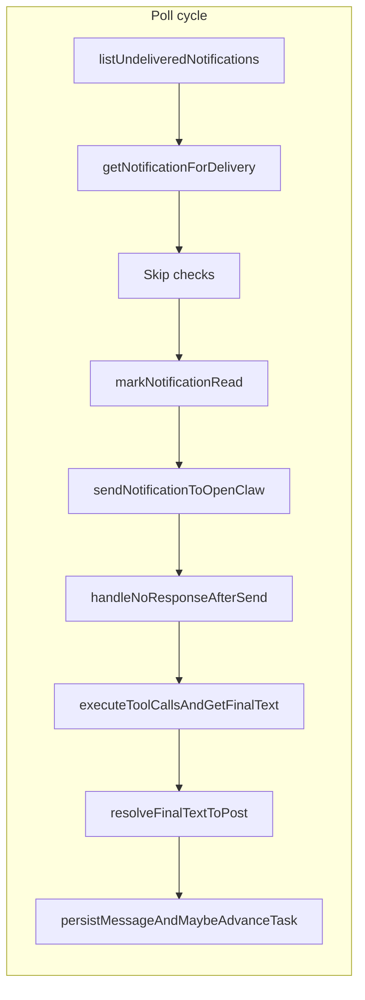

## Enhancement Summary

**Deepened on:** 2026-02-20  
**Sections enhanced:** All; added §3.6 (async/timing), §6 (security), §8 (strong and scalable delivery).  
**Research agents used:** architecture-strategist, performance-oracle, security-sentinel, data-integrity-guardian, best-practices-researcher, explore, pattern-recognition-specialist, julik-frontend-races-reviewer.

### Key Improvements

1. **Critical fix unchanged:** Remove `clearNoResponseRetry` from the retry branch only; add retry-exhaustion test and document invariants as must-haves.
2. **Strength and scalability:** Document single-threaded poll and FIFO; add observability (metrics for queue depth, retry-map size, poll/cycle duration) and safeguards (cap/evict `noResponseFailures`, backend index for list undelivered, min backoff) as recommended follow-ups.
3. **Data integrity:** Explicit invariants — persist message (and optional task advance) before `markNotificationDelivered`; at-least-once delivery with exactly-once message per notification via `sourceNotificationId`; idempotent mark\* operations.
4. **Security:** Sanitize or truncate `lastErrorMessage` before exposing on unauthenticated health; avoid logging full prompts or `deliverySessionKey`.
5. **YAGNI:** DLQ, persisted retry count, and per-notification backoff are optional follow-ups; not required for this audit.

### New Considerations Discovered

- Backend `listUndeliveredForAccount` uses `.collect()` then sort + slice — with large queues this is O(all undelivered). Add an index with `createdAt` and use `.order("asc").take(limit)` for O(limit) and scalability.
- `noResponseFailures` Map can grow unbounded (entries removed only when notification is “done”). Cap size and/or evict by age (e.g. entries with `lastAt` older than 2× reset window).
- Optional: add `.catch()` on the `poll()` promise so a future throw is logged and the loop can reschedule instead of leaving an unhandled rejection.
- Enforce minimum backoff delay (e.g. 1s) in `backoffMs` so repeated poll failures do not retry in under a second.

---

# Delivery Implementation Challenge — Audit Plan

> **For Claude:** Use this plan to verify correctness, fix the retry bug, and add edge-case tests. No new features; audit and hardening only.

**Goal:** Challenge the delivery implementation in [apps/runtime/src/delivery.ts](apps/runtime/src/delivery.ts) and related modules for correctness, idempotency, and edge cases. Confirm whether it is "done properly" and surface any strange edge cases or bugs.

**Scope:** [apps/runtime/src/delivery.ts](apps/runtime/src/delivery.ts), [apps/runtime/src/delivery/](apps/runtime/src/delivery/) (policy, no-response, prompt, types), backend [packages/backend/convex/service/notifications.ts](packages/backend/convex/service/notifications.ts) and [packages/backend/convex/service/actions.ts](packages/backend/convex/service/actions.ts) (notification service actions). Existing tests: [apps/runtime/src/delivery.test.ts](apps/runtime/src/delivery.test.ts), [apps/runtime/src/delivery-loop.test.ts](apps/runtime/src/delivery-loop.test.ts), [apps/runtime/src/delivery/policy.test.ts](apps/runtime/src/delivery/policy.test.ts).

---

## 1. Delivery flow (reference)

- **Skip paths (mark delivered, no send):** missing agent, missing task, `shouldDeliverToAgent` false, stale thread_update, HEARTBEAT_OK.
- **Failure path:** any throw after we started processing → `markNotificationDeliveryEnded`, increment `failedCount`, notification stays undelivered for next poll.
- **No-response:** empty/placeholder/NO_REPLY with no tool calls → retry (throw) or proceed (exhausted / terminal skip). Retry is tracked in-memory by `notificationId` with attempt count and 10-minute reset window.

---

## 2. Critical bug: no-response retry count reset

**Finding:** Retries never exhaust; the in-memory attempt count is cleared when we decide to retry, so the next poll sees attempt 1 again.

**Location:** [apps/runtime/src/delivery.ts](apps/runtime/src/delivery.ts) lines 653–661.

**What happens:**

1. First no-response: `_getNoResponseRetryDecision(notificationId)` runs inside `handleNoResponseAfterSend`, sets `noResponseFailures[notificationId] = { count: 1, lastAt: now }`, returns `{ attempt: 1, shouldRetry: true }`.
2. Loop gets `action: "retry"`, then calls `**clearNoResponseRetry(notification._id)`\*\* (line 659) and throws.
3. Notification is not marked delivered; next poll fetches it again.
4. Second no-response: map entry was deleted, so `_getNoResponseRetryDecision` again returns `attempt: 1, shouldRetry: true`. Cycle repeats; we never reach attempt 2 or 3, so "exhausted" and fallback never occur.

**Fix:** Remove `clearNoResponseRetry(notification._id)` from the **retry** branch (the block that does `throw new Error(noResponseOutcome.reason)`). Only clear when we are done with this notification: on all **proceed** paths that eventually mark delivered (success, exhausted, terminal skip). Clearing already happens once at line 685 for those paths; it must not happen when we throw for retry.

**Verification:** Add or extend a test that simulates three consecutive no-response outcomes for the same notification (e.g. mock `sendToOpenClaw` to return empty text, run three poll cycles or three invocations of the processing path for the same id). Assert that the third time we do **not** retry (exhausted path: mark delivered, no throw), and that attempt count in logs or state is 3.

**Research insights (best practices):** Industry pattern is to clear retry/attempt state only when the item reaches a terminal outcome (delivered or moved to DLQ). Clearing on “retry” resets the budget and prevents exhaustion; the fix aligns with “cap retries and move to terminal state” (ScalableCode, AWS DLQ patterns).

---

## 3. Edge cases and invariants to verify

### 3.1 Backend and idempotency

- **listUndeliveredForAccount:** Uses `deliveredAt === undefined`; `markRead` and `markDeliveryEnded` do not change `deliveredAt`, so they do not remove the notification from the list. Verified from [packages/backend/convex/service/notifications.ts](packages/backend/convex/service/notifications.ts).
- **markDelivered / markNotificationDelivered:** Idempotent (patch only if `!notification.deliveredAt`). Safe to call twice.
- **markNotificationRead:** Idempotent; clears `deliveryEndedAt` so on retry the typing indicator can show again. Correct.
- **markNotificationDeliveryEnded:** Only sets `deliveryEndedAt` when `deliveredAt` is null; idempotent. Correct.

### 3.2 Context and skip logic

- **Context null:** If `getNotificationForDelivery` returns `null`, the loop does not mark the notification delivered (line 561–562: `context?.agent` is falsy and we do not enter `context?.notification` branch for null). So it will be retried next poll. Documented in code; no bug.
- **Context with notification but agent null:** We mark delivered and skip (lines 721–729). Correct.
- **Task missing but notification has taskId:** We mark delivered and skip (lines 565–574). Correct.
- **Stale thread_update:** `_isStaleThreadUpdateNotification` requires `thread_update`, `messageId`, user-authored message, and a later user message in thread. Logic in [apps/runtime/src/delivery.ts](apps/runtime/src/delivery.ts) 818–834 is consistent; covered by test in delivery-loop.test.ts.

### 3.3 No-response and tools

- **HEARTBEAT_OK:** Handled before `handleNoResponseAfterSend`; we clear retry and mark delivered. Correct.
- **No response with tool calls:** We do not consider it "needsRetry" (we require `result.toolCalls.length === 0`). We run tools then `resolveFinalTextToPost`; if no final text we may post `FALLBACK_NO_REPLY_AFTER_TOOLS` when `shouldPersistNoResponseFallback` is true (currently false). Logic is consistent.
- **Partial tool execution:** If `ctx.agent` becomes null mid-loop in `executeToolCallsAndGetFinalText`, we break and send only the outputs collected so far. If `sendOpenClawToolResults` fails we keep `currentText` and continue. Acceptable; no silent drop of notification.
- **Retry state across restarts:** `noResponseFailures` is in-memory only. After process restart, the same notification will be treated as attempt 1 again. Acceptable design (retry budget is per process lifetime unless we persist attempt count in Convex).

### 3.4 Ordering and concurrency

- **Single-threaded loop:** Next poll is scheduled with `setTimeout(poll, delay)` after each cycle completes. No concurrent poll cycles; no race on shared state.
- **FIFO:** Backend sorts by `createdAt` ascending; runtime processes in list order. No reordering.

### 3.6 Async / timing safety (Node.js delivery loop)

- **Single-threaded poll, no overlapping runs:** The next poll is scheduled only after `_runOnePollCycle` resolves (`setTimeout(poll, delay)` runs in the same tick after `await _runOnePollCycle(config)`). No `setInterval`; no second cycle can start until the current one finishes. Shared `state` is only touched by one run at a time—no async race between cycles.
- **State between await points:** All mutations to `state` (e.g. `deliveredCount`, `noResponseFailures`, `consecutiveFailures`) happen in one sequential async flow per cycle. No other async work is scheduled that could read/write the same state between awaits, so no interleaving races.
- **Unhandled rejections:** `_runOnePollCycle` is wrapped in a top-level try/catch and always returns a delay (never throws). The `poll()` promise therefore does not reject in current code. Defensive hardening: add `poll().catch(err => { log.error("Delivery poll threw", err); if (state.isRunning) setTimeout(poll, config.deliveryInterval ?? 5000); })` so a future throw (e.g. from a new code path) does not leave an unhandled rejection and the loop can reschedule.
- **clearNoResponseRetry on retry branch:** Bug already documented in §2: calling `clearNoResponseRetry(notification._id)` before `throw` in the retry branch resets the attempt count so the next poll sees attempt 1 again. Remove that call from the retry branch; only clear on proceed paths that mark delivered.
- **markNotificationDeliveryEnded on failure:** The per-notification catch block always calls `markNotificationDeliveryEnded` (in an inner try/catch so a failing mark does not skip the rest of the cycle). Typing indicator is cleared and the notification remains undelivered for the next poll. No change needed.

### 3.5 Double-fetch of same notification

- If we call `markNotificationRead` then throw before `markNotificationDelivered`, the notification stays undelivered. Next poll we fetch it again, get context again, and call `markNotificationRead` again (idempotent). No double-send of the same notification in one cycle because we process the list sequentially and only one cycle runs at a time.

---

## 4. Possible edge cases (low risk, optional tests)

- **Exhausted path and attempt log:** When exhausted, we use `noResponseOutcome.attempt ?? _getNoResponseRetryDecision(notification._id).attempt`. After the fix (no clear on retry), `noResponseOutcome.attempt` should always be set when exhausted, so the fallback call is redundant but harmless (and would now return the same attempt). Optional: set `attempt` in the exhausted outcome so the fallback is never needed.
- **Reset window:** If we get no-response at t=0 and again at t > 10 minutes, the count resets to 0 in `_getNoResponseRetryDecision` (existing logic). So we get 3 more retries. By design; no change required unless product wants a global cap.
- **Multiple notifications in one poll:** Each has its own entry in `noResponseFailures`. Failures in one do not clear the other (we only clear by notification id). Correct.

---

## 5. Test and fix checklist

| Item             | Action                                                                                                                                                                                                                                                                      |
| ---------------- | --------------------------------------------------------------------------------------------------------------------------------------------------------------------------------------------------------------------------------------------------------------------------- |
| Retry bug        | Remove `clearNoResponseRetry(notification._id)` from the retry branch (before `throw`) in [apps/runtime/src/delivery.ts](apps/runtime/src/delivery.ts).                                                                                                                     |
| Retry exhaustion | Add test: same notification returns no-response 3 times in a row; on third attempt we proceed to exhausted (mark delivered, no throw). Can be in delivery-loop.test.ts with mocked sendToOpenClaw returning empty text and same notification returned by list + getContext. |
| State snapshot   | Existing test in delivery.test.ts verifies `getDeliveryState()` returns a copy of `noResponseFailures`; no change needed.                                                                                                                                                   |
| Optional         | Test that after fix, `_getNoResponseRetryDecision` called 3 times for same id without reset yields attempt 1, 2, 3 and then `shouldRetry: false`. (delivery.test.ts already has related tests; extend to assert no clear on retry path.)                                    |

---

## 6. Security review — recommendations for the plan

- **Service token and accountId on all Convex actions**
  - All delivery-related service actions (`listUndeliveredNotifications`, `getNotificationForDelivery`, `markNotificationDelivered`, `markNotificationRead`, `markNotificationDeliveryEnded`) already require `serviceToken` + `accountId`, call `requireServiceAuth(ctx, args.serviceToken)`, and enforce `serviceContext.accountId === args.accountId`.
  - **Recommendation:** Document in the plan or runbook that any new service action used by the runtime must accept both `serviceToken` and `accountId`, validate the token, and reject when `serviceContext.accountId !== args.accountId`. Consider a small checklist in a contributing doc.
- **Notification ownership checks**
  - `getNotificationForDelivery` rejects when `result.notification.accountId !== args.accountId`.
  - `markNotificationDelivered`, `markNotificationRead`, and `markNotificationDeliveryEnded` each re-fetch the notification (via `getForDelivery`) and reject when `notification.accountId !== args.accountId`.
  - **Recommendation:** No change required. Optionally add a one-line comment in the plan: “All notification write actions verify notification belongs to the account bound to the service token.”
- **Cross-account and injection risks in delivery context / prompt building**
  - **Cross-account:** Runtime uses a single `config.accountId` from env; all Convex calls use that. Backend actions always compare notification/agent/task `accountId` to `args.accountId`, so cross-account delivery or writes are blocked.
  - **Prompt/context injection:** Prompt content comes from Convex (notification body/title, message content, task title/description, thread, docs). A user or agent who can write that data can influence the LLM (prompt injection). There is no SQL/NoSQL injection in Convex from prompt building.
  - **Recommendation:** (1) Document that user/agent-authored content in notifications and threads is trusted prompt input and can affect model behavior; (2) Avoid logging full prompts (instructions + input) in production, or redact `deliverySessionKey` / `sessionKey` if any prompt logging is added; (3) Keep existing truncation limits (e.g. `THREAD_MAX_CHARS_PER_MESSAGE`, `TASK_DESCRIPTION_MAX_CHARS`) to limit blast radius of long malicious content.
- **Safe handling of failures: `markNotificationDeliveryEnded` and no leak of internal state**
  - **markNotificationDeliveryEnded:** On any throw during processing of a notification, the catch block calls `markNotificationDeliveryEnded` with the same `notification._id`, `config.serviceToken`, and `config.accountId`. If that call throws, the inner catch only logs and does not rethrow, so the loop continues.
  - **Recommendation:** Keep this pattern. Optionally add a short comment in code that we always call `markNotificationDeliveryEnded` on failure so the typing indicator is cleared and the notification stays undelivered for retry.
  - **Internal state leakage:** `state.lastErrorMessage` is set from `error.message` (and cause). It is exposed via `getDeliveryState()` and included in the **unauthenticated** `GET /health` response (`delivery.lastErrorMessage`). If an error ever contained secrets (e.g. from OpenClaw or Convex), they could be exposed to anyone who can hit the health endpoint.
  - **Recommendation:** (1) Sanitize or truncate what is stored in `lastErrorMessage` (e.g. strip stack traces, cap length, avoid storing raw third-party error bodies). (2) Prefer not returning raw `lastErrorMessage` on the public health response; return a generic failure reason or a short sanitized message, and keep full details for logs only. (3) Ensure Convex service actions never throw errors that include internal IDs, stack traces, or tokens to the client; keep “Forbidden/Not found” style messages.
- **Summary security checklist for delivery**
  - Every runtime-invoked Convex service action requires `serviceToken` + `accountId` and enforces match.
  - Every notification write (mark delivered/read/delivery-ended) verifies notification belongs to the account.
  - Failure path always calls `markNotificationDeliveryEnded`; no rethrow that skips it.
  - `lastErrorMessage` (and any health-exposed error field) is sanitized and not echoed to untrusted callers.
  - Prompt/session keys are not logged; user content in prompts is treated as untrusted for model behavior.

---

## 7. Summary

- **Critical:** One bug — clearing no-response retry state when we throw for retry prevents retries from ever exhausting. Fix: do not call `clearNoResponseRetry` in the retry branch; only clear on proceed paths that mark delivered.
- **Invariants:** Backend idempotency and list criteria are correct. Skip logic (missing task/agent, policy, stale thread_update) and HEARTBEAT_OK handling are correct. Single-threaded poll and FIFO ordering prevent concurrency/ordering issues.
- **Edge cases:** Context null retried next poll; partial tool failure and in-memory retry state reset on restart are acceptable. No other "strange" edge cases identified that require code changes beyond the retry clear fix.
- **Recommendation:** Apply the single fix and add the exhaustion test; optionally tighten the exhausted branch to always use `noResponseOutcome.attempt` and add a short comment above the retry branch that we intentionally do not clear retry state so the next poll sees the correct attempt count.

---

## 8. Strong and scalable delivery — recommendations

These items make the system stronger and more scalable; the critical bug fix and exhaustion test remain the only must-haves for this audit.

### Invariants to document

- **Single-threaded poll and FIFO:** Delivery is intentionally one poll cycle at a time via `setTimeout(poll, delay)` to avoid races on `state` and preserve FIFO. If concurrency is added later (e.g. multiple runtimes per account), define single-writer or locking so only one writer marks delivered.
- **Mark delivered only after “done”:** Call `markNotificationDelivered` only after the actions that define “delivered” (persist message or skip by policy) have succeeded or been skipped. Never mark delivered before `createMessageFromAgent` (or equivalent) for the success path; current order in `persistMessageAndMaybeAdvanceTask` is correct — document and do not reorder.
- **At-least-once delivery, exactly-once message per notification:** Notifications stay in the list until `markNotificationDelivered` succeeds. Message creation is idempotent by `sourceNotificationId`; retries do not create duplicate messages.
- **Retry state:** No-response retry state is in-memory by design; restart resets attempt counts. If retries must survive restarts or multiple runtimes, persist attempt count in Convex and keep “should retry” policy in runtime; Convex stores data, runtime decides retry/exhausted.

### Observability and metrics

- **Queue depth:** Expose or query count of undelivered notifications (e.g. gauge `delivery_undelivered_count`) to detect backlog and alert on growth.
- **Retry map and cycle:** Expose `noResponseFailures.size` (e.g. gauge `delivery_no_response_tracked_count`), poll duration (existing), and optionally cycle length (time from poll start to last notification delivered in that cycle). Add metrics for `delivery_consecutive_failures` and `delivery_next_delay_ms` when in backoff.
- **Structured logs:** Add correlation fields (e.g. `notificationId`, `taskId`, `accountId`) and per-notification duration for tracing and SLOs.

### Safeguards and scalability

- **Cap or evict `noResponseFailures`:** Entries are removed only when a notification is “done”; under load the map can grow unbounded. Cap size (e.g. 2000) with eviction by oldest `lastAt`, and/or periodically remove entries with `lastAt` older than e.g. 2× `NO_RESPONSE_RETRY_RESET_MS`.
- **Backend list undelivered:** `listUndeliveredForAccount` currently uses `.collect()` then sort + slice, so cost is O(all undelivered). Add an index that supports ordering by `createdAt` (e.g. `["accountId", "recipientType", "deliveredAt", "createdAt"]`) and use `.order("asc").take(limit)` so the database returns only `limit` rows. Keep `LIST_UNDELIVERED_MAX_LIMIT` (or configurable cap) as max batch size.
- **Minimum backoff:** Enforce a minimum delay (e.g. 1s) in `backoffMs` so computed backoff is never sub-second and repeated poll failures do not create tight retry loops.
- **Config validation:** Validate `deliveryInterval` (e.g. 5s–300s) and backoff params (e.g. `deliveryBackoffMaxMs <= 600000`) so bad env values do not cause overload or near-infinite backoff.

### Security

- **Health endpoint:** Sanitize or truncate `lastErrorMessage` before exposing on unauthenticated `GET /health`; avoid returning raw Convex errors (IDs, stacks, tokens). Keep full message for logs only.
- **Prompt and keys:** Do not log full prompts or `deliverySessionKey`; keep existing truncation limits for user/agent content in prompt building.
- **Checklist:** All delivery-related Convex actions require `serviceToken` and `accountId` and enforce `serviceContext.accountId === args.accountId`; notification ownership is re-checked on get and mark-\* actions.

### Optional follow-ups (YAGNI for this audit)

- **Dead-letter / terminal outcome:** Persist a terminal reason (e.g. `deliveryTerminalReason: 'no_response_exhausted'`) when max retries are exhausted for dashboards, alerts, and replay. Not required for correctness.
- **Persisted retry count:** Store no-response attempt count (and optionally last attempt time) in Convex when cross-restart retry budget or multi-worker consistency is needed.
- **Per-notification backoff:** After N consecutive failures for the same notification, skip it for K minutes or use “next retry at” to avoid one bad notification dominating the loop. Poll-level backoff is sufficient for this audit.
- **Per-notification timeout:** Abort `sendToOpenClaw` or tool execution after N seconds so one stuck notification does not block the whole cycle; document as future hardening.
