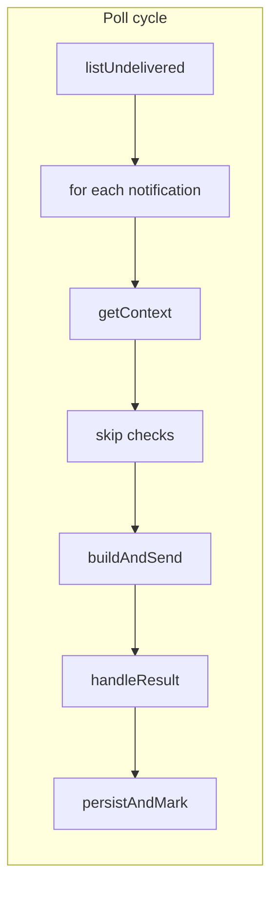

## Enhancement Summary

**Deepened on:** 2026-02-20  
**Sections enhanced:** Phase 1 (extraction, tests, mocks), Phase 2 (extractions, state handling, types), File layout, Security, Performance, Risks  
**Research agents used:** best-practices-researcher, framework-docs-researcher, architecture-strategist, code-simplicity-reviewer, kieran-typescript-reviewer, performance-oracle, security-sentinel, pattern-recognition-specialist

### Key Improvements

1. **Vitest mocking:** Use `vi.hoisted()` for mock refs used in `vi.mock` factories; single `mockAction` that branches on action ref (use real `api` so refs match); `beforeEach` with `vi.clearAllMocks()` and set implementations per test. Type stubs as `Doc<"notifications">[]` and `GetForDeliveryResult | null` (e.g. `buildContext() as GetForDeliveryResult`); avoid `as never` on the whole client.
2. **State isolation:** Add test-only `_resetDeliveryStateForTests()` (or extend reset) and call in `beforeEach` for poll-cycle tests so counts and `noResponseFailures` do not leak; keep `getDeliveryState()` returning a copy of `noResponseFailures`.
3. **Security and auth:** Assert every Convex action is called with `args.accountId === config.accountId` and `args.serviceToken === config.serviceToken`; use a single frozen `config` in tests. Document: "All Convex calls use config.serviceToken and config.accountId; getNotificationForDelivery enforces account scope." Add a logging rule: no full context/notification/raw Convex errors in logs; sanitize error messages.
4. **No-response helper design:** Prefer `handleNoResponseResult` (or merged `computeWhatToPost`) returning a discriminated result; the **loop** applies state updates (`clearNoResponseRetry`, counters) and throws on retry. Keeps helper testable and avoids command/query mixing.
5. **Phase 2 simplification:** Consider merging `handleNoResponseResult` and `resolveTextToPost` into one `computeWhatToPost(result, ctx, taskId, ...)` that handles HEARTBEAT_OK, no-response, placeholder, and no-reply-after-tools. Use only `getSkipReason` (not `shouldSkipDelivery`). Consolidate the three skip scenarios into one parameterized test.
6. **Edge-case tests:** Add: "Skip: missing agent" (context with `agent: null`, `notification` set); "Error: missing deliverySessionKey"; "Context null" (list returns one notification, getNotificationForDelivery returns `null`). Optional: assert mutating returned `getDeliveryState().noResponseFailures` does not affect next read.
7. **Types and placement:** Define `SendResult` (or reuse gateway return type) in one place; explicit return types for all Phase 2 functions. Move `isStaleThreadUpdateNotification` and `getSkipReason` to `delivery/policy.ts` so skip logic lives in policy; optional `delivery/capabilities.ts` for `buildToolCapabilitiesForContext` to keep delivery.ts lean.
8. **Performance and ordering:** No caching for `buildToolCapabilitiesForContext` unless profiling shows it hot. Document that notifications are processed **sequentially (FIFO)** on purpose. Optional test: assert returned delay is finite and positive.

### New Considerations Discovered

- Backend contract: runtime assumes single-tenant; token and accountId must match; document that `getNotificationForDelivery` enforces account scope.
- Optional delay guard in tests: `expect(delay).toBeGreaterThan(0); expect(Number.isFinite(delay)).toBe(true);` to catch refactors that return 0 or NaN.
- If using `vi.resetModules()` for state reset, re-import the module dynamically after reset; static imports keep the first instance.

---

# Delivery.ts: Tests First, Then Refactor

## Goal

- **Phase 1:** Add unit tests that cover current behavior so refactoring cannot silently break the delivery loop.
- **Phase 2:** Refactor [apps/runtime/src/delivery.ts](apps/runtime/src/delivery.ts) into sub-functions to improve readability and maintainability; all Phase 1 tests must stay green.

## Current state

- [delivery.ts](apps/runtime/src/delivery.ts) is ~643 lines. The main logic lives inside an async `poll` closure (lines 129–434) that:
  - Fetches undelivered notifications from Convex
  - For each: fetches context, applies skip rules (missing task, `shouldDeliverToAgent`, stale thread_update), builds instructions/input, calls OpenClaw, handles no-response/retry/HEARTBEAT_OK, runs tool calls, persists message and/or marks delivered
- Existing tests in [delivery.test.ts](apps/runtime/src/delivery.test.ts) cover **policy and prompt only** (e.g. `shouldDeliverToAgent`, `formatNotificationMessage`, `buildDeliveryInstructions`, `_getNoResponseRetryDecision` “three strikes”, `_isNoReplySignal`, `canAgentMarkDone`). The **loop body and integration with Convex/gateway are not tested**.
- [delivery/policy.test.ts](apps/runtime/src/delivery/policy.test.ts) and [gateway.test.ts](apps/runtime/src/gateway.test.ts) cover policy and no-response helpers used by delivery.

---

## Phase 1: Unit tests for current behavior

Objective: Lock in current behavior so Phase 2 refactors are safe. One **minimal structural change** is needed so the loop body can be tested without running real Convex or OpenClaw.

### 1.1 Minimal extraction to make the poll cycle testable

- **Change:** Extract the content of the `poll` closure into an internal async function that can be invoked from tests.
  - Add `**_runOnePollCycle(config: RuntimeConfig): Promise<number>` that:
    - Performs the current logic from `const pollStart = Date.now()` through computation of the next delay (including `state.consecutiveFailures`, `backoffMs`, `config.deliveryInterval`).
    - Returns the **next delay in ms** (so the loop can still do `setTimeout(poll, delay)`).
  - Replace the closure body with: call `const delay = await _runOnePollCycle(config); setTimeout(poll, delay);` (and keep the `if (!state.isRunning) return` at the top of `poll`).
  - Mark with JSDoc `@internal` and export only for tests (same pattern as `_getNoResponseRetryDecision`).
- **Why:** The loop currently depends on `getConvexClient()`, `sendToOpenClaw`, `executeAgentTool`, etc. By testing `_runOnePollCycle` with those modules mocked, we can assert on Convex action calls and state without dealing with `setTimeout` or real I/O.

**Research insights (Extract Testable Component, Vitest):**

- **Single seam:** `_runOnePollCycle` is the designated test seam for the poll body; Phase 2 only splits its body, not its signature. Add a one-line JSDoc to that effect.
- **Closure minimal:** The loop closure should only: check `state.isRunning`, call `const delay = await _runOnePollCycle(config); setTimeout(poll, delay);`. All context is passed in; no closure over mutable state that tests need to control.
- **Return type:** Use explicit `Promise<number>` for `_runOnePollCycle`. No branded type for "next delay" unless you add more numeric concepts later.

### 1.2 Tests for already-testable units (no new extraction)

Add to [delivery.test.ts](apps/runtime/src/delivery.test.ts) (or a dedicated describe block):

- `**isStaleThreadUpdateNotification`
  - Export it as `**_isStaleThreadUpdateNotification` from delivery.ts (one-line export, test-only hook).
  - Cases: returns `true` when `thread_update` + `messageId` and a **user** message exists **after** the notified message in `thread`; returns `false` when no `messageId`, or no user message after it, or not `thread_update` / not agent recipient, or `message.authorType !== "user"`.
- `**_getNoResponseRetryDecision` reset window
  - After exhausting retries for a notification id (e.g. 3 calls so `shouldRetry === false`), call again with `**now = lastAt + 10 * 60 * 1000 + 1` (or use a test constant if you expose it). Assert `attempt === 1` and `shouldRetry === true` (counter reset).
- `**getDeliveryState()`
  - Start loop, call `getDeliveryState()`, assert shape (`isRunning`, `deliveredCount`, `noResponseFailures`, etc.). Stop loop, call again, assert `isRunning === false`. Assert that mutating the returned `noResponseFailures` Map does not affect the next `getDeliveryState()` (snapshot is a copy).
- `**startDeliveryLoop` / `stopDeliveryLoop`
  - Call `startDeliveryLoop(config)` twice; assert second call does not start a second loop (e.g. single `getConvexClient` or single list-undelivered call if you run one cycle with mocks). Call `stopDeliveryLoop()` and assert `getDeliveryState().isRunning === false`. Idempotent stop (call stop twice, no error).

**Research insights (test isolation):**

- **Snapshot copy:** Add an explicit test: get state, mutate the returned `noResponseFailures` Map (e.g. set a key), get state again; assert the second snapshot's `noResponseFailures` is unchanged (e.g. still empty or previous size).
- **State reset:** In `beforeEach` for every describe that touches the delivery loop, call `_resetNoResponseRetryState()` and, if added, `_resetDeliveryStateForTests()` so tests are order-independent.

### 1.3 Tests for one poll cycle (`_runOnePollCycle`) with mocks

Use **vitest** `vi.mock` for:

- `./convex-client`: `getConvexClient` returns a client whose `action` resolves per action name (e.g. `listUndeliveredNotifications` → list of notification stubs, `getNotificationForDelivery` → full context stub, `markNotificationDelivered` / `markNotificationRead` / `createMessageFromAgent` / `updateTaskStatusFromAgent` / `markNotificationDeliveryEnded` → no-op or counters).
- `./gateway`: `sendToOpenClaw`, `sendOpenClawToolResults`, `registerSession` — stub implementations that record calls and return controlled values (e.g. `{ text: "OK", toolCalls: [] }`).
- `./tooling/agentTools`: `executeAgentTool` — return `{ success: true }` or controlled output; `getToolCapabilitiesAndSchemas` can stay real or be stubbed if needed.
- `./metrics`: `recordSuccess`, `recordFailure` — vi.fn().
- `./backoff`: `backoffMs` — vi.fn().mockReturnValue(1000) or similar.

**Research insights (Vitest mocking, typing, security):**

- **vi.hoisted:** Use `const mockAction = vi.hoisted(() => vi.fn());` and `const mockSendToOpenClaw = vi.hoisted(() => vi.fn());` so the mock factory can reference them. Reconfigure in each test or `beforeEach` (e.g. `mockAction.mockImplementation(...)`); do not call `vi.mock` again per test.
- **Action dispatch:** Use the **real** `api` from convex-client so `actionRef === api.service.actions.listUndeliveredNotifications` etc. match. In the mock, branch on `actionRef` and return typed stubs: `Doc<"notifications">[]` for list, `GetForDeliveryResult | null` for getNotificationForDelivery (build context with existing `buildContext()` and cast once to `GetForDeliveryResult`).
- **Auth assertions:** For every test that runs `_runOnePollCycle(config)`, assert that every `client.action(_, args)` call receives `args.accountId === config.accountId` and `args.serviceToken === config.serviceToken`. Use a single frozen `config`; no mock or caller should substitute accountId/serviceToken. This guards against cross-account bugs after refactors.
- **Optional simplification:** Consolidate the three skip scenarios (missing task, shouldDeliverToAgent false, stale thread) into **one parameterized test** "skip: marks delivered and does not call sendToOpenClaw" with three inputs. Reduces duplicate mock setup while keeping coverage.

**Scenarios to cover (each as a test):**

1. **Empty poll:** `listUndeliveredNotifications` returns `[]`. Assert no `getNotificationForDelivery` or `sendToOpenClaw` calls; `state.lastDelivery` set; `recordSuccess` not called (or called only when notifications.length > 0 per current code); returned delay equals `config.deliveryInterval`.
2. **Skip: missing task:** One notification; `getNotificationForDelivery` returns context with `context.agent` set, `context.notification.taskId` set, `context.task` null. Assert `markNotificationDelivered` called, `sendToOpenClaw` not called, `state.deliveredCount` incremented.
3. **Skip: shouldDeliverToAgent false:** Context with e.g. task `status: "done"` and notification type that causes skip. Assert `markNotificationDelivered` called, `sendToOpenClaw` not called.
4. **Skip: stale thread_update:** Context with `thread_update`, `messageId`, thread where a user message appears after the notified message. Assert `markNotificationDelivered` called, `sendToOpenClaw` not called.
5. **Happy path:** One notification; context with agent, task, `deliverySessionKey`; `sendToOpenClaw` returns `{ text: "Reply", toolCalls: [] }`. Assert `markNotificationRead` (or ignore failure), `registerSession`, `sendToOpenClaw`, `createMessageFromAgent` (with correct taskId/content), `markNotificationDelivered`; `state.deliveredCount` incremented.
6. **HEARTBEAT_OK skip:** `sendToOpenClaw` returns `{ text: "HEARTBEAT_OK", toolCalls: [] }`. Assert `markNotificationDelivered` called, no message created, `clearNoResponseRetry` effect (e.g. no throw, deliveredCount incremented).
7. **No-response retry (throw):** `sendToOpenClaw` returns empty/no-reply; `shouldRetryNoResponseForNotification` true (e.g. assignment); `_getNoResponseRetryDecision` returns `shouldRetry: true`. Assert delivery throws (or that `markNotificationDeliveryEnded` is called and state.failedCount incremented when the throw is caught by the outer catch).
8. **No-response exhausted:** Same no-reply response, but after 3 retries for that id (or mock `_getNoResponseRetryDecision` to return `shouldRetry: false`). Assert either fallback message posted when `shouldPersistNoResponseFallback` is true, or no message when false; `markNotificationDelivered` called; `state.requiredNotificationRetryExhaustedCount` or `noResponseTerminalSkipCount` as expected.
9. **Error path:** e.g. `sendToOpenClaw` throws. Assert `state.failedCount` incremented, `markNotificationDeliveryEnded` called, `state.lastErrorMessage` set.
10. **Tool calls path (optional but valuable):** Context with task; `sendToOpenClaw` returns `{ text: "", toolCalls: [{ name: "...", call_id: "1", arguments: {} }] }`; stub `executeAgentTool` and `sendOpenClawToolResults` to return success and final text. Assert tool executed, tool results sent, message created with final text (or fallback if no final text and fallback policy applies).

**Additional edge-case scenarios (recommended):**

- **Skip: missing agent:** One notification; `getNotificationForDelivery` returns context with `agent: null`, `notification` set. Assert `markNotificationDelivered` called, `sendToOpenClaw` not called, `state.deliveredCount` incremented.
- **Error: missing deliverySessionKey:** Context with agent and task but `deliverySessionKey` omitted. Assert delivery throws or catch runs, `markNotificationDeliveryEnded` called, failure state updated.
- **Context null:** List returns one notification, `getNotificationForDelivery` returns `null`. Assert no send, no crash; clarify in spec whether that notification is retried later or skipped (current code does nothing for it in that poll).

**Optional:** Assert returned delay is finite and positive: `expect(delay).toBeGreaterThan(0); expect(Number.isFinite(delay)).toBe(true);`.

Reset shared state between tests (e.g. `_resetNoResponseRetryState()`, and reset module-level `state` if possible or run in isolation) so counts and `noResponseFailures` do not leak.

---

## Phase 2: Refactor into sub-functions

Objective: Split the large block inside `_runOnePollCycle` (and the inner `for` loop) into named functions so each has a single responsibility and the file is easier to read and change. **No behavior change;** all Phase 1 tests must pass after each step.

### 2.1 Logical blocks to extract (in dependency order)

The following map the current inline logic to suggested functions. Keep all of them in [delivery.ts](apps/runtime/src/delivery.ts) (or move pure helpers to [delivery/](apps/runtime/src/delivery/) if you prefer; keep Convex/gateway calls in delivery.ts to avoid circular deps).

- **Skip checks (pure):** Already have `shouldDeliverToAgent`; add `**shouldSkipDelivery(context, notificationId): Promise<SkipResult | null>`** or keep inline and extract only `**isStaleThreadUpdateNotification`** (already tested). Alternatively extract a small `**getSkipReason(ctx, notification): "missing_task" | "policy" | "stale_thread" | null`** that returns why we skip or null if we should not skip; then the loop calls Convex `markNotificationDelivered` when non-null and continues.
- **Tool capabilities:** Extract `**buildToolCapabilitiesForContext(ctx, config): ToolCapabilities` (lines 221–258: flags, `getToolCapabilitiesAndSchemas`, optional `buildHttpCapabilityLabels` + empty schemas). Pure except for dependency on config.
- **Send to OpenClaw:** Extract `**sendNotificationToOpenClaw(sessionKey, ctx, config, toolCapabilities): Promise<SendResult>` that builds instructions/input, calls `registerSession`, `buildDeliveryInstructions`, `buildNotificationInput`, `sendToOpenClaw`. Returns `{ text, toolCalls }`.
- **No-response handling:** Extract `**handleNoResponseResult(args): { textToPost, suppressAgentNotifications, skipMessageReason }` where `args` include `result`, `ctx`, `notificationId`, `taskId`, and state updaters (or pass state and let the function update `state.requiredNotificationRetryExhaustedCount` / `noResponseTerminalSkipCount` and call `clearNoResponseRetry`). This encapsulates the HEARTBEAT_OK branch, `needsRetry`, `shouldRetry` + retry decision, fallback vs null, and terminal skip. It can throw when retrying.
- **Tool execution:** Extract `**executeToolCallsAndGetFinalText(result.toolCalls, ctx, config, toolCapabilities): Promise<string | null>` that runs `executeAgentTool` for each call, builds outputs, calls `sendOpenClawToolResults`, returns final text or null.
- **Final text / placeholder / no-reply-after-tools:** Extract `**resolveTextToPost(textToPost, result, ctx, taskId): { textToPost, suppressAgentNotifications, skipMessageReason }` (or merge into a slightly larger “post-processing” function that handles placeholder replacement and `FALLBACK_NO_REPLY_AFTER_TOOLS`). This keeps the logic that runs after tool execution in one place.
- **Persistence and status update:** Extract `**persistMessageAndMaybeAdvanceTask(client, ctx, notification, textToPost, suppressAgentNotifications, skipMessageReason, config)` that does `createMessageFromAgent` when `taskId && textToPost`, then `updateTaskStatusFromAgent` when conditions hold, then always `markNotificationDelivered` and increments `state.deliveredCount`.

**Research insights (Phase 2 extractions):**

- **Skip:** Use only `getSkipReason(ctx, notification)` (not both `shouldSkipDelivery` and `getSkipReason`). Place in delivery/policy.ts; move `isStaleThreadUpdateNotification` there (or delivery/skip) so getSkipReason lives in delivery/ without importing delivery.ts.
- **SendResult:** Define in one place (e.g. delivery/types.ts or gateway) and use for `sendNotificationToOpenClaw` and the loop.
- **No-response:** Prefer helper returning a discriminated result; **loop** applies `clearNoResponseRetry`, counters, and throw. Document in JSDoc that it may throw to signal retry.
- **Merge option:** Consider merging `handleNoResponseResult` and `resolveTextToPost` into one `computeWhatToPost(...)` that handles HEARTBEAT_OK, no-response, placeholder, and no-reply-after-tools.
- **persistMessageAndMaybeAdvanceTask:** Either pass `canModifyTaskStatus` (and flags) as args or derive from ctx; document which. Explicit return type `Promise<void>`.
- **Optional:** Put `buildToolCapabilitiesForContext` in delivery/capabilities.ts to keep delivery.ts lean.

### 2.2 Refactor steps (incremental)

1. **Extract `buildToolCapabilitiesForContext`** — Replace the inline block (flags → rawToolCapabilities → toolCapabilities) with a call. Run tests.
2. **Extract `sendNotificationToOpenClaw`** — Move instruction/input building and `sendToOpenClaw` into this function. Run tests.
3. **Extract no-response handling** — Move HEARTBEAT_OK, needsRetry, shouldRetry, decision, fallback/terminal-skip into `handleNoResponseResult` (or a name you prefer). Keep the same throw and state updates. Run tests.
4. **Extract `executeToolCallsAndGetFinalText`** — Move the tool-call loop and `sendOpenClawToolResults` into it. Run tests.
5. **Extract final-text resolution** — Placeholder and “no reply after tools” logic into one function. Run tests.
6. **Extract `persistMessageAndMaybeAdvanceTask`** — Move createMessageFromAgent, updateTaskStatusFromAgent, markNotificationDelivered, state.deliveredCount. Run tests.
7. **Optional: extract skip-reason helper** — If the loop is still long, introduce `getSkipReason` in delivery/policy and have the loop act on it. Run tests.

After each step, run the full delivery test suite and fix any regressions before continuing.

**Research insights (architecture, patterns):**

- **Dependency rule:** Any new file under delivery/ must not import from delivery.ts (parent entry) to avoid circular dependencies. Add a one-line comment in new delivery/ modules to that effect.
- **Naming:** Proposed names align with existing `build`_, `get`_, `resolve*`, `handle*`, `execute*`, `persist*`; reserve `should*` for booleans, so use `getSkipReason` for "reason or null."
- **Performance:** No need to cache `buildToolCapabilitiesForContext`; per-notification context varies and the work is small. Document that **notifications are processed sequentially (FIFO)** on purpose to preserve order and limit concurrency.

### 2.3 What stays in the loop

- Fetch notifications and context (Convex calls).
- Loop over notifications; for each: get context, then either skip (mark delivered, continue) or call the new functions in sequence: build tool capabilities → send to OpenClaw → handle no-response (may throw) → execute tool calls (if any) → resolve text to post → persist and mark delivered.
- Catch block: update state, `markNotificationDeliveryEnded`.
- After the loop: update `state.lastDelivery`, recordSuccess/recordFailure, compute and return delay.

---

## File and test layout

- **Tests:** Keep [delivery.test.ts](apps/runtime/src/delivery.test.ts) as the main test file for delivery.ts. Add the new describe blocks for `_runOnePollCycle`, `_isStaleThreadUpdateNotification`, retry reset, `getDeliveryState`, and start/stop there. Use a single `vi.mock` setup at the top of the describe that uses `_runOnePollCycle` so Convex and gateway are mocked only for those tests (or use a separate file `delivery-loop.test.ts` if you prefer to isolate mocks).
- **Exports:** Export `_runOnePollCycle` and `_isStaleThreadUpdateNotification` with `@internal` and a short comment that they are for unit tests only.
- **Constants:** If you need to test the 10-minute reset, either export `NO_RESPONSE_RETRY_RESET_MS` as `_NO_RESPONSE_RETRY_RESET_MS` for tests or pass a custom `now` into `_getNoResponseRetryDecision` (already supported).

**Research insights (logging and auth docs):**

- **Logging rule:** Document (e.g. in plan or docs/runtime): in the delivery loop and extracted helpers, do not log full DeliveryContext, notification bodies, or raw Convex error objects; prefer opaque ids and short reason strings. Sanitize error messages before setting `state.lastErrorMessage` or logging.
- **Auth assumptions:** Document in plan or apps/runtime/README (or docs/runtime): "All Convex service actions are called with config.serviceToken and config.accountId. getNotificationForDelivery enforces account scope. The runtime must never pass accountId or serviceToken from context or list results."

---

## Success criteria

- **Phase 1:** All new tests pass; existing delivery and policy tests still pass. One poll cycle is covered by tests that mock Convex and gateway and assert on skip paths, happy path, HEARTBEAT_OK, no-response (retry and exhausted), and error path.
- **Phase 2:** Same tests pass after refactor. Code in delivery.ts is organized into named functions; the main loop is shorter and reads as a high-level sequence of steps.

---

## Risks and mitigations

- **Shared mutable state:** `state` is module-level. In tests, reset state (e.g. `_resetNoResponseRetryState()`, and consider a test-only `_resetDeliveryStateForTests()` if needed) so tests do not depend on order. Call reset in `beforeEach` for the poll-cycle describe block.
- **Async and timers:** By testing `_runOnePollCycle` directly, we avoid `setTimeout` in tests; the loop still uses `setTimeout` in production.
- **Refactor scope:** If you prefer not to add `_runOnePollCycle` in Phase 1, an alternative is to mock at the module level and run the real loop with fake timers (`vi.useFakeTimers()` and `vi.advanceTimersByTimeAsync`), then assert on mock call counts. That avoids extraction but is more fragile (timing, async). The recommended approach is the minimal extraction so tests are deterministic and focused.
- **Module reset:** If using `vi.resetModules()` to get fresh state, re-import the delivery module dynamically after reset; static imports keep the first loaded instance.
