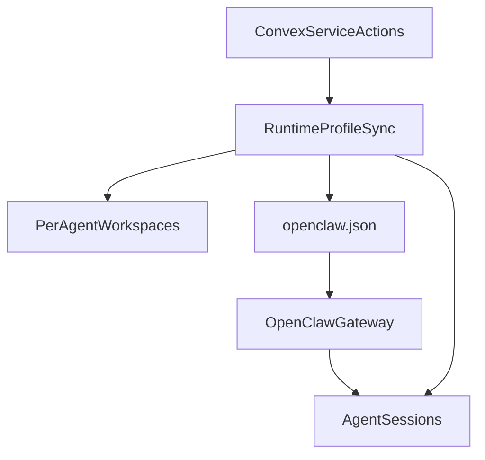

# OpenClaw Agent Profile Sync Plan

## 1. Context & goal

We need each OpenClaw agent session to reflect its Convex profile: role-specific instructions (`soulContent`) and assigned skills. We will implement a Convex-driven sync that generates per-agent OpenClaw workspaces plus a generated `openclaw.json` with `agents.list[]` entries. Skills remain prompt-only (no `SKILL.md` generation), so we will embed them into a per-agent `TOOLS.md`. This must work with the current runtime + gateway split and use only existing GitHub access via `GH_TOKEN` (no new secrets).

Key constraints:

- Runtime and OpenClaw gateway are separate containers; file sync requires shared volumes.
- OpenClaw config should reload safely without manual intervention.
- Avoid new secrets; keep using `GH_TOKEN` only for repo access.
- Keep imports at the top of files and add JSDoc for new functions.

## 2. Codebase research summary

Files inspected and patterns to reuse:

- [packages/backend/convex/seed.ts](packages/backend/convex/seed.ts): Seeds `soulContent`, skill slugs, and `openclawConfig`.
- [packages/backend/convex/schema.ts](packages/backend/convex/schema.ts): `agents` schema includes `soulContent` and `openclawConfig.skillIds`.
- [packages/backend/convex/agents.ts](packages/backend/convex/agents.ts): Agent create/update flows; `soulContent` is optional on create.
- [packages/backend/convex/service/actions.ts](packages/backend/convex/service/actions.ts) and [packages/backend/convex/service/agents.ts](packages/backend/convex/service/agents.ts): Runtime calls `listAgents`, internal queries exist.
- [apps/runtime/src/gateway.ts](apps/runtime/src/gateway.ts): Runtime sends to OpenClaw via `/v1/responses`; no profile sync.
- [apps/runtime/src/agent-sync.ts](apps/runtime/src/agent-sync.ts): Polling sync for agent list.
- [apps/runtime/openclaw/start-openclaw.sh](apps/runtime/openclaw/start-openclaw.sh): Gateway startup and workspace setup.
- [apps/runtime/docker-compose.runtime.yml](apps/runtime/docker-compose.runtime.yml): Runtime and gateway are separate services, only gateway has workspace volumes.
- [docs/runtime/AGENTS.md](docs/runtime/AGENTS.md) and [docs/runtime/SOUL_TEMPLATE.md](docs/runtime/SOUL_TEMPLATE.md): Canonical instruction templates.

Existing patterns to follow:

- Convex internal queries in `service/*` for runtime use.
- Runtime uses polling and idempotent registration; extend that pattern for profile sync.
- Runtime already writes structured prompts in [apps/runtime/src/delivery.ts](apps/runtime/src/delivery.ts); keep consistent formatting.

## 3. High-level design

### Architecture summary

- Backend exposes a runtime-specific agent payload that includes `soulContent` fallback and resolved skill details.
- Runtime generates:
  - Per-agent workspace directories containing `SOUL.md`, `AGENTS.md`, `TOOLS.md`, `MEMORY.md`, and `memory/`.
  - A generated `openclaw.json` with `agents.list[]` entries (agent id = slug, workspace path, identity name).
- OpenClaw gateway reads the generated config via `OPENCLAW_CONFIG_PATH` and reloads on changes.

### Data flow

### Mapping decisions

- Agent id in OpenClaw config uses agent slug (aligns with `agent:{slug}:{accountId}` session keys).
- `soulContent` is written to `SOUL.md` per agent; `AGENTS.md` is shared from repo docs.
- Skills are prompt-only: `TOOLS.md` contains a list of assigned skill names and descriptions.
- `openclawConfig.model` is mapped to OpenClaw provider/model strings via a mapping table; if no match, omit per-agent model and rely on gateway defaults.

## 4. File & module changes

### Backend

- [packages/backend/convex/lib/agent-soul.ts](packages/backend/convex/lib/agent-soul.ts) (new)
  - Add a shared `generateDefaultSoul(name, role)` function (JSDoc required).
  - Reuse in both agent creation and runtime payload.
- [packages/backend/convex/agents.ts](packages/backend/convex/agents.ts)
  - On `create`, if `soulContent` is missing, set default via `generateDefaultSoul`.
  - Keep imports at top; add JSDoc for new helper usage.
- [packages/backend/convex/service/agents.ts](packages/backend/convex/service/agents.ts)
  - Add `listForRuntime` internal query that returns agents with:
    - `effectiveSoulContent` (fallback to default)
    - `openclawConfig` (unchanged)
    - `resolvedSkills`: array of `{ _id, name, slug, description }` resolved from `openclawConfig.skillIds`.
- [packages/backend/convex/service/actions.ts](packages/backend/convex/service/actions.ts)
  - Add `listAgentsForRuntime` action that calls `listForRuntime`.
  - Keep existing `listAgents` unchanged to avoid breaking other runtime usage.

### Runtime

- [apps/runtime/src/openclaw-profiles.ts](apps/runtime/src/openclaw-profiles.ts) (new)
  - `syncOpenClawProfiles(agents, config)`:
    - Build per-agent workspace directory under `OPENCLAW_WORKSPACE_ROOT` (default `/root/clawd/agents`).
    - Write `SOUL.md` (from `effectiveSoulContent`).
    - Write `AGENTS.md` (from repo file `docs/runtime/AGENTS.md` inside runtime container).
    - Write `TOOLS.md` with assigned skills (prompt-only). Include a short header + bullet list.
    - Ensure `memory/` and `deliverables/` exist; `MEMORY.md` and `memory/WORKING.md` should exist.
    - Hash per-agent content and avoid rewrites if unchanged.
    - Generate `openclaw.json` with `agents.list[]` and `agents.defaults.skipBootstrap: true`.
    - Write config to `OPENCLAW_CONFIG_PATH` (default `/root/clawd/openclaw.json`).
    - Return a flag if config changed.
  - Include mapping helper `mapModelToOpenClaw(model)` with a fixed table:
    - `claude-sonnet-4-20250514` → `anthropic/claude-sonnet-4-5`
    - `claude-opus-4-20250514` → `anthropic/claude-opus-4-5`
    - `gpt-4o` → `openai/gpt-4o`
    - `gpt-4o-mini` → `openai/gpt-4o-mini`
    - Fallback: omit per-agent model.
  - Add JSDoc to all new functions and keep imports at top.
- [apps/runtime/src/agent-sync.ts](apps/runtime/src/agent-sync.ts)
  - After fetching agents, call `listAgentsForRuntime` and then `syncOpenClawProfiles`.
  - Only trigger reload if config changed.
- [apps/runtime/src/index.ts](apps/runtime/src/index.ts)
  - Ensure profile sync is invoked on startup (before heartbeats) and on agent sync ticks.
- [apps/runtime/src/config.ts](apps/runtime/src/config.ts)
  - Add env parsing for `OPENCLAW_WORKSPACE_ROOT` and `OPENCLAW_CONFIG_PATH` with defaults.
  - Add `OPENCLAW_CONFIG_RELOAD` flag if needed by gateway reload logic.
- [apps/runtime/openclaw/start-openclaw.sh](apps/runtime/openclaw/start-openclaw.sh)
  - Respect `OPENCLAW_CONFIG_PATH` when starting `clawdbot gateway`.
  - Add a lightweight reload strategy:
    - Preferred: enable OpenClaw `gateway.reload` in generated config (if supported).
    - Fallback: watch config hash and restart gateway on change.
- [apps/runtime/docker-compose.runtime.yml](apps/runtime/docker-compose.runtime.yml)
  - Mount the shared workspace/config volume into `runtime` service so it can write:
    - `../../.runtime/openclaw-workspace:/root/clawd`
    - `../../.runtime/openclaw-data:/root/.clawdbot` (if config lives there).
- [apps/runtime/.env.example](apps/runtime/.env.example)
  - Document new env vars: `OPENCLAW_WORKSPACE_ROOT`, `OPENCLAW_CONFIG_PATH`.

### Docs

- [docs/runtime/runtime-docker-compose.md](docs/runtime/runtime-docker-compose.md)
  - Update instructions to include shared volumes and profile sync behavior.

## 5. Step-by-step tasks

1. Add `generateDefaultSoul` helper in [packages/backend/convex/lib/agent-soul.ts](packages/backend/convex/lib/agent-soul.ts) and apply it in [packages/backend/convex/agents.ts](packages/backend/convex/agents.ts) for `create` when `soulContent` is missing.
2. Add `listForRuntime` internal query in [packages/backend/convex/service/agents.ts](packages/backend/convex/service/agents.ts) that returns `effectiveSoulContent` and resolved skill metadata.
3. Add `listAgentsForRuntime` action in [packages/backend/convex/service/actions.ts](packages/backend/convex/service/actions.ts) to expose the new payload to runtime.
4. Create [apps/runtime/src/openclaw-profiles.ts](apps/runtime/src/openclaw-profiles.ts) with JSDoc-documented helpers:

- File/dir creation and hashing
- `TOOLS.md` generation from resolved skills
- OpenClaw config generation with `agents.list[]`
- Model mapping function

1. Update [apps/runtime/src/agent-sync.ts](apps/runtime/src/agent-sync.ts) to call `listAgentsForRuntime` and `syncOpenClawProfiles` on each sync tick.
2. Update [apps/runtime/src/index.ts](apps/runtime/src/index.ts) to run profile sync during startup before heartbeats.
3. Add env parsing in [apps/runtime/src/config.ts](apps/runtime/src/config.ts) for workspace/config paths and pass to profile sync.
4. Update [apps/runtime/openclaw/start-openclaw.sh](apps/runtime/openclaw/start-openclaw.sh) to use `OPENCLAW_CONFIG_PATH` and implement reload strategy (config hot reload or restart loop).
5. Update [apps/runtime/docker-compose.runtime.yml](apps/runtime/docker-compose.runtime.yml) to mount shared volumes into runtime.
6. Update [apps/runtime/.env.example](apps/runtime/.env.example) and [docs/runtime/runtime-docker-compose.md](docs/runtime/runtime-docker-compose.md) with new env vars and setup steps.

## 6. Edge cases & risks

- Missing `soulContent`: use backend default generator to avoid blank `SOUL.md`.
- Empty or disabled skills: generate `TOOLS.md` with “No assigned skills” to keep prompt stable.
- Model mismatch: if mapping fails, omit per-agent model so OpenClaw defaults apply.
- Config churn: avoid restarts by hashing and only writing when content changes.
- Volume access: runtime must be able to write to the same filesystem as gateway; ensure compose volume mounts match production.
- Gateway reload stability: if using restart-on-change, avoid rapid loops by debouncing writes and validating JSON before reload.

## 7. Testing strategy

- Unit tests (runtime):
  - `openclaw-profiles` config generation: snapshot `openclaw.json` from a sample agent list.
  - `TOOLS.md` generation from skill metadata.
  - Model mapping function coverage for all known models and fallback path.
- Unit tests (backend):
  - `generateDefaultSoul` output when `soulContent` missing.
  - `listForRuntime` returns `effectiveSoulContent` and resolved skill list.
- Manual QA:
  - Start `docker compose -f apps/runtime/docker-compose.runtime.yml --profile openclaw up --build`.
  - Verify generated workspaces under `.runtime/openclaw-workspace/agents/{slug}`.
  - Confirm `openclaw.json` contains `agents.list[]` and correct workspace paths.
  - Trigger agent changes (skills/soul) and confirm files update and gateway reloads.
  - Send a test message to each agent and confirm behavior matches profile instructions.

## 8. Rollout / migration

- No data migration required; workspaces are generated on first sync.
- For existing agents, runtime creates workspace files without overwriting unchanged content.
- If gateway reload is unstable, add a feature flag (env `OPENCLAW_PROFILE_SYNC=false`) to disable profile sync while keeping runtime running.

## 9. TODO checklist

- Backend
  - Add `generateDefaultSoul` helper and use it on agent creation.
  - Implement `listForRuntime` internal query with resolved skills.
  - Add `listAgentsForRuntime` service action.
- Runtime
  - Add `openclaw-profiles.ts` with workspace + config generation.
  - Add model mapping table and fallback logic.
  - Integrate profile sync into `agent-sync` and startup flow.
  - Add env parsing for workspace/config paths.
  - Update `start-openclaw.sh` to respect config path and reload.
- Infra / Docs
  - Add shared volume mounts to runtime service in compose.
  - Update `.env.example` and runtime docker compose docs.
- Tests / QA
  - Add unit tests for config generation and skill formatting.
  - Run manual QA flow in docker compose and verify reload behavior.
