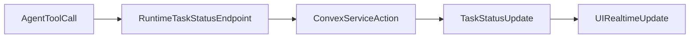

# Agent Status Updates via Explicit Convex Calls

#### 1. Context & goal

We need agents to update task status explicitly (no parsing), matching the initial concept doc that shows direct Convex calls for status changes. Tasks should also auto-move to `assigned` when assignees are added. The plan must handle all workflow statuses (`inbox`, `assigned`, `in_progress`, `review`, `done`, `blocked`) with proper validation, audit logging, notifications, and service auth.

#### 2. Codebase research summary

Key files and patterns:

- `[docs/concept/openclaw-mission-control-initial-article.md](docs/concept/openclaw-mission-control-initial-article.md)` — shows explicit task status updates via Convex calls.
- `[packages/backend/convex/tasks.ts](packages/backend/convex/tasks.ts)` — status validation (`updateStatus`) and assignment mutation (`assign`).
- `[packages/backend/convex/lib/task_workflow.ts](packages/backend/convex/lib/task_workflow.ts)` — allowed transitions + requirements.
- `[packages/backend/convex/lib/notifications.ts](packages/backend/convex/lib/notifications.ts)` — status change notifications.
- `[packages/backend/convex/service/actions.ts](packages/backend/convex/service/actions.ts)` — service actions used by runtime.
- `[apps/runtime/src/health.ts](apps/runtime/src/health.ts)` — runtime HTTP server to host a status update tool endpoint.
- `[apps/runtime/src/gateway.ts](apps/runtime/src/gateway.ts)` — sessionKey→agentId mapping.
- `[docs/runtime/AGENTS.md](docs/runtime/AGENTS.md)` — agent operating rules.

Existing patterns to reuse:

- `requireServiceAuth` for service calls
- `logActivity` for audit trail
- `createStatusChangeNotification` for notifications
- `isValidTransition` + `validateStatusRequirements` for workflow enforcement

#### 3. High-level design

**Backend (Convex)**

- Add a service-only mutation to update task status as an agent, enforcing workflow rules and logging activity.
- Add a service action that validates the runtime service token, verifies account ownership, and calls the internal mutation.
- Enhance `tasks.assign` to auto-transition `inbox → assigned` and revert `assigned → inbox` when all assignees are removed.
- Enforce the canonical workflow from `task_workflow.ts` (no skipped statuses; `blocked` requires a reason).

**Runtime Tool (Explicit calls, no parsing)**

- Expose a local-only HTTP endpoint `POST /agent/task-status` on the runtime health server.
- Require header `x-openclaw-session-key` to resolve `agentId` via the gateway session map.
- Endpoint body: `{ taskId, status, blockedReason? }` and forwards to the Convex service action.
- Allow only `in_progress`, `review`, `done`, `blocked` in the tool; `inbox`/`assigned` are handled by assignment logic.
- Return JSON `{ success: true }` on success, and `{ success: false, error }` with 4xx/422 on validation errors.

**Agent UX (Convex CLI / tool usage)**

- Agents are instructed to call the runtime task-status tool before posting a thread update.
- This mirrors the concept doc’s explicit Convex status update flow (no parsing).
- Convex CLI (`npx convex run tasks:update ...`) is a manual/dev fallback only, not the production agent path.

Mermaid flow:

#### 4. File & module changes

**Backend**

- `[packages/backend/convex/service/tasks.ts](packages/backend/convex/service/tasks.ts)`
  - Add `updateStatusFromAgent` internal mutation:
    - args: `taskId`, `agentId`, `status`, `blockedReason?`
    - validate transition and requirements
    - idempotent when status unchanged
    - log `task_status_changed` with `actorType: "agent"`
    - notify assigned users/agents
    - include metadata `{ oldStatus, newStatus, blockedReason }`
- `[packages/backend/convex/service/actions.ts](packages/backend/convex/service/actions.ts)`
  - Add `updateTaskStatusFromAgent` action:
    - validate service token
    - verify agent/task account
    - call `internal.service.tasks.updateStatusFromAgent`
- `[packages/backend/convex/tasks.ts](packages/backend/convex/tasks.ts)`
  - In `assign`, auto-transition:
    - `inbox → assigned` when assignees exist
    - `assigned → inbox` when all assignees removed
  - log `task_status_changed` activity and create status-change notifications for assignees

**Runtime**

- `[apps/runtime/src/gateway.ts](apps/runtime/src/gateway.ts)`
  - Export helper `getAgentIdForSessionKey(sessionKey)`.
- `[apps/runtime/src/health.ts](apps/runtime/src/health.ts)`
  - Add `POST /agent/task-status` endpoint:
    - validate header `x-openclaw-session-key`
    - parse JSON body `{ taskId, status, blockedReason? }`
    - resolve agentId, call `api.service.actions.updateTaskStatusFromAgent`
    - return 400 for invalid JSON or missing fields, 401 for unknown session, 422 for invalid transitions
- `[apps/runtime/src/delivery.ts](apps/runtime/src/delivery.ts)`
  - Update prompt text to instruct explicit tool usage for status changes.
  - Mention session key format `agent:{slug}:{accountId}` (from concept docs).

**Docs**

- `[docs/runtime/AGENTS.md](docs/runtime/AGENTS.md)`
  - Add “How to update task status” section with tool call format.
  - Include an example call and the `HEALTH_HOST`/`HEALTH_PORT` location of the runtime tool.

#### 5. Step-by-step tasks

1. **Backend mutation**: Implement `updateStatusFromAgent` in `[packages/backend/convex/service/tasks.ts](packages/backend/convex/service/tasks.ts)`.

- Validate transitions with `isValidTransition`.
- Validate requirements with `validateStatusRequirements` (blocked requires reason; in_progress/assigned require assignees).
- Early-return when `currentStatus === nextStatus` (idempotent).
- Patch status and blockedReason; update `updatedAt`.
- Log `task_status_changed` with `actorType: "agent"` and metadata.
- Notify assigned users and agents with `createStatusChangeNotification`.

1. **Service action**: Add `updateTaskStatusFromAgent` in `[packages/backend/convex/service/actions.ts](packages/backend/convex/service/actions.ts)`.

- Validate `serviceToken` and `accountId` with `requireServiceAuth`.
- Check agent and task belong to account via internal queries.
- Call `internal.service.tasks.updateStatusFromAgent`.

1. **Auto-assign transitions**: Update `assign` in `[packages/backend/convex/tasks.ts](packages/backend/convex/tasks.ts)`.

- Compute final assignee lists (`assignedUserIds`/`assignedAgentIds`).
- If `status === inbox` and assignees exist → set `assigned`.
- If `status === assigned` and assignees empty → set `inbox`.
- Log `task_status_changed` and notify assignees for auto-transition.

1. **Gateway helper**: Add `getAgentIdForSessionKey` in `[apps/runtime/src/gateway.ts](apps/runtime/src/gateway.ts)`.
2. **Runtime endpoint**: Add `POST /agent/task-status` in `[apps/runtime/src/health.ts](apps/runtime/src/health.ts)`.

- Read `x-openclaw-session-key` header.
- Parse JSON body `{ taskId, status, blockedReason? }`.
- Validate `status` is one of `in_progress|review|done|blocked`.
- Resolve agentId via gateway helper; return 401 if unknown.
- Call `api.service.actions.updateTaskStatusFromAgent` with service token.

1. **Prompt update**: Update `[apps/runtime/src/delivery.ts](apps/runtime/src/delivery.ts)`.

- Add explicit instruction: call the tool before posting status-changing updates.
- Include the session key format `agent:{slug}:{accountId}`.

1. **Docs update**: Update `[docs/runtime/AGENTS.md](docs/runtime/AGENTS.md)`.

- Document the endpoint, required header, allowed statuses, and blocked reason requirement.
- Provide a curl example with `HEALTH_HOST`/`HEALTH_PORT`.

1. **Verify**: Run `npx convex dev --once` and `npm run typecheck`.

#### 6. Edge cases & risks

- Invalid transitions (e.g., `inbox → done`) must be rejected with a clear error.
- `blocked` requires `blockedReason`.
- Missing/unknown session key must return 401 without side effects.
- `assigned → inbox` revert only if status is `assigned` to avoid regressions.

#### 7. Testing strategy

- Manual QA:
  - Assign agent to inbox task → auto moves to `assigned`.
  - Call status tool with `in_progress`, `review`, `done`, `blocked` (with reason).
  - Try invalid transition (`inbox → done`) and confirm rejection.
  - Try `blocked` without reason and confirm rejection.
  - Try missing/unknown `x-openclaw-session-key` and confirm 401.

#### 8. Rollout / migration

- No schema changes or migrations required.
- Deploy Convex + runtime changes together to ensure the tool is available.

#### 9. TODO checklist

- Add `updateStatusFromAgent` internal mutation
- Add `updateTaskStatusFromAgent` service action
- Update `assign` for auto status transitions
- Add sessionKey→agentId resolver
- Add `/agent/task-status` endpoint
- Update runtime prompt to instruct tool usage
- Update `docs/runtime/AGENTS.md` with tool usage
- Run `npx convex dev --once` and `npm run typecheck`
