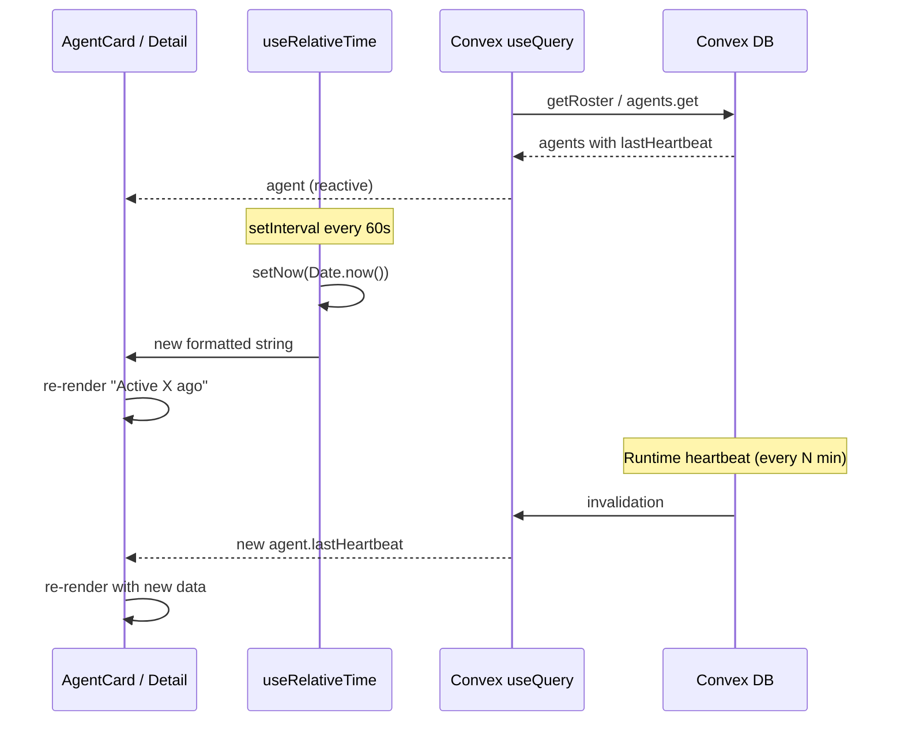

# Fix agent "last connection" not updating dynamically

## Context and goal

The agent roster and detail views show "Active X minutes ago" (and "Last seen X ago") from `agent.lastHeartbeat`. This text does not update in real time: users must refresh to see updated times. With Convex, we expect reactive data; the fix has two parts — (1) make the **relative time label** live-update on the client, and (2) confirm Convex reactivity so DB updates are reflected without refresh.

**Constraints:** No backend change required for the minimal fix; optional backend improvement is noted. Reuse existing patterns (periodic tick, Convex `useQuery`) and project conventions (hooks, date-fns).

## Root cause

- **Data source:** [AgentCard](apps/web/src/components/agents/AgentCard.tsx) and the [agent detail page](<apps/web/src/app/(dashboard)/[accountSlug]/agents/[agentId]/page.tsx>) render `formatDistanceToNow(agent.lastHeartbeat, { addSuffix: true })`. The roster uses `useQuery(api.agents.getRoster, { accountId })` and the detail uses `useQuery(api.agents.get, { agentId })`, so Convex **does** push new data when the DB changes.
- **Why it looks static:** `lastHeartbeat` in Convex is only updated when the runtime runs a **full heartbeat cycle** ([heartbeat.ts](apps/runtime/src/heartbeat.ts) → `updateAgentHeartbeat` → [service/agents.upsertHeartbeat](packages/backend/convex/service/agents.ts)), which runs every N minutes (e.g. 5–30 per agent). Between those updates, the **same** timestamp is in the DB, so the component does not re-render and "2 minutes ago" never becomes "3 minutes ago" until the next heartbeat or a manual refresh.
- **Conclusion:** The relative time string must be **re-computed on a timer** (e.g. every 30–60s) so it advances without waiting for a new Convex write. Convex reactivity remains important so that when the runtime does write a new `lastHeartbeat`, the UI updates without refresh.

## Codebase summary

- **Roster:** [apps/web/src/app/(dashboard)/[accountSlug]/agents/page.tsx](<apps/web/src/app/(dashboard)/[accountSlug]/agents/page.tsx>) uses `useQuery(api.agents.getRoster, { accountId })` and maps roster to `<AgentCard agent={...} />`. `getRoster` returns agents with `...agent` (includes `lastHeartbeat`).
- **Agent detail:** [apps/web/src/app/(dashboard)/[accountSlug]/agents/[agentId]/page.tsx](<apps/web/src/app/(dashboard)/[accountSlug]/agents/[agentId]/page.tsx>) uses `useQuery(api.agents.get, { agentId })` and shows "Last seen {formatDistanceToNow(agent.lastHeartbeat, { addSuffix: true })}".
- **Existing pattern:** [TaskThread.tsx](apps/web/src/components/tasks/TaskThread.tsx) uses `setInterval(() => setNow(Date.now()), 1000)` for a live "now"; [LiveClock.tsx](apps/web/src/components/dashboard/LiveClock.tsx) uses `setInterval(() => setNow(new Date()), 1000)`. Same idea: a ticking "now" to force re-renders for time-based UI.

## High-level design

- Add a small **hook** that takes a timestamp (ms or null) and returns the formatted relative time string, and internally updates a "now" state every 60s (or 30s) so the returned string changes over time.
- Use this hook in `AgentCard` and on the agent detail page for the "Last seen" line. Convex `useQuery` stays as-is so DB updates still flow in.

## File and module changes

### New file

- `**apps/web/src/lib/hooks/useRelativeTime.ts**` (or colocate next to components if preferred)
  - Hook: `useRelativeTime(timestampMs: number | null | undefined, options?: { addSuffix?: boolean }) => string`.
  - Returns `formatDistanceToNow(timestampMs, { addSuffix })` when timestamp is valid, else a fallback string (e.g. "Never active").
  - Uses `useState` for "now" and `useEffect` + `setInterval(..., 60_000)` (or 30_000) to update "now" so the formatted string is re-computed each tick. Cleanup on unmount.
  - Uses `date-fns` `formatDistanceToNow` (already used in the app). Accept number (ms) as per Convex schema.

### Existing files to touch

- **[apps/web/src/components/agents/AgentCard.tsx](apps/web/src/components/agents/AgentCard.tsx)**
  - Replace the inline `formatDistanceToNow(agent.lastHeartbeat, { addSuffix: true })` (and "Never active") with `useRelativeTime(agent.lastHeartbeat, { addSuffix: true })`. Keep the same copy: "Active {relativeTime}" when present, "Never active" when null.
  - Keep all other logic and props unchanged.
- **[apps/web/src/app/(dashboard)/[accountSlug]/agents/[agentId]/page.tsx](<apps/web/src/app/(dashboard)/[accountSlug]/agents/[agentId]/page.tsx>)**
  - For the "Last seen" block that uses `formatDistanceToNow(agent.lastHeartbeat, { addSuffix: true })`, switch to the same hook so that line also updates over time. Keep conditional so we only show the block when `agent.lastHeartbeat` is set.

## Step-by-step tasks

1. **Add `useRelativeTime` hook**

- Create `apps/web/src/lib/hooks/useRelativeTime.ts`.
- Implement: accept `timestampMs` (number | null | undefined) and optional `{ addSuffix?: boolean }`; return string. Use state for "now", update every 60 seconds via `setInterval`, cleanup in `useEffect` return. Use `formatDistanceToNow(timestampMs, { addSuffix })` when timestamp is valid; otherwise return a sensible fallback (e.g. "Never active" or empty string depending on caller).
- Use 60s interval to balance freshness and unnecessary re-renders (can use 30s if product prefers).

1. **Use hook in AgentCard**

- In `AgentCard.tsx`, import `useRelativeTime` and replace the "Active X ago" / "Never active" block with the hook. Preserve existing copy and layout (Clock icon + span).

1. **Use hook on agent detail page**

- In the agent detail page, import `useRelativeTime` and replace the "Last seen {formatDistanceToNow(...)}" usage with the hook so "Last seen X ago" updates live.

1. **Optional: Verify Convex reactivity**

- Manually: trigger a heartbeat (or wait for one), confirm roster/detail views update without refresh. If they do not, investigate query usage and Convex invalidation (out of scope for the minimal fix but noted in edge cases).

## Edge cases and risks

- **Stale timestamp type:** Schema stores `lastHeartbeat` as number (ms). The hook and `formatDistanceToNow` accept number; no conversion needed. If the value is 0 or invalid, treat as "no heartbeat" (fallback string).
- **Timer frequency:** 60s is a reasonable default; "X minutes ago" does not need second precision. Avoid very short intervals (e.g. 1s) to limit re-renders.
- **Unmount:** Clear the interval in the hook’s `useEffect` cleanup to avoid leaks and state updates after unmount.
- **Convex subscription:** If in production the UI still does not update when the runtime writes a new `lastHeartbeat` (even after a heartbeat interval), verify that `getRoster` and `agents.get` are used via `useQuery` with stable args and that no layer is caching the result in a non-reactive way.

## Testing strategy

- **Manual:** Open agents roster; note "Active X minutes ago" for an online agent; wait 1–2 minutes without refresh; confirm the text updates (e.g. "2 minutes ago" → "3 minutes ago"). Repeat for agent detail "Last seen". Confirm "Never active" still shows when `lastHeartbeat` is missing.
- **Unit (optional):** Hook can be unit-tested with a fake timer (e.g. Jest `useFakeTimers`) to assert the returned string changes after advancing time and that cleanup runs.

## Rollout

No feature flags or migration. Frontend-only change; deploy as usual. If the hook is reused elsewhere later, keep the same 60s interval unless a specific screen needs a different cadence.

## TODO checklist

- Add `useRelativeTime(timestampMs, options?)` in `apps/web/src/lib/hooks/useRelativeTime.ts` with 60s tick and cleanup.
- In `AgentCard.tsx`, replace inline `formatDistanceToNow` for lastHeartbeat with `useRelativeTime(agent.lastHeartbeat, { addSuffix: true })`, keeping "Active ..." / "Never active" copy.
- In agent detail page, replace "Last seen" `formatDistanceToNow(agent.lastHeartbeat, ...)` with `useRelativeTime(agent.lastHeartbeat, { addSuffix: true })`.
- Manual QA: roster and detail "last connection" text updates without refresh after 1–2 minutes.
- (Optional) If product wants DB value to update more often than full heartbeats, consider a lightweight runtime "ping" that only updates `lastHeartbeat` on a shorter interval; document as follow-up.
