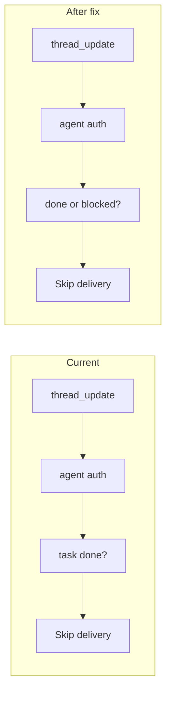

# Blocked task reply-loop fix

## 1. Context and goal

When a task is moved to **Done**, the runtime already stops the conversation loop by not delivering agent-authored `thread_update` notifications to other agents (see [delivery.ts](apps/runtime/src/delivery.ts)). When a task is moved to **Blocked**, that same skip is not applied, so agents keep receiving thread updates and can reply repeatedly, causing a reply loop.

**Goal:** Apply the same delivery-skip logic for **blocked** tasks so that moving a task to Blocked stops agent-to-agent thread_update delivery, while user-authored messages and other notification types are unchanged.

**Constraints:** No backend or schema changes required; the fix is entirely in the runtime delivery logic and optionally in the notification prompt text.

---

## 2. Codebase research summary

**Files inspected:**

- **[apps/runtime/src/delivery.ts](apps/runtime/src/delivery.ts)**
  - `shouldDeliverToAgent()` (lines 327–355): For `thread_update` + `messageAuthorType === "agent"`, it returns `false` when `taskStatus === "done"` to avoid reply loops. There is no check for `taskStatus === "blocked"`.
  - `formatNotificationMessage()` (lines 730–756): When `task?.status === "done"` it appends an instruction telling the agent to reply once briefly and not again. No equivalent for `blocked`.
- **[packages/backend/convex/lib/task_workflow.ts](packages/backend/convex/lib/task_workflow.ts)**
  - `blocked` is a valid status with transitions back to `assigned` or `in_progress`. No change needed.
- **Backend service actions**
  - `listUndeliveredNotifications` / `getNotificationForDelivery` do not filter by task status; the runtime decides in `shouldDeliverToAgent`. No backend change.

**Pattern to follow:** The existing “done” handling: (1) skip delivery for agent-authored thread_update when task is done; (2) when a notification is still delivered (e.g. mention), prompt tells the agent to reply once and not continue. We mirror (1) for blocked and optionally (2).

---

## 3. High-level design

**Data flow (unchanged):**

- Convex creates notifications (e.g. `thread_update`) when messages are added.
- Runtime polls, fetches notification context (including `task.status`), then calls `shouldDeliverToAgent(context)`.
- If `true`, the notification is delivered to OpenClaw; if `false`, it is skipped (and can be marked delivered or not depending on existing logic).
- The payload is built by `formatNotificationMessage()`, which can add status-specific instructions.

**Change:**

- In `shouldDeliverToAgent`, when we are in the branch “thread_update + agent-authored message”, treat `blocked` like `done`: do not deliver (return `false`). That stops agent→agent thread updates on blocked tasks and prevents the reply loop.
- Optionally, in `formatNotificationMessage`, when `task?.status === "blocked"`, add one line of instruction so that any notification that is still delivered (e.g. user mention) tells the agent not to continue substantive work until the task is unblocked.

---

## 4. File and module changes

**Existing file to modify:**

- **apps/runtime/src/delivery.ts**
  - `**shouldDeliverToAgent**`
    - Extend the condition that returns `false` from “when `taskStatus === "done"`” to “when `taskStatus === "done"` or `taskStatus === "blocked"`” (e.g. `if (taskStatus === "done" || taskStatus === "blocked") return false;`).
  - **JSDoc for `shouldDeliverToAgent**`
    - Update to state that we also skip `thread_update` on **blocked** to avoid reply loops (in addition to “skips thread_update on DONE”).
  - `**formatNotificationMessage` (optional)
    - In the same place where `task?.status === "done"` adds a line (around line 750), add a conditional line for `task?.status === "blocked"`: e.g. instruct the agent that the task is BLOCKED and to reply only to clarify or unblock, and not to continue substantive work until status is changed.

No new files. No backend or Convex changes.

---

## 5. Step-by-step tasks

1. **Update `shouldDeliverToAgent` in delivery.ts**

- In the block `if (notificationType === "thread_update" && messageAuthorType === "agent")`, change the condition from `if (taskStatus === "done")` to `if (taskStatus === "done" || taskStatus === "blocked")` so that both done and blocked tasks skip delivery of agent-authored thread_update.

1. **Update JSDoc for `shouldDeliverToAgent**`

- In the comment above the function, replace “skips thread_update on DONE to avoid reply loops” with wording that also mentions blocked (e.g. “skips thread_update when task is DONE or BLOCKED to avoid reply loops”).

1. **(Optional) Add blocked-task instruction in `formatNotificationMessage**`

- In the same return block where the “done” instruction is added (`task?.status === "done" ? "..." : ""`), add a similar ternary for `task?.status === "blocked"`: one short line telling the agent the task is BLOCKED and to reply only to clarify/unblock, and not to continue substantive work until status is updated.

---

## 6. Edge cases and risks

- **User mentions on blocked tasks:** Notifications triggered by **user** messages (e.g. “@Agent can you unblock this?”) have `messageAuthorType === "user"`, so they do not enter the “agent-authored thread_update” branch and will still be delivered. Desired.
- **Assignment / other types:** Only `thread_update` with agent author is affected. Assignment and other notification types are unchanged.
- **Unblocking:** When the task is moved back to `in_progress` or `assigned`, `taskStatus` is no longer `blocked`, so delivery resumes as before. No migration or flag needed.
- **Risk:** None identified; change is additive and localized to the same branch that already handles “done”.

---

## 7. Testing strategy

- **Manual QA**
  - Move a task to Blocked; have an agent post a thread message; verify that other agents do not receive that thread_update (no new notification delivered for them).
  - Move the same task back to In progress; have an agent post again; verify that other agents do receive the thread_update.
  - (If prompt line added) Open a notification payload for a blocked task and confirm the blocked instruction appears in the message body.
- **Unit tests (optional):** If there are existing tests for `shouldDeliverToAgent`, add cases for `taskStatus === "blocked"` (and `messageAuthorType === "agent"`, `notificationType === "thread_update"`) expecting `false`. No existing tests were found in the repo for this function.

---

## 8. Rollout / migration

- No feature flags or migration needed.
- Deploy runtime as usual; new behavior applies as soon as the updated code is running.
- No observability changes required for this small logic fix.

---

## 9. TODO checklist

- In [apps/runtime/src/delivery.ts](apps/runtime/src/delivery.ts), extend the “done” check in `shouldDeliverToAgent` to also return `false` when `taskStatus === "blocked"`.
- Update the JSDoc of `shouldDeliverToAgent` to mention that thread_update is skipped when task is DONE or BLOCKED.
- (Optional) In `formatNotificationMessage`, add a blocked-task instruction line when `task?.status === "blocked"`.
- Manual QA: task moved to Blocked → agent posts → other agents do not get thread_update; task unblocked → agent posts → others do get it.
