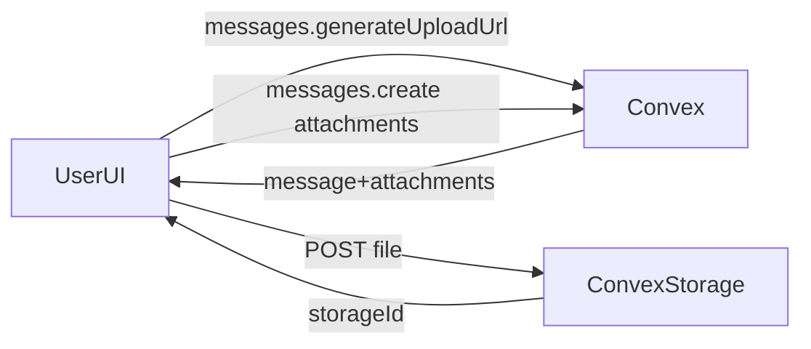

#### 1. Context & goal

- Enable message attachments to be uploaded to Convex storage and persisted on messages while keeping the data model inline (no `files` table).
- Enforce multi-tenancy and validation (allowed types + 20MB max) for every upload-related mutation.
- Keep the API surface minimal and consistent with existing `messages`/`service.messages` patterns.

#### 2. Codebase research summary

- Inspected files:
  - [apps/web/src/components/tasks/MessageInput.tsx](apps/web/src/components/tasks/MessageInput.tsx) — UI collects files but `messages.create` isn’t called with attachments.
  - [apps/web/src/components/tasks/MessageItem.tsx](apps/web/src/components/tasks/MessageItem.tsx) — no attachment rendering.
  - [packages/backend/convex/schema.ts](packages/backend/convex/schema.ts) — `messages.attachments` exists as `{ name, url, type, size }`.
  - [packages/backend/convex/lib/validators.ts](packages/backend/convex/lib/validators.ts) — `attachmentValidator` mirrors the schema.
  - [packages/backend/convex/messages.ts](packages/backend/convex/messages.ts) — `messages.create` accepts `attachments` and logs `hasAttachments` but no storage integration.
  - [packages/backend/convex/service/messages.ts](packages/backend/convex/service/messages.ts) — agent message creation supports `attachments`.
  - [packages/backend/convex/service/actions.ts](packages/backend/convex/service/actions.ts) — `createMessageFromAgent` validates attachments inline with `{ url, name, type, size }`.
  - [packages/backend/convex/lib/auth.ts](packages/backend/convex/lib/auth.ts) — `requireAccountMember` pattern for tenancy.
  - [packages/backend/convex/lib/activity.ts](packages/backend/convex/lib/activity.ts) — `logActivity` used for audit trail.
- Gap: No Convex storage upload flow (`ctx.storage.generateUploadUrl`) in backend.

#### 3. High-level design

- Add a `messages.generateUploadUrl` mutation that accepts `taskId`, loads the task, and calls `requireAccountMember` to gate uploads per account.
- Store attachments inline on `messages` with a `storageId` field and metadata (`name`, `type`, `size`). Keep `url` optional for backward compatibility and to avoid breaking existing shape.
- On `messages.create` and `service.messages.createFromAgent`, validate allowed types and size (20MB) and, when `storageId` is present, call `ctx.storage.getUrl(storageId)` to populate `url` before insert.
- Update the service action `createMessageFromAgent` to accept the new attachment shape and pass through to the internal mutation.

#### 4. File & module changes

- [packages/backend/convex/schema.ts](packages/backend/convex/schema.ts)
  - Update `messages.attachments` to include `storageId: v.id("_storage")` and make `url` optional for compatibility.
- [packages/backend/convex/lib/validators.ts](packages/backend/convex/lib/validators.ts)
  - Extend `attachmentValidator` to include `storageId` (required) and `url` (optional).
  - Add a small helper (exported) to validate attachment `type` and `size` against allowed list + 20MB cap.
- [packages/backend/convex/messages.ts](packages/backend/convex/messages.ts)
  - Add `generateUploadUrl` mutation with `taskId` → membership guard → `ctx.storage.generateUploadUrl()`.
  - In `create`, validate attachments and resolve `url` via `ctx.storage.getUrl(storageId)` when missing.
- [packages/backend/convex/service/messages.ts](packages/backend/convex/service/messages.ts)
  - Update attachment validation and URL resolution to match the user flow.
- [packages/backend/convex/service/actions.ts](packages/backend/convex/service/actions.ts)
  - Align `createMessageFromAgent` args with the new attachment shape (include `storageId`, optional `url`).

#### 5. Step-by-step tasks

1. **Schema + validator update**

- Update `messages.attachments` in [packages/backend/convex/schema.ts](packages/backend/convex/schema.ts) to include `storageId` and optional `url`.
- Extend `attachmentValidator` (and add helper for type/size checks) in [packages/backend/convex/lib/validators.ts](packages/backend/convex/lib/validators.ts).

1. **Upload URL + attachment handling (user messages)**

- Add `messages.generateUploadUrl` in [packages/backend/convex/messages.ts](packages/backend/convex/messages.ts) using `taskId` + `requireAccountMember`.
- Update `messages.create` to validate attachments and resolve `url` from `storageId` before insert.

1. **Agent/runtime parity**

- Update [packages/backend/convex/service/messages.ts](packages/backend/convex/service/messages.ts) to use the new attachment shape and validation.
- Align [packages/backend/convex/service/actions.ts](packages/backend/convex/service/actions.ts) `createMessageFromAgent` args to match the updated shape.

1. **Typegen + sanity check**

- Regenerate Convex types (`npx convex dev --once`) and verify no type errors in web/runtime imports.

#### 6. Edge cases & risks

- Storage URL resolution can fail if `storageId` is invalid; decide whether to reject the message or drop the attachment with a clear error.
- Client-provided `type`/`size` can be spoofed; use `ctx.storage.getMetadata` if available, otherwise document the trust boundary.
- Existing messages with `{ url }` only should continue to work; keep `url` optional and avoid breaking reads.
- Ensure multi-tenancy: only members of the task’s account can generate upload URLs or attach files.

#### 7. Testing strategy

- **Unit tests** (if backend test harness exists): attachment validation helper (allowed types, size limits, missing fields).
- **Integration**: generate upload URL → upload file → create message with `storageId` → verify `attachments.url` is present.
- **Manual QA**: in UI, attach a file, send message, confirm message persists and `attachments` metadata is stored.

#### 8. Rollout / migration (if relevant)

- No data migration required if `url` remains optional and `storageId` is additive.
- After schema changes, re-run Convex type generation and restart dev server.

#### 9. TODO checklist

- Backend
  - Update `messages.attachments` schema to include `storageId` + optional `url`.
  - Extend `attachmentValidator` and add type/size validation helper.
  - Add `messages.generateUploadUrl` mutation.
  - Update `messages.create` to validate attachments and resolve `url` from `storageId`.
  - Align `service.messages` and `service.actions` attachment shapes.
- Frontend
  - Wire `MessageInput` to call `messages.generateUploadUrl`, upload files, and pass attachments to `messages.create`.
- Tests
  - Add unit test coverage for attachment validation and size/type checks.
  - Add an integration test or manual QA checklist for the upload flow.
- Infra
  - Re-run `npx convex dev --once` to regenerate types after schema updates.
