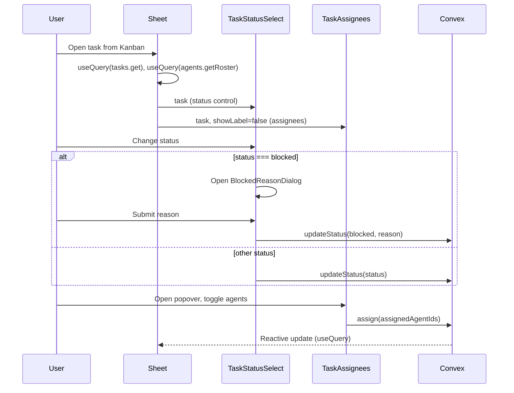

# Editable status and assignees in task detail sheet

## 1. Context and goal

Users currently must open a task in the full-page view to change its **status** or **assignees**. The task detail sheet (slide-over from the Kanban board) shows these as read-only badges. The goal is to make status and assignees **editable in the sheet** so users can update them without leaving the board.

**Constraints:** Reuse existing Convex mutations (`tasks.updateStatus`, `tasks.assign`), existing UI patterns (Select, Popover, BlockedReasonDialog), and avoid duplicating logic between full page and sheet. No backend or API changes.

---

## 2. Codebase research summary

**Main files inspected:**

- [apps/web/src/components/tasks/TaskDetailSheet.tsx](apps/web/src/components/tasks/TaskDetailSheet.tsx) — Sheet implementation: status and assignees are static (Badge and avatar list only; lines 179–262).
- [apps/web/src/components/tasks/TaskHeader.tsx](apps/web/src/components/tasks/TaskHeader.tsx) — Full-page header: status via `Select` + `handleStatusChange` + `BlockedReasonDialog`; assignees via `<TaskAssignees task={task} />`; uses `api.tasks.updateStatus` and `api.tasks.reopen`.
- [apps/web/src/components/tasks/TaskAssignees.tsx](apps/web/src/components/tasks/TaskAssignees.tsx) — Agent picker: Popover with roster, `api.tasks.assign`, toggle assignees; includes a "Assignees:" label (line 69).
- [apps/web/src/components/tasks/BlockedReasonDialog.tsx](apps/web/src/components/tasks/BlockedReasonDialog.tsx) — Dialog for blocked reason; props: `open`, `onOpenChange`, `onConfirm(reason)`, optional `taskTitle`.
- [packages/backend/convex/tasks.ts](packages/backend/convex/tasks.ts) — `updateStatus({ taskId, status, blockedReason? })`, `assign({ taskId, assignedAgentIds })`, `reopen({ taskId })` (for done → review).

**Patterns to follow:** Same status flow as TaskHeader (Select → if "blocked" open BlockedReasonDialog → else updateStatus). Reuse TaskAssignees for assignees. Use `TASK_STATUS_LABELS` from `@packages/shared` and existing Select/Popover from `@packages/ui`.

---

## 3. High-level design

- **Status:** Introduce a shared **TaskStatusSelect** used by both TaskHeader and TaskDetailSheet. It owns the Select, `updateStatus` mutation, and BlockedReasonDialog state; when status is "done", it can show a compact "Reopen" action that calls `api.tasks.reopen`.
- **Assignees:** Use existing **TaskAssignees** in the sheet; add an optional prop to hide its built-in label so the sheet can keep its "ASSIGNEES" section header and card styling.
- **No new APIs:** All updates go through existing Convex mutations; Convex reactivity keeps the sheet and board in sync.

---

## 4. File and module changes

**New file**

- `**apps/web/src/components/tasks/TaskStatusSelect.tsx**`
  - Props: `task: Doc<"tasks">`, optional `variant?: "default" | "compact"` (compact = smaller trigger for sheet).
  - Renders: Select with `value={task.status}`, options from `TASK_STATUS_LABELS`; on change, if "blocked" set local state to open BlockedReasonDialog, else call `updateStatus({ taskId, status })`.
  - Renders BlockedReasonDialog when open; onConfirm calls `updateStatus({ taskId, status: "blocked", blockedReason })`.
  - When `task.status === "done"`: render a small "Reopen" button/link that calls `api.tasks.reopen` (so sheet users can reopen without going to full page).
  - Uses `useMutation(api.tasks.updateStatus)` and `useMutation(api.tasks.reopen)`; toast on success/error.

**Existing files to modify**

- `**apps/web/src/components/tasks/TaskHeader.tsx**`
  - Replace the inline status Select, `handleStatusChange`, `handleBlockedConfirm`, and `showBlockedDialog` state with `<TaskStatusSelect task={task} />`.
  - Remove the BlockedReasonDialog instance that was used for status (keep other dialogs: Edit, Delete).
  - Keep "Mark as done" button when status === "review" and the rest of the header layout unchanged.
- `**apps/web/src/components/tasks/TaskDetailSheet.tsx**`
  - Replace the static status Badge (lines 179–188) with `<TaskStatusSelect task={task} variant="compact" />`. Keep the priority Badge as-is (read-only).
  - Replace the assignees metadata block (lines 229–262): keep the outer card div and "ASSIGNEES" label, replace the inner content with `<TaskAssignees task={task} showLabel={false} />` so the component only renders avatars + picker button, matching the sheet’s card style.
- `**apps/web/src/components/tasks/TaskAssignees.tsx**`
  - Add optional prop `showLabel?: boolean` (default `true`). When `false`, do not render the `Assignees:` element so the sheet can provide its own section heading.

---

## 5. Step-by-step tasks

1. **Add TaskStatusSelect component**

- Create [apps/web/src/components/tasks/TaskStatusSelect.tsx](apps/web/src/components/tasks/TaskStatusSelect.tsx).
- Implement Select with `TASK_STATUS_LABELS`, `updateStatus` mutation, and local state for BlockedReasonDialog. On "blocked" selection open dialog; on confirm call `updateStatus` with `blockedReason`.
- When `task.status === "done"`, render a "Reopen" control that calls `api.tasks.reopen`.
- Add optional `variant` prop; when "compact", use a smaller SelectTrigger (e.g. same styling as sheet badges).
- Add JSDoc and use existing toast/error handling pattern.

1. **Refactor TaskHeader to use TaskStatusSelect**

- In [apps/web/src/components/tasks/TaskHeader.tsx](apps/web/src/components/tasks/TaskHeader.tsx), remove `showBlockedDialog`, `handleStatusChange`, `handleBlockedConfirm`, and the inline status Select.
- Render `<TaskStatusSelect task={task} />` in place of the Select.
- Remove the BlockedReasonDialog used for status (keep TaskEditDialog, DeleteTaskDialog).
- Ensure "Mark as done" (when status === "review") and other header behavior remain.

1. **Add showLabel to TaskAssignees**

- In [apps/web/src/components/tasks/TaskAssignees.tsx](apps/web/src/components/tasks/TaskAssignees.tsx), add `showLabel?: boolean` to the props interface (default `true`).
- Conditionally render the "Assignees:" span only when `showLabel !== false`.

1. **Wire status and assignees into TaskDetailSheet**

- In [apps/web/src/components/tasks/TaskDetailSheet.tsx](apps/web/src/components/tasks/TaskDetailSheet.tsx), import TaskStatusSelect and TaskAssignees.
- Replace the status Badge block with `<TaskStatusSelect task={task} variant="compact" />`.
- In the Assignees grid cell, keep the card wrapper and "ASSIGNEES" label; replace the static avatar/list with `<TaskAssignees task={task} showLabel={false} />`.

1. **Manual QA**

- Open a task from the Kanban board in the sheet; change status (including to "blocked" and entering a reason); change assignees via the picker; confirm updates persist and board updates in real time.
- On full-page task view, confirm status Select and BlockedReasonDialog still work and TaskAssignees unchanged.
- For a "done" task, confirm Reopen works from both sheet (TaskStatusSelect) and full page.

---

## 6. Edge cases and risks

- **Blocked:** Same as full page: selecting "blocked" opens BlockedReasonDialog; backend validates `blockedReason` when status is blocked. No change to validation.
- **Invalid transitions:** Backend already rejects invalid status transitions; user sees toast error. No need to hide options in the Select (optional future improvement).
- **Done → Reopen:** Reopen is a separate mutation; TaskStatusSelect will expose "Reopen" when `task.status === "done"` so sheet users don’t need to open the full page.
- **Permissions:** Unchanged; `requireAccountMember` in Convex applies to both sheet and full page.
- **Risk:** Extracting TaskStatusSelect from TaskHeader might miss a subtle dependency (e.g. focus or ref). Mitigation: keep TaskHeader layout and only swap the control; run full-page and sheet flows in QA.

---

## 7. Testing strategy

- **Unit:** Not strictly required for this UI-only reuse; Convex mutations are already exercised elsewhere. Optional: shallow render TaskStatusSelect and TaskAssignees with `showLabel={false}` to ensure no regressions.
- **Integration / E2E:** Optional: one flow "open task from board → change status in sheet → change assignees → close sheet → verify board and full page show new values."
- **Manual QA checklist:**
  - From Kanban, open task in sheet; change status to Assigned, In progress, Review, Done; confirm toast and UI update.
  - In sheet, set status to Blocked; enter reason; submit; confirm blocked reason appears in sheet.
  - In sheet, open assignee picker; add/remove agents; confirm list updates and toast.
  - Open same task in full page; confirm status and assignees match and remain editable.
  - Set task to Done; in sheet use Reopen; confirm status returns to Review.

---

## 8. Rollout / migration

- No feature flags or migration. Frontend-only change; deploy as usual. No new env or config.

---

## 9. TODO checklist

**Backend**

- None (no backend changes).

**Frontend – New**

- Create `TaskStatusSelect.tsx` with Select, updateStatus, BlockedReasonDialog, and Reopen for done tasks; support `variant="compact"`.

**Frontend – Modify**

- TaskHeader: use TaskStatusSelect; remove status-related state and BlockedReasonDialog for status.
- TaskAssignees: add `showLabel?: boolean` (default true); hide "Assignees:" when false.
- TaskDetailSheet: use TaskStatusSelect (compact) for status and TaskAssignees (showLabel false) for assignees.

**Tests / QA**

- Manual: change status and assignees from sheet; verify persistence and full-page parity; test blocked and reopen flows.
