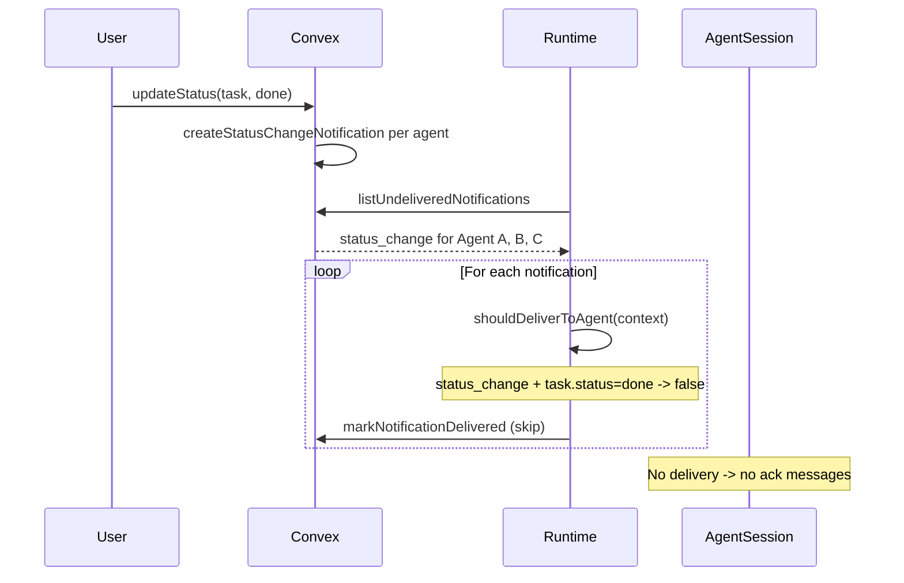

# Fix DONE Reply Loop and task_status / Endpoint Issues

## 1. Context and goal

When a user moves a task to **DONE**, every assigned agent receives a **status_change** notification. Each agent then posts a short "Acknowledged" reply, producing a flood of messages ("each agent acknowledged in a loop") and requiring the user to stop Docker. Separately, agents report **task_status tool not found in function set** and **HTTP endpoint (127.0.0.1:3000) connection refused**, so they cannot transition the task to DONE via tooling.

**Goals:**

- **Reply flood:** Stop delivering **status_change** notifications to agents when the task is already **done** (and optionally **blocked** for consistency with existing thread_update behavior).
- **Tool/endpoint:** Provide a clear, actionable plan so deployers can fix "task_status not in function set" and "connection refused" (env and gateway session routing; no code change required if env is correct).

**Constraints:** Multi-tenancy and existing delivery semantics for other notification types unchanged. No backend schema or new notification types.

---

## 2. Codebase research summary

**Files inspected:**

- [apps/runtime/src/delivery.ts](apps/runtime/src/delivery.ts) — `shouldDeliverToAgent()` skips **thread_update** when `task.status === "done"` or `"blocked"` to avoid reply loops; no handling for **status_change**. Delivery context includes `task` (current DB state at delivery time).
- [packages/backend/convex/lib/notifications.ts](packages/backend/convex/lib/notifications.ts) — `createStatusChangeNotification()` creates one notification per recipient (user/agent) when status changes (used from [packages/backend/convex/tasks.ts](packages/backend/convex/tasks.ts) on user-driven status update and from [packages/backend/convex/service/tasks.ts](packages/backend/convex/service/tasks.ts) when an agent updates status).
- [packages/backend/convex/service/notifications.ts](packages/backend/convex/service/notifications.ts) — `getForDelivery` returns `task` from DB at delivery time (so after a move to DONE, `task.status` is already `"done"`).
- [apps/runtime/src/gateway.ts](apps/runtime/src/gateway.ts) — Sends `tools` in the OpenResponses payload when provided; JSDoc states that if the gateway runs the request under a different session (e.g. main), the model will not see our tools ("tool not in function set").
- [apps/runtime/src/config.ts](apps/runtime/src/config.ts), [apps/runtime/README.md](apps/runtime/README.md), [apps/runtime/.env.example](apps/runtime/.env.example) — `TASK_STATUS_BASE_URL` defaults to `http://{HEALTH_HOST}:{HEALTH_PORT}` (e.g. `http://127.0.0.1:3000`). From inside the OpenClaw gateway container, 127.0.0.1 is the gateway, not the runtime, so the HTTP fallback fails unless set to a reachable URL (e.g. `http://runtime:3000`).

**Pattern to reuse:** The existing skip in `shouldDeliverToAgent` for `thread_update` + agent author when `taskStatus === "done" || taskStatus === "blocked"` ([delivery.ts](apps/runtime/src/delivery.ts) ~lines 416–419). We add a similar skip for **status_change** to agents when the task is already done (and optionally blocked).

---

## 3. High-level design

**Reply flood fix (runtime only):**

- In **shouldDeliverToAgent**: when `notification.type === "status_change"` and `recipientType` is effectively agent (we only deliver to agents in the delivery loop; the context has `context.agent`), and `context.task?.status === "done"` (and optionally `=== "blocked"`), return **false** so the notification is not delivered. The task in context is the current DB state, so after a user moves the task to DONE, each status_change notification is fetched with `task.status === "done"` and can be skipped for agents.
- Result: Moving a task to DONE no longer triggers any agent to receive a "Task status changed to done" notification, so no acknowledgment flood. User and other notification types unchanged.

**Tool / endpoint (operational):**

- **task_status tool not found:** The runtime already includes `task_status` in `tools` when `canModifyTaskStatus && hasTaskContext` ([delivery.ts](apps/runtime/src/delivery.ts) ~207–219, [agentTools.ts](apps/runtime/src/tooling/agentTools.ts) getToolCapabilitiesAndSchemas). The failure is likely (1) OpenClaw gateway running the request under a session that does not receive per-request tools (e.g. wrong session key), or (2) OpenClaw/Cloud Code Assist rejecting the tool schema (see OpenClaw troubleshooting: avoid unsupported JSON Schema keywords). Plan: document session routing and schema compatibility; no code change unless schema scrub is needed.
- **Connection refused (127.0.0.1:3000):** The prompt embeds `taskStatusBaseUrl`; default is loopback. From the gateway container, runtime is reachable at a different host (e.g. `http://runtime:3000`). Plan: document that deployers must set **TASK_STATUS_BASE_URL** to a URL the **gateway** can use to reach the runtime (e.g. in Docker Compose, `TASK_STATUS_BASE_URL=http://runtime:3000` for the runtime service; [docker-compose.runtime.yml](apps/runtime/docker-compose.runtime.yml) already sets this).

---

## 4. File and module changes

**Existing file to modify:**

- **[apps/runtime/src/delivery.ts](apps/runtime/src/delivery.ts)**
  - **shouldDeliverToAgent**: At the top of the function (after reading `notificationType`, `messageAuthorType`, `taskStatus`), add: if `notificationType === "status_change"` and `context.notification?.recipientType === "agent"` and (`taskStatus === "done"` or, optionally, `taskStatus === "blocked"`), return **false**. This prevents delivering "task status changed to done" (or blocked) to agents and stops the acknowledgment flood.
  - **JSDoc**: Update the comment above `shouldDeliverToAgent` to state that we also skip **status_change** notifications to agents when the task is DONE (and optionally BLOCKED) to avoid acknowledgment storms.

**Documentation (no code logic change):**

- **[apps/runtime/README.md](apps/runtime/README.md)** (or a dedicated troubleshooting section): Add or reinforce:
  - **"task_status tool not found in function set"**: Ensure the OpenClaw gateway runs the OpenResponses request in the **session** identified by `x-openclaw-session-key` so per-request tools are applied; if the gateway uses a different session (e.g. main), the model will not see the tools. Also ensure tool schemas are compatible (e.g. avoid unsupported JSON Schema keywords per OpenClaw docs).
  - **"HTTP endpoint (127.0.0.1:3000) connection refused"**: Set **TASK_STATUS_BASE_URL** to a URL the **gateway** can use to reach the runtime (e.g. `http://runtime:3000` when both run in Docker Compose). The default uses the runtime’s HEALTH_HOST/HEALTH_PORT (often 127.0.0.1:3000), which from inside the gateway container points at the gateway, not the runtime.

Optional: If you want full symmetry with thread_update, extend the skip to `taskStatus === "blocked"` for status_change as well (so "task status changed to blocked" is not delivered to agents).

---

## 5. Step-by-step tasks

1. **Runtime: skip status_change when task is done (and optionally blocked)**
   In [apps/runtime/src/delivery.ts](apps/runtime/src/delivery.ts), at the start of `shouldDeliverToAgent`, add a condition: if `notificationType === "status_change"` and `context.notification?.recipientType === "agent"` and `taskStatus === "done"` (and optionally `taskStatus === "blocked"`), return `false`. Use the existing `taskStatus` variable already derived from `context.task?.status`.
2. **Runtime: update JSDoc for shouldDeliverToAgent**
   In the same file, update the JSDoc above `shouldDeliverToAgent` to state that delivery is also skipped for **status_change** notifications to agents when the task is DONE (and BLOCKED if you added that branch).
3. **Docs: task_status and HTTP fallback troubleshooting**
   In [apps/runtime/README.md](apps/runtime/README.md), add or expand a short section (e.g. under existing troubleshooting) that explains: (1) "task_status tool not found" → check gateway session routing and tool schema compatibility; (2) "connection refused" for task-status HTTP fallback → set TASK_STATUS_BASE_URL to a URL the gateway can reach (e.g. `http://runtime:3000` in Docker).
4. **Manual QA**
   Move a task to DONE and confirm no agent receives a status_change notification and no flood of acknowledgments. Optionally move to BLOCKED and confirm the same if you added the blocked branch. Verify task_status and HTTP fallback when TASK_STATUS_BASE_URL and gateway session are correctly configured.

---

## 6. Edge cases and risks

- **User recipients:** The change only skips delivery in the runtime for **agent** recipients; status_change notifications for **users** are not delivered by the runtime (only agent notifications are polled). So no change to user notification behavior.
- **Agent moves task to done:** When an agent calls the task_status tool and moves the task to DONE, the backend creates status_change notifications for other agents ([service/tasks.ts](packages/backend/convex/service/tasks.ts)). Those will now be skipped by shouldDeliverToAgent because task.status is already "done". That is desired: no need for other agents to be notified "task changed to done" and reply.
- **Stale context:** getForDelivery loads task from DB at delivery time, so task.status is current; no race.
- **Risk:** None identified; change is additive and scoped to status_change + agent + done (and optionally blocked).

---

## 7. Testing strategy

- **Manual QA (required)**
  - Move a task (with multiple assigned agents) to DONE → confirm no agent posts an acknowledgment; confirm in Convex or logs that status_change notifications are marked delivered without being sent to OpenClaw.
  - If blocked is included: move task to BLOCKED → same check.
  - With correct TASK_STATUS_BASE_URL and gateway session: confirm an agent can transition task to DONE via task_status tool or HTTP fallback.
- **Unit tests (optional)**
  - If [apps/runtime/src/delivery.test.ts](apps/runtime/src/delivery.test.ts) or similar tests exist for `shouldDeliverToAgent`, add cases: `notificationType === "status_change"`, `recipientType === "agent"`, `task.status === "done"` → expected `false`; same for `task.status === "blocked"` if implemented.

---

## 8. Rollout / migration

- No migration or feature flags. Deploy runtime; new behavior applies immediately.
- Recommend deployers set TASK_STATUS_BASE_URL and verify gateway session routing for task_status/HTTP fallback (documented in README).

---

## 9. TODO checklist

- In [apps/runtime/src/delivery.ts](apps/runtime/src/delivery.ts), add early return in `shouldDeliverToAgent`: when `notificationType === "status_change"`, `context.notification?.recipientType === "agent"`, and `taskStatus === "done"` (and optionally `taskStatus === "blocked"`), return `false`.
- Update JSDoc of `shouldDeliverToAgent` to mention skipping status_change to agents when task is DONE (and BLOCKED if applicable).
- In [apps/runtime/README.md](apps/runtime/README.md), add or expand troubleshooting for "task_status tool not found" (session routing, schema) and "HTTP endpoint connection refused" (TASK_STATUS_BASE_URL).
- Manual QA: task → DONE (and optionally BLOCKED); verify no agent acks and, where applicable, task_status/HTTP fallback works with correct env.
