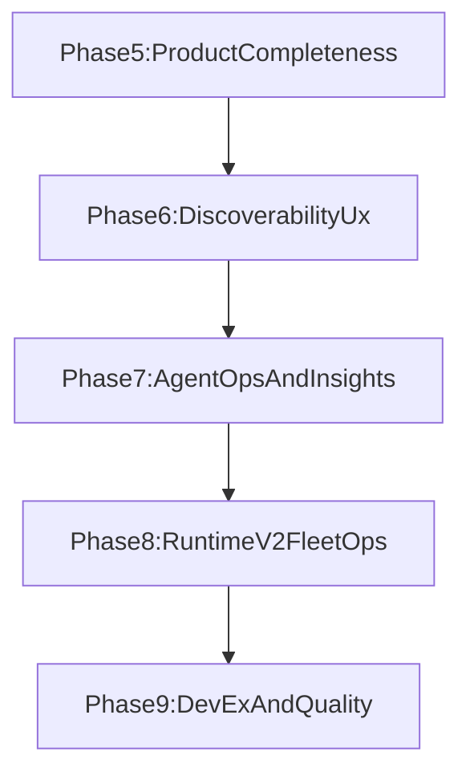

# OpenClaw Mission Control Improvements v2 Plan

## 1. Context & goal

We will create a new post‑v1 orchestrator and a comprehensive, phased set of improvements that build on the existing Next.js + Convex + OpenClaw architecture while closing known gaps, improving UX, and adding runtime fleet operations. The plan integrates upstream inspiration, local roadmap docs, and current code realities, and it explains the value of each improvement.

Assumptions:

- V1 core phases are complete and the current architecture (multi‑tenant, Clerk auth, per‑account runtime) remains unchanged.
- Existing patterns (`requireAccountMember`, `logActivity`, service‑only auth) remain the baseline.
- We will extend current surfaces rather than re‑implement already‑working features.

Constraints:

- Must preserve strict multi‑tenancy and audit trail requirements.
- TypeScript strict, Convex naming/indexing, and realtime UI patterns are mandatory.
- Runtime operations must be idempotent and observable.

## 2. Codebase research summary

Files and sources inspected:

- Core docs: [docs/concept/openclaw-mission-control-initial-article.md](docs/concept/openclaw-mission-control-initial-article.md), [docs/concept/openclaw-mission-control-cursor-core-instructions.md](docs/concept/openclaw-mission-control-cursor-core-instructions.md)
- Orchestration and roadmap: [docs/build/00-orchestrator.md](docs/build/00-orchestrator.md), [docs/roadmap/missing-features.md](docs/roadmap/missing-features.md), [docs/roadmap/runtime-version-management-v2.md](docs/roadmap/runtime-version-management-v2.md)
- Prior plans: [.cursor/plans/mission_control_improvements_b9b1535e.plan.md](.cursor/plans/mission_control_improvements_b9b1535e.plan.md), [.cursor/plans/mission_control_improvements_99670ff4.plan.md](.cursor/plans/mission_control_improvements_99670ff4.plan.md)
- Backend: [packages/backend/convex/schema.ts](packages/backend/convex/schema.ts), [packages/backend/convex/documents.ts](packages/backend/convex/documents.ts), [packages/backend/convex/notifications.ts](packages/backend/convex/notifications.ts), [packages/backend/convex/memberships.ts](packages/backend/convex/memberships.ts), [packages/backend/convex/tasks.ts](packages/backend/convex/tasks.ts), [packages/backend/convex/messages.ts](packages/backend/convex/messages.ts), [packages/backend/convex/lib/notifications.ts](packages/backend/convex/lib/notifications.ts), [packages/backend/convex/accounts.ts](packages/backend/convex/accounts.ts)
- Frontend: [apps/web/src/app/(dashboard)/[accountSlug]/settings/page.tsx](apps/web/src/app/(dashboard)/[accountSlug]/settings/page.tsx), [apps/web/src/app/(dashboard)/[accountSlug]/notifications/page.tsx](apps/web/src/app/(dashboard)/[accountSlug]/notifications/page.tsx), [apps/web/src/app/(dashboard)/[accountSlug]/docs/page.tsx](apps/web/src/app/(dashboard)/[accountSlug]/docs/page.tsx), [apps/web/src/app/(dashboard)/[accountSlug]/feed/page.tsx](apps/web/src/app/(dashboard)/[accountSlug]/feed/page.tsx), [apps/web/src/app/(dashboard)/[accountSlug]/admin/openclaw/page.tsx](apps/web/src/app/(dashboard)/[accountSlug]/admin/openclaw/page.tsx)
- Shared types: [packages/shared/src/types/index.ts](packages/shared/src/types/index.ts)
- Upstream reference: [https://github.com/manish-raana/openclaw-mission-control](https://github.com/manish-raana/openclaw-mission-control)

Key findings to reuse or adjust:

- Settings General/Members/Notifications are wired; Appearance/Billing are stubs.
- Documents backend is feature‑complete; the Docs UI is missing edit/duplicate/link/upload wiring.
- Notifications schema uses `body` + `readAt`; frontend uses these correctly but has a type mismatch with shared notification types.
- Notification triggers exist for tasks/messages; membership change notifications and preference enforcement are missing.
- OpenClaw admin page exists but uses local state and stubbed actions.
- Upstream repo has useful UX touches: header stats, activity feed filters, compact roster, task visual cues, seed script.

## 3. High‑level design

We will add a new orchestrator that defines post‑v1 phases and concrete modules. Each phase delivers clear value:

- Phase 5: Product completeness and workflow gaps (ensures core SaaS expectations are met).
- Phase 6: Discoverability and UX polish (faster navigation, clearer visibility).
- Phase 7: Agent operations and insights (observability, accountability).
- Phase 8: Runtime v2 and fleet operations (safe upgrades, reliability).
- Phase 9: DevEx and quality (repeatable onboarding, regressions prevented).

Mermaid view of phase dependencies:

Architectural fit:

- Frontend improvements stay within the Next.js App Router and reuse existing `components/` structure.
- Backend improvements use Convex queries/mutations with existing auth guards and activity logging.
- Runtime v2 is introduced as an additive system (new tables + orchestration service), gated behind feature flags.

## 4. File & module changes

### Orchestration and phase docs (new)

- [docs/build/01-orchestrator-v2.md](docs/build/01-orchestrator-v2.md): new post‑v1 orchestrator that defines phases 5–9 and their reviewer modules; value: clear execution control for the next roadmap.
- [docs/build/phase-5-product-completeness/](docs/build/phase-5-product-completeness/): modules for notifications alignment, preferences, membership notifications, docs UI wiring, settings appearance/billing decisions.
- [docs/build/phase-6-discoverability-ux/](docs/build/phase-6-discoverability-ux/): modules for search, feed filters, header stats/clock, task/agent visual cues, empty/loading states.
- [docs/build/phase-7-agent-ops-insights/](docs/build/phase-7-agent-ops-insights/): modules for agent detail page, analytics dashboard, daily standup job, runtime status surfaces.
- [docs/build/phase-8-runtime-v2/](docs/build/phase-8-runtime-v2/): modules for runtimes table, upgrade orchestration service, fleet admin UI, self‑upgrade, monitoring.
- [docs/build/phase-9-devex-quality/](docs/build/phase-9-devex-quality/): modules for seed script, tests, AGENTS/HEARTBEAT/SOUL docs, optional tooling improvements.

### Backend (Convex)

- [packages/backend/convex/lib/notifications.ts](packages/backend/convex/lib/notifications.ts): enforce `account.settings.notificationPreferences` before creating notifications; add helpers for membership change notifications; value: reduce noise, respect user settings.
- [packages/backend/convex/memberships.ts](packages/backend/convex/memberships.ts): create notifications on member add/remove/role change; value: improve team awareness and auditability.
- [packages/backend/convex/notifications.ts](packages/backend/convex/notifications.ts): add type filter/pagination support and metadata for deep links; value: scalable notifications UI.
- [packages/backend/convex/documents.ts](packages/backend/convex/documents.ts): add any missing queries for version history or file uploads (if chosen); value: richer doc workflows without new tables.
- [packages/backend/convex/search.ts](packages/backend/convex/search.ts) (new): global search queries/actions with indexed filters; value: cross‑surface discoverability.
- [packages/backend/convex/schema.ts](packages/backend/convex/schema.ts): add `invitations` and `runtimes` tables plus needed indexes; value: team onboarding and runtime fleet ops.
- [packages/backend/convex/actions/standup.ts](packages/backend/convex/actions/standup.ts) (new): scheduled standup summary; value: lightweight accountability.
- [packages/shared/src/types/index.ts](packages/shared/src/types/index.ts): align `NotificationType` and add shared search/analytics result types; value: type‑safe UI/Convex alignment.

### Frontend (Next.js)

- [apps/web/src/app/(dashboard)/[accountSlug]/notifications/page.tsx](apps/web/src/app/(dashboard)/[accountSlug]/notifications/page.tsx): align notification types with shared types; add filters, pagination, and deep links; value: accurate and scalable notifications UX.
- [apps/web/src/app/(dashboard)/[accountSlug]/settings/page.tsx](apps/web/src/app/(dashboard)/[accountSlug]/settings/page.tsx): wire Appearance to `account.settings.theme` and decide Billing behavior (feature flag or stub removal); value: complete settings experience.
- [apps/web/src/app/(dashboard)/[accountSlug]/docs/page.tsx](apps/web/src/app/(dashboard)/[accountSlug]/docs/page.tsx): add edit, duplicate, link‑to‑task, and optional upload UI; value: full document workflows.
- [apps/web/src/app/(dashboard)/[accountSlug]/feed/page.tsx](apps/web/src/app/(dashboard)/[accountSlug]/feed/page.tsx): add activity filters and type grouping; value: faster audit scanning.
- [apps/web/src/app/(dashboard)/[accountSlug]/admin/openclaw/page.tsx](apps/web/src/app/(dashboard)/[accountSlug]/admin/openclaw/page.tsx): replace local state with Convex‑backed runtime config and actions (restart, upgrade, rate limits); value: real runtime control.
- New routes:
  - [apps/web/src/app/(dashboard)/[accountSlug]/search/page.tsx](apps/web/src/app/(dashboard)/[accountSlug]/search/page.tsx)
  - [apps/web/src/app/(dashboard)/[accountSlug]/agents/[agentId]/page.tsx](apps/web/src/app/(dashboard)/[accountSlug]/agents/[agentId]/page.tsx)
  - [apps/web/src/app/(dashboard)/[accountSlug]/analytics/page.tsx](apps/web/src/app/(dashboard)/[accountSlug]/analytics/page.tsx)
  - [apps/web/src/app/(dashboard)/[accountSlug]/profile/page.tsx](apps/web/src/app/(dashboard)/[accountSlug]/profile/page.tsx)
- New components (examples, adjust to existing structure):
  - [apps/web/src/components/notifications/NotificationFilters.tsx](apps/web/src/components/notifications/NotificationFilters.tsx)
  - [apps/web/src/components/dashboard/DashboardStats.tsx](apps/web/src/components/dashboard/DashboardStats.tsx)
  - [apps/web/src/components/dashboard/LiveClock.tsx](apps/web/src/components/dashboard/LiveClock.tsx)
  - [apps/web/src/components/feed/ActivityFilters.tsx](apps/web/src/components/feed/ActivityFilters.tsx)
  - [apps/web/src/components/tasks/TaskCard.tsx](apps/web/src/components/tasks/TaskCard.tsx) (visual cues)
  - [apps/web/src/components/agents/AgentCard.tsx](apps/web/src/components/agents/AgentCard.tsx) (status badges)

### Runtime and ops

- [apps/runtime/src/heartbeat.ts](apps/runtime/src/heartbeat.ts): staggered heartbeat scheduling; value: reduce thundering herd and cost.
- [apps/runtime/src/self-upgrade.ts](apps/runtime/src/self-upgrade.ts) (new): optional self‑upgrade hook for runtime v2; value: safer upgrades.
- [apps/runtime/src/health.ts](apps/runtime/src/health.ts): export richer metrics used by fleet monitoring UI.

### DevEx and docs

- [packages/backend/convex/seed.ts](packages/backend/convex/seed.ts): demo data for accounts/agents/tasks/messages; value: fast onboarding and QA.
- [docs/AGENTS.md](docs/AGENTS.md), [docs/HEARTBEAT.md](docs/HEARTBEAT.md), [docs/SOUL_TEMPLATE.md](docs/SOUL_TEMPLATE.md): extracted from core instructions; value: consistent agent operations.

## 5. Step‑by‑step tasks

1. Draft [docs/build/01-orchestrator-v2.md](docs/build/01-orchestrator-v2.md) with phases 5–9, module names, and reviewer steps aligned to [docs/build/00-orchestrator.md](docs/build/00-orchestrator.md).
2. Add phase folders and module plan stubs for phases 5–9 (one module per major improvement), referencing the same execution protocol.
3. Align notification types: update [packages/shared/src/types/index.ts](packages/shared/src/types/index.ts), adjust [apps/web/src/app/(dashboard)/[accountSlug]/notifications/page.tsx](apps/web/src/app/(dashboard)/[accountSlug]/notifications/page.tsx), and ensure backend types remain the source of truth.
4. Add membership notifications in [packages/backend/convex/memberships.ts](packages/backend/convex/memberships.ts) and preference enforcement in [packages/backend/convex/lib/notifications.ts](packages/backend/convex/lib/notifications.ts).
5. Extend notifications UI for filters/pagination/deep links, using data from [packages/backend/convex/notifications.ts](packages/backend/convex/notifications.ts).
6. Wire Docs UI to existing backend features: edit/update, duplicate, link‑to‑task, and optionally upload.
7. Implement Appearance settings in [apps/web/src/app/(dashboard)/[accountSlug]/settings/page.tsx](apps/web/src/app/(dashboard)/[accountSlug]/settings/page.tsx) and connect to [apps/web/src/components/providers/ThemeProvider.tsx](apps/web/src/components/providers/ThemeProvider.tsx).
8. Add invitations (schema + mutations) and wire Members UI to invite‑by‑email (if desired beyond current Clerk‑user invites).
9. Add global search endpoint(s) and the search page, reusing indexed Convex queries.
10. Add activity feed filters and refine [apps/web/src/components/feed/ActivityItem.tsx](apps/web/src/components/feed/ActivityItem.tsx) rendering for all activity types.
11. Add dashboard header stats + live clock, and optional task/agent visual cues to improve at‑a‑glance status.
12. Build agent detail page and analytics dashboard, reusing activities/tasks/agents data and adding aggregate queries as needed.
13. Wire OpenClaw admin UI to actual runtime config and actions; add runtime status surfaces in the main dashboard.
14. Implement daily standup summary (scheduled Convex action) and a surface to view it (doc or feed item).
15. Start Runtime v2: add `runtimes` and `systemConfig` tables, migrate existing runtime config, and add fleet queries.
16. Implement upgrade orchestration service and admin fleet UI (canary/rolling/rollback), gated behind feature flag.
17. Add self‑upgrade support in runtime and extend monitoring/alerts.
18. Add seed script and minimal E2E coverage for the core workflow.
19. Add AGENTS/HEARTBEAT/SOUL docs and update CONTRIBUTING if needed.

## 6. Edge cases & risks

- Notification preference enforcement must not suppress critical system alerts; add an override type for mandatory notifications.
- Membership notifications must respect role/visibility and avoid leaking data across accounts.
- Search queries must be indexed and bounded to avoid full scans and slow requests.
- Runtime v2 migration requires careful data backfill from `accounts.runtimeConfig` to `runtimes` without downtime.
- Upgrade orchestration must be idempotent and protected by admin role checks; failure paths must rollback safely.
- Docs upload/versioning require storage limits and file type validation.

## 7. Testing strategy

- Unit: notification preference logic, membership notification generation, search filters, status transitions.
- Integration: task assignment → notification; membership add → notification; docs update/duplicate; runtime status update surfaced in UI.
- E2E (new): sign in → create task → assign → notification appears → feed updates; openclaw admin page reads runtime status.
- Manual QA: settings appearance toggle, docs edit/duplicate, search results, agent detail stats, analytics charts.

## 8. Rollout / migration

- Feature flags for Runtime v2 admin UI and upgrade orchestration.
- Data migration script: backfill `runtimes` from existing account runtime config and keep dual‑write until stable.
- Gradual rollout: enable search and feed filters first; runtime v2 after canary validation.
- Observability: log notification drops due to preferences; track runtime upgrade success rates.

## 9. TODO checklist

**Backend**

- Align `NotificationType` across schema, shared types, and UI mapping.
- Add membership notifications and preference enforcement in `lib/notifications`.
- Add search queries/actions and necessary indexes.
- Add invitations and runtimes tables plus migrations.
- Add standup summary action and storage.

**Frontend**

- Improve notifications page (type mapping, filters, pagination, deep links).
- Wire docs UI to edit/duplicate/link/upload features.
- Implement appearance settings and theme persistence.
- Add search, agent detail, analytics, and profile routes.
- Add activity feed filters, header stats, clock, and visual cues.
- Wire OpenClaw admin UI to backend runtime config/actions.

**Runtime**

- Add staggered heartbeat scheduling.
- Implement self‑upgrade hook for Runtime v2.
- Emit richer health metrics for fleet dashboards.

**Docs / Orchestration**

- Create orchestrator v2 and phase module docs.
- Add AGENTS/HEARTBEAT/SOUL docs for operators and agents.

**Tests / QA**

- Add unit tests for notification and search logic.
- Add E2E test for core task → notification workflow.
- Define manual QA checklist for new pages and runtime controls.

