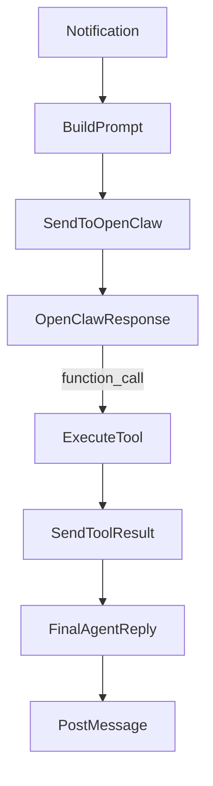

# OpenClaw Tooled Task Status Plan

## 1. Context & goal

The task loop happened because agents stated “done” in thread messages but did not actually update task status. OpenClaw docs say tools are only callable if they appear in both the system prompt and tool schema. The goal is to expose a `task_status` tool via the OpenResponses `tools` schema, execute it in the runtime, and keep prompts/docs aligned so agents can reliably close tasks. This plan adds proper tool wiring and still keeps the HTTP endpoint as a manual fallback.

Key constraints:

- OpenClaw uses `POST /v1/responses` (OpenResponses API) and supports client-side function tools.
- Tool calls must be executed by the runtime, with results sent back as `function_call_output`.
- Only agents with `canModifyTaskStatus` should get the tool.

## 2. Codebase research summary

Main files inspected:

- [apps/runtime/src/delivery.ts](apps/runtime/src/delivery.ts): builds the notification prompt sent to OpenClaw.
- [apps/runtime/src/gateway.ts](apps/runtime/src/gateway.ts): sends messages to `/v1/responses`, parses response text only.
- [apps/runtime/src/health.ts](apps/runtime/src/health.ts): implements `/agent/task-status` HTTP endpoint.
- [packages/backend/convex/service/actions.ts](packages/backend/convex/service/actions.ts): includes `updateTaskStatusFromAgent` action.
- [packages/backend/convex/service/notifications.ts](packages/backend/convex/service/notifications.ts): returns `context.agent`, `context.task`, etc.
- [docs/runtime/AGENTS.md](docs/runtime/AGENTS.md) and [packages/backend/convex/seed.ts](packages/backend/convex/seed.ts): agent instructions and seeded docs.

Patterns to follow:

- Runtime uses Convex service actions for privileged operations.
- Delivery pipeline can access `context.agent` and `context.task`.
- OpenResponses API supports `tools` and `function_call_output` (from OpenClaw docs).

## 3. High-level design

Use OpenResponses client-side tools for task status updates:

1. Delivery constructs the notification prompt and includes **Task ID**.
2. `sendToOpenClaw` attaches a `task_status` tool schema **only** when:

- A task is present, and
- `context.agent.openclawConfig.behaviorFlags.canModifyTaskStatus` is `true`.

1. If OpenClaw returns a `function_call` item for `task_status`, the runtime executes:

- `api.service.actions.updateTaskStatusFromAgent` with `agentId`, `taskId`, `status`, `blockedReason`.

1. Runtime sends a follow-up request with `function_call_output` to let the agent finish its final message.
2. Final agent reply is posted into the task thread as usual.

Mermaid data flow:

## 4. File & module changes

### [apps/runtime/src/delivery.ts](apps/runtime/src/delivery.ts)

- Ensure `Task ID: <task._id>` is included in the prompt when a task exists.
- When calling `sendToOpenClaw`, pass `tools` + `toolChoice` **only** if agent has `canModifyTaskStatus` and `context.task` exists.

### [apps/runtime/src/gateway.ts](apps/runtime/src/gateway.ts)

- Extend `sendToOpenClaw` to accept optional `tools` and `toolChoice` fields.
- Update request body to include `tools` and `tool_choice` per OpenResponses spec.
- Add parsing for `function_call` items in the response (not just `output_text`).
- Return a structured result: `{ text?: string; toolCalls?: ToolCall[] }` instead of only string.

### [apps/runtime/src/tooling/taskStatusTool.ts](apps/runtime/src/tooling/taskStatusTool.ts)

- New helper to execute `task_status` tool calls:
  - Validate `status` is one of `in_progress|review|done|blocked`.
  - Validate `blockedReason` when status is `blocked`.
  - Call `api.service.actions.updateTaskStatusFromAgent` with runtime `serviceToken` + `accountId`.
- Return output `{ success: true }` or `{ success: false, error: "..." }` to send back as `function_call_output`.

### [apps/runtime/src/delivery.ts](apps/runtime/src/delivery.ts)

- After initial OpenClaw response:
  - If tool call(s) exist, execute them and send `function_call_output` in a second `/v1/responses` call.
  - Post the **final** agent message after tool completion.

### [docs/runtime/AGENTS.md](docs/runtime/AGENTS.md)

- Update wording: status changes should use the `task_status` tool (now schema-enabled), not only HTTP instructions.

### [packages/backend/convex/seed.ts](packages/backend/convex/seed.ts)

- Keep seeded AGENTS doc aligned with the new tool usage description.
- Ensure squad-lead SOUL mentions the tool explicitly.

## 5. Step-by-step tasks

1. **Define tool schema** in `apps/runtime/src/gateway.ts` (or shared helper) with OpenResponses format:

- `name: "task_status"`
- `parameters`: JSON schema with `taskId`, `status`, `blockedReason`.

1. **Update sendToOpenClaw signature** to accept `tools` and `toolChoice`.
2. **Update delivery pipeline** to pass `tools` only when agent has `canModifyTaskStatus` and task exists.
3. **Parse tool calls** from OpenResponses output:

- Detect `output` items with `type: "function_call"`.
- Extract `call_id`, `name`, `arguments`.

1. **Execute tool calls** via a new helper (task status tool) using Convex `updateTaskStatusFromAgent`.
2. **Send function_call_output** back to OpenClaw in a follow-up request and parse the final text.
3. **Update docs** (`docs/runtime/AGENTS.md`, seed content in `seed.ts`) to reflect tool usage.
4. **Manual QA** (see testing section).

## 6. Edge cases & risks

- **Missing task ID**: ensure prompt always includes Task ID; tool call requires it.
- **Invalid status transitions**: Convex mutation already validates; return error in tool output and allow agent to explain.
- **Multiple tool calls**: handle first tool call only (or execute sequentially); document behavior.
- **Tool allowed when flag disabled**: do not attach tools when `canModifyTaskStatus` is false; return error if somehow called.
- **Retry loop risk**: ensure notification is marked delivered after final response; avoid posting intermediary tool errors as separate messages.

## 7. Testing strategy

- **Manual QA** (required):
  - Task in `review` → agent uses tool call → task transitions to `done` → final summary posted.
  - Task in `review` with agent lacking `canModifyTaskStatus` → tool not offered; agent posts “blocked” note.
  - `blocked` status tool call without `blockedReason` → tool returns error; agent posts failure message.
- **Optional unit tests** (if runtime test harness is added):
  - Parsing `function_call` output items.
  - Tool execution error handling.

## 8. Rollout / migration

- No data migrations required.
- Keep `/agent/task-status` endpoint as a fallback for manual calls.
- Deploy runtime changes first so tool calls work; then update docs/seed.

## 9. TODO checklist

- Backend / Runtime: add `task_status` tool schema in `apps/runtime/src/gateway.ts`
- Backend / Runtime: parse `function_call` items and return structured result
- Backend / Runtime: implement `task_status` executor helper and call Convex service action
- Backend / Runtime: send `function_call_output` follow-up and post final message
- Runtime: pass tools only when `canModifyTaskStatus` is true and task exists
- Docs: update `docs/runtime/AGENTS.md` to prefer tool usage
- Docs: update `packages/backend/convex/seed.ts` AGENTS content + squad lead SOUL
- Manual QA: review → done via tool call; blocked validation; no tool when flag disabled
