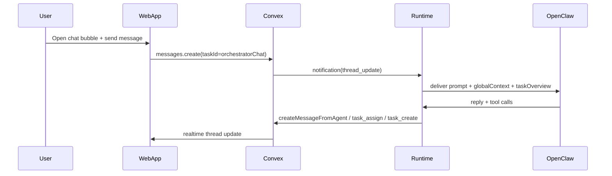

# Orchestrator Chat + Whole Context

## 1. Context & goal

We want an in‑app chat bubble that lets any account member talk to the orchestrator, brainstorm at a project level, and have the orchestrator create tasks, assign agents, and post updates to existing tasks. The orchestrator must have whole‑project awareness without relying on external channels. Constraints: multi‑tenancy (accountId everywhere), no full table scans, OpenClaw session routing via runtime, and minimal UI disruption. The solution should reuse the existing task thread + notification delivery pipeline and add controlled, orchestrator‑only tools for task assignment and context retrieval.

Acceptance criteria:

- A persistent chat entry in the web app opens an “Orchestrator Chat” thread.
- Messages in that thread notify the orchestrator agent and produce replies in the same thread.
- The orchestrator can create tasks with assignees and assign agents to existing tasks via a new tool.
- The orchestrator can fetch task context and post messages to other tasks from the chat.
- The prompt for orchestrator chat includes a global briefing doc plus a compact task overview snapshot.

## 2. Codebase research summary

Main files and patterns inspected:

- `[apps/web/src/components/tasks/TaskThread.tsx](apps/web/src/components/tasks/TaskThread.tsx)` + `[apps/web/src/components/tasks/MessageInput.tsx](apps/web/src/components/tasks/MessageInput.tsx)`: existing thread UI and message creation/mentions.
- `[apps/web/src/components/tasks/TaskDetailSheet.tsx](apps/web/src/components/tasks/TaskDetailSheet.tsx)`: Sheet pattern for slide‑over panels.
- `[apps/web/src/app/(dashboard)/[accountSlug]/layout.tsx](<apps/web/src/app/(dashboard)`/[accountSlug]/layout.tsx>): account‑scoped layout suitable for global UI overlay.
- `[apps/runtime/src/delivery.ts](apps/runtime/src/delivery.ts)`: notification prompt construction and tool capability injection.
- `[apps/runtime/src/tooling/agentTools.ts](apps/runtime/src/tooling/agentTools.ts)`: tool schemas and execution dispatcher.
- `[packages/backend/convex/service/notifications.ts](packages/backend/convex/service/notifications.ts)`: delivery context composition and repository doc injection.
- `[packages/backend/convex/tasks.ts](packages/backend/convex/tasks.ts)`: task assignment mutation (user‑facing).
- `[packages/backend/convex/service/actions.ts](packages/backend/convex/service/actions.ts)`: service actions used by runtime.
- `[packages/backend/convex/schema.ts](packages/backend/convex/schema.ts)` + `[packages/backend/convex/accounts.ts](packages/backend/convex/accounts.ts)`: account settings storage and validation.

Key reuse points:

- Use the existing task thread + notification pipeline to route orchestrator chat.
- Reuse `tasks.assign` logic in a service‑only mutation for agent tools.
- Inject global context via `service/notifications.getForDelivery` (already used for repository doc).

## 3. High‑level design

We will model orchestrator chat as a dedicated system task (“Orchestrator Chat”) whose id is stored in account settings. The chat bubble opens a Sheet panel that renders `TaskThread` for that task. When a user posts, the existing mention/subscription notification flow delivers a prompt to the orchestrator session. For whole‑context awareness, the delivery context is extended to include (a) a global briefing document and (b) a compact task overview snapshot, injected only for the orchestrator chat task.

We add orchestrator‑only runtime tools:

- `task_assign` (assign agents to existing tasks by slug).
- `task_message` (post a message to another task).
- `task_list`/`task_get`/`task_thread` (retrieve task and thread context on demand).
- Extend `task_create` to accept assignee slugs at creation time.

Mermaid flow:

## 4. File & module changes

### Backend (Convex)

- `[packages/backend/convex/schema.ts](packages/backend/convex/schema.ts)`
  - Add `orchestratorChatTaskId: v.optional(v.id("tasks"))` under `accounts.settings`.
- `[packages/backend/convex/accounts.ts](packages/backend/convex/accounts.ts)`
  - Extend `accountSettingsValidator` and `update` to accept `orchestratorChatTaskId` and validate account ownership.
- `[packages/backend/convex/tasks.ts](packages/backend/convex/tasks.ts)`
  - Add `getOrCreateOrchestratorChat` mutation: create system task if missing, set label `system:orchestrator-chat`, ensure subscriptions, and persist task id into account settings.
- `[packages/backend/convex/service/notifications.ts](packages/backend/convex/service/notifications.ts)`
  - Extend `GetForDeliveryResult` with `globalBriefingDoc` and `taskOverview` fields.
  - Fetch “Account Briefing” reference document (type `reference`, title match) and include in context.
  - If notification taskId matches `orchestratorChatTaskId`, compute a compact overview (counts + top N tasks per status, truncated).
- `[packages/backend/convex/service/actions.ts](packages/backend/convex/service/actions.ts)`
  - Add service actions for `assignTaskFromAgent`, `listTasksForAgentTool`, `getTaskForAgentTool`, `listTaskThreadForAgentTool` (all service‑token gated).
- `[packages/backend/convex/service/tasks.ts](packages/backend/convex/service/tasks.ts)`
  - Add internal mutation `assignFromAgent` reusing logic from `tasks.assign` (agent‑initiated).
  - Add internal queries for `listForTool` (filters: status, assignee, limit) and `getForTool`.
- `[packages/backend/convex/service/messages.ts](packages/backend/convex/service/messages.ts)`
  - Add internal query to list thread messages for a task with minimal author info for tool use.

### Runtime

- `[apps/runtime/src/tooling/agentTools.ts](apps/runtime/src/tooling/agentTools.ts)`
  - Add tool schemas: `task_assign`, `task_message`, `task_list`, `task_get`, `task_thread`.
  - Extend `executeAgentTool` to call new service actions.
  - Gate new tools to orchestrator only (by checking `DeliveryContext.orchestratorAgentId`).
  - Extend `TASK_CREATE_TOOL_SCHEMA` to accept `assigneeSlugs` (array of strings).
- `[apps/runtime/src/delivery.ts](apps/runtime/src/delivery.ts)`
  - Extend `DeliveryContext` to include `globalBriefingDoc` and `taskOverview`.
  - Inject new sections in `formatNotificationMessage()` for orchestrator chat:
    - “Global Context” (briefing doc)
    - “Task Overview” (summary snapshot)
  - Add tool usage instructions for `task_assign`, `task_message`, and `task_list/task_thread`.

### Web App

- `[apps/web/src/app/(dashboard)/[accountSlug]/layout.tsx](<apps/web/src/app/(dashboard)`/[accountSlug]/layout.tsx>)
  - Mount a new `OrchestratorChat` component as a fixed overlay.
- New UI components (example locations):
  - `[apps/web/src/components/orchestrator/OrchestratorChat.tsx](apps/web/src/components/orchestrator/OrchestratorChat.tsx)`
    - Floating chat bubble + `Sheet` panel.
  - `[apps/web/src/components/orchestrator/OrchestratorChatPanel.tsx](apps/web/src/components/orchestrator/OrchestratorChatPanel.tsx)`
    - Renders `TaskThread` for the orchestrator chat task id.
- `[apps/web/src/lib/hooks/useOrchestratorChat.ts](apps/web/src/lib/hooks/useOrchestratorChat.ts)`
  - Fetch or create chat task via `api.tasks.getOrCreateOrchestratorChat` and handle loading/empty states.

## 5. Step‑by‑step tasks

1. **Schema + settings**: add `orchestratorChatTaskId` to account settings schema and validator; regenerate Convex types.
2. **Orchestrator chat task**: implement `tasks.getOrCreateOrchestratorChat`, label it, subscribe orchestrator, and persist id to account settings.
3. **Global context injection**: update `service/notifications.getForDelivery` to attach briefing doc and task overview for chat notifications.
4. **Tooling backend**: add service actions and internal queries/mutations for task lookup, thread fetch, assignment from agent.
5. **Runtime tools**: add tool schemas + execution logic; extend `task_create` to accept assignees.
6. **Prompt updates**: extend `formatNotificationMessage` with “Global Context” and “Task Overview” sections and new tool instructions.
7. **Web UI**: add orchestrator chat bubble/Sheet and use `TaskThread` against chat task id.
8. **Docs UX** (optional but recommended): add a quick link in Docs to “Account Briefing” reference doc.
9. **Tests + QA**: add unit tests for prompt rendering + tool execution; run lint/typecheck.

## 6. Edge cases & risks

- Orchestrator not configured: chat bubble should show a “Set orchestrator” prompt and disable input.
- Chat task deleted or missing: recreate on demand and repair settings.
- Prompt size: task overview must be capped (top N per status, truncated descriptions).
- Duplicate assignments: `task_assign` should be idempotent when assignee already present.
- Task status transitions: assigning agents should follow existing auto‑transition rules.
- Mention gating: `task_message` must respect `canMentionAgents` for agent mentions.

## 7. Testing strategy

- **Unit tests**
  - `apps/runtime/src/delivery.test.ts`: verify global context + task overview sections render only for orchestrator chat.
  - `apps/runtime/src/tooling/agentTools` (new or existing tests): validate tool schemas + execution routing.
  - `packages/backend/convex/service/tasks.ts`: assignment behavior (auto status transitions, notifications).
- **Integration**
  - Simulate orchestrator chat message → notification → OpenClaw reply → message created.
- **Manual QA**
  - Open chat bubble, send message, see orchestrator reply.
  - Ask orchestrator to create task with assignees; verify assignments + notifications.
  - Ask orchestrator to summarize in‑progress tasks; verify tools can fetch task/threads.

## 8. Rollout / migration

- Backward compatible schema changes (new optional settings field).
- Chat task is created lazily when first used.
- No data migration required.
- Monitor runtime prompt size and OpenClaw response time after enabling task overview.

## 9. TODO checklist

- Add `orchestratorChatTaskId` to account settings schema and validators.
- Implement `tasks.getOrCreateOrchestratorChat` mutation and label handling.
- Extend delivery context with briefing doc + task overview in `service/notifications.getForDelivery`.
- Add service actions + internal queries for task list/get/thread and agent assignment.
- Add runtime tools (`task_assign`, `task_message`, `task_list`, `task_get`, `task_thread`) and extend `task_create`.
- Inject new context sections + tool instructions in `formatNotificationMessage`.
- Add web chat bubble + Sheet panel wired to orchestrator chat task.
- Add tests + run `npm run typecheck` and `npm run lint`.
