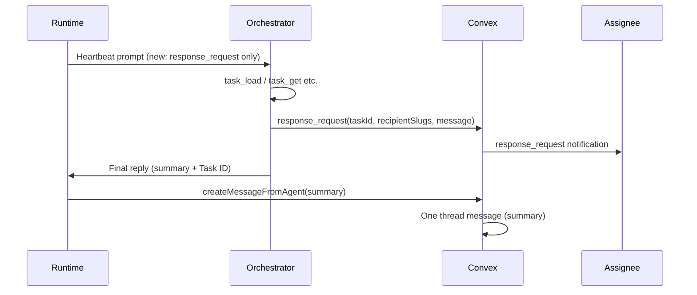

# Orchestrator single heartbeat message (Option A)

## 1. Context and goal

**Goal:** When the orchestrator runs a heartbeat and nudges assignees for status, the task thread should show **one** message (the "real" summary) instead of two. Today: (1) `task_message` posts the request text, then (2) the agent's final reply posts the summary. We keep only the final reply in the thread; the assignee still gets the nudge via **response_request** (notification + message payload).

**Constraints:** No change to runtime posting logic (heartbeat still posts the final response when not HEARTBEAT_OK). No change to `response_request` or `task_message` tool behavior. Only prompt and documentation changes so the orchestrator **does not call** `task_message` for heartbeat status follow-ups.

**Scope:** [apps/runtime](apps/runtime) (heartbeat prompt, tests), [docs/runtime](docs/runtime) (AGENTS.md, HEARTBEAT.md), [packages/backend/convex/seed.ts](packages/backend/convex/seed.ts) (Squad Lead SOUL), and optionally [apps/runtime/src/openclaw-profiles.ts](apps/runtime/src/openclaw-profiles.ts).

---

## 2. Codebase research summary

**Files inspected:**

- [apps/runtime/src/heartbeat.ts](apps/runtime/src/heartbeat.ts) — `buildOrchestratorFollowUpBlock()` (lines 278–297) builds the orchestrator follow-up instruction. Current text: "do both (1) post a task_message thread comment ... and (2) send response_request". This is the single source of heartbeat-specific orchestrator tool guidance injected into the prompt.
- [docs/runtime/AGENTS.md](docs/runtime/AGENTS.md) — Tool descriptions (task_message, response_request), "Orchestrator follow-ups", and "Orchestrator ping requests" (user-initiated ping: task_message + response_request). Latter must stay unchanged.
- [docs/runtime/HEARTBEAT.md](docs/runtime/HEARTBEAT.md) — Checklist for agents; no explicit "task_message vs response_request" today.
- [packages/backend/convex/seed.ts](packages/backend/convex/seed.ts) — Squad Lead SOUL (e.g. lines 837, 858): "use task_message + response_request" for **user-asked** pings. Need a separate heartbeat rule.
- [apps/runtime/src/openclaw-profiles.ts](apps/runtime/src/openclaw-profiles.ts) — Lines 116–119: user-asked ping behavior (task_message + response_request). Can add a heartbeat-specific bullet.
- [apps/runtime/src/heartbeat.test.ts](apps/runtime/src/heartbeat.test.ts) — Lines 361–375: expectations for orchestrator prompt include "task_message thread comment" and "[http://runtime:3000/agent/task-message](http://runtime:3000/agent/task-message)". These must be updated to match the new wording.

**Patterns to follow:** Existing doc structure in AGENTS.md (orchestrator follow-ups vs ping requests); single place for heartbeat orchestrator instructions in `buildOrchestratorFollowUpBlock`.

---

## 3. High-level design

- **No code change** to tool execution or to `createMessageFromAgent` / `createTaskMessageForAgentTool`. Only the **instructions** sent to the orchestrator change so it stops calling `task_message` for heartbeat status nudges.
- **Data flow:** Same as today; the only difference is the orchestrator no longer calls `task_message` during heartbeat, so only the final reply is posted to the thread. Assignees still get the nudge via `response_request`.

---

## 4. File and module changes

**Existing files to modify:**

| File                                                                           | Changes                                                                                                                                                                                                                                                                                                                                                                                                                                                                                                                                                                       |
| ------------------------------------------------------------------------------ | ----------------------------------------------------------------------------------------------------------------------------------------------------------------------------------------------------------------------------------------------------------------------------------------------------------------------------------------------------------------------------------------------------------------------------------------------------------------------------------------------------------------------------------------------------------------------------- |
| [apps/runtime/src/heartbeat.ts](apps/runtime/src/heartbeat.ts)                 | In `buildOrchestratorFollowUpBlock`: Replace the `toolLine` so it says to use **response_request only** for assignee follow-up (do not post task_message) and to put a short summary in the final reply. In the `httpLine`, remove `task-message` from the listed endpoints for this block so the agent is not prompted to use it for heartbeat follow-ups (keep task-load, task-search, task-get, response-request).                                                                                                                                                         |
| [docs/runtime/AGENTS.md](docs/runtime/AGENTS.md)                               | Add a short subsection or bullet under "Orchestrator follow-ups" or next to it: **Heartbeat follow-ups:** When following up on heartbeat (requesting status from assignees), use **response_request** only; do not use task_message. Put your follow-up summary in your final reply so the thread gets one update. Leave "Orchestrator ping requests" (user-asked ping) unchanged: task_message + response_request. Optionally clarify in the task_message bullet that pairing with response_request is for user-initiated pings / handoffs, not for heartbeat status nudges. |
| [docs/runtime/HEARTBEAT.md](docs/runtime/HEARTBEAT.md)                         | In the section that applies to the orchestrator (e.g. "If you are the orchestrator" or in the "Report + persist memory" / action section), add one line: when requesting status from assignees, use **response_request** only; put your follow-up summary in your reply (do not also post task_message).                                                                                                                                                                                                                                                                      |
| [packages/backend/convex/seed.ts](packages/backend/convex/seed.ts)             | In Squad Lead SOUL (personality/constraints or default operating procedure), add one line: when nudging assignees for status on heartbeat, use **response_request** only and put your summary in your final reply; do not use task_message for that. Keep existing lines about "when the primary user asks to ping" and "if asked to ping agents/tasks" (task_message + response_request) unchanged.                                                                                                                                                                          |
| [apps/runtime/src/openclaw-profiles.ts](apps/runtime/src/openclaw-profiles.ts) | Optionally add one bullet near the orchestrator ping block: when following up on **heartbeat** (requesting status from assignees), use response_request only and put your summary in your final reply. Leave the "When the primary user asks... ping" block unchanged.                                                                                                                                                                                                                                                                                                        |
| [apps/runtime/src/heartbeat.test.ts](apps/runtime/src/heartbeat.test.ts)       | In the test that checks orchestrator heartbeat message content: remove expectation for "task_message thread comment"; add expectation for the new wording (e.g. "response_request only" or "do not also post task_message"). Remove or adjust expectation for "[http://runtime:3000/agent/task-message](http://runtime:3000/agent/task-message)" in the prompt if that URL is no longer present in the heartbeat block. Keep expectations for "response_request", "task_load", "Prioritize stale", "Take up to 3 atomic follow-ups", and other unchanged strings.             |

**New files:** None.

---

## 5. Step-by-step tasks

1. **Update heartbeat orchestrator instruction**
  In [apps/runtime/src/heartbeat.ts](apps/runtime/src/heartbeat.ts), in `buildOrchestratorFollowUpBlock`, set `toolLine` to state that for assignee follow-up the agent must use **response_request only** (do not also post task_message) and put a short summary in the final reply; on failure report BLOCKED with task IDs/agent slugs. Update `httpLine` to remove the task-message endpoint from the list (keep task-load, task-search, task-get, response-request). Preserve the rest of the block (prioritize stale, one action per heartbeat, etc.).
2. **Update AGENTS.md**
  In [docs/runtime/AGENTS.md](docs/runtime/AGENTS.md), add a clear "Heartbeat follow-ups" rule under or next to "Orchestrator follow-ups": use response_request only when requesting status from assignees on heartbeat; put summary in final reply; do not use task_message for that. Do not change "Orchestrator ping requests" (user-asked ping).
3. **Update HEARTBEAT.md**
  In [docs/runtime/HEARTBEAT.md](docs/runtime/HEARTBEAT.md), add one line for the orchestrator: when requesting status from assignees, use response_request only and put your follow-up summary in your reply (do not also post task_message).
4. **Update Squad Lead SOUL in seed**
  In [packages/backend/convex/seed.ts](packages/backend/convex/seed.ts), in the Squad Lead agent SOUL (personality constraints or default operating procedure), add one line: when nudging assignees for status on heartbeat, use response_request only and put your summary in your final reply; do not use task_message for that. Leave all "ping agents/tasks" (user-initiated) lines unchanged.
5. **Optionally update openclaw-profiles**
  In [apps/runtime/src/openclaw-profiles.ts](apps/runtime/src/openclaw-profiles.ts), add one bullet for heartbeat follow-up (response_request only; summary in final reply) near the orchestrator ping text; leave the primary-user ping bullet as-is.
6. **Update heartbeat unit test**
  In [apps/runtime/src/heartbeat.test.ts](apps/runtime/src/heartbeat.test.ts), in the test that asserts on the orchestrator heartbeat message: drop the assertion that the message contains "task_message thread comment"; add an assertion for the new instruction (e.g. "response_request only" or "do not also post task_message"). If the built message no longer includes the task-message URL, remove or relax the assertion that the message contains "[http://runtime:3000/agent/task-message](http://runtime:3000/agent/task-message)". Keep assertions for "response_request", "task_load", "Prioritize stale", "Take up to 3 atomic follow-ups", and BLOCKED/failure wording. Run the heartbeat test suite and fix any other failing expectations.

---

## 6. Edge cases and risks

- **Agent still calls task_message:** If the model ignores the new instruction, two messages can still appear. Mitigation: clear, single-place wording in the heartbeat block and docs; no conflicting "use task_message" in the heartbeat-specific text.
- **User-asked ping vs heartbeat:** Ensure all changes are scoped to "heartbeat" or "when requesting status from assignees on heartbeat". User-initiated "ping agents/tasks" must keep task_message + response_request so the explicit request remains in the thread when a human asked for it.
- **HTTP fallback:** Removing task-message from the heartbeat block’s HTTP list only affects the heartbeat prompt. Agents can still use task_message when triggered by notifications or other prompts that mention it (e.g. AGENTS.md for user pings).

---

## 7. Testing strategy

- **Unit:** [apps/runtime/src/heartbeat.test.ts](apps/runtime/src/heartbeat.test.ts) — `buildHeartbeatMessage` with `isOrchestrator: true`: assert new wording (response_request only / do not post task_message), no "task_message thread comment", and no task-message URL in the built string if removed; assert response_request and other follow-up text still present.
- **Manual QA:** Run one orchestrator heartbeat with tracked tasks that need a status nudge; confirm only one new thread message (the summary) and that the assignee receives a response_request notification with the nudge message.

---

## 8. Rollout / migration

- No feature flags or data migration. Doc and prompt changes only; deploy as usual. If behavior is wrong, revert the edits to heartbeat.ts, AGENTS.md, HEARTBEAT.md, and seed.ts.

---

## 9. TODO checklist

- **Runtime** — In `heartbeat.ts` `buildOrchestratorFollowUpBlock`, replace `toolLine` with response_request-only wording and put-summary-in-reply; remove task-message from `httpLine` in that block.
- **Docs** — In `AGENTS.md`, add Heartbeat follow-ups rule (response_request only; summary in reply); leave Orchestrator ping requests unchanged.
- **Docs** — In `HEARTBEAT.md`, add one line for orchestrator: response_request only when requesting status; summary in reply; do not task_message.
- **Backend** — In `seed.ts` Squad Lead SOUL, add heartbeat rule (response_request only; summary in reply); keep user-asked ping rules unchanged.
- **Runtime** — Optionally in `openclaw-profiles.ts`, add heartbeat follow-up bullet (response_request only; summary in reply).
- **Tests** — In `heartbeat.test.ts`, update orchestrator message expectations: new wording, no "task_message thread comment", adjust/remove task-message URL assertion; run heartbeat tests and fix any remaining failures.

