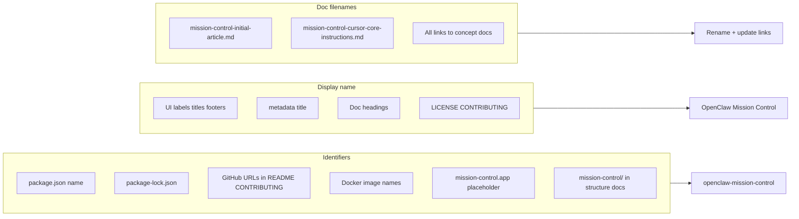

# Rename Project: mission-control → openclaw-mission-control

## Context and goal

The project has been renamed from **mission-control** to **openclaw-mission-control**. This plan updates **all mentions** across the repository:

- **Identifiers/slugs**: `mission-control` → `openclaw-mission-control` (package name, repo URLs, folder references, Docker image names, domain placeholder).
- **Display/product name**: `Mission Control` → `OpenClaw Mission Control` (UI labels, page titles, docs headings, footers, LICENSE, CONTRIBUTING, READMEs).
- **Concept doc filenames**: `mission-control-initial-article.md` and `mission-control-cursor-core-instructions.md` → `openclaw-mission-control-initial-article.md` and `openclaw-mission-control-cursor-core-instructions.md`, with all internal links updated.

Constraints: no logic or behaviour changes; preserve existing structure; update links so nothing breaks after file renames.

---

## Codebase research summary

Searches were run for `mission-control`, `Mission Control`, `mission_control`, and doc filenames. Findings:

| Area             | Files / locations                                                                                                                                                                                                                                                                                                                                                                                                                                                              |
| ---------------- | ------------------------------------------------------------------------------------------------------------------------------------------------------------------------------------------------------------------------------------------------------------------------------------------------------------------------------------------------------------------------------------------------------------------------------------------------------------------------------ |
| **Root package** | [package.json](package.json) (`name`), [package-lock.json](package-lock.json)                                                                                                                                                                                                                                                                                                                                                                                                  |
| **UI / app**     | [apps/web/src/app/layout.tsx](apps/web/src/app/layout.tsx), [Sidebar.tsx](apps/web/src/components/dashboard/Sidebar.tsx), [MobileNav.tsx](apps/web/src/components/dashboard/MobileNav.tsx), auth pages, [splash page](<apps/web/src/app/(splash)/page.tsx>), [new-account](<apps/web/src/app/(dashboard)/new-account/page.tsx>), [auth layout](<apps/web/src/app/(auth)/layout.tsx>), [admin/openclaw](<apps/web/src/app/(dashboard)/[accountSlug]/admin/openclaw/page.tsx>)   |
| **Runtime**      | [apps/runtime/README.md](apps/runtime/README.md), [apps/runtime/src/index.ts](apps/runtime/src/index.ts), [docker-compose.runtime.yml](apps/runtime/docker-compose.runtime.yml), [.env.example](apps/runtime/.env.example), [openclaw/start-openclaw.sh](apps/runtime/openclaw/start-openclaw.sh), [openclaw/Dockerfile](apps/runtime/openclaw/Dockerfile)                                                                                                                     |
| **Docs**         | [docs/README.md](docs/README.md), [docs/concept/mission-control-initial-article.md](docs/concept/mission-control-initial-article.md), [docs/concept/mission-control-cursor-core-instructions.md](docs/concept/mission-control-cursor-core-instructions.md), [docs/runtime/](docs/runtime/), [docs/roadmap/missing-features.md](docs/roadmap/missing-features.md), [docs/quality/code-review-agent-response-writeback.md](docs/quality/code-review-agent-response-writeback.md) |
| **Cursor**       | [.cursor/rules/01-project-overview.mdc](.cursor/rules/01-project-overview.mdc), [.cursor/plans/done/](.cursor/plans/done/), [.cursor/plans/todo/](.cursor/plans/todo/)                                                                                                                                                                                                                                                                                                         |
| **Root docs**    | [README.md](README.md), [CONTRIBUTING.md](CONTRIBUTING.md), [LICENSE](LICENSE)                                                                                                                                                                                                                                                                                                                                                                                                 |
| **Other**        | [packages/backend/convex/schema.ts](packages/backend/convex/schema.ts), [packages/ui/README.md](packages/ui/README.md), [scripts/runtime-upgrade-local.sh](scripts/runtime-upgrade-local.sh), [apps/native/](apps/native/), [.github/ISSUE_TEMPLATE/feature_request.md](.github/ISSUE_TEMPLATE/feature_request.md)                                                                                                                                                             |

Existing patterns: repo name appears as `YOUR_ORG/mission-control` in README/CONTRIBUTING; Docker images are `mission-control-runtime` and `mission-control-openclaw`; concept docs live under `docs/concept/` and are linked from rules and plans.

---

## High-level design

- **No new services or APIs**: only string and filename changes.
- **Doc renames**: rename the two concept files, then update every reference (rules, plans, docs, runtime README).
- **Display name**: replace "Mission Control" with "OpenClaw Mission Control" in user-facing and doc text; keep "Mission Control" only where it would read awkwardly (e.g. inside a quote that refers to the original product name) — the plan assumes full replacement unless noted.

---

## File and module changes

### 1. Root and lockfile

| File                                   | Changes                                                                                                         |
| -------------------------------------- | --------------------------------------------------------------------------------------------------------------- |
| [package.json](package.json)           | `"name": "mission-control"` → `"name": "openclaw-mission-control"`.                                             |
| [package-lock.json](package-lock.json) | Top-level `"name": "mission-control"` and nested package name under `packages.""` → `openclaw-mission-control`. |

### 2. Concept docs (rename + content)

| Action      | Detail                                                                                                                                               |
| ----------- | ---------------------------------------------------------------------------------------------------------------------------------------------------- |
| **Rename**  | `docs/concept/mission-control-initial-article.md` → `docs/concept/openclaw-mission-control-initial-article.md`.                                      |
| **Rename**  | `docs/concept/mission-control-cursor-core-instructions.md` → `docs/concept/openclaw-mission-control-cursor-core-instructions.md`.                    |
| **Content** | In both files, replace "Mission Control" with "OpenClaw Mission Control" in headings and body (and fix any "mission-control" identifier if present). |

### 3. All references to old concept doc filenames

Update to the new filenames (`openclaw-mission-control-initial-article.md`, `openclaw-mission-control-cursor-core-instructions.md`) in:

- [.cursor/rules/01-project-overview.mdc](.cursor/rules/01-project-overview.mdc): frontmatter description, headings, bullet paths, and structure block (`mission-control/` → `openclaw-mission-control/`, doc filenames → new names).
- [docs/README.md](docs/README.md): doc list and any paths.
- [apps/runtime/README.md](apps/runtime/README.md): "See ..." links and any other doc paths.
- [.cursor/plans/done/openclaw-send-runtime_da0d3d97.plan.md](.cursor/plans/done/openclaw-send-runtime_da0d3d97.plan.md): link list.
- [.cursor/plans/done/runtime-compose-openclaw_59af0a44.plan.md](.cursor/plans/done/runtime-compose-openclaw_59af0a44.plan.md): "Core constraints" links.
- [.cursor/plans/done/mission_control_improvements_v2_3822f6cd.plan.md](.cursor/plans/done/mission_control_improvements_v2_3822f6cd.plan.md): "Core docs" links (and fix path: `docs/mission-control-*` → `docs/concept/openclaw-mission-control-*` if applicable).

### 4. Docker and runtime

| File                                                                               | Changes                                                                                                                                                                                                                                                    |
| ---------------------------------------------------------------------------------- | ---------------------------------------------------------------------------------------------------------------------------------------------------------------------------------------------------------------------------------------------------------- |
| [apps/runtime/docker-compose.runtime.yml](apps/runtime/docker-compose.runtime.yml) | Comment "Mission Control" → "OpenClaw Mission Control"; `image: mission-control-runtime` → `openclaw-mission-control-runtime`; `image: mission-control-openclaw` → `openclaw-mission-control-openclaw`.                                                    |
| [apps/runtime/README.md](apps/runtime/README.md)                                   | All "Mission Control" → "OpenClaw Mission Control"; doc links to new concept filenames; `docker build ... -t mission-control-runtime` → `openclaw-mission-control-runtime`; `docker run ... mission-control-runtime` → `openclaw-mission-control-runtime`. |
| [apps/runtime/.env.example](apps/runtime/.env.example)                             | Comment "Mission Control" → "OpenClaw Mission Control".                                                                                                                                                                                                    |
| [apps/runtime/openclaw/start-openclaw.sh](apps/runtime/openclaw/start-openclaw.sh) | Comment "Mission Control" → "OpenClaw Mission Control".                                                                                                                                                                                                    |
| [apps/runtime/openclaw/Dockerfile](apps/runtime/openclaw/Dockerfile)               | Comment "Mission Control" → "OpenClaw Mission Control".                                                                                                                                                                                                    |
| [apps/runtime/src/index.ts](apps/runtime/src/index.ts)                             | Log string "Mission Control Runtime Service" → "OpenClaw Mission Control Runtime Service".                                                                                                                                                                 |

### 5. Web app (UI and copy)

| File                                                                                                                                       | Changes                                                                                                                           |
| ------------------------------------------------------------------------------------------------------------------------------------------ | --------------------------------------------------------------------------------------------------------------------------------- |
| [apps/web/src/app/layout.tsx](apps/web/src/app/layout.tsx)                                                                                 | `title: "Mission Control"` → `"OpenClaw Mission Control"`.                                                                        |
| [apps/web/src/components/dashboard/Sidebar.tsx](apps/web/src/components/dashboard/Sidebar.tsx)                                             | Brand label "Mission Control" → "OpenClaw Mission Control".                                                                       |
| [apps/web/src/components/dashboard/MobileNav.tsx](apps/web/src/components/dashboard/MobileNav.tsx)                                         | Same brand label.                                                                                                                 |
| [apps/web/src/app/(auth)/layout.tsx](<apps/web/src/app/(auth)/layout.tsx>)                                                                 | Brand text and footer "2026 Mission Control" → "2026 OpenClaw Mission Control".                                                   |
| [apps/web/src/app/(auth)/sign-in/[[...sign-in]]/page.tsx](<apps/web/src/app/(auth)/sign-in/[[...sign-in]]/page.tsx>)                       | "Sign in to continue to Mission Control" → "OpenClaw Mission Control".                                                            |
| [apps/web/src/app/(auth)/sign-up/[[...sign-up]]/page.tsx](<apps/web/src/app/(auth)/sign-up/[[...sign-up]]/page.tsx>)                       | "Get started with Mission Control" → "OpenClaw Mission Control".                                                                  |
| [apps/web/src/app/(dashboard)/new-account/page.tsx](<apps/web/src/app/(dashboard)/new-account/page.tsx>)                                   | "first Mission Control account" → "OpenClaw Mission Control"; `mission-control.app` → `openclaw-mission-control.app` in URL hint. |
| [apps/web/src/app/(dashboard)/[accountSlug]/admin/openclaw/page.tsx](<apps/web/src/app/(dashboard)/[accountSlug]/admin/openclaw/page.tsx>) | "Mission Control runtime" → "OpenClaw Mission Control runtime".                                                                   |
| [apps/web/src/app/(splash)/page.tsx](<apps/web/src/app/(splash)/page.tsx>)                                                                 | Comment, brand span, all marketing copy "Mission Control" → "OpenClaw Mission Control" (stats, testimonials, FAQ, footer).        |

### 6. Docs (other)

| File                                                                                                         | Changes                                                                                              |
| ------------------------------------------------------------------------------------------------------------ | ---------------------------------------------------------------------------------------------------- |
| [docs/README.md](docs/README.md)                                                                             | Heading and list: "Mission Control" → "OpenClaw Mission Control"; concept doc filenames → new names. |
| [docs/runtime/runtime-docker-compose.md](docs/runtime/runtime-docker-compose.md)                             | All "Mission Control" → "OpenClaw Mission Control".                                                  |
| [docs/runtime/AGENTS.md](docs/runtime/AGENTS.md)                                                             | Title and body "Mission Control" → "OpenClaw Mission Control".                                       |
| [docs/roadmap/missing-features.md](docs/roadmap/missing-features.md)                                         | Title "Mission Control" → "OpenClaw Mission Control".                                                |
| [docs/quality/code-review-agent-response-writeback.md](docs/quality/code-review-agent-response-writeback.md) | "Mission Control" → "OpenClaw Mission Control".                                                      |

### 7. Root docs and GitHub

| File                                                                                   | Changes                                                                                                                                                                                                          |
| -------------------------------------------------------------------------------------- | ---------------------------------------------------------------------------------------------------------------------------------------------------------------------------------------------------------------- |
| [README.md](README.md)                                                                 | Title and all "Mission Control" → "OpenClaw Mission Control"; `YOUR_ORG/mission-control` → `YOUR_ORG/openclaw-mission-control` (badge, clone, cd, folder diagram, docker image names, Issues/Discussions links). |
| [CONTRIBUTING.md](CONTRIBUTING.md)                                                     | Title and intro "Mission Control" → "OpenClaw Mission Control"; clone/cd `mission-control` → `openclaw-mission-control`.                                                                                         |
| [LICENSE](LICENSE)                                                                     | "Mission Control Contributors" → "OpenClaw Mission Control Contributors".                                                                                                                                        |
| [.github/ISSUE_TEMPLATE/feature_request.md](.github/ISSUE_TEMPLATE/feature_request.md) | "Suggest an idea for Mission Control" → "OpenClaw Mission Control".                                                                                                                                              |

### 8. Packages and scripts

| File                                                                   | Changes                                                                                 |
| ---------------------------------------------------------------------- | --------------------------------------------------------------------------------------- |
| [packages/backend/convex/schema.ts](packages/backend/convex/schema.ts) | Comment "Mission Control Database Schema" → "OpenClaw Mission Control Database Schema". |
| [packages/ui/README.md](packages/ui/README.md)                         | "mission-control monorepo" → "openclaw-mission-control monorepo".                       |
| [scripts/runtime-upgrade-local.sh](scripts/runtime-upgrade-local.sh)   | Comment "Mission Control" → "OpenClaw Mission Control".                                 |

### 9. Native app

| File                                           | Changes                                                                              |
| ---------------------------------------------- | ------------------------------------------------------------------------------------ |
| [apps/native/App.tsx](apps/native/App.tsx)     | JSDoc "Mission Control Native App" / "Mission Control" → "OpenClaw Mission Control". |
| [apps/native/README.md](apps/native/README.md) | Title and body "Mission Control" → "OpenClaw Mission Control".                       |
| [apps/native/app.json](apps/native/app.json)   | `name` and `displayName` "Mission Control" → "OpenClaw Mission Control".             |

### 10. Cursor plans (todo)

| File                                                                                                             | Changes                                                                   |
| ---------------------------------------------------------------------------------------------------------------- | ------------------------------------------------------------------------- |
| [.cursor/plans/todo/runtime-v1-release_5fd82dc3.plan.md](.cursor/plans/todo/runtime-v1-release_5fd82dc3.plan.md) | "Mission Control architecture" → "OpenClaw Mission Control architecture". |
| [.cursor/plans/todo/agent_skills_poc_9c3727d3.plan.md](.cursor/plans/todo/agent_skills_poc_9c3727d3.plan.md)     | "Mission Control" → "OpenClaw Mission Control".                           |

Optional: do not rename `.cursor/plans/done/mission_control_improvements_v2_3822f6cd.plan.md` to avoid breaking external references; only update its content and links.

---

## Step-by-step tasks

1. **Package name**
   In [package.json](package.json) and [package-lock.json](package-lock.json), set `"name": "openclaw-mission-control"` (and lockfile `packages.""` if present).
2. **Rename concept docs**
   Rename `docs/concept/mission-control-initial-article.md` → `docs/concept/openclaw-mission-control-initial-article.md` and `docs/concept/mission-control-cursor-core-instructions.md` → `docs/concept/openclaw-mission-control-cursor-core-instructions.md`.
3. **Update concept doc content**
   In both renamed files, replace "Mission Control" with "OpenClaw Mission Control" (and any "mission-control" identifier with "openclaw-mission-control" if present).
4. **Update all links to concept docs**
   In [.cursor/rules/01-project-overview.mdc](.cursor/rules/01-project-overview.mdc), [docs/README.md](docs/README.md), [apps/runtime/README.md](apps/runtime/README.md), and all [.cursor/plans](.cursor/plans) files that link to the old filenames, replace with `openclaw-mission-control-initial-article.md` and `openclaw-mission-control-cursor-core-instructions.md` (and fix path to `docs/concept/` where needed).
5. **Cursor rule overview**
   In [.cursor/rules/01-project-overview.mdc](.cursor/rules/01-project-overview.mdc), set description and headings to "OpenClaw Mission Control"; replace `mission-control/` with `openclaw-mission-control/` in the structure block and all doc paths.
6. **Docker and runtime**
   In [apps/runtime/docker-compose.runtime.yml](apps/runtime/docker-compose.runtime.yml) and [apps/runtime/README.md](apps/runtime/README.md), switch image names to `openclaw-mission-control-runtime` and `openclaw-mission-control-openclaw`; replace all "Mission Control" with "OpenClaw Mission Control" in runtime app and [.env.example](apps/runtime/.env.example), [start-openclaw.sh](apps/runtime/openclaw/start-openclaw.sh), [Dockerfile](apps/runtime/openclaw/Dockerfile), and [index.ts](apps/runtime/src/index.ts).
7. **Web app copy**
   In layout, Sidebar, MobileNav, auth layout, sign-in/sign-up, new-account, admin openclaw page, and splash page, replace every "Mission Control" with "OpenClaw Mission Control" and `mission-control.app` with `openclaw-mission-control.app`.
8. **Remaining docs**
   In [docs/README.md](docs/README.md), [docs/runtime/](docs/runtime/), [docs/roadmap/missing-features.md](docs/roadmap/missing-features.md), [docs/quality/code-review-agent-response-writeback.md](docs/quality/code-review-agent-response-writeback.md), replace "Mission Control" and old concept doc filenames as above.
9. **Root and GitHub**
   In [README.md](README.md), [CONTRIBUTING.md](CONTRIBUTING.md), [LICENSE](LICENSE), and [.github/ISSUE_TEMPLATE/feature_request.md](.github/ISSUE_TEMPLATE/feature_request.md), replace "Mission Control" with "OpenClaw Mission Control" and `mission-control` with `openclaw-mission-control` in repo URLs, clone commands, and folder/docker examples.
10. **Packages, scripts, native, plans**
    Update [packages/backend/convex/schema.ts](packages/backend/convex/schema.ts), [packages/ui/README.md](packages/ui/README.md), [scripts/runtime-upgrade-local.sh](scripts/runtime-upgrade-local.sh), [apps/native/App.tsx](apps/native/App.tsx), [apps/native/README.md](apps/native/README.md), [apps/native/app.json](apps/native/app.json), and [.cursor/plans/todo](.cursor/plans/todo) plan files as specified above.
11. **Verification**
    Run: `rg -i "mission-control|Mission Control" --glob '!node_modules' --glob '!.git' .` (and optionally `rg "mission_control"`) and fix any remaining hits; re-run after changes. Confirm no links point to old concept doc filenames.

---

## Edge cases and risks

- **Broken links**: Any reference to `mission-control-initial-article.md` or `mission-control-cursor-core-instructions.md` must be updated after the rename; the plan lists all known referrers. A single missed link will 404.
- **Case and spacing**: Replace "Mission Control" (two words) in prose and "mission-control" (kebab) in identifiers; avoid changing unrelated tokens (e.g. in a quoted third-party sentence).
- **Placeholders**: `YOUR_ORG` and `YOUR_USERNAME` stay as-is; only the repo segment becomes `openclaw-mission-control`.
- **Plan file names**: Renaming `.cursor/plans/done/mission_control_*.plan.md` could break references; recommended to only update their content and links.
- **package-lock.json**: Only the root package name (and any explicit reference under `packages.""`) should change; no dependency version or resolution changes.

---

## Testing strategy

- **No unit/integration code changes**: No new tests required for behaviour.
- **Smoke**: After edits, run `npm ci` and `npm run build` to ensure package name and lockfile are valid.
- **Manual**: Open key app routes (splash, sign-in, dashboard sidebar, new account), confirm "OpenClaw Mission Control" appears; run Docker Compose and confirm image names and logs use the new name; open Cursor rules and a few doc/plan links to confirm concept doc links resolve.

---

## Rollout / migration

- Single PR; no feature flags or gradual rollout.
- No data migration; rename is repo-only.
- After merge, ensure GitHub repo is actually named `openclaw-mission-control` so README/CONTRIBUTING clone URLs and badges match.

---

## TODO checklist

**Package and lockfile**

- Set `name` to `openclaw-mission-control` in [package.json](package.json) and [package-lock.json](package-lock.json).

**Concept docs**

- Rename [docs/concept/mission-control-initial-article.md](docs/concept/mission-control-initial-article.md) to `openclaw-mission-control-initial-article.md`.
- Rename [docs/concept/mission-control-cursor-core-instructions.md](docs/concept/mission-control-cursor-core-instructions.md) to `openclaw-mission-control-cursor-core-instructions.md`.
- In both renamed files, replace "Mission Control" with "OpenClaw Mission Control" (and identifiers if any).

**Links to concept docs**

- Update paths in [.cursor/rules/01-project-overview.mdc](.cursor/rules/01-project-overview.mdc).
- Update paths in [docs/README.md](docs/README.md), [apps/runtime/README.md](apps/runtime/README.md).
- Update links in [.cursor/plans/done/openclaw-send-runtime_da0d3d97.plan.md](.cursor/plans/done/openclaw-send-runtime_da0d3d97.plan.md), [runtime-compose-openclaw_59af0a44.plan.md](.cursor/plans/done/runtime-compose-openclaw_59af0a44.plan.md), [mission_control_improvements_v2_3822f6cd.plan.md](.cursor/plans/done/mission_control_improvements_v2_3822f6cd.plan.md).

**Cursor rule**

- In [.cursor/rules/01-project-overview.mdc](.cursor/rules/01-project-overview.mdc): description, headings, `openclaw-mission-control/` in structure, all doc paths.

**Docker and runtime**

- [apps/runtime/docker-compose.runtime.yml](apps/runtime/docker-compose.runtime.yml): image names and comment.
- [apps/runtime/README.md](apps/runtime/README.md): display name, doc links, docker commands.
- [apps/runtime/.env.example](apps/runtime/.env.example), [openclaw/start-openclaw.sh](apps/runtime/openclaw/start-openclaw.sh), [openclaw/Dockerfile](apps/runtime/openclaw/Dockerfile), [src/index.ts](apps/runtime/src/index.ts): comments/log string.

**Web app**

- [apps/web/src/app/layout.tsx](apps/web/src/app/layout.tsx), [Sidebar.tsx](apps/web/src/components/dashboard/Sidebar.tsx), [MobileNav.tsx](apps/web/src/components/dashboard/MobileNav.tsx).
- [apps/web/src/app/(auth)/layout.tsx](<apps/web/src/app/(auth)/layout.tsx>), sign-in and sign-up pages.
- [apps/web/src/app/(dashboard)/new-account/page.tsx](<apps/web/src/app/(dashboard)/new-account/page.tsx>) (including `openclaw-mission-control.app`).
- [apps/web/src/app/(dashboard)/[accountSlug]/admin/openclaw/page.tsx](<apps/web/src/app/(dashboard)/[accountSlug]/admin/openclaw/page.tsx>).
- [apps/web/src/app/(splash)/page.tsx](<apps/web/src/app/(splash)/page.tsx>).

**Docs**

- [docs/README.md](docs/README.md), [docs/runtime/runtime-docker-compose.md](docs/runtime/runtime-docker-compose.md), [docs/runtime/AGENTS.md](docs/runtime/AGENTS.md), [docs/roadmap/missing-features.md](docs/roadmap/missing-features.md), [docs/quality/code-review-agent-response-writeback.md](docs/quality/code-review-agent-response-writeback.md).

**Root and GitHub**

- [README.md](README.md): title, body, repo URLs, folder, docker examples.
- [CONTRIBUTING.md](CONTRIBUTING.md), [LICENSE](LICENSE), [.github/ISSUE_TEMPLATE/feature_request.md](.github/ISSUE_TEMPLATE/feature_request.md).

**Other**

- [packages/backend/convex/schema.ts](packages/backend/convex/schema.ts), [packages/ui/README.md](packages/ui/README.md), [scripts/runtime-upgrade-local.sh](scripts/runtime-upgrade-local.sh).
- [apps/native/App.tsx](apps/native/App.tsx), [apps/native/README.md](apps/native/README.md), [apps/native/app.json](apps/native/app.json).
- [.cursor/plans/todo/runtime-v1-release_5fd82dc3.plan.md](.cursor/plans/todo/runtime-v1-release_5fd82dc3.plan.md), [.cursor/plans/todo/agent_skills_poc_9c3727d3.plan.md](.cursor/plans/todo/agent_skills_poc_9c3727d3.plan.md).

**Verification**

- Run `rg -i "mission-control|Mission Control"` (excluding node_modules/.git); address any remaining matches.
- Run `npm ci` and `npm run build`; spot-check UI and doc links.
