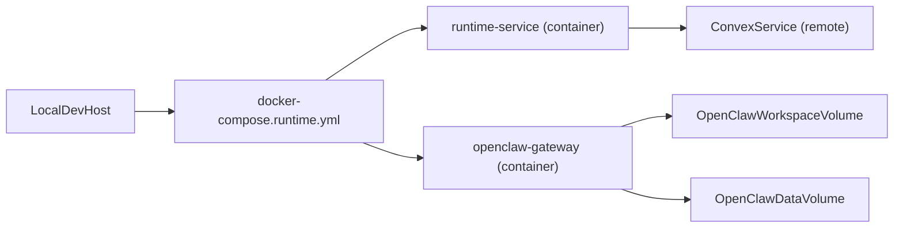

# Runtime + Docker Compose (Local Dev)

## 1. Context & goal

Build a local-dev Docker Compose workflow that runs the OpenClaw Mission Control runtime alongside an OpenClaw gateway, following the patterns from [clawdbot-docker](https://github.com/CrocSwap/clawdbot-docker). Improve the runtime service with safer defaults, reliability guards, and better observability, while keeping per-account isolation and service-token auth intact. Target is local development only, with explicit notes for production parity.

Key constraints:

- One runtime per account, service-only auth, and no cross-account data access.
- Local-only port bindings by default for safety.
- Keep Node 24 and existing runtime responsibilities intact.

## 2. Codebase research summary

Files inspected:

- Runtime core: [apps/runtime/src/index.ts](apps/runtime/src/index.ts), [apps/runtime/src/config.ts](apps/runtime/src/config.ts), [apps/runtime/src/gateway.ts](apps/runtime/src/gateway.ts), [apps/runtime/src/delivery.ts](apps/runtime/src/delivery.ts), [apps/runtime/src/health.ts](apps/runtime/src/health.ts), [apps/runtime/src/self-upgrade.ts](apps/runtime/src/self-upgrade.ts)
- Runtime build & docs: [apps/runtime/Dockerfile](apps/runtime/Dockerfile), [apps/runtime/README.md](apps/runtime/README.md)
- Upgrade roadmap: [docs/roadmap/runtime-version-management-v2.md](docs/roadmap/runtime-version-management-v2.md)
- Core constraints: [docs/concept/openclaw-mission-control-initial-article.md](docs/concept/openclaw-mission-control-initial-article.md), [docs/concept/openclaw-mission-control-cursor-core-instructions.md](docs/concept/openclaw-mission-control-cursor-core-instructions.md), [docs/build/00-orchestrator.md](docs/build/00-orchestrator.md)

What exists today:

- Runtime service already handles delivery loop, heartbeats, health endpoints, and self-upgrade checks.
- Docker support is a single Dockerfile with manual `docker build/run` commands.
- No compose file, no OpenClaw gateway container, no standard env template for local Compose.

Key patterns to reuse:

- Existing runtime config loading in [apps/runtime/src/config.ts](apps/runtime/src/config.ts) and health reporting in [apps/runtime/src/health.ts](apps/runtime/src/health.ts).
- Upgrade flow expectations in [docs/roadmap/runtime-version-management-v2.md](docs/roadmap/runtime-version-management-v2.md).

## 3. High-level design

Create a local-dev Compose stack with two services:

- `runtime`: built from the existing runtime Dockerfile; exposes `/health` locally.
- `openclaw-gateway`: built from a new lightweight OpenClaw container setup modeled after [clawdbot-docker](https://github.com/CrocSwap/clawdbot-docker) (template config + start script + persistent volumes).

Add runtime improvements for:

- Security: local-only binds, explicit gateway token in env templates, avoid logging secrets.
- Reliability: delivery backoff + error tracking, healthcheck integration, graceful shutdown hardening.
- Observability: structured logging with log levels, richer `/health` state.
- Upgrade: local script aligned with roadmap’s `docker compose pull/down/up` flow.

Mermaid overview:

## 4. File & module changes

### Existing files to touch

- [apps/runtime/src/config.ts](apps/runtime/src/config.ts)
  - Add env support for `LOG_LEVEL`, `HEALTH_HOST`, and delivery backoff settings.
  - Prefer `OPENCLAW_VERSION` env if set before running version detection.
  - Move `child_process` import to the top to comply with import rule.
- [apps/runtime/src/index.ts](apps/runtime/src/index.ts)
  - Replace `console.*` with a runtime logger.
  - Add handlers for `unhandledRejection` and `uncaughtException` to log and exit cleanly.
- [apps/runtime/src/delivery.ts](apps/runtime/src/delivery.ts)
  - Track `consecutiveFailures`, `lastErrorAt`, `lastErrorMessage` in state.
  - Add exponential backoff with jitter on polling errors.
- [apps/runtime/src/health.ts](apps/runtime/src/health.ts)
  - Bind to `HEALTH_HOST` (default `127.0.0.1` for local dev).
  - Surface new delivery error counters/last error in `/health` response.
- [apps/runtime/src/self-upgrade.ts](apps/runtime/src/self-upgrade.ts)
  - Add `UPGRADE_MODE` env (`exit` default) and log clearly when upgrade is detected.
- [apps/runtime/Dockerfile](apps/runtime/Dockerfile)
  - Add a `HEALTHCHECK` using a Node one-liner (no extra packages).
- [apps/runtime/README.md](apps/runtime/README.md)
  - Add Compose quickstart and local OpenClaw gateway instructions.
- [apps/runtime/.env.example](apps/runtime/.env.example)
  - Extend with OpenClaw gateway settings (token, bind host, ports) and logging/backoff envs.
- [.gitignore](.gitignore)
  - Ignore local runtime/OpenClaw volumes (e.g., `.runtime/`).

### New files to create

- [docker-compose.runtime.yml](docker-compose.runtime.yml)
  - Define `runtime` and `openclaw-gateway` services, volumes, healthchecks, `restart: unless-stopped`, and local-only port bindings.
  - Use `profiles` so OpenClaw can be started only when needed.
- [apps/runtime/openclaw/Dockerfile](apps/runtime/openclaw/Dockerfile)
  - Build OpenClaw gateway image based on clawdbot-docker patterns.
- [apps/runtime/openclaw/openclaw.json.template](apps/runtime/openclaw/openclaw.json.template)
  - Default config template merged with env values.
- [apps/runtime/openclaw/start-openclaw.sh](apps/runtime/openclaw/start-openclaw.sh)
  - Startup script to merge env into config and launch the gateway.
- [apps/runtime/openclaw/user-setup.sh](apps/runtime/openclaw/user-setup.sh)
  - Optional build hook for extra tools, matching clawdbot-docker conventions.
- [apps/runtime/src/logger.ts](apps/runtime/src/logger.ts)
  - Minimal structured logger with levels and secret redaction.
- [apps/runtime/src/backoff.ts](apps/runtime/src/backoff.ts)
  - Utility to calculate exponential backoff with jitter (unit-testable).
- [scripts/runtime-upgrade-local.sh](scripts/runtime-upgrade-local.sh)
  - Local upgrade helper using `docker compose pull/down/up` aligned with roadmap.
- [docs/runtime/runtime-docker-compose.md](docs/runtime/runtime-docker-compose.md)
  - Local dev Compose instructions, env setup, and troubleshooting.

## 5. Step-by-step tasks

1. Add OpenClaw container assets based on clawdbot-docker: create `apps/runtime/openclaw/*` (Dockerfile, template, start script, optional user-setup), and add `.runtime/` to `.gitignore`.
2. Create [docker-compose.runtime.yml](docker-compose.runtime.yml) with `runtime` + `openclaw-gateway` services, local-only port binds, volumes, and healthchecks; add `profiles` so OpenClaw is optional.
3. Extend [apps/runtime/.env.example](apps/runtime/.env.example) with OpenClaw gateway env vars and logging/backoff settings; update [apps/runtime/README.md](apps/runtime/README.md) and add [docs/runtime/runtime-docker-compose.md](docs/runtime/runtime-docker-compose.md) with local Compose quickstart.
4. Add a runtime logger module and wire it through [apps/runtime/src/index.ts](apps/runtime/src/index.ts), [apps/runtime/src/health.ts](apps/runtime/src/health.ts), [apps/runtime/src/delivery.ts](apps/runtime/src/delivery.ts), and [apps/runtime/src/self-upgrade.ts](apps/runtime/src/self-upgrade.ts).
5. Add delivery backoff + error counters in [apps/runtime/src/delivery.ts](apps/runtime/src/delivery.ts) and surface the new fields in `/health` via [apps/runtime/src/health.ts](apps/runtime/src/health.ts).
6. Update [apps/runtime/src/config.ts](apps/runtime/src/config.ts) to include `LOG_LEVEL`, `HEALTH_HOST`, and backoff envs; prefer `OPENCLAW_VERSION` when present; move `child_process` import to top-level.
7. Add [scripts/runtime-upgrade-local.sh](scripts/runtime-upgrade-local.sh) and reference it from docs; ensure [apps/runtime/src/self-upgrade.ts](apps/runtime/src/self-upgrade.ts) logs upgrade detection consistently with `UPGRADE_MODE`.
8. Add a `HEALTHCHECK` to [apps/runtime/Dockerfile](apps/runtime/Dockerfile) and verify Compose healthcheck configuration matches `/health`.

## 6. Edge cases & risks

- Runtime may run without OpenClaw: ensure compose `profiles` allow `runtime` alone and `/health` still reports `openclawVersion` as `unknown` if not provided.
- Service tokens must never be logged: logger should redact `SERVICE_TOKEN` and any gateway tokens.
- Backoff must not stop delivery permanently: enforce max backoff and reset on success.
- Self-upgrade inside containers should not attempt to run Docker: keep `UPGRADE_MODE=exit` for local dev and rely on host scripts.
- Health endpoint bind host defaults: keep `HEALTH_HOST` explicit for local; document for production parity.

## 7. Testing strategy

- Unit tests (if a test harness exists for runtime): add tests for `backoff` calculations and log-level filtering in [apps/runtime/src/backoff.ts](apps/runtime/src/backoff.ts) and [apps/runtime/src/logger.ts](apps/runtime/src/logger.ts).
- Manual QA:
  - `docker compose -f docker-compose.runtime.yml up` starts runtime and OpenClaw services.
  - `curl http://127.0.0.1:3000/health` returns healthy JSON with new fields.
  - OpenClaw UI reachable at `http://localhost:18789/?token=local` (if gateway profile enabled).
  - Stop OpenClaw container and verify runtime stays up with degraded status.
  - Simulate delivery errors and confirm backoff counters update in `/health`.
  - Run `scripts/runtime-upgrade-local.sh` and verify containers restart cleanly.

## 8. Rollout / migration (if relevant)

- Local dev only: no data migration. Add `.runtime/` volumes for persistence and document how to reset by deleting the folder.
- Observability change: logging format may change; update docs to explain log fields and log levels.
- Keep defaults conservative: local-only bindings unless explicitly overridden in env.

## 9. TODO checklist

- Add OpenClaw Docker assets under `apps/runtime/openclaw/` following clawdbot-docker pattern.
- Create `docker-compose.runtime.yml` with runtime + gateway services, volumes, and healthchecks.
- Extend `apps/runtime/.env.example` with OpenClaw and logging/backoff envs.
- Add `.runtime/` to `.gitignore` for persisted OpenClaw data/workspace.
- Implement runtime logger + backoff utilities and wire them into runtime modules.
- Update `/health` response with delivery error counters and bind host support.
- Add `scripts/runtime-upgrade-local.sh` and document local upgrade workflow.
- Update `apps/runtime/README.md` and add `docs/runtime/runtime-docker-compose.md`.
- Manual QA: compose up/down, health checks, OpenClaw UI, upgrade script.

