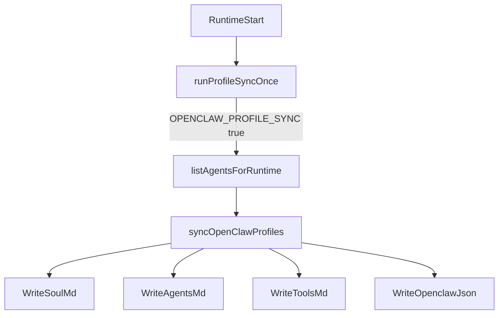

# Runtime Profile Sync + Timeout Hardening Plan

## 1. Context & goal

We will improve the runtime service so agent workspaces are less likely to miss `SOUL.md`/`AGENTS.md`/`TOOLS.md` and long OpenClaw runs do not timeout as often. This keeps profile sync opt-in but adds clear warnings, a strong SOUL fallback, and a higher default OpenClaw request timeout with consistent docs.

User stories and acceptance criteria:

- As an operator, I see a clear warning if profile sync is disabled so I know why `SOUL.md` is missing.
- As an agent, `SOUL.md` is always non-empty when profile sync is enabled, even if Convex data is blank.
- As an operator, the default OpenClaw request timeout is higher (300000ms) and docs/configs agree.

Key constraints:

- Runtime is per-account and must remain safe for multi-tenancy.
- Profile sync stays opt-in (no behavior change unless explicitly enabled).
- No runtime behavior should change for installations that already set `OPENCLAW_REQUEST_TIMEOUT_MS`.

Assumptions:

- Assumption A: “timeout” refers to `OPENCLAW_REQUEST_TIMEOUT_MS` (OpenResponses `/v1/responses`).
- Assumption B: “missing SOUL” is caused by disabled profile sync or empty `effectiveSoulContent`.

Feature setup checklist:

- Requirements / scope documented
- User stories or acceptance criteria clear
- Feature branch created (if applicable)
- Development environment ready

## 2. Codebase research summary

Files reviewed:

- [apps/runtime/src/openclaw-profiles.ts](apps/runtime/src/openclaw-profiles.ts) — writes `SOUL.md`, `AGENTS.md`, `HEARTBEAT.md`, `TOOLS.md` for each agent and generates `openclaw.json`.
- [apps/runtime/src/agent-sync.ts](apps/runtime/src/agent-sync.ts) — runs profile sync only when `OPENCLAW_PROFILE_SYNC` is enabled.
- [apps/runtime/src/config.ts](apps/runtime/src/config.ts) — defines `openclawRequestTimeoutMs` default (currently 180000).
- [apps/runtime/src/gateway.ts](apps/runtime/src/gateway.ts) — uses `openclawRequestTimeoutMs` for OpenClaw request aborts.
- [apps/runtime/README.md](apps/runtime/README.md), [apps/runtime/.env.example](apps/runtime/.env.example), [docs/runtime/runtime-docker-compose.md](docs/runtime/runtime-docker-compose.md) — document timeout and profile sync envs.
- [packages/backend/convex/service/agents.ts](packages/backend/convex/service/agents.ts), [packages/backend/convex/lib/agent_soul.ts](packages/backend/convex/lib/agent_soul.ts) — `effectiveSoulContent` fallback and `generateDefaultSoul()`.
- [apps/runtime/src/openclaw-profiles.test.ts](apps/runtime/src/openclaw-profiles.test.ts) — existing tests for profile sync behavior.

Key findings:

- Profile sync is opt-in (`OPENCLAW_PROFILE_SYNC`), so workspaces are empty unless enabled. `runProfileSyncOnce()` exits early when disabled.
- `syncOpenClawProfiles()` writes `SOUL.md` directly from `effectiveSoulContent` without verifying non-empty content.
- `openclawRequestTimeoutMs` default is 180000 in config, while docker-compose already uses 300000.

Relevant snippets:

```464:505:apps/runtime/src/openclaw-profiles.ts
export function syncOpenClawProfiles(
  agents: AgentForProfile[],
  options: ProfileSyncOptions,
): { configChanged: boolean } {
  // ...
  for (const agent of agents) {
    // ...
    writeIfChanged(path.join(agentDir, "SOUL.md"), agent.effectiveSoulContent);
    writeIfChanged(path.join(agentDir, "AGENTS.md"), agentsMdContent);
    writeIfChanged(path.join(agentDir, "HEARTBEAT.md"), heartbeatMdContent);
    writeIfChanged(
      path.join(agentDir, "TOOLS.md"),
      buildToolsMd(agent.resolvedSkills),
    );
    // ...
  }
}
```

```141:156:apps/runtime/src/agent-sync.ts
export async function runProfileSyncOnce(config: RuntimeConfig): Promise<void> {
  if (!config.openclawProfileSyncEnabled) return;
  // ... listAgentsForRuntime → syncOpenClawProfiles
}
```

```313:318:apps/runtime/src/config.ts
openclawRequestTimeoutMs: parseIntOrDefault(
  process.env.OPENCLAW_REQUEST_TIMEOUT_MS,
  180000,
),
```

## 3. High-level design

Architecture summary:

- Backend still computes `effectiveSoulContent` in `listForRuntime`, but the runtime will guard against empty content when writing `SOUL.md`.
- Runtime logs a clear warning when profile sync is disabled so operators understand why workspace files are missing.
- Runtime default timeout for OpenClaw `/v1/responses` increases to 300000ms, and docs/config examples are aligned.

Data flow (profile sync):

- Runtime startup → `runProfileSyncOnce()` → Convex `listAgentsForRuntime` → `syncOpenClawProfiles()` → write `SOUL.md` / `AGENTS.md` / `TOOLS.md` → write `openclaw.json`.

Mermaid (profile sync focus):




Key design choices:

- Add a helper (e.g., `resolveSoulContent`) in `openclaw-profiles.ts` that trims `effectiveSoulContent`, logs a warning when empty, and falls back to `generateDefaultSoul(agent.name, agent.role)`.
- Add a one-time warning when profile sync is disabled (in `runProfileSyncOnce()` or startup) to make missing files diagnosable without changing defaults.
- Update `openclawRequestTimeoutMs` default to 300000 and update all docs/config references.

## 4. File & module changes

Existing files to touch:

- [apps/runtime/src/openclaw-profiles.ts](apps/runtime/src/openclaw-profiles.ts)
  - Add `resolveSoulContent(agent)` helper with JSDoc; ensure imports stay at top.
  - Use helper when writing `SOUL.md` so content is never blank.
  - Emit a warning when fallback is used (include agent id/slug/name).
- [apps/runtime/src/openclaw-profiles.test.ts](apps/runtime/src/openclaw-profiles.test.ts)
  - Add tests that `SOUL.md` is non-empty when `effectiveSoulContent` is empty/whitespace.
- [apps/runtime/src/agent-sync.ts](apps/runtime/src/agent-sync.ts) or [apps/runtime/src/index.ts](apps/runtime/src/index.ts)
  - Add a startup warning when `OPENCLAW_PROFILE_SYNC` is disabled (and gateway is enabled) to explain missing workspace files.
- [apps/runtime/src/config.ts](apps/runtime/src/config.ts)
  - Change `openclawRequestTimeoutMs` default to 300000.
- [apps/runtime/src/gateway.ts](apps/runtime/src/gateway.ts)
  - Align initial state default with config (300000) for consistency.
- [apps/runtime/README.md](apps/runtime/README.md)
  - Update default timeout to 300000 and add a short note about enabling profile sync for workspace files.
- [apps/runtime/.env.example](apps/runtime/.env.example)
  - Update the commented timeout value to 300000 and add a short note on `OPENCLAW_PROFILE_SYNC`.
- [docs/runtime/runtime-docker-compose.md](docs/runtime/runtime-docker-compose.md)
  - Update default timeout wording to 300000 and mention that profile sync must be enabled to populate SOUL/AGENTS/TOOLS.

New files to create:

- None.

## 5. Step-by-step tasks

1. Update [apps/runtime/src/openclaw-profiles.ts](apps/runtime/src/openclaw-profiles.ts): add `resolveSoulContent()` (with JSDoc) that trims and falls back to `generateDefaultSoul`, then use it for the `SOUL.md` write and log a warning when fallback is used.
2. Extend [apps/runtime/src/openclaw-profiles.test.ts](apps/runtime/src/openclaw-profiles.test.ts) with a case where `effectiveSoulContent` is empty/whitespace and verify `SOUL.md` contains default content (agent name/role).
3. Add a profile-sync-disabled warning in [apps/runtime/src/agent-sync.ts](apps/runtime/src/agent-sync.ts) (or startup in [apps/runtime/src/index.ts](apps/runtime/src/index.ts)) so operators see why workspaces are missing when `OPENCLAW_PROFILE_SYNC` is false.
4. Bump the default `openclawRequestTimeoutMs` to 300000 in [apps/runtime/src/config.ts](apps/runtime/src/config.ts) and align the initial gateway state in [apps/runtime/src/gateway.ts](apps/runtime/src/gateway.ts).
5. Update docs/config examples: [apps/runtime/README.md](apps/runtime/README.md), [apps/runtime/.env.example](apps/runtime/.env.example), and [docs/runtime/runtime-docker-compose.md](docs/runtime/runtime-docker-compose.md) to reflect the new timeout default and emphasize that profile sync must be enabled to generate `SOUL.md`/`AGENTS.md`/`TOOLS.md`.

## 6. Edge cases & risks

- Empty or whitespace `effectiveSoulContent`: ensure fallback uses `generateDefaultSoul()` and logs once per agent sync.
- Profile sync disabled intentionally: warning should be informational, not fatal; avoid log spam by logging once per startup.
- Timeout default increase: longer waits before failure could delay error surfacing; keep env override documented.

## 7. Testing strategy

Unit tests:

- Update [apps/runtime/src/openclaw-profiles.test.ts](apps/runtime/src/openclaw-profiles.test.ts) to assert `SOUL.md` fallback behavior.
- Run `npm run test` from `apps/runtime` to cover existing runtime tests (delivery/gateway/tooling).

Integration/manual QA:

- Start runtime locally with `OPENCLAW_PROFILE_SYNC=true` and confirm per-agent workspace includes `SOUL.md`, `AGENTS.md`, `TOOLS.md`.
- Start runtime with `OPENCLAW_PROFILE_SYNC=false` and confirm the warning logs once at startup.
- Verify logs show the new default timeout value when sending OpenClaw requests (optional log or via config dump if available).

## 8. Rollout / migration

- Redeploy or restart the runtime service so the new default timeout and logging take effect.
- Operators who want workspace files must set `OPENCLAW_PROFILE_SYNC=true` and restart (documented in README/compose docs).
- No data migrations required.

## 9. TODO checklist

- Backend
  - No backend code changes required (reuse `generateDefaultSoul` from `@packages/backend`).
- Runtime
  - Add `resolveSoulContent()` in `openclaw-profiles.ts` and use it for `SOUL.md` writes.
  - Add warning when fallback SOUL content is used.
  - Add startup warning when profile sync is disabled.
  - Increase default `openclawRequestTimeoutMs` to 300000 in config and gateway state.
  - Add/adjust unit tests in `openclaw-profiles.test.ts`.
- Docs / Config
  - Update `apps/runtime/README.md` timeout default and profile sync note.
  - Update `apps/runtime/.env.example` timeout comment and profile sync note.
  - Update `docs/runtime/runtime-docker-compose.md` timeout default and profile sync note.
- QA
  - Run runtime tests (`npm run test` in `apps/runtime`).
  - Manual check: workspace files exist with profile sync enabled; warning logs appear when disabled.

