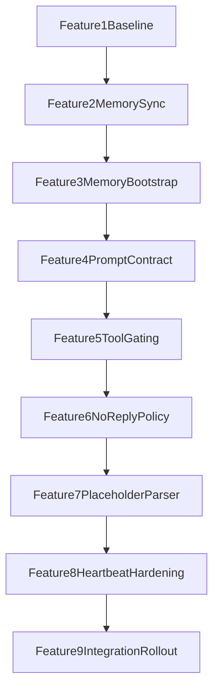

# Runtime Reliability Recovery Plan (Split by Feature Track)

## 0) Recovery Operating Contract

We will not repeat the previous "all at once" approach. This plan is intentionally split into independent feature tracks, each with:

- isolated scope
- isolated files
- isolated tests
- explicit acceptance gate
- explicit rollback point
- mandatory user confirmation before starting the next track

Execution rule: **one feature track at a time, then stop, validate, and ask approval**.

## 1) Context & Goal

We need to stabilize runtime reliability for OpenClaw Mission Control after failed bundled attempts. The goal is to resolve recurring issues around memory file reads, `read` tool misuse, and delivery no-reply behavior without masking failures, while keeping behavior traceable and reversible feature by feature.

Key constraints:

- Keep error visibility; do not suppress or rewrite genuine failures.
- Avoid broad refactors in a single pass.
- Align runtime prompt sources (`runtime defaults`, `docs`, `seed`) to prevent drift.
- Validate each track with logs and tests before proceeding.

## 2) Codebase Research Summary

### Files and modules inspected

- [apps/runtime/src/delivery.ts](apps/runtime/src/delivery.ts)
- [apps/runtime/src/delivery.test.ts](apps/runtime/src/delivery.test.ts)
- [apps/runtime/src/heartbeat.ts](apps/runtime/src/heartbeat.ts)
- [apps/runtime/src/heartbeat.test.ts](apps/runtime/src/heartbeat.test.ts)
- [apps/runtime/src/gateway.ts](apps/runtime/src/gateway.ts)
- [apps/runtime/src/gateway.test.ts](apps/runtime/src/gateway.test.ts)
- [apps/runtime/src/openclaw-profiles.ts](apps/runtime/src/openclaw-profiles.ts)
- [apps/runtime/src/openclaw-profiles.test.ts](apps/runtime/src/openclaw-profiles.test.ts)
- [apps/runtime/openclaw/start-openclaw.sh](apps/runtime/openclaw/start-openclaw.sh)
- [apps/runtime/docker-compose.runtime.yml](apps/runtime/docker-compose.runtime.yml)
- [docs/runtime/AGENTS.md](docs/runtime/AGENTS.md)
- [docs/runtime/HEARTBEAT.md](docs/runtime/HEARTBEAT.md)
- [packages/backend/convex/seed.ts](packages/backend/convex/seed.ts)
- [apps/runtime/README.md](apps/runtime/README.md)
- latest stash `stash@{0}` (13 files, +438/-81)
- transcript and runtime logs from this incident

### Findings driving the split

- `read tool called without path` appears independently from missing memory file errors.
- missing per-agent daily notes (`/root/clawd/agents/<slug>/memory/YYYY-MM-DD.md`) is a separate bootstrapping/scaffold issue.
- delivery no-response retry/give-up behavior is a separate reliability policy issue.
- tool-capability prompt gating is a separate prompt-construction issue.
- bundle-application from stash created high blast radius; tracks must be separated.

## 3) High-Level Design

We use a feature-track pipeline where each track hardens exactly one fault domain.

Design choices:

- each track is shippable and revertable on its own
- each track has explicit acceptance criteria and log signatures
- progression is blocked until user approves the current track

## 4) File & Module Changes by Feature

### Feature 1 - Baseline and reproducibility

- [docs/runtime/runtime-reliability-recovery-checklist.md](docs/runtime/runtime-reliability-recovery-checklist.md) (new)
  - capture baseline error signatures and success criteria
  - define per-track pass/fail gates

### Feature 2 - Per-agent memory scaffold in profile sync

- [apps/runtime/src/openclaw-profiles.ts](apps/runtime/src/openclaw-profiles.ts)
  - add helper to ensure per-agent `MEMORY.md`, `memory/WORKING.md`, and rolling daily notes
- [apps/runtime/src/openclaw-profiles.test.ts](apps/runtime/src/openclaw-profiles.test.ts)
  - add scaffold-focused tests with deterministic date expectations

### Feature 3 - Startup backfill for existing workspaces

- [apps/runtime/openclaw/start-openclaw.sh](apps/runtime/openclaw/start-openclaw.sh)
  - add idempotent scan/backfill over existing `/root/clawd/agents/*` directories

### Feature 4 - Prompt contract alignment for read/memory usage

- [apps/runtime/src/heartbeat.ts](apps/runtime/src/heartbeat.ts)
- [apps/runtime/src/delivery.ts](apps/runtime/src/delivery.ts)
- [docs/runtime/AGENTS.md](docs/runtime/AGENTS.md)
- [docs/runtime/HEARTBEAT.md](docs/runtime/HEARTBEAT.md)
- [packages/backend/convex/seed.ts](packages/backend/convex/seed.ts)
  - align guidance: memory-first loading, strict read argument format, directory-read prohibition

### Feature 5 - Runtime tool availability gating

- [apps/runtime/src/delivery.ts](apps/runtime/src/delivery.ts)
- [apps/runtime/src/delivery.test.ts](apps/runtime/src/delivery.test.ts)
  - gate capability instructions by actual runtime tool schemas, not only behavior flags

### Feature 6 - Delivery no-reply policy

- [apps/runtime/src/delivery.ts](apps/runtime/src/delivery.ts)
- [apps/runtime/src/delivery.test.ts](apps/runtime/src/delivery.test.ts)
  - classify retries by notification intent
  - make exhausted required-reply behavior explicit and observable

### Feature 7 - Gateway placeholder parser hardening

- [apps/runtime/src/gateway.ts](apps/runtime/src/gateway.ts)
- [apps/runtime/src/gateway.test.ts](apps/runtime/src/gateway.test.ts)
  - support all known no-reply placeholder variants

### Feature 8 - Heartbeat hardening (orchestrator/runtime messaging)

- [apps/runtime/src/heartbeat.ts](apps/runtime/src/heartbeat.ts)
- [apps/runtime/src/heartbeat.test.ts](apps/runtime/src/heartbeat.test.ts)
  - ensure explicit runtime capability messaging and reliable fallback instructions
  - keep no error suppression behavior

### Feature 9 - Integration and rollout guardrails

- [apps/runtime/docker-compose.runtime.yml](apps/runtime/docker-compose.runtime.yml)
- [apps/runtime/README.md](apps/runtime/README.md)
- [docs/runtime/runtime-reliability-recovery-checklist.md](docs/runtime/runtime-reliability-recovery-checklist.md)
  - confirm runtime doc path wiring and rollout verification procedure

## 5) Step-by-Step Tasks (One Feature at a Time)

1. **Feature 1: Baseline and reproducibility**

- Capture current error signatures from logs (`read tool called without path`, `ENOENT`, `EISDIR`, no-reply loop signatures).
- Define exact pass criteria for each upcoming track.
- **Gate 1 (must approve):** "Baseline report accepted."

2. **Feature 2: Per-agent memory scaffold in profile sync**

- Implement scaffold helper and tests.
- Validate by unit tests only.
- **Gate 2:** "Unit tests pass and scope limited to profile sync."

3. **Feature 3: Startup backfill for existing workspaces**

- Add shell backfill logic in startup script.
- Validate by Docker restart + file existence checks.
- **Gate 3:** "No per-agent daily-memory ENOENT in first cycle."

4. **Feature 4: Prompt contract alignment**

- Align runtime/docs/seed text for read usage and memory behavior.
- Add prompt assertions where possible.
- **Gate 4:** "Prompt contract diff accepted; no drift."

5. **Feature 5: Tool availability gating**

- Reintroduce schema-derived tool gating and tests.
- **Gate 5:** "No instructions for unavailable tools."

6. **Feature 6: Delivery no-reply policy**

- Rework retry/fallback matrix by notification type.
- Add tests for each notification category.
- **Gate 6:** "Retry behavior matches matrix and is observable."

7. **Feature 7: Gateway placeholder parser**

- Extend parser and tests for alternate placeholder variants.
- **Gate 7:** "Parser covers all known placeholder strings."

8. **Feature 8: Heartbeat hardening**

- Apply heartbeat-specific reliability messaging and tests.
- Keep explicit no-suppression behavior.
- **Gate 8:** "Heartbeat behavior stable; no hidden failures."

9. **Feature 9: Integration soak + rollout**

- Run Docker integration across a full heartbeat wave.
- Verify all signature checks from Feature 1 baseline.
- Produce final rollout + rollback checklist.
- **Gate 9:** "User signs off go-live criteria."

## 6) Edge Cases & Risks

- timezone day boundaries causing daily-note name mismatch
- existing stale agent directories with partial memory structure
- prompt drift between runtime defaults and seeded docs
- no-reply policy too aggressive or too lenient
- merging multiple tracks in one commit by mistake

Mitigations:

- UTC-consistent date strategy
- idempotent startup backfill
- explicit text parity checks across runtime/docs/seed
- retry matrix tests per notification type
- strict "one track per commit/PR" discipline

## 7) Testing Strategy

Per feature:

- Feature 2: unit tests in [apps/runtime/src/openclaw-profiles.test.ts](apps/runtime/src/openclaw-profiles.test.ts)
- Feature 3: Docker restart + memory path checks
- Feature 4: prompt assertions in [apps/runtime/src/heartbeat.test.ts](apps/runtime/src/heartbeat.test.ts) and [apps/runtime/src/delivery.test.ts](apps/runtime/src/delivery.test.ts)
- Feature 5/6: delivery unit tests in [apps/runtime/src/delivery.test.ts](apps/runtime/src/delivery.test.ts)
- Feature 7: parser unit tests in [apps/runtime/src/gateway.test.ts](apps/runtime/src/gateway.test.ts)
- Feature 8: heartbeat unit tests in [apps/runtime/src/heartbeat.test.ts](apps/runtime/src/heartbeat.test.ts)
- Feature 9: full Docker soak and log verification against baseline signatures

Manual checks after each feature:

- verify expected errors reduced for that feature only
- verify no unrelated behavior regressed
- verify log clarity improved (not suppressed)

## 8) Rollout / Migration

- deploy by feature track sequence, not as a single batch
- if any gate fails, revert only the latest feature track
- keep a running incident checklist doc with:
  - what changed
  - what improved
  - what still fails
  - go/no-go decision

## 9) TODO Checklist (Split by Feature)

### Feature 1 - Baseline and reproducibility

- Create baseline error signature report from current logs
- Define quantitative pass criteria per feature track
- Create recovery checklist document

### Feature 2 - Profile sync memory scaffold

- Implement per-agent memory scaffold helper
- Add profile-sync scaffold tests
- Validate tests and isolate commit scope

### Feature 3 - Startup backfill

- Add idempotent startup backfill loop for existing agent directories
- Validate with Docker restart and first heartbeat cycle logs

### Feature 4 - Prompt contract alignment

- Update heartbeat prompt contract
- Update delivery prompt contract
- Align runtime docs (`AGENTS.md`, `HEARTBEAT.md`)
- Align seed docs in Convex seed content

### Feature 5 - Tool availability gating

- Implement schema-driven tool availability gating in delivery formatter
- Add and pass delivery tests for unavailable-tool suppression

### Feature 6 - Delivery no-reply policy

- Implement retry matrix by notification type
- Add and pass delivery tests for retry/no-reply behavior
- Verify fallback behavior is explicit and observable

### Feature 7 - Gateway placeholder parsing

- Extend parser for alternate no-reply placeholder forms
- Add and pass parser tests

### Feature 8 - Heartbeat hardening

- Apply heartbeat reliability wording updates
- Add/adjust heartbeat tests
- Verify no suppression path is introduced

### Feature 9 - Integration and rollout

- Run full runtime test suite and typechecks
- Run Docker integration soak across all agents
- Compare logs against baseline signatures
- Produce final go/no-go report
- Stop for user approval after each feature track
