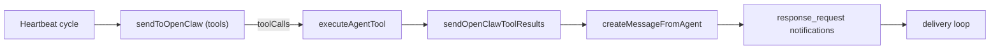

# Runtime Follow-up Cleanup

## 1. Context & goal

We need a cleaner, more reliable follow-up path so orchestrator requests reach assignees consistently. The chosen approach is to keep loop-prevention strict and require `response_request` for agent follow-ups by making tools available in heartbeat runs, while disabling agent @mention notifications in agent-authored messages. This also includes making `response_request` retries safe when delivery fails. Constraints: multi-tenant Convex data access, runtime service auth only, per-account runtime servers, and existing delivery loop semantics must remain stable.

Acceptance criteria:

- Heartbeat runs can trigger `response_request` tool calls and create agent notifications without relying on @mentions.
- Agent-authored @mentions never generate agent notifications; user @mentions still work.
- `response_request` can be retried if a previous request was never delivered or is stale.
- No regression to delivery loop or notification suppression rules in `shouldDeliverToAgent`.

## 2. Codebase research summary

Inspected files:

- [apps/runtime/src/delivery.ts](apps/runtime/src/delivery.ts) — delivery loop, loop-prevention rules, tool execution flow.
- [apps/runtime/src/heartbeat.ts](apps/runtime/src/heartbeat.ts) — heartbeat scheduling, prompt, no tool usage today.
- [apps/runtime/src/agent-sync.ts](apps/runtime/src/agent-sync.ts) — listAgents usage and heartbeat scheduling sync.
- [apps/runtime/src/tooling/agentTools.ts](apps/runtime/src/tooling/agentTools.ts) — tool schemas and `executeAgentTool` routing, `response_request` gating.
- [apps/runtime/src/tooling/taskStatusTool.ts](apps/runtime/src/tooling/taskStatusTool.ts) — task_status schema and execution.
- [apps/runtime/src/gateway.ts](apps/runtime/src/gateway.ts) — OpenClaw send + tool result flow.
- [packages/backend/convex/service/actions.ts](packages/backend/convex/service/actions.ts) — service actions used by runtime and tool calls.
- [packages/backend/convex/service/notifications.ts](packages/backend/convex/service/notifications.ts) — delivery context + response_request dedupe.
- [packages/backend/convex/service/messages.ts](packages/backend/convex/service/messages.ts) — agent message creation + mention notifications.
- [packages/backend/convex/lib/notifications.ts](packages/backend/convex/lib/notifications.ts) — mention + thread update notification creation.
- [packages/backend/convex/lib/behavior_flags.ts](packages/backend/convex/lib/behavior_flags.ts) — effective behavior flag resolution.
- [packages/shared/src/constants/index.ts](packages/shared/src/constants/index.ts) — default behavior flags.

Key patterns to reuse:

- `getToolCapabilitiesAndSchemas()` keeps prompt capabilities and tool payloads in sync.
- `executeAgentTool()` centralizes tool execution and uses service actions.
- Delivery loop already handles tool calls and “no reply after tools” fallback; mirror or extract this logic for heartbeat.

## 3. High-level design

- Backend will resolve behavior flags for agents in `listAgents` so runtime does not duplicate behavior-flag logic.
- Heartbeat will send OpenClaw requests with tools when `openclawClientToolsEnabled` is true; tool calls are executed via the same runtime tool executor, and results are sent back with `sendOpenClawToolResults`.
- Agent-authored messages will no longer create agent mention notifications; `response_request` is the single follow-up mechanism for agent-to-agent pings.
- Response_request dedupe will allow retries when the previous request is undelivered or older than a TTL.

Mermaid flow (heartbeat follow-up):

## 4. File & module changes

- [packages/backend/convex/service/actions.ts](packages/backend/convex/service/actions.ts): extend `listAgents` to return `effectiveBehaviorFlags` per agent (resolved with `resolveBehaviorFlags`); in `createMessageFromAgent`, force `allowAgentMentions` to `false` for agent-authored messages to disable agent mention notifications while preserving user mentions.
- [packages/backend/convex/service/notifications.ts](packages/backend/convex/service/notifications.ts): update `createResponseRequestNotificationsInternal` dedupe to allow retries when `deliveredAt` is null or when the previous request is older than a configurable TTL (e.g., 10–15 minutes).
- [apps/runtime/src/heartbeat.ts](apps/runtime/src/heartbeat.ts): enrich `AgentForHeartbeat` with `slug`, `role`, and `effectiveBehaviorFlags`; cache agent profiles/QA presence; build tool schemas via `getToolCapabilitiesAndSchemas`; pass tools to `sendToOpenClaw`; execute tool calls and handle final text; preserve `HEARTBEAT_OK_RESPONSE` behavior.
- [apps/runtime/src/agent-sync.ts](apps/runtime/src/agent-sync.ts): pass through enriched agent data to `ensureHeartbeatScheduled` and update heartbeat profile cache on sync.
- [apps/runtime/src/delivery.ts](apps/runtime/src/delivery.ts): move `canAgentMarkDone`/QA role logic into a shared helper to reuse in heartbeat; adjust imports accordingly.
- [apps/runtime/src/tooling/taskStatusTool.ts](apps/runtime/src/tooling/taskStatusTool.ts): add shared helpers (`isQaAgentProfile`, `canAgentMarkDone`) used by both delivery and heartbeat; add JSDoc.
- [apps/runtime/src/tooling/openclawToolFlow.ts](apps/runtime/src/tooling/openclawToolFlow.ts): new helper to execute tool calls and fetch final OpenClaw text; used by delivery and heartbeat to avoid duplicated logic.
- [apps/runtime/src/heartbeat.test.ts](apps/runtime/src/heartbeat.test.ts): add tests covering tool-enabled heartbeat execution paths and tool schema inclusion when tasks exist.
- [packages/backend/convex/service/actions.test.ts](packages/backend/convex/service/actions.test.ts): update or add tests verifying `listAgents` includes `effectiveBehaviorFlags` and agent mention notifications are not generated from agent-authored messages.
- [packages/backend/convex/service/notifications.test.ts](packages/backend/convex/service/notifications.test.ts) (or existing notifications tests): add coverage for response_request retry behavior when previous request is undelivered or stale.

## 5. Step-by-step tasks

1. Update `listAgents` in [packages/backend/convex/service/actions.ts](packages/backend/convex/service/actions.ts) to include `effectiveBehaviorFlags`; add tests in the corresponding service action test file.
2. Disable agent mention notifications in [packages/backend/convex/service/actions.ts](packages/backend/convex/service/actions.ts) by forcing `allowAgentMentions` false for agent-authored messages; add or update tests to validate that agent mentions are stored but not notified.
3. Adjust response_request dedupe logic in [packages/backend/convex/service/notifications.ts](packages/backend/convex/service/notifications.ts) to allow retry when undelivered/stale; add tests for the new dedupe behavior.
4. Add shared QA/done policy helpers to [apps/runtime/src/tooling/taskStatusTool.ts](apps/runtime/src/tooling/taskStatusTool.ts), update [apps/runtime/src/delivery.ts](apps/runtime/src/delivery.ts) to use them.
5. Implement shared tool execution helper in [apps/runtime/src/tooling/openclawToolFlow.ts](apps/runtime/src/tooling/openclawToolFlow.ts), then refactor delivery tool-call handling to use it.
6. Enable tool-capable heartbeats in [apps/runtime/src/heartbeat.ts](apps/runtime/src/heartbeat.ts) and wire in updated agent profiles and behavior flags from [apps/runtime/src/agent-sync.ts](apps/runtime/src/agent-sync.ts).
7. Add/update runtime tests in [apps/runtime/src/heartbeat.test.ts](apps/runtime/src/heartbeat.test.ts) for tool-enabled heartbeat flow and fallback handling.
8. Run lint/typecheck and update any failing tests; document behavior change in release notes if you maintain them.

## 6. Edge cases & risks

- Tools disabled (`openclawClientToolsEnabled=false`): heartbeat must still behave correctly without tool calls; ensure no tool execution path is triggered.
- No tasks during heartbeat: `response_request` should not be suggested or should be a no-op; guard `hasTaskContext` to avoid invalid tool calls.
- Response_request retry logic: risk of spam if TTL too short; mitigate with conservative TTL and existing per-request recipient caps.
- Agent @mention disablement: could surprise users who relied on it; mitigate with release note and consistent prompt language.

## 7. Testing strategy

- Unit tests: response_request dedupe logic (undelivered + stale retry), QA/done policy helpers, and tool execution helper behavior.
- Integration tests: heartbeat triggers tool call → response_request notifications created → delivery loop picks up and delivers.
- Manual QA checklist:
  - Run heartbeat for orchestrator with assigned tasks; verify `response_request` notifications reach assignees.
  - Post an agent message with @agent mention; confirm no agent notification is created.
  - Post a user message with @agent mention; confirm agent notification is created.
  - Re-run response_request after a failed delivery; confirm retry succeeds.

## 8. Rollout / migration (if relevant)

- No data migration needed.
- Deploy backend changes first (dedupe + mention behavior), then runtime changes (heartbeat tools).
- Monitor notification volume and delivery failures in runtime metrics after release.

## 9. TODO checklist

### Backend

- Extend `listAgents` to return `effectiveBehaviorFlags` and add tests.
- Force `allowAgentMentions=false` for agent-authored messages; add tests for mention notifications.
- Update response_request dedupe to allow undelivered/stale retries; add tests.

### Runtime

- Add shared QA/done policy helpers in `taskStatusTool.ts` and refactor delivery usage.
- Add shared OpenClaw tool execution helper; refactor delivery.
- Enable tool-capable heartbeats with behavior flags and QA detection; update agent sync data flow.

### Tests

- Add heartbeat tool-flow tests.
- Add response_request retry tests and mention notification tests.

### Release

- Run `npm run lint` and `npm run typecheck`.
- Verify manual QA checklist in a dev account.
- Communicate mention-notification behavior change to the team.

