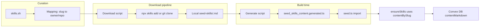

# Seed skills from [skills.sh](http://skills.sh)

## 1. Context and goal

- **Goal:** For each of the 9 seed skills in [packages/backend/convex/seed.ts](packages/backend/convex/seed.ts), pick a matching skill from [skills.sh](https://skills.sh/) (where applicable), download it via the official CLI into a local folder, and use the skill’s markdown content to populate the `contentMarkdown` field so seeded agents get real SKILL.md content from day one.
- **Constraints:** Convex runs in the cloud, so content must be part of the deployed bundle (no runtime file reads). Keep using [validateContentMarkdown](packages/backend/convex/lib/skills_validation.ts) (512 KB limit). Preserve idempotent seed behavior (insert-only for existing skills unless we add an explicit “sync content” option later).

## 2. Codebase research summary

- **[packages/backend/convex/seed.ts](packages/backend/convex/seed.ts):** Defines `seedSkills` (name, slug, description, optional contentMarkdown) and `ensureSkills(ctx, accountId)` which inserts missing skills by slug and uses `contentMarkdown` when provided. Only two skills currently have inline `contentMarkdown` (github-issue-triage, sprint-planning); the other seven are metadata-only.
- **[packages/backend/convex/lib/skills_validation.ts](packages/backend/convex/lib/skills_validation.ts):** `validateContentMarkdown(content)` enforces 512 KB; already used in seed on insert.
- **skills.sh:** Install with `npx skills add <owner/repo>` ([CLI docs](https://skills.sh/docs/cli)). Skills are GitHub repos; typical structure includes a skill definition file (e.g. SKILL.md). Exact install path of the CLI is not documented; the implementation step will need to run the CLI once and inspect where it writes files (or use GitHub raw/content API as fallback to copy SKILL.md into our folder).
- **Runtime:** [apps/runtime/src/openclaw-profiles.ts](apps/runtime/src/openclaw-profiles.ts) writes `contentMarkdown` to `agentDir/skills/<slug>/SKILL.md` during profile sync; no change required there.

## 3. High-level design

- **Curation (manual):** Maintain a mapping from each seed skill `slug` to a skills.sh skill (owner/repo) and optional path to SKILL.md inside the repo (for monorepos like vercel-labs/agent-skills).
- **Download (script):** For each mapping, run the CLI (or fetch from GitHub) and copy the relevant SKILL.md into a fixed folder under the repo, e.g. `packages/backend/convex/seed-skills/<slug>.md`. Committed .md files become the source of truth for content.
- **Generate (script):** Read `seed-skills/*.md`, validate size with the same 512 KB limit, and emit a TypeScript module that exports `contentBySlug: Record<string, string>`. This file lives under `convex/` so it is deployed with Convex.
- **Seed (code):** Import `contentBySlug` from the generated file; in `ensureSkills`, use `s.contentMarkdown ?? contentBySlug[s.slug] ?? undefined` when inserting. Inline `contentMarkdown` in `seedSkills` can remain as fallback for slugs without a file; once all have files, it can be removed.

## 4. Suggested skill mapping (to be confirmed on skills.sh)

Below is a proposed mapping based on the [skills.sh leaderboard](https://skills.sh/) and your seed slugs. Implementer or maintainer should verify each skill’s README and SKILL.md on skills.sh before finalizing.

| Seed slug           | Suggested skills.sh skill (owner/repo)                                                                     | Notes                                                                                             |
| ------------------- | ---------------------------------------------------------------------------------------------------------- | ------------------------------------------------------------------------------------------------- |
| github-issue-triage | Custom / keep or find triage skill                                                                         | Consider receiving-code-review or requesting-code-review (obra/superpowers) if no triage-specific |
| sprint-planning     | obra/superpowers (writing-plans) or keep custom                                                            |                                                                                                   |
| release-management  | jimliu/baoyu-skills (release-skills) or keep custom                                                        |                                                                                                   |
| repo-architecture   | wshobson/agents (architecture-patterns) or softaworks/agent-toolkit (c4-architecture)                      |                                                                                                   |
| frontend-nextjs     | vercel-labs/next-skills (next-best-practices) or vercel-labs/agent-skills (vercel-react-best-practices)    | May need path if repo has multiple skills                                                         |
| backend-convex      | Custom                                                                                                     | No Convex-specific skill on leaderboard; keep or add minimal custom .md                           |
| pr-review           | softaworks/agent-toolkit (qa-test-planner) or wshobson/agents (code-review-excellence) / anthropics/skills |                                                                                                   |
| test-strategy       | obra/superpowers (test-driven-development) or softaworks/agent-toolkit (qa-test-planner)                   |                                                                                                   |
| test-automation     | anthropics/skills (webapp-testing) or wshobson/agents (e2e-testing-patterns)                               |                                                                                                   |

For repos that ship multiple skills (e.g. vercel-labs/agent-skills), the mapping must include the path to the specific SKILL.md (e.g. `vercel-react-best-practices/SKILL.md`). The download script will copy that file to `seed-skills/frontend-nextjs.md`.

## 5. File and module changes

### New files

- **packages/backend/convex/seed-skills/** (directory)
  - Store one `.md` file per seed slug (e.g. `frontend-nextjs.md`, `pr-review.md`). Content is the full SKILL.md body (or equivalent). These files are committed so content is reproducible and the generate step does not depend on network.
- **packages/backend/convex/seed-skills-mapping.json** (or .ts)
  - Mapping from seed `slug` to `{ source: "owner/repo", path?: string }`. `path` is the path inside the repo to the skill file (default `"SKILL.md"` for single-skill repos). Used by the download script only; not imported by Convex at runtime.
- **packages/backend/scripts/seed-skills-download.ts** (or .js)
  - For each entry in the mapping: run `npx skills add <source>` (or clone repo / fetch raw file from GitHub), locate the SKILL.md (by `path`), copy to `convex/seed-skills/<slug>.md`. Create `seed-skills/` if missing. Optionally set `DISABLE_TELEMETRY=1` when calling the CLI. Document in script or README that the CLI install location may need to be discovered once (e.g. project root `.skills` or similar) and the script should copy from there; if the CLI does not expose a stable path, fallback to cloning the GitHub repo and copying the file.
- **packages/backend/scripts/seed-skills-generate.ts** (or .js)
  - Read all `convex/seed-skills/*.md`; for each, validate length with the same 512 KB limit (reuse constant from skills_validation or duplicate the number); build `contentBySlug` (key = filename without extension); write `convex/seed_skills_content.generated.ts` that exports `contentBySlug: Record<string, string>`. Use escaped strings or template literals so the file is valid TypeScript. If a .md file exceeds the limit, fail the script with a clear error.
- **packages/backend/convex/seed_skills_content.generated.ts**
  - Generated; do not edit by hand. Exports `export const contentBySlug: Record<string, string> = { ... }`. Add this path to `.gitignore` only if the team prefers generating in CI; otherwise commit it so `convex deploy` works without a pre-step.

### Existing files to change

- **[packages/backend/convex/seed.ts](packages/backend/convex/seed.ts)**
  - Add: `import { contentBySlug } from "./seed_skills_content.generated";`
  - In the loop inside `ensureSkills`, when inserting a new skill, set `contentMarkdown: s.contentMarkdown ?? contentBySlug[s.slug] ?? undefined`.
  - Optionally remove inline `contentMarkdown` from the two skills that currently have it once their content lives in `seed-skills/<slug>.md` so a single source of truth is used.
- **packages/backend/package.json**
  - Add scripts, e.g. `"seed-skills:download": "tsx scripts/seed-skills-download.ts"`, `"seed-skills:generate": "tsx scripts/seed-skills-generate.ts"`, and optionally `"seed-skills:sync": "npm run seed-skills:download && npm run seed-skills:generate"`. Ensure the generate script runs with CWD or paths such that it reads from `convex/seed-skills/` and writes to `convex/seed_skills_content.generated.ts`.
- **.gitignore** (if generated file is not committed)
  - Add `packages/backend/convex/seed_skills_content.generated.ts`. Otherwise, do not ignore it so it is committed.
- **docs (optional)**
  - Short section in [packages/backend/convex/README.md](packages/backend/convex/README.md) or project docs: how to refresh seed skill content (run download, then generate, then deploy), and that mapping is in `seed-skills-mapping.json`.

## 6. Step-by-step tasks

1. **Curation**

- On [skills.sh](https://skills.sh/) (and GitHub), pick one skill per seed slug (or decide “keep custom” for some). Document the chosen owner/repo and path (if any) in a mapping file. For “keep custom”, add a short `contentMarkdown` in seed or a minimal `seed-skills/<slug>.md` in repo.

1. **Add mapping and folder**

- Create `packages/backend/convex/seed-skills-mapping.json` (or .ts) with shape `{ [slug]: { source: string, path?: string } }`. Create `packages/backend/convex/seed-skills/` and add a `.gitkeep` or one sample .md so the folder is committed.

1. **Download script**

- Create `packages/backend/scripts/seed-skills-download.ts`. Implement: read mapping; for each slug, run `npx skills add <source>` (or clone/fetch from GitHub), resolve the SKILL.md path (repo root or `path`), read that file, write to `convex/seed-skills/<slug>.md`. Handle single-skill vs multi-skill repos via `path`. If CLI install location is unknown, use Node to clone the repo (e.g. `simple-git` or `child_process` + `git clone`) and copy the file. Add npm script `seed-skills:download`.

1. **Generate script**

- Create `packages/backend/scripts/seed-skills-generate.ts`. Read every `.md` in `convex/seed-skills/`, key by basename without extension; check each length &lt;= 512 1024; build `contentBySlug`; write `convex/seed_skills_content.generated.ts` with a single export. Add npm script `seed-skills:generate`. Decide whether to commit the generated file or add it to .gitignore and run generate in CI before deploy.

1. **Wire seed to generated content**

- In `seed.ts`, import `contentBySlug` from `./seed_skills_content.generated`. In `ensureSkills`, use `contentMarkdown: s.contentMarkdown ?? contentBySlug[s.slug] ?? undefined` on insert. Run generate once so the file exists; run `convex run seed:runInternal` (or equivalent) and verify skills get contentMarkdown.

1. **Documentation and CI (optional)**

- Document in README or docs: how to update seed skills (edit mapping, run download, run generate, deploy). If generated file is not committed, add a CI step before Convex deploy to run `seed-skills:generate`.

## 7. Edge cases and risks

- **CLI install path:** The skills CLI may install to a project or user directory that is not documented. Mitigation: implement download script to try the CLI first; if the install path cannot be determined, fall back to cloning the GitHub repo and copying the file from the repo (no dependency on CLI layout).
- **Size limit:** A skill from skills.sh might exceed 512 KB. Mitigation: generate script validates and fails with a clear error; consider truncation or “use first N chars” only if product agrees.
- **Missing or renamed skills:** If a mapped repo or path is removed/renamed, download fails. Mitigation: mapping is in repo; pin to a tag or commit in the mapping if needed; document that updates should be tested locally.
- **Idempotency:** Seed only inserts missing skills; it does not update `contentMarkdown` for existing skills. So existing accounts will keep old content until you add an optional “sync seed content” (e.g. patch existing skill by slug from generated content). Out of scope for this plan unless you explicitly add it.

## 8. Testing strategy

- **Unit:** Generate script: given a folder with one or more .md files, output TS has correct keys and values; given a file &gt; 512 KB, script throws with a clear message.
- **Integration:** After running download + generate, run seed (e.g. against dev) and query skills for the account; confirm skills that have a .md file have non-empty `contentMarkdown` and that runtime (or a test) can write them to SKILL.md.
- **Manual:** Run `seed-skills:download` and `seed-skills:generate`, then `convex run seed:runInternal`; in dashboard, open an agent with assigned skills and confirm profile sync writes SKILL.md under the runtime agent dir (or check Convex skills table contentMarkdown).

## 9. Rollout / migration

- No feature flag needed. New accounts get full content on first seed. Existing accounts keep current skill rows (no automatic overwrite of contentMarkdown). If you later add “sync seed content,” run it as an explicit migration or optional flag on seed.

## 10. TODO checklist

- **Curation:** Choose and document skills.sh mapping for all 9 seed slugs (and paths for multi-skill repos).
- **Repo:** Create `convex/seed-skills/` and `convex/seed-skills-mapping.json` (or .ts).
- **Script:** Implement `scripts/seed-skills-download.ts` (CLI or git clone fallback), add `seed-skills:download` script.
- **Script:** Implement `scripts/seed-skills-generate.ts` (read .md, validate size, write `.generated.ts`), add `seed-skills:generate` script.
- **Convex:** Add `seed_skills_content.generated.ts` (generated) and import + use `contentBySlug` in `seed.ts` for `contentMarkdown`.
- **Decision:** Commit generated file vs generate in CI; update .gitignore if needed.
- **Docs:** Document how to refresh seed skill content (mapping, download, generate, deploy).
- **Test:** Unit test for generate script (size limit, keys); manual run of download + generate + seed; verify contentMarkdown in DB and/or runtime SKILL.md.
