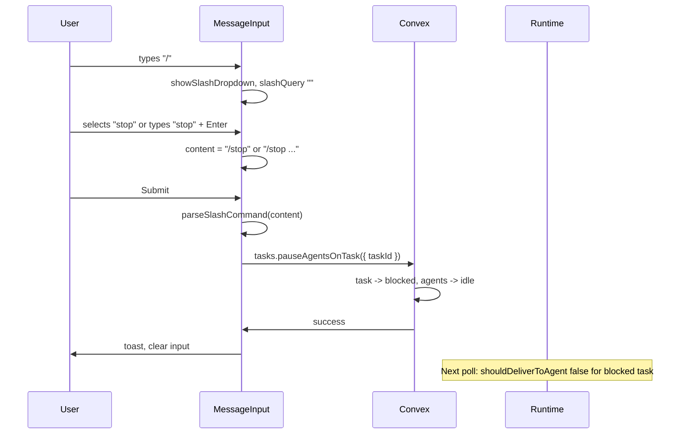

# Slash command /stop — Pause agents on task (emergency stop)

## 1. Context and goal

**Goal:** Let users type `/stop` in the task thread message input to immediately pause all agents on that task (emergency stop for infinite reply loops). This mirrors the existing `@` mention pattern with a new `/` slash-command pattern.

**Constraints:**

- Reuse the same UX pattern as `@`: type `/` to open a command dropdown; first command is `/stop`.
- No new backend services: use existing Convex mutations and task/agent schema.
- Backward compatible: existing messages and flows unchanged.
- Security: only account members can run `/stop` (same as posting a message).

**Mechanism:** Setting the task to **blocked** stops the runtime from delivering further `thread_update` notifications to agents on that task (`[shouldDeliverToAgent](apps/runtime/src/delivery.ts)` returns false when task status is `blocked`). Optionally setting assigned agents to **idle** and clearing `currentTaskId` gives clear UI feedback that they are no longer “on” this task.

---

## 2. Codebase research summary

**Files inspected:**

| Path                                                                                             | Relevance                                                                                                                                                                                                                  |
| ------------------------------------------------------------------------------------------------ | -------------------------------------------------------------------------------------------------------------------------------------------------------------------------------------------------------------------------- |
| [apps/web/src/components/tasks/MessageInput.tsx](apps/web/src/components/tasks/MessageInput.tsx) | Main input: `@` trigger via `/@(\w*)$/`, `showMentionDropdown`, `handleContentChange`, `handleSubmit`, `handleKeyDown`, `insertMention`, `createMessage(api.messages.create)`. Submit flow: trim content → create message. |
| [packages/backend/convex/tasks.ts](packages/backend/convex/tasks.ts)                             | `updateStatus` (status + blockedReason), `requireAccountMember`, task patch, status-change notifications, `logActivity`. Transition rules live in `task_workflow`.                                                         |
| [packages/backend/convex/lib/task_workflow.ts](packages/backend/convex/lib/task_workflow.ts)     | `TASK_STATUS_TRANSITIONS`: `blocked` only from `assigned` or `in_progress`. `validateStatusRequirements`: blocked requires `blockedReason`.                                                                                |
| [packages/backend/convex/agents.ts](packages/backend/convex/agents.ts)                           | `updateStatus(agentId, status, currentTaskId)` — user-facing; used by AgentStatusDialog.                                                                                                                                   |
| [packages/backend/convex/schema.ts](packages/backend/convex/schema.ts)                           | Agent status: `online`, `busy`, `idle`, `offline`, `error`. Task: `blockedReason`, `assignedAgentIds`.                                                                                                                     |
| [apps/runtime/src/delivery.ts](apps/runtime/src/delivery.ts)                                     | `shouldDeliverToAgent`: for `thread_update` + agent author, returns false when `taskStatus` is `done` or `blocked` (avoids reply loops).                                                                                   |

**Patterns to reuse:**

- Mention: trigger regex → dropdown state → query/filter list → select with Enter/Tab → insert text. Same pattern for `/`: trigger `/(\w*)$/` → slash dropdown → filter commands by query → select → insert command text.
- Submit: before calling `createMessage`, check if trimmed content is a slash command; if so, run command handler and return without creating a message.
- Task status: use same activity/notifications as `updateStatus` (e.g. `logActivity`, `createStatusChangeNotification`). Agent status: direct `ctx.db.patch` in a single mutation (Convex mutations cannot call other mutations).

---

## 3. High-level design

- **UI:** MessageInput gains slash-command state (e.g. `showSlashDropdown`, `slashQuery`, `selectedSlashIndex`) and a command list; on change, detect `/` and show dropdown; on submit, if content is a slash command, call the corresponding Convex mutation and do not create a message.
- **Backend:** New mutation `tasks.pauseAgentsOnTask({ taskId })`: validate task and member; if status is `assigned` | `in_progress` | `review`, set task to `blocked` with `blockedReason: "Paused by user (/stop)"`, patch all `task.assignedAgentIds` to `status: "idle"`, `currentTaskId: undefined`, log task and agent activities; otherwise return a clear error.
- **Workflow:** Allow `review` → `blocked` only for this emergency path (either in a dedicated transition check in the new mutation or by adding `blocked` to `review` in `TASK_STATUS_TRANSITIONS` so one code path handles it).

---

## 4. File and module changes

### 4.1 Backend

- **[packages/backend/convex/lib/task_workflow.ts](packages/backend/convex/lib/task_workflow.ts)**
  - In `TASK_STATUS_TRANSITIONS`, add `"blocked"` to `review`’s array so `review` → `blocked` is valid (enables emergency stop from review; UI can still choose whether to expose “Block” from review elsewhere).
- **[packages/backend/convex/tasks.ts](packages/backend/convex/tasks.ts)**
  - New mutation `pauseAgentsOnTask`: args `{ taskId }`.
  - `requireAccountMember` on task’s account; load task.
  - If `task.status` not in `["assigned", "in_progress", "review"]`, throw with a clear message (e.g. "Task can only be paused when status is Assigned, In progress, or Review").
  - If already `blocked`, no-op and return (or return a success flag).
  - Patch task: `status: "blocked"`, `blockedReason: "Paused by user (/stop)"`, `updatedAt`.
  - For each `task.assignedAgentIds`: get agent, `ctx.db.patch(agentId, { status: "idle", currentTaskId: undefined, lastHeartbeat: Date.now() })`, and `logActivity` for `agent_status_changed` (actorType `"user"`, same userId/userName from auth).
  - Send status-change notifications (reuse same pattern as `updateStatus`: `createStatusChangeNotification` for users and agents).
  - `logActivity` for `task_status_changed` with meta including `oldStatus`, `newStatus: "blocked"`, `blockedReason`.
  - Return a simple success payload (e.g. `{ paused: true }`).

### 4.2 Frontend

- **[apps/web/src/components/tasks/MessageInput.tsx](apps/web/src/components/tasks/MessageInput.tsx)**
  - **Slash command types:** Define a small type/list of slash commands, e.g. `{ id: "stop", label: "stop", description: "Pause all agents on this task (emergency stop)" }`.
  - **State:** `showSlashDropdown`, `slashQuery`, `slashStartIndex`, `selectedSlashIndex` (mirror mention state).
  - **Trigger in `handleContentChange`:** Besides `@` check, detect `/` with a regex (e.g. `/(\w*)$/` on text before cursor). When matched: set `showSlashDropdown` true, `slashQuery` to the captured part, `slashStartIndex`; when not matched: clear slash state. Ensure only one of mention or slash dropdown is active (e.g. if `/` matched, set mention dropdown false).
  - **Filtered commands:** `useMemo`: filter command list by `slashQuery` (prefix or contains).
  - **Insert slash command:** `insertSlashCommand(commandId)` (or label): replace segment from `slashStartIndex` with `/stop` (or chosen command + space), clear slash state, focus textarea.
  - **Keyboard in `handleKeyDown`:** When `showSlashDropdown` and there are filtered commands: ArrowDown/ArrowUp update `selectedSlashIndex`; Enter/Tab select and insert command; Escape close dropdown.
  - **Submit in `handleSubmit`:** Before `createMessage`, `trimContent = content.trim()`. If `trimContent === "/stop"` or `trimContent.startsWith("/stop ")`: call `pauseAgentsOnTask({ taskId })`, on success toast "Agents paused" (or similar), clear content and slash state, return; on error toast error. Otherwise call existing `createMessage` and clear content.
  - **Dropdown UI:** When `showSlashDropdown`, render a dropdown above the input (same positioning pattern as mention dropdown), with header “Slash command” and list of filtered commands; each item shows `/stop` and description; click or Enter selects and inserts.
  - **Click outside:** Same `containerRef` click-outside logic should close slash dropdown (and mention dropdown) when clicking outside.
  - **Hints:** Add a hint line for “/” commands (e.g. “/ stop agents”) next to the existing “@ mention” hint.

### 4.3 Shared / types

- No new shared package types required. Command list can live in MessageInput or a tiny `slashCommands.ts` in the same component folder if we want to keep the component file smaller.

---

## 5. Step-by-step tasks

1. **Workflow: allow review → blocked**
   In [packages/backend/convex/lib/task_workflow.ts](packages/backend/convex/lib/task_workflow.ts), add `"blocked"` to the `review` entry in `TASK_STATUS_TRANSITIONS`.
2. **Backend: `pauseAgentsOnTask` mutation**
   In [packages/backend/convex/tasks.ts](packages/backend/convex/tasks.ts), implement `pauseAgentsOnTask` as described: auth, load task, validate status in `["assigned","in_progress","review"]`, no-op if already blocked, patch task to blocked with reason, patch each assigned agent to idle and clear currentTaskId, log activities, send status-change notifications, return.
3. **Frontend: slash command list and parsing**
   In MessageInput (or a small co-located helper), define the list of slash commands and a `parseSlashCommand(trimmedContent)` that returns `{ command: "stop", reason?: string } | null` for `/stop` and `/stop <reason>` (reason optional for future use).
4. **Frontend: slash dropdown state and trigger**
   In [apps/web/src/components/tasks/MessageInput.tsx](apps/web/src/components/tasks/MessageInput.tsx), add state for slash dropdown; in `handleContentChange`, add regex for `/` and set/clear slash state; ensure at most one of mention/slash dropdown is open.
5. **Frontend: filtered commands and insert**
   Add `filteredSlashCommands` (useMemo from command list + slashQuery), `insertSlashCommand`, and in `handleKeyDown` handle ArrowUp/ArrowDown/Enter/Tab/Escape for slash dropdown; on select, insert `/stop` (or selected command + space).
6. **Frontend: submit handling**
   In `handleSubmit`, if `parseSlashCommand(content.trim())` returns `{ command: "stop" }`, call `api.tasks.pauseAgentsOnTask({ taskId })`, show toast, clear input, return; else keep existing createMessage flow.
7. **Frontend: slash dropdown UI**
   Add the slash-command dropdown markup (above input, same pattern as mention dropdown), with header and list of filtered commands; wire click and keyboard selection to `insertSlashCommand`.
8. **Frontend: click outside and hints**
   Ensure click-outside closes slash dropdown; add “/” to the keyboard hints line (e.g. “/ command”).
9. **Tests and QA**
   Manual: open task thread, type `/`, see /stop; select and submit, task becomes blocked and agents idle; try /stop on inbox/done and see error. Optionally add a unit test for `parseSlashCommand` and an integration test for `pauseAgentsOnTask` (status transitions, agent patches, activity logs).

---

## 6. Edge cases and risks

| Case                                              | Handling                                                                                                                                                        |
| ------------------------------------------------- | --------------------------------------------------------------------------------------------------------------------------------------------------------------- |
| Task already blocked                              | No-op in mutation, return success; optional toast “Task is already paused.”                                                                                     |
| Task inbox or done                                | Throw with clear message; toast error in UI.                                                                                                                    |
| No assigned agents                                | Still set task to blocked; no agent patches.                                                                                                                    |
| User not account member                           | `requireAccountMember` throws; UI shows generic error toast.                                                                                                    |
| Race: task status changed between open and submit | Mutation re-reads task; if status no longer pausable, throw.                                                                                                    |
| Slash in middle of message                        | Only treat as command when submission is exactly `/stop` or starts with `/stop` (trimmed). No dropdown for `/` in middle unless we explicitly support it later. |
| Delivery in flight                                | Runtime will not deliver further thread_update once task is blocked; in-flight replies may still complete (acceptable for “stop” semantics).                    |

**Risks:**

- Adding `review` → `blocked` allows any UI that uses `updateStatus` to move review → blocked. If that’s undesired, keep transition only inside `pauseAgentsOnTask` (custom transition check) and do not change `TASK_STATUS_TRANSITIONS`.
- No feature flag in scope; can add later if needed.

---

## 7. Testing strategy

- **Unit:** `parseSlashCommand`: `/stop`, `/stop` , `/stop reason`, `/stop`, `foo` → null. Backend: `pauseAgentsOnTask` with different task statuses (assigned, in_progress, review, inbox, done, blocked), with and without assigned agents; verify task and agent patches and activity logs.
- **Integration:** From MessageInput, submit `/stop` and assert task status blocked and agents idle (or use Convex test helpers).
- **Manual QA:** Type `/` → dropdown with /stop; select with mouse/Enter; submit with Enter; confirm task blocked, agents idle, toast; try invalid statuses and confirm error; confirm normal messages still send when content is not a slash command.

---

## 8. Rollout / migration

- No data migration. New mutation and UI only.
- Deploy backend first so `pauseAgentsOnTask` exists before frontend is deployed.
- Optional: log or metric when `/stop` is used for future tuning.

---

## 9. TODO checklist

**Backend**

- Add `"blocked"` to `review` in `TASK_STATUS_TRANSITIONS` in [packages/backend/convex/lib/task_workflow.ts](packages/backend/convex/lib/task_workflow.ts) (or keep transition only inside new mutation).
- Implement `pauseAgentsOnTask` in [packages/backend/convex/tasks.ts](packages/backend/convex/tasks.ts): auth, task load, status check, task patch, agent patches, notifications, activity logs.

**Frontend**

- Add slash command list and `parseSlashCommand` (in MessageInput or small helper).
- Add state: `showSlashDropdown`, `slashQuery`, `slashStartIndex`, `selectedSlashIndex` in [apps/web/src/components/tasks/MessageInput.tsx](apps/web/src/components/tasks/MessageInput.tsx).
- In `handleContentChange`, detect `/` and set/clear slash dropdown; keep only one of mention/slash open.
- Add `filteredSlashCommands`, `insertSlashCommand`, and slash dropdown keyboard handling in `handleKeyDown`.
- In `handleSubmit`, if parsed slash command is `stop`, call `pauseAgentsOnTask`, toast, clear input; else create message.
- Render slash-command dropdown UI and wire click/selection.
- Close slash dropdown on click outside; add “/” hint to keyboard hints.

**Tests**

- Unit test `parseSlashCommand` (and optionally `pauseAgentsOnTask` status/agent/activity behavior).
- Manual QA: `/` dropdown, /stop submit, task blocked and agents idle; error for invalid status; normal message unchanged.
