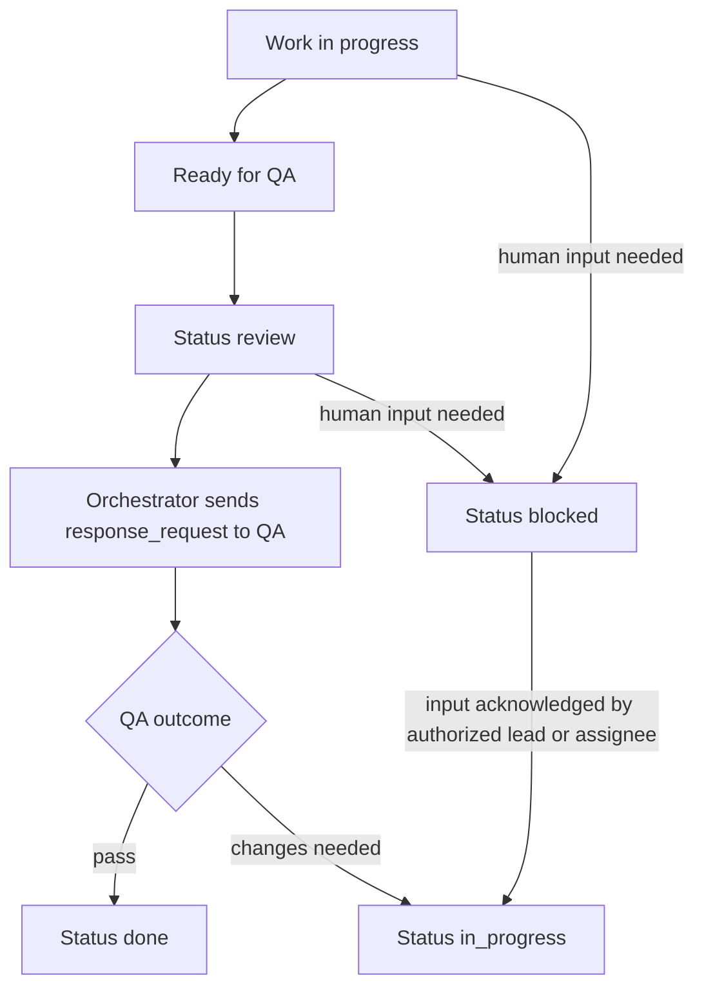

# Workflow Status Rules Alignment Plan

## 0. Setup Checklist

- Requirements/scope documented from user request.
- User stories and acceptance criteria clarified from existing thread context.
- Feature branch created (implementation phase).
- Development environment ready (implementation phase).

Assumptions:

- Assumption A: "Authorized actor" means any agent with `canModifyTaskStatus=true` (including orchestrator and assignees when enabled).
- Assumption B: We will not change backend transition graph; we will align prompts/docs to existing backend enforcement.
- Assumption C: REVIEW is strictly for QA validation (not generic human sign-off), per your requested process.

## 1. Context & goal

We are aligning core agent operating instructions so task-state behavior matches your intended workflow: when human input is required, tasks must be `blocked`; `review` is reserved for QA validation; once blocker input is acknowledged/resolved, an authorized lead or assignee must move the task back to `in_progress` before continuing. This is critical because prompt/docs drift currently causes inconsistent runtime behavior and incorrect status semantics.

Constraints:

- Must stay consistent with current backend enforcement (`TASK_STATUS_TRANSITIONS`, QA-only done rules, `blockedReason` requirement).
- No regressions to existing `response_request` requirement for orchestrator.
- Keep instruction wording deterministic and non-ambiguous across all prompt sources.

## 2. Codebase research summary

Main files audited:

- `[/Users/guillaumedieudonne/Desktop/mission-control/packages/backend/convex/seed.ts](/Users/guillaumedieudonne/Desktop/mission-control/packages/backend/convex/seed.ts)`
- `[/Users/guillaumedieudonne/Desktop/mission-control/apps/runtime/src/delivery.ts](/Users/guillaumedieudonne/Desktop/mission-control/apps/runtime/src/delivery.ts)`
- `[/Users/guillaumedieudonne/Desktop/mission-control/apps/runtime/src/openclaw-profiles.ts](/Users/guillaumedieudonne/Desktop/mission-control/apps/runtime/src/openclaw-profiles.ts)`
- `[/Users/guillaumedieudonne/Desktop/mission-control/docs/runtime/AGENTS.md](/Users/guillaumedieudonne/Desktop/mission-control/docs/runtime/AGENTS.md)`
- `[/Users/guillaumedieudonne/Desktop/mission-control/docs/runtime/HEARTBEAT.md](/Users/guillaumedieudonne/Desktop/mission-control/docs/runtime/HEARTBEAT.md)`
- `[/Users/guillaumedieudonne/Desktop/mission-control/packages/shared/src/constants/index.ts](/Users/guillaumedieudonne/Desktop/mission-control/packages/shared/src/constants/index.ts)`
- `[/Users/guillaumedieudonne/Desktop/mission-control/packages/backend/convex/lib/task_workflow.ts](/Users/guillaumedieudonne/Desktop/mission-control/packages/backend/convex/lib/task_workflow.ts)`
- `[/Users/guillaumedieudonne/Desktop/mission-control/packages/backend/convex/service/actions.ts](/Users/guillaumedieudonne/Desktop/mission-control/packages/backend/convex/service/actions.ts)`
- `[/Users/guillaumedieudonne/Desktop/mission-control/packages/backend/convex/service/tasks.ts](/Users/guillaumedieudonne/Desktop/mission-control/packages/backend/convex/service/tasks.ts)`
- `[/Users/guillaumedieudonne/Desktop/mission-control/apps/runtime/src/delivery.test.ts](/Users/guillaumedieudonne/Desktop/mission-control/apps/runtime/src/delivery.test.ts)`
- `[/Users/guillaumedieudonne/Desktop/mission-control/apps/runtime/src/heartbeat.ts](/Users/guillaumedieudonne/Desktop/mission-control/apps/runtime/src/heartbeat.ts)`
- `[/Users/guillaumedieudonne/Desktop/mission-control/apps/runtime/src/heartbeat.test.ts](/Users/guillaumedieudonne/Desktop/mission-control/apps/runtime/src/heartbeat.test.ts)`

What we learned:

- Prompt/doc drift exists in multiple places: current text still says "If you need human review: move to REVIEW".
- Runtime already enforces QA done semantics and requires `review` before `done`.
- Backend transitions already allow `in_progress -> blocked`, `review -> blocked`, and `blocked -> in_progress`.
- Missing instruction: explicit unblock transition (`blocked -> in_progress`) and who should perform it.
- Missing orchestrator instruction: move to `review` before requesting QA via `response_request`.

## 3. High-level design

No architecture change; this is behavior alignment across instruction layers.

Flow to enforce:

Data/control layers:

- Seeded source-of-truth instructions (`seed.ts`) define persisted agent behavior defaults.
- Runtime prompt assembly (`delivery.ts`) provides per-notification tactical enforcement.
- Runtime fallback template (`openclaw-profiles.ts`) keeps Docker/runtime-generated AGENTS defaults aligned.
- Human-readable docs (`docs/runtime/AGENTS.md`, optional `HEARTBEAT.md`) must mirror same semantics.
- Tests validate prompt content includes critical guardrails.

## 4. File & module changes

Existing files to touch:

- `[/Users/guillaumedieudonne/Desktop/mission-control/packages/backend/convex/seed.ts](/Users/guillaumedieudonne/Desktop/mission-control/packages/backend/convex/seed.ts)`
  - Replace "human review -> REVIEW" with explicit "human dependency -> BLOCKED" language.
  - Update valid-transition guidance to include `in_progress -> blocked`, `review -> blocked`, `blocked -> in_progress`.
  - Update role SOULs (orchestrator, engineer, QA, designer, writer, default) to explicitly disambiguate REVIEW (QA-only) vs BLOCKED (human dependency), and add unblock rule.
- `[/Users/guillaumedieudonne/Desktop/mission-control/apps/runtime/src/delivery.ts](/Users/guillaumedieudonne/Desktop/mission-control/apps/runtime/src/delivery.ts)`
  - Update `statusInstructions` string to codify: human dependency => blocked with `blockedReason`; unblock => move to `in_progress` before resuming.
  - Extend `orchestratorResponseRequestInstruction` to require setting status to `review` before QA `response_request`.
  - Update blocked-task inline reminder (`task?.status === "blocked"`) to include move-back-to-`in_progress` rule once resolved.
- `[/Users/guillaumedieudonne/Desktop/mission-control/apps/runtime/src/openclaw-profiles.ts](/Users/guillaumedieudonne/Desktop/mission-control/apps/runtime/src/openclaw-profiles.ts)`
  - Update `DEFAULT_AGENTS_MD` task-state bullets with same semantics as delivery/seed.
  - Update orchestrator ping/request section to include "move to review first" for QA requests.
- `[/Users/guillaumedieudonne/Desktop/mission-control/docs/runtime/AGENTS.md](/Users/guillaumedieudonne/Desktop/mission-control/docs/runtime/AGENTS.md)`
  - Mirror canonical rules in docs to prevent operational ambiguity.
  - Add one concise "Unblocking" rule: authorized lead/assignee moves blocked tasks back to `in_progress` once needed input arrives.
- `[/Users/guillaumedieudonne/Desktop/mission-control/docs/runtime/HEARTBEAT.md](/Users/guillaumedieudonne/Desktop/mission-control/docs/runtime/HEARTBEAT.md)` (optional but recommended)
  - Add a short cross-reference to AGENTS task-state rules so heartbeat usage does not drift.
- `[/Users/guillaumedieudonne/Desktop/mission-control/apps/runtime/src/delivery.test.ts](/Users/guillaumedieudonne/Desktop/mission-control/apps/runtime/src/delivery.test.ts)`
  - Add assertions for new prompt text:
    - human dependency => blocked
    - blocked resolved => in_progress
    - orchestrator QA request requires review first + response_request.
- `[/Users/guillaumedieudonne/Desktop/mission-control/apps/runtime/src/openclaw-profiles.test.ts](/Users/guillaumedieudonne/Desktop/mission-control/apps/runtime/src/openclaw-profiles.test.ts)` (recommended)
  - Add regression tests that generated default AGENTS template contains updated workflow lines.

No new files required.

## 5. Step-by-step tasks

1. Confirm canonical workflow wording and acceptance criteria in one source paragraph (to reuse verbatim across files).
2. Update task-state rule block in `seed.ts` and all role-specific SOUL fragments where status guidance appears.
3. Update `delivery.ts` `statusInstructions` and `orchestratorResponseRequestInstruction` strings to enforce runtime behavior.
4. Update `openclaw-profiles.ts` `DEFAULT_AGENTS_MD` sections with the same canonical wording.
5. Update `docs/runtime/AGENTS.md` (and optionally `docs/runtime/HEARTBEAT.md`) to mirror runtime behavior exactly.
6. Add/adjust runtime unit tests (`delivery.test.ts`, `openclaw-profiles.test.ts`) to lock critical text semantics.
7. Run targeted tests for runtime package and verify no lints introduced in touched files.
8. Final consistency pass: ensure wording parity across seed/runtime/docs and no contradictory phrases remain (especially "human review -> REVIEW").

## 6. Edge cases & risks

- Risk: Partial update causes drift (seed updated, runtime not updated, or docs stale).
  - Mitigation: use one canonical wording snippet and apply everywhere; run grep checks for old phrase.
- Risk: Agents without `canModifyTaskStatus` cannot perform unblock transition.
  - Mitigation: wording must say "authorized" actor and instruct blocked report when not permitted.
- Risk: Overly rigid wording blocks legitimate non-QA review flows.
  - Mitigation: explicitly define REVIEW as QA validation in this system to avoid ambiguity.
- Risk: Existing behavior around done/QA becomes confusing.
  - Mitigation: keep current done restrictions untouched; only improve state semantics before/around QA.

## 7. Testing strategy

Unit tests:

- `delivery.test.ts`
  - Prompt includes "move to blocked for human dependency".
  - Prompt includes "move back to in_progress when blocker resolved".
  - Orchestrator prompt includes "move to review before requesting QA" and mandatory `response_request`.
- `openclaw-profiles.test.ts`
  - Default AGENTS template includes updated task-state bullets and QA-request sequencing.

Integration/manual checks:

- Build one orchestrator notification for `in_progress` task requiring QA and verify prompt asks review-first + response_request.
- Build blocked-task notification and verify prompt says no substantive work until status updated and then return to `in_progress`.
- Verify old phrase "If you need human review: move to REVIEW" no longer exists in runtime/seed/docs.

Manual QA checklist:

- Orchestrator asks QA: task is moved to `review` first.
- Human clarification needed: task moves to `blocked` with explicit reason.
- After human acknowledgement: authorized actor moves task back to `in_progress`.
- QA pass still required for `done` when QA agent exists.

## 8. Rollout / migration

- No data migration required (instructional and test updates only).
- Safe rollout path:
  - Merge prompt/docs updates + tests in one PR.
  - Validate in staging runtime by simulating one blocked/unblocked cycle and one QA handoff cycle.
- Observability:
  - Review runtime logs for reduced misuses (QA requested while still `in_progress`, or human dependency in `review`).

## 9. TODO checklist

### Backend/Seed

- Update canonical task-state rules in `seed.ts` (human dependency => blocked; unblock => in_progress).
- Update orchestrator/QA/engineer/designer/writer/default SOUL status instructions in `seed.ts`.

### Runtime prompts

- Update `delivery.ts` `statusInstructions` transitions and human-dependency guidance.
- Update `delivery.ts` orchestrator QA instruction to require `review` before `response_request`.
- Update blocked-state runtime reminder in `delivery.ts`.

### Runtime profile defaults/docs

- Update `DEFAULT_AGENTS_MD` in `openclaw-profiles.ts` to match new workflow.
- Update `docs/runtime/AGENTS.md` with the same wording.
- (Optional) Add heartbeat cross-reference in `docs/runtime/HEARTBEAT.md`.

### Tests/validation

- Add regression tests in `delivery.test.ts` for new critical prompt rules.
- Add template regression tests in `openclaw-profiles.test.ts`.
- Run targeted tests and lint checks for touched runtime/backend files.
- Run final grep audit to ensure no stale "human review -> REVIEW" wording remains.

