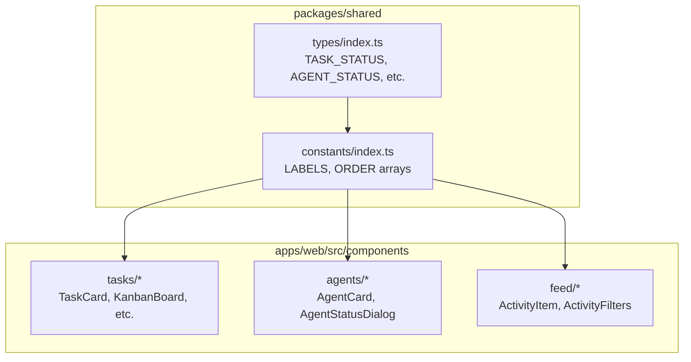

# Frontend Enum Constants Migration

## 1. Context and Goal

Migrate the frontend (`apps/web`) to use the new centralized enum constants pattern established in `@packages/shared`. Currently, many frontend files use hardcoded status strings (e.g., `"online"`, `"inbox"`, `"blocked"`) and some define their own duplicate types. This creates maintenance burden and type safety gaps.

**Key constraints:**

- Must maintain backward compatibility with existing functionality
- Follow existing patterns in `@packages/shared` (`CONSTANT.VALUE` for const objects)
- Avoid breaking any UI/UX behavior
- Keep DRY principle: single source of truth for enum values

## 2. Codebase Research Summary

**Files inspected:**

- `[packages/shared/src/types/index.ts](packages/shared/src/types/index.ts)` - Has `TASK_STATUS`, `AGENT_STATUS`, `MEMBER_ROLE`, etc. as const objects
- `[packages/shared/src/constants/index.ts](packages/shared/src/constants/index.ts)` - Has `TASK_STATUS_ORDER`, `TASK_STATUS_LABELS`, `SKILL_CATEGORY_LABELS`
- `[apps/web/src/components/tasks/KanbanBoard.tsx](apps/web/src/components/tasks/KanbanBoard.tsx)` - Uses `TASK_STATUS_ORDER` but hardcodes `"archived"`
- `[apps/web/src/components/agents/AgentStatusDialog.tsx](apps/web/src/components/agents/AgentStatusDialog.tsx)` - Defines own `AgentStatus` type and `STATUS_OPTIONS`
- `[apps/web/src/components/tasks/TasksPageContent.tsx](apps/web/src/components/tasks/TasksPageContent.tsx)` - Hardcodes `STATUS_FILTER_CONFIG`
- `[apps/web/src/components/feed/ActivityItem.tsx](apps/web/src/components/feed/ActivityItem.tsx)` - Imports `ActivityType` from backend instead of shared

**Missing in @packages/shared:**

- `AGENT_STATUS_LABELS` - Labels for agent status UI
- `AGENT_STATUS_ORDER` - Display order for agent statuses
- `ACTIVITY_TYPE_LABELS` - Labels for activity types
- `NOTIFICATION_TYPE_LABELS` - Labels for notification types

**Existing patterns to follow:**

- Const objects: `TASK_STATUS.INBOX`, `AGENT_STATUS.ONLINE`
- Label records: `TASK_STATUS_LABELS`, `SKILL_CATEGORY_LABELS`
- Order arrays: `TASK_STATUS_ORDER`

## 3. High-Level Design

**Data flow:**

1. `@packages/shared/types` defines const objects (`TASK_STATUS`, `AGENT_STATUS`)
2. `@packages/shared/constants` uses those to define labels, orders, transitions
3. Frontend imports from `@packages/shared` for both constants and types
4. Hardcoded strings replaced with `CONSTANT.VALUE` references

## 4. File and Module Changes

### Phase 1: Add Missing Constants to @packages/shared

`**[packages/shared/src/constants/index.ts](packages/shared/src/constants/index.ts)**`

- Add `AGENT_STATUS_ORDER: readonly AgentStatus[]` - Order: online, busy, idle, offline, error
- Add `AGENT_STATUS_LABELS: Record<AgentStatus, string>` - Human-readable labels
- Add `ACTIVITY_TYPE_LABELS: Record<ActivityType, string>` - Labels for all activity types
- Add `NOTIFICATION_TYPE_LABELS: Record<NotificationType, string>` - Labels for notification types
- Re-export `AGENT_STATUS`, `ACTIVITY_TYPE`, `NOTIFICATION_TYPE` from types

### Phase 2: Update Frontend Components

**Task Components:**

| File                                                                           | Changes                                                                                                                                                                    |
| ------------------------------------------------------------------------------ | -------------------------------------------------------------------------------------------------------------------------------------------------------------------------- |
| `[KanbanBoard.tsx](apps/web/src/components/tasks/KanbanBoard.tsx)`             | Import `TASK_STATUS`; replace `"archived"` with `TASK_STATUS.ARCHIVED`, `"blocked"` with `TASK_STATUS.BLOCKED`, `"inbox"` with `TASK_STATUS.INBOX`                         |
| `[TasksPageContent.tsx](apps/web/src/components/tasks/TasksPageContent.tsx)`   | Import `TASK_STATUS`, derive `STATUS_FILTER_CONFIG` from `TASK_STATUS_ORDER` and `TASK_STATUS_LABELS` (keep custom labels for "in_progress"="Active", "blocked"="Waiting") |
| `[TaskStatusSelect.tsx](apps/web/src/components/tasks/TaskStatusSelect.tsx)`   | Import `TASK_STATUS`; replace `"blocked"`, `"done"` with constants                                                                                                         |
| `[TaskHeader.tsx](apps/web/src/components/tasks/TaskHeader.tsx)`               | Import `TASK_STATUS`; replace `"done"`, `"review"`, `"blocked"`, `"archived"`                                                                                              |
| `[TaskDetailSheet.tsx](apps/web/src/components/tasks/TaskDetailSheet.tsx)`     | Import `TASK_STATUS`; replace `"done"`, `"archived"`, `"review"`, `"blocked"`                                                                                              |
| `[TaskCard.tsx](apps/web/src/components/tasks/TaskCard.tsx)`                   | Import `TASK_STATUS`; replace `"blocked"`                                                                                                                                  |
| `[KanbanColumn.tsx](apps/web/src/components/tasks/KanbanColumn.tsx)`           | Import `TASK_STATUS`; replace `"inbox"`                                                                                                                                    |
| `[ArchiveTaskDialog.tsx](apps/web/src/components/tasks/ArchiveTaskDialog.tsx)` | Import `TASK_STATUS`; replace `"archived"`                                                                                                                                 |

**Agent Components:**

| File                                                                            | Changes                                                                                                                                              |
| ------------------------------------------------------------------------------- | ---------------------------------------------------------------------------------------------------------------------------------------------------- |
| `[AgentStatusDialog.tsx](apps/web/src/components/agents/AgentStatusDialog.tsx)` | Remove local `AgentStatus` type; import `AgentStatus`, `AGENT_STATUS`, `AGENT_STATUS_LABELS` from shared; refactor `STATUS_OPTIONS` to use constants |
| `[AgentCard.tsx](apps/web/src/components/agents/AgentCard.tsx)`                 | Import `AGENT_STATUS`; replace `"online"`, `"busy"` with constants                                                                                   |
| `[TaskAssignees.tsx](apps/web/src/components/tasks/TaskAssignees.tsx)`          | Import `AGENT_STATUS`; replace `"online"`, `"busy"`, `"idle"`, `"offline"`, `"error"`                                                                |
| `[AgentsSidebar.tsx](apps/web/src/components/tasks/AgentsSidebar.tsx)`          | Import `AGENT_STATUS`; replace `"online"`, `"busy"`                                                                                                  |

**Feed/Activity Components:**

| File                                                                                 | Changes                                                                                            |
| ------------------------------------------------------------------------------------ | -------------------------------------------------------------------------------------------------- |
| `[ActivityItem.tsx](apps/web/src/components/feed/ActivityItem.tsx)`                  | Change import of `ActivityType` from `@packages/backend/convex/lib/activity` to `@packages/shared` |
| `[ActivityFilters.tsx](apps/web/src/components/feed/ActivityFilters.tsx)`            | Import `ACTIVITY_TYPE_LABELS` from shared; remove local `ACTIVITY_TYPE_LABELS` definition          |
| `[TaskActivityTimeline.tsx](apps/web/src/components/tasks/TaskActivityTimeline.tsx)` | If it imports `ActivityType` from backend, change to `@packages/shared`                            |

**Page Components:**

| File                                                                                  | Changes                                                                                         |
| ------------------------------------------------------------------------------------- | ----------------------------------------------------------------------------------------------- |
| `[agents/page.tsx](apps/web/src/app/(dashboard)`/[accountSlug]/agents/page.tsx)       | Import `AGENT_STATUS`; replace `"online"`, `"busy"`                                             |
| `[analytics/page.tsx](apps/web/src/app/(dashboard)`/[accountSlug]/analytics/page.tsx) | Import `TASK_STATUS`, `AGENT_STATUS`; replace hardcoded status keys in `taskCountByStatus[...]` |

## 5. Step-by-Step Tasks

### Phase 1: Shared Package Updates

1. **Add agent status constants to `[packages/shared/src/constants/index.ts](packages/shared/src/constants/index.ts)**`
  - Import `AgentStatus` from `../types`
  - Add `AGENT_STATUS_ORDER` array
  - Add `AGENT_STATUS_LABELS` record
2. **Add activity type labels to `[packages/shared/src/constants/index.ts](packages/shared/src/constants/index.ts)**`
  - Import `ActivityType` from `../types`
  - Add `ACTIVITY_TYPE_LABELS` record with all 14 activity types
3. **Add notification type labels to `[packages/shared/src/constants/index.ts](packages/shared/src/constants/index.ts)**`
  - Import `NotificationType` from `../types`
  - Add `NOTIFICATION_TYPE_LABELS` record
4. **Re-export const objects from constants**
  - Add re-export of `AGENT_STATUS`, `ACTIVITY_TYPE`, `NOTIFICATION_TYPE` from types

### Phase 2: Task Components

1. **Update `[KanbanBoard.tsx](apps/web/src/components/tasks/KanbanBoard.tsx)**`
  - Add `TASK_STATUS` to imports from `@packages/shared`
  - Replace `"archived"` line 32 with `TASK_STATUS.ARCHIVED`
  - Replace `"blocked"` line 209, 236 with `TASK_STATUS.BLOCKED`
  - Replace `"inbox"` line 275 with `TASK_STATUS.INBOX`
2. **Update `[TasksPageContent.tsx](apps/web/src/components/tasks/TasksPageContent.tsx)**`
  - Import `TASK_STATUS`, `TASK_STATUS_ORDER`, `TASK_STATUS_LABELS`
  - Derive `STATUS_FILTER_CONFIG` from constants (with overrides for custom labels)
3. **Update `[TaskStatusSelect.tsx](apps/web/src/components/tasks/TaskStatusSelect.tsx)**`
  - Add `TASK_STATUS` to imports
  - Replace `"blocked"` and `"done"` with constants
4. **Update `[TaskHeader.tsx](apps/web/src/components/tasks/TaskHeader.tsx)**`
  - Add `TASK_STATUS` to imports
  - Replace all hardcoded status strings
5. **Update `[TaskDetailSheet.tsx](apps/web/src/components/tasks/TaskDetailSheet.tsx)**`
  - Add `TASK_STATUS` to imports
  - Replace all hardcoded status strings
6. **Update `[TaskCard.tsx](apps/web/src/components/tasks/TaskCard.tsx)**`
  - Add `TASK_STATUS` to imports
    - Replace `"blocked"` with `TASK_STATUS.BLOCKED`
7. **Update `[KanbanColumn.tsx](apps/web/src/components/tasks/KanbanColumn.tsx)**`
  - Add `TASK_STATUS` to imports
    - Replace `"inbox"` with `TASK_STATUS.INBOX`
8. **Update `[ArchiveTaskDialog.tsx](apps/web/src/components/tasks/ArchiveTaskDialog.tsx)**`
  - Add `TASK_STATUS` to imports
    - Replace `"archived"` with `TASK_STATUS.ARCHIVED`

### Phase 3: Agent Components

1. **Update `[AgentStatusDialog.tsx](apps/web/src/components/agents/AgentStatusDialog.tsx)**`
  - Remove local `AgentStatus` type definition
    - Import `AgentStatus`, `AGENT_STATUS`, `AGENT_STATUS_LABELS` from `@packages/shared`
    - Refactor `STATUS_OPTIONS` to use `AGENT_STATUS.ONLINE`, etc.
2. **Update `[AgentCard.tsx](apps/web/src/components/agents/AgentCard.tsx)**`
  - Import `AGENT_STATUS` from `@packages/shared`
    - Replace `"online"`, `"busy"` with constants
3. **Update `[TaskAssignees.tsx](apps/web/src/components/tasks/TaskAssignees.tsx)**`
  - Import `AGENT_STATUS` from `@packages/shared`
    - Replace all hardcoded agent status strings
4. **Update `[AgentsSidebar.tsx](apps/web/src/components/tasks/AgentsSidebar.tsx)**`
  - Import `AGENT_STATUS` from `@packages/shared`
    - Replace `"online"`, `"busy"` with constants
5. **Update `[agents/page.tsx](apps/web/src/app/(dashboard)`/[accountSlug]/agents/page.tsx)**
  - Import `AGENT_STATUS` from `@packages/shared`
    - Replace status comparisons with constants

### Phase 4: Activity/Feed Components

1. **Update `[ActivityItem.tsx](apps/web/src/components/feed/ActivityItem.tsx)**`
  - Change `ActivityType` import from `@packages/backend/convex/lib/activity` to `@packages/shared`
    - Keep `getActivityDescription` import from backend (it's a function, not a type)
2. **Update `[ActivityFilters.tsx](apps/web/src/components/feed/ActivityFilters.tsx)**`
  - Import `ACTIVITY_TYPE_LABELS` from `@packages/shared`
    - Remove local `ACTIVITY_TYPE_LABELS` definition (lines 7-22)
3. **Update `[TaskActivityTimeline.tsx](apps/web/src/components/tasks/TaskActivityTimeline.tsx)**` (if applicable)
  - Check if it imports `ActivityType` from backend, change to shared

### Phase 5: Analytics Page

1. **Update `[analytics/page.tsx](apps/web/src/app/(dashboard)`/[accountSlug]/analytics/page.tsx)**
  - Import `TASK_STATUS`, `AGENT_STATUS` from `@packages/shared`
    - Replace hardcoded status keys in summary access patterns
    - Replace local `AGENT_STATUS_ORDER` and `AGENT_STATUS_COLORS` definitions

### Phase 6: Validation

1. **Run validation suite**
  - `npm run typecheck` - Verify no type errors
    - `npm run lint` - Verify code style
    - `npm run test` - Run all tests
    - `npm run build` - Verify build succeeds

## 6. Edge Cases and Risks

**Edge cases:**

- `TasksPageContent.tsx` has custom labels ("Active" instead of "In Progress", "Waiting" instead of "Blocked") - must preserve these overrides
- Some components may dynamically construct status strings - search for template literals

**Risks:**

- Breaking existing filter/comparison logic if constants imported incorrectly
- Mitigation: Run full test suite and typecheck after each file update

**Risk area:** `STATUS_FILTER_CONFIG` in `TasksPageContent.tsx`

- The custom labels differ from `TASK_STATUS_LABELS`
- Solution: Create a local `CUSTOM_STATUS_LABELS` override map or derive config with explicit label overrides

## 7. Testing Strategy

**Unit tests:** Not needed - these are import refactors with no logic changes

**Integration testing:** Run existing test suites to verify:

- Kanban board drag-and-drop still works
- Status filtering still works
- Agent status display still works

**Manual QA checklist:**

- Kanban board displays all columns correctly
- Dragging tasks between columns updates status
- "Blocked" status triggers reason dialog
- Agent status badges show correct colors
- Activity feed filters work
- Analytics page displays correct status breakdowns
- Agent roster filters active agents correctly

## 8. Rollout/Migration

No migration needed - this is a code refactor with no data or API changes. Deploy as a single PR.

**Observability:** No changes needed.

---

## TODO Checklist

### Shared Package

- Add `AGENT_STATUS_ORDER` array to `packages/shared/src/constants/index.ts`
- Add `AGENT_STATUS_LABELS` record to `packages/shared/src/constants/index.ts`
- Add `ACTIVITY_TYPE_LABELS` record to `packages/shared/src/constants/index.ts`
- Add `NOTIFICATION_TYPE_LABELS` record to `packages/shared/src/constants/index.ts`
- Re-export `AGENT_STATUS`, `ACTIVITY_TYPE`, `NOTIFICATION_TYPE` const objects from constants

### Task Components

- Update `KanbanBoard.tsx` - use `TASK_STATUS.*` constants
- Update `TasksPageContent.tsx` - derive `STATUS_FILTER_CONFIG` from shared constants
- Update `TaskStatusSelect.tsx` - use `TASK_STATUS.*` constants
- Update `TaskHeader.tsx` - use `TASK_STATUS.*` constants
- Update `TaskDetailSheet.tsx` - use `TASK_STATUS.*` constants
- Update `TaskCard.tsx` - use `TASK_STATUS.*` constants
- Update `KanbanColumn.tsx` - use `TASK_STATUS.*` constants
- Update `ArchiveTaskDialog.tsx` - use `TASK_STATUS.*` constants

### Agent Components

- Update `AgentStatusDialog.tsx` - remove local type, use shared `AGENT_STATUS.*`
- Update `AgentCard.tsx` - use `AGENT_STATUS.*` constants
- Update `TaskAssignees.tsx` - use `AGENT_STATUS.*` constants
- Update `AgentsSidebar.tsx` - use `AGENT_STATUS.*` constants
- Update `agents/page.tsx` - use `AGENT_STATUS.*` constants

### Activity/Feed Components

- Update `ActivityItem.tsx` - import `ActivityType` from shared
- Update `ActivityFilters.tsx` - use shared `ACTIVITY_TYPE_LABELS`
- Check/update `TaskActivityTimeline.tsx` if needed

### Analytics

- Update `analytics/page.tsx` - use `TASK_STATUS.*` and `AGENT_STATUS.*`

### Validation

- Run `npm run typecheck`
- Run `npm run lint`
- Run `npm run test`
- Run `npm run build`
- Manual QA verification

