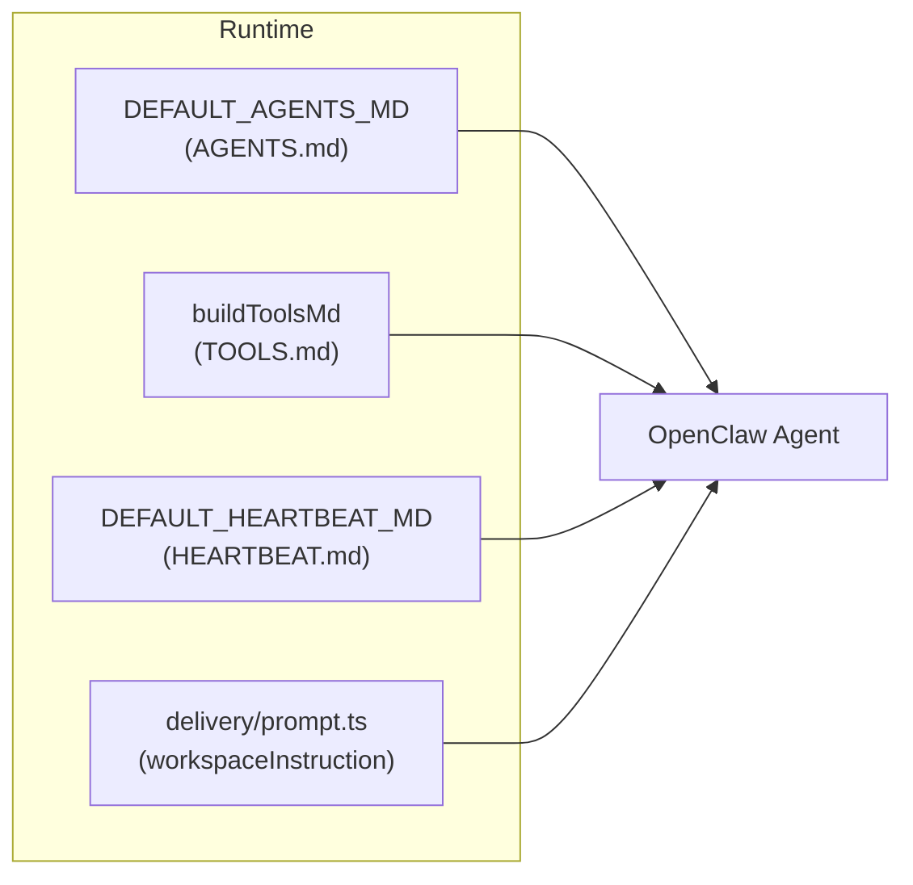

## Enhancement Summary

**Deepened on:** 2026-02-20  
**Sections enhanced:** Tasks 1–5, Research Insights, optional touchpoints  
**Research agents used:** agent-native-reviewer, best-practices-researcher, code-simplicity-reviewer, architecture-strategist, pattern-recognition-specialist

### Key improvements

1. **Path typo fix:** Use `skills/<slug>/SKILL.md` everywhere; the plan previously had skills//SKILL.md (double slash) in wording suggestions — corrected so paths are valid and copy-paste safe.
2. **Canonical phrasing:** One consistent "where skills live" and "where not to look" phrase per file (see Consistency table below); positive-first then negative for better agent compliance.
3. **Optional touchpoints:** Plan extended with optional Task 6 (get_agent_skills tool description) and Task 7 (docs/runtime/AGENTS.md sync) so all instruction surfaces stay aligned.
4. **OpenClaw alignment:** Official docs state workspace is separate from `~/.openclaw/` (config); skills load from workspace `/skills` first. Plan wording aligns with that model.

### New considerations discovered

- **docs/runtime/AGENTS.md:** If used as source for agent-facing AGENTS.md, add the same one-line rule (skills only in workspace; do not look in /root/.openclaw/).
- **get_agent_skills tool:** Description does not say where skill content lives; adding one sentence closes the loop when agents list skills then look for SKILL.md.
- **Shared constant (optional):** Define a single phrase constant in openclaw-profiles.ts and reuse in DEFAULT_AGENTS_MD, buildToolsMd, and delivery to reduce drift.
- **Workspace root anchor:** Optionally add "Your workspace root is the directory containing this file (AGENTS.md / TOOLS.md)." to disambiguate.

---

# Improve instructions so agents look for skills in the workspace

> **For Claude:** REQUIRED SUB-SKILL: Use superpowers:executing-plans to implement this plan task-by-task.

**Goal:** Agents currently look for skills in `/root/.openclaw/` (config directory) and report "skill doesn't exist"; we make it explicit that skills live only in the agent workspace (TOOLS.md + `skills/<slug>/SKILL.md`).

**Architecture:** All agent-facing text is produced by the mission-control runtime: default AGENTS.md and HEARTBEAT.md in [apps/runtime/src/openclaw-profiles.ts](apps/runtime/src/openclaw-profiles.ts), TOOLS.md via `buildToolsMd` in the same file, and the delivery prompt in [apps/runtime/src/delivery/prompt.ts](apps/runtime/src/delivery/prompt.ts). No Convex or OpenClaw gateway code changes.

**Tech Stack:** TypeScript (runtime), string literals in openclaw-profiles.ts and delivery/prompt.ts.

---

## Where instructions live (reference)




Skills are materialized under each agent workspace as `skills/<slug>/SKILL.md`. The config directory `/root/.openclaw/` holds only `openclaw.json`; no skill files.

---

### Task 1: Add "Where to find skills" to AGENTS.md

**Files:**

- Modify: [apps/runtime/src/openclaw-profiles.ts](apps/runtime/src/openclaw-profiles.ts) (DEFAULT_AGENTS_MD)

**Step 1:** In `DEFAULT_AGENTS_MD`, after the "Skill usage is mandatory" rule (around line 77–80), add one short subsection so the agent knows where skills live and where not to look.

**Change:** Insert a new bullet under rule 7 (or a one-line clarification) so it reads that assigned skills are listed in **TOOLS.md** and skill content is in **skills/****/SKILL.md** under **your workspace** only, and that **/root/.openclaw/ is the config directory — do not look for skills there**.

**Exact wording (suggestion):** After the line "in your update, name the skill(s) you used; if none apply, explicitly write No applicable skill", add:

- "Assigned skills live only in your workspace: TOOLS.md and `skills/<slug>/SKILL.md` (e.g. skills/code-review-checklist/SKILL.md). Do not look for skills in /root/.openclaw/ (config directory)."

**Step 2:** Run tests for openclaw-profiles (no new tests required; existing tests should still pass).

Run: `cd apps/runtime && npm test -- --testPathPattern=openclaw-profiles`
Expected: All tests pass.

---

### Task 2: Clarify TOOLS.md header with workspace path

**Files:**

- Modify: [apps/runtime/src/openclaw-profiles.ts](apps/runtime/src/openclaw-profiles.ts) (`buildToolsMd`)

**Step 1:** In `buildToolsMd`, extend the `header` string so it explicitly states where SKILL.md files are.

**Current (line 251–252):**

```ts
const header =
  "# Assigned skills\n\nSkill usage policy: before each operation, check this list and use every relevant skill. If no listed skill applies, explicitly state `No applicable skill` in your task update. Some skills have real SKILL.md files in this workspace.\n\n";
```

**New:** Add one sentence: "Skill files are at `skills/<slug>/SKILL.md` under your workspace root (not in /root/.openclaw/)."

**Step 2:** Run tests.

Run: `cd apps/runtime && npm test -- --testPathPattern=openclaw-profiles`
Expected: All tests pass (including those that assert TOOLS.md content).

---

### Task 3: Add workspace-only skill hint to delivery prompt

**Files:**

- Modify: [apps/runtime/src/delivery/prompt.ts](apps/runtime/src/delivery/prompt.ts)

**Step 1:** In `workspaceInstruction` (around line 372–374), add a short phrase that skill definitions are in the workspace, not the config directory.

**Current:**

```ts
const workspaceInstruction =
  "Primary operating instructions live in workspace files: AGENTS.md, USER.md, IDENTITY.md, SOUL.md, HEARTBEAT.md, and TOOLS.md. Follow those files; keep this reply focused on this notification.";
```

**New:** Append: " Skill definitions are in your workspace (TOOLS.md and skills/*/SKILL.md), not in /root/.openclaw/."

**Step 2:** Run delivery/prompt tests if any; otherwise run runtime test suite.

Run: `cd apps/runtime && npm test`
Expected: All tests pass.

---

### Task 4: Optional — HEARTBEAT.md skill-check line

**Files:**

- Modify: [apps/runtime/src/openclaw-profiles.ts](apps/runtime/src/openclaw-profiles.ts) (DEFAULT_HEARTBEAT_MD)

**Step 1:** In DEFAULT_HEARTBEAT_MD, line 193 ("Before executing the action, check your assigned skills and use every relevant skill."), optionally add "(in TOOLS.md and workspace skills/ directory)".

**Step 2:** Run tests again.

Run: `cd apps/runtime && npm test -- --testPathPattern=openclaw-profiles`
Expected: All tests pass.

---

### Task 5: Save plan and verify

**Files:**

- Create: `docs/plans/2026-02-20-improve-skill-lookup-instructions.md` (copy of this plan for repo history, if desired)

**Step 1:** Typecheck and lint.

Run: `yarn typecheck` and `yarn lint` from repo root.
Expected: No errors.

**Step 2:** Commit (when instructed).

Commit message format (per project): short title (< 80 chars), 2–3 bullet points.

---

## Summary of edits


| Location                                                                                      | Change                                                                                         |
| --------------------------------------------------------------------------------------------- | ---------------------------------------------------------------------------------------------- |
| [openclaw-profiles.ts](apps/runtime/src/openclaw-profiles.ts) DEFAULT_AGENTS_MD               | One line: skills only in workspace; do not look in /root/.openclaw/                            |
| [openclaw-profiles.ts](apps/runtime/src/openclaw-profiles.ts) buildToolsMd                    | One sentence in TOOLS.md header: skill files at `skills/<slug>/SKILL.md`, not /root/.openclaw/ |
| [delivery/prompt.ts](apps/runtime/src/delivery/prompt.ts) workspaceInstruction                | Append: skill definitions in workspace, not /root/.openclaw/                                   |
| [openclaw-profiles.ts](apps/runtime/src/openclaw-profiles.ts) DEFAULT_HEARTBEAT_MD (optional) | Clarify "check your assigned skills" with "(in TOOLS.md and workspace skills/)"                |


No schema or API changes. Restarting the runtime (and profile sync) will rewrite agent workspace files so existing agents pick up the new wording on next run.

---

---

## Research Insights (2024–2026)

Best practices for instructions that LLM agents reliably follow, applied to skill-lookup wording.

### 1. Concrete best-practice recommendations for the instruction text

1. **Lead with positive, then add negative.** Research on negated prompts (e.g. Jang et al., ACL 2023; “Understanding the Impact of Negative Prompts,” 2024) shows that LLMs often handle negation worse than positive constraints—larger models can perform worse on “do not X” alone. Prefer: state where to look first (“skills live only in your workspace: TOOLS.md and `skills/<slug>/SKILL.md`”), then add the negative as reinforcement (“Do not look in /root/.openclaw/”).
2. **Make paths unambiguous with one concrete pattern.** Use a single, explicit path pattern relative to “workspace” (e.g. `skills/<slug>/SKILL.md`) and, where helpful, one short example (e.g. `skills/code-review-checklist/SKILL.md`). Official-style guidance (e.g. VS Code prompt variables, Prompt Flow) favors explicit path declarations; GPT-5-Codex–style guidance warns that over-specifying many path variants can reduce quality—so one clear pattern plus one example is a good balance.
3. **Repeat the rule in multiple surfaces.** Prompt repetition has been shown to improve instruction-following in agent scenarios (e.g. “Prompt Repetition Improves Non-Reasoning LLMs,” 2025; “Measuring and Controlling Instruction (In)Stability,” 2024). Keeping the same “where skills live” rule in AGENTS.md, TOOLS.md header, and delivery `workspaceInstruction` is aligned with this—redundancy reinforces and helps counter instruction drift over long conversations.
4. **Keep each occurrence short and consistent.** Use the same canonical phrasing everywhere (e.g. “TOOLS.md and `skills/<slug>/SKILL.md`” and “not in /root/.openclaw/”) so the model sees one reinforced rule, not several wordings that could be interpreted as different constraints.
5. **Anchor “workspace” explicitly.** The plan already ties skills to “your workspace” and “workspace root.” Keep that framing so “workspace” is the single anchor; avoid introducing another base path (e.g. “project root” or “repo root”) unless it is clearly the same thing.

### 2. Pitfalls to avoid

- **Relying only on negative instructions.** “Do not look in /root/.openclaw/” alone is weaker than “Look only in your workspace: TOOLS.md and `skills/<slug>/SKILL.md`; /root/.openclaw/ is config only.”
- **Path typo in the plan.** The plan draft uses `skills/<slug>/SKILL.md` (double slash) in a couple of places; it should be `skills/<slug>/SKILL.md` or `skills/*/SKILL.md` so the path pattern is valid and copy-pasteable.
- **Over-long or multiple path variants.** Listing many path examples or alternate phrasings can dilute the instruction; one pattern + one example (e.g. `skills/code-review-checklist/SKILL.md`) is enough.
- **Putting the rule in only one file.** A single mention is more likely to be forgotten or deprioritized; the plan’s multi-surface approach (AGENTS.md, TOOLS.md, delivery prompt, optionally HEARTBEAT.md) is appropriate.

### 3. Suggested phrasing improvements

- **AGENTS.md (after rule 7):**  
Use positive-first, then negative:  
*“Assigned skills live only in your workspace: TOOLS.md and `skills/<slug>/SKILL.md` (e.g. skills/code-review-checklist/SKILL.md). Do not look for skills in /root/.openclaw/ (config directory).”*
- **TOOLS.md header:**  
Same pattern, one sentence:  
*“Skill files are at `skills/<slug>/SKILL.md` under your workspace root (e.g. skills/code-review-checklist/SKILL.md); not in /root/.openclaw/.”*
- **Delivery prompt (`workspaceInstruction`):**  
Short reinforcement:  
*“Skill definitions are in your workspace (TOOLS.md and `skills/<slug>/SKILL.md`), not in /root/.openclaw/.”*
- **Consistency:**  
Use `skills/<slug>/SKILL.md` (or `skills/*/SKILL.md` if the runtime uses globs) everywhere (one directory per skill slug; slug from TOOLS.md). Optional anchor: "Your workspace is the directory containing this file (AGENTS.md / TOOLS.md)." Avoid “your workspace” / “workspace root” as the only base so agents do not infer other roots.

---

### 4. Consistency table (phrase per file)


| File / location                   | Where skills live                                                           | Where not to look                                              |
| --------------------------------- | --------------------------------------------------------------------------- | -------------------------------------------------------------- |
| **AGENTS.md**                     | Assigned skills live only in your workspace: TOOLS.md and skills//SKILL.md. | Do not look for skills in /root/.openclaw/ (config directory). |
| **TOOLS.md** header               | Skill files are at skills//SKILL.md under your workspace.                   | not in /root/.openclaw/                                        |
| **delivery** workspaceInstruction | Skill definitions are in your workspace (TOOLS.md and skills//SKILL.md).    | not in /root/.openclaw/                                        |
| **HEARTBEAT** (optional)          | (in TOOLS.md and workspace skills/ directory)                               | Omit or add "not in /root/.openclaw/"                          |


### 5. Edge cases and implementation details

- **Docker vs host:** Runtime maps host paths via toGatewayWorkspaceRoot. The agent only ever sees one workspace path (its cwd). "Your workspace" is correct; no need to mention Docker in the instructions.
- **OpenClaw docs:** Workspace is separate from ~~/.openclaw/ (config). Skills load from workspace /skills first (highest priority), then~~ /.openclaw/skills, then bundled. Plan wording aligns with "workspace only" and "not config directory."

### 6. References

- [OpenClaw Agent Workspace](https://docs.molt.bot/agent-workspace) — workspace vs ~/.openclaw/
- [OpenClaw Skills](https://docs.openclaw.ai/tools/skills) — workspace skills precedence, SKILL.md structure

---

## Optional tasks (post-Tasks 1-5)

### Task 6: Optional — get_agent_skills tool description

**Files:** [apps/runtime/src/tooling/agentTools.ts](apps/runtime/src/tooling/agentTools.ts)

Add one sentence to the get_agent_skills tool description (around line 311-312): skill content is read from the workspace (TOOLS.md and skills//SKILL.md), not from the config directory. Closes the loop when agents list skills then look for SKILL.md.

### Task 7: Optional — docs/runtime/AGENTS.md sync

**Files:** [docs/runtime/AGENTS.md](docs/runtime/AGENTS.md)

If this file is (or will be) used as the source for agent-facing AGENTS.md, add the same one-line rule after rule 7: assigned skills live only in your workspace (TOOLS.md and skills//SKILL.md); do not look for skills in /root/.openclaw/. The runtime uses DEFAULT_AGENTS_MD from code by default; sync only if operators supply custom AGENTS.md from this doc.

---

## Execution handoff

Plan complete. Two execution options:

1. **Subagent-Driven (this session)** — Dispatch a fresh subagent per task, review between tasks, fast iteration.
2. **Parallel Session (separate)** — Open a new session with executing-plans for batch execution with checkpoints.

Which approach?