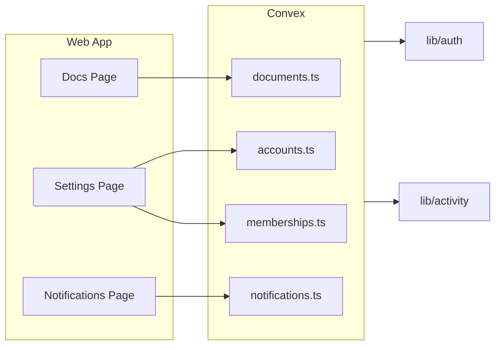

# Implementation Plan: Missing Features (roadmap)

## 1. Context and goal

Implement the missing backend and frontend work for the Documents, Settings, and Notifications areas so that the scaffolded dashboard pages work end-to-end with Convex. The roadmap doc describes required Convex functions, schema changes, and UI wiring. Key constraints: multi-tenant isolation (all by `accountId`), existing auth (`requireAccountMember`, `requireAccountAdmin`, `requireAccountOwner`), activity logging via `logActivity`, and Convex naming (snake_case files, indexed queries).

**Assumption A:** Documents are extended with a **file/folder tree** (optional `parentId`, `kind: "file" | "folder"`) while keeping the current document model (title, content, type: deliverable/note/template/reference) for backward compatibility and task-linked docs.

**Assumption B:** Settings “Members” reuses the existing [memberships](packages/backend/convex/memberships.ts) module; the roadmap’s “invite by email” with an invitations table is treated as a **later phase** (invitation record + email action). For now, Settings Members tab can mirror the existing admin members page ([admin/members/page.tsx](apps/web/src/app/(dashboard)/[accountSlug]/admin/members/page.tsx)) and use `memberships.invite` with userId/userName/userEmail (e.g. from Clerk lookup or manual input).

**Assumption C:** Notifications backend is largely complete; the main work is **API alignment** (frontend calls `list` / `markAsRead` / `markAllAsRead`; backend exposes `listMine` / `markRead` / `markAllRead`) and fixing the notifications page to use schema fields `body` and `readAt` instead of `message` and `isRead`.

---

## 2. Codebase research summary

| Area          | Files inspected                                                                                                                                                                                                                                                                                      | Findings                                                                                                                                                                                                                                                                                                                                                                                                  |
| ------------- | ---------------------------------------------------------------------------------------------------------------------------------------------------------------------------------------------------------------------------------------------------------------------------------------------------- | --------------------------------------------------------------------------------------------------------------------------------------------------------------------------------------------------------------------------------------------------------------------------------------------------------------------------------------------------------------------------------------------------------- |
| Schema        | [packages/backend/convex/schema.ts](packages/backend/convex/schema.ts)                                                                                                                                                                                                                               | `documents` has title, content, type (deliverable/note/template/reference), taskId, authorType/authorId, version; no parentId or file/folder. `accounts` has no `settings`. `notifications` has title, body, readAt (not isRead). No invitations table.                                                                                                                                                   |
| Accounts      | [packages/backend/convex/accounts.ts](packages/backend/convex/accounts.ts)                                                                                                                                                                                                                           | `update` only supports `name`; need to add `slug` and `settings`. `remove` exists and cascades; subscriptions are not deleted (comment: “skip for now”) — must delete subscriptions for account tasks before deleting tasks.                                                                                                                                                                              |
| Documents     | [packages/backend/convex/documents.ts](packages/backend/convex/documents.ts)                                                                                                                                                                                                                         | Full CRUD + list/listByType/listByTask/search; no folder/parentId support. Uses `requireAccountMember`, `logActivity`.                                                                                                                                                                                                                                                                                    |
| Memberships   | [packages/backend/convex/memberships.ts](packages/backend/convex/memberships.ts)                                                                                                                                                                                                                     | list, invite (by userId/userName/userEmail), updateRole, remove, leave, transferOwnership. No invite-by-email flow.                                                                                                                                                                                                                                                                                       |
| Notifications | [packages/backend/convex/notifications.ts](packages/backend/convex/notifications.ts)                                                                                                                                                                                                                 | get, listMine, getUnreadCount, markRead, markAllRead, remove. Naming differs from roadmap/frontend: list vs listMine, markAsRead vs markRead, markAllAsRead vs markAllRead.                                                                                                                                                                                                                               |
| Lib           | [packages/backend/convex/lib/notifications.ts](packages/backend/convex/lib/notifications.ts)                                                                                                                                                                                                         | Notifications created via helpers (mention, thread, assignment, status_change); no standalone internal “create” mutation.                                                                                                                                                                                                                                                                                 |
| Frontend      | [apps/web/src/app/(dashboard)/[accountSlug]/docs/page.tsx](apps/web/src/app/(dashboard)/[accountSlug]/docs/page.tsx), [settings/page.tsx](apps/web/src/app/(dashboard)/[accountSlug]/settings/page.tsx), [notifications/page.tsx](apps/web/src/app/(dashboard)/[accountSlug]/notifications/page.tsx) | Docs page uses `api.documents.list`, expects `doc.name`, `doc.type` (file/folder). Settings: no Convex calls; General (name/slug), Members (placeholder), Notifications (preferences) need wiring. Notifications page uses `api.notifications.list` (does not exist), `notification.message` (schema has `body`), `notification.isRead` (schema has `readAt`), and `markAsRead` (backend has `markRead`). |
| Admin members | [apps/web/src/app/(dashboard)/[accountSlug]/admin/members/page.tsx](apps/web/src/app/(dashboard)/[accountSlug]/admin/members/page.tsx)                                                                                                                                                               | Uses `api.memberships.list`; invite dialog is UI-only (toast), no Convex invite call.                                                                                                                                                                                                                                                                                                                     |

Existing patterns to follow: auth from [packages/backend/convex/lib/auth.ts](packages/backend/convex/lib/auth.ts), activity from [packages/backend/convex/lib/activity.ts](packages/backend/convex/lib/activity.ts), validators from [packages/backend/convex/lib/validators.ts](packages/backend/convex/lib/validators.ts).

---

## 3. High-level design

- **Documents:** Extend schema with optional `parentId` and `kind` (file | folder). Add list-by-folder query and optional `folderId` to list; create/update/remove support folders. Frontend already calls `documents.list`; ensure returned shape includes `name` (from title or new field) and `type` (kind) for grid/list.
- **Settings:** Extend accounts schema with optional `settings`; extend `accounts.update` with slug + settings; fix `accounts.remove` to delete subscriptions for account tasks before deleting tasks. Wire General tab to `accounts.update` (name, slug); wire Members tab to memberships list + invite/updateRole/remove (reuse patterns from admin members); wire Notifications tab to account settings (notificationPreferences); wire Danger Zone to `accounts.remove`.
- **Notifications:** Add query alias `list` (same as listMine) and mutation aliases `markAsRead` / `markAllAsRead` (same as markRead / markAllRead). Update notifications page to use `api.notifications.list`, `body` instead of `message`, and `readAt` (unread = no readAt) instead of `isRead`; use `markAsRead` / `markAllAsRead`. Optionally add cursor-based pagination to list later.

Notification triggers (task assigned, task completed, agent message, member joined) are partially present via [lib/notifications.ts](packages/backend/convex/lib/notifications.ts); ensure tasks/messages flow call these helpers where specified in the roadmap.

---

## 4. File and module changes

### 4.1 Schema

- **[packages/backend/convex/schema.ts](packages/backend/convex/schema.ts)**
  - **documents:** Add optional `parentId: v.optional(v.id("documents"))`, and `kind: v.union(v.literal("file"), v.literal("folder"))` (default "file" for existing rows via migration or default in new writes). For folders, content can be optional or empty. Add index `by_parent` on `["accountId", "parentId"]`.
  - **accounts:** Add optional `settings: v.optional(v.object({ theme: v.optional(v.string()), notificationPreferences: v.optional(v.object({ taskUpdates: v.boolean(), agentActivity: v.boolean(), emailDigest: v.boolean() })) }))`.
  - No new `invitations` table in this phase (roadmap “invite by email” deferred).

### 4.2 Backend

- **[packages/backend/convex/documents.ts](packages/backend/convex/documents.ts)**
  - **list:** Extend args with optional `folderId: v.optional(v.id("documents"))` (when present, filter by parentId === folderId; when absent, list root: parentId undefined). Return shape for UI: include `name: doc.name ?? doc.title`, `type: doc.kind` (file | folder), plus existing fields. Ensure backward compatibility: existing docs without `kind` treated as "file", without `parentId` as root.
  - **create:** Add optional `parentId`, optional `kind` (default "file"). For kind "folder", allow empty content and optional name/title.
  - **update:** Allow updating `parentId` (move) and `kind` where applicable.
  - **remove:** Already exists; consider cascade: deleting a folder could delete or orphan children (decide: forbid delete if has children, or cascade delete).
  - Add optional `name` on documents if we want a distinct folder name vs title (or use title for both); roadmap uses "name" for display.
- **[packages/backend/convex/accounts.ts](packages/backend/convex/accounts.ts)**
  - **update:** Add optional `slug: v.optional(v.string())` and `settings: v.optional(v.object({ theme: v.optional(v.string()), notificationPreferences: v.optional(v.object({ taskUpdates: v.boolean(), agentActivity: v.boolean(), emailDigest: v.boolean() })) }))`. If slug provided, check uniqueness (by_slug) and patch. Patch settings merge if needed.
  - **remove:** Before deleting tasks, query subscriptions by_task for each task ID in the account, delete those subscriptions, then delete tasks (and rest of cascade as today).
- **[packages/backend/convex/notifications.ts](packages/backend/convex/notifications.ts)**
  - Export **list** as alias for listMine (same args and handler) so frontend can call `api.notifications.list`.
  - Export **markAsRead** as alias for markRead (same args).
  - Export **markAllAsRead** as alias for markAllRead (same args).
  - Optional: add `filter: v.optional(v.union(v.literal("all"), v.literal("unread")))` to list and cursor-based pagination later.

### 4.3 Frontend

- **[apps/web/src/app/(dashboard)/[accountSlug]/docs/page.tsx](apps/web/src/app/(dashboard)/[accountSlug]/docs/page.tsx)**
  - Use `documents.list` with optional `folderId` (state for current folder; root when null). Pass `folderId` when user navigates into a folder.
  - Use returned `name` and `type` (file | folder) for display; format “Updated recently” from `updatedAt`. Wire “New Document” / “New Folder” to documents.create with appropriate kind and parentId. Wire search to existing `documents.search` or list + client filter; optionally add searchQuery to list args if backend supports it (already has search query).
  - Enable Create Document / New Folder buttons and dropdown actions (open doc, delete, etc.) using documents.get, documents.update, documents.remove.
- **[apps/web/src/app/(dashboard)/[accountSlug]/settings/page.tsx](apps/web/src/app/(dashboard)/[accountSlug]/settings/page.tsx)**
  - **General:** Local state for name and slug; on Save call `accounts.update` with accountId, name, slug. Show validation error if slug conflict.
  - **Members:** Use `api.memberships.list` with accountId; show list. Invite: use `memberships.invite` with userId, userName, userEmail (e.g. from Clerk if user exists, or a simple “add by email” that requires the user to already exist in Clerk for now). Wire Change Role to `memberships.updateRole`, Remove to `memberships.remove` (accountId, membershipId). Reuse role display logic from admin members page.
  - **Notifications:** Use account.settings.notificationPreferences; toggles or “Configure” that call `accounts.update` with settings.notificationPreferences (taskUpdates, agentActivity, emailDigest).
  - **Danger Zone:** Delete Workspace button calls `accounts.remove` with confirmation modal; pass accountId from useAccount.
- **[apps/web/src/app/(dashboard)/[accountSlug]/notifications/page.tsx](apps/web/src/app/(dashboard)/[accountSlug]/notifications/page.tsx)**
  - Replace `api.notifications.list` usage: backend will expose `list` (alias of listMine); keep args `{ accountId, limit: 50 }`.
  - Use `notification.body` instead of `notification.message`.
  - Use unread as `!notification.readAt` (or `notification.readAt == null`).
  - Use `notification.createdAt` or Convex `_creationTime` for “time ago”.
  - Use `api.notifications.markAsRead` and `api.notifications.markAllAsRead` (aliases).

### 4.4 Validators

- **[packages/backend/convex/lib/validators.ts](packages/backend/convex/lib/validators.ts)**  
  - Add document kind validator: `v.union(v.literal("file"), v.literal("folder"))` and use in documents args where needed.

---

## 5. Step-by-step tasks

1. **Schema: documents** — Add optional `parentId`, `kind` (file | folder), and index `by_parent` on (accountId, parentId). Keep existing fields; for existing rows, treat missing kind as "file" and missing parentId as root in queries.
2. **Schema: accounts** — Add optional `settings` object (theme, notificationPreferences: taskUpdates, agentActivity, emailDigest).
3. **Documents backend** — In documents.ts: extend list args with optional folderId; filter by parentId; return name (name ?? title) and type (kind). Extend create with optional parentId and kind; for folders, allow empty content. Extend update for parentId (move) and kind. In remove, either forbid deleting a folder that has children or implement cascade delete (document decision in plan).
4. **Accounts backend** — In accounts.ts update: add slug (with uniqueness check) and settings; merge settings if partial. In remove: before deleting tasks, get all task IDs for account, for each task query subscriptions by_task and delete them, then proceed with existing cascade.
5. **Notifications backend** — Export list (alias listMine), markAsRead (alias markRead), markAllAsRead (alias markAllRead).
6. **Docs page frontend** — Wire list with folderId state (breadcrumb or back-navigation); wire New Document / New Folder to create; wire grid/list to name, type, updatedAt; wire search; wire row click to get and open/edit; wire delete to remove.
7. **Settings page frontend** — General: form + accounts.update(name, slug). Members: memberships.list + invite/updateRole/remove with proper args. Notifications: account.settings.notificationPreferences + accounts.update(settings). Danger Zone: confirm dialog + accounts.remove.
8. **Notifications page frontend** — Switch to api.notifications.list; use body, readAt, markAsRead, markAllAsRead; fix unread styling and time display.
9. **Notification triggers** — Verify task assignment and status change flows call createAssignmentNotification and createStatusChangeNotification; add member_added activity (and optional notification) when membership is created via invite; document where agent_message notifications would be created (runtime/messages).

---

## 6. Edge cases and risks

- **Documents:** Deleting a folder that has children: either disallow and return a clear error, or cascade-delete children (then folder). Cascade is simpler for UX but destructive; recommend cascade with a single mutation that deletes folder and all descendants.
- **Account slug uniqueness:** If slug is already taken, return a clear conflict error; frontend shows validation message.
- **Settings slug change:** Changing slug affects URLs; dashboard layout uses accountSlug from route. After update, redirect to new slug or show success and let user navigate (recommend redirect to `/[newSlug]/settings`).
- **Subscriptions cleanup:** Order in remove: delete subscriptions for all account tasks, then activities, messages, documents, tasks, agents, memberships, account. Avoid full table scan on subscriptions: iterate task IDs from by_account tasks query, then for each taskId query by_task and delete.
- **Notifications list:** Frontend currently calls `api.notifications.list` which does not exist; adding the alias fixes it. No breaking change for existing listMine callers.
- **Members invite:** Current memberships.invite requires userId, userName, userEmail. Without an invitations table, “invite by email” means: either lookup user by email via Clerk (if API available in Convex action) or show “user must already have an account” and use a manual flow. Defer full invite-by-email to a later phase with invitations table + email action.

---

## 7. Testing strategy

- **Unit / Convex tests:** documents list with folderId (root vs folder); create file/folder with parentId; update parentId (move); remove folder with/without children. accounts.update with slug uniqueness and settings merge. notifications list/markAsRead/markAllAsRead.
- **Integration:** Docs page: list root, create folder, create file in folder, list by folder, delete file, delete folder. Settings: update name/slug, update notification prefs, delete workspace (test account). Notifications: list, mark one read, mark all read.
- **Manual QA:** General: change name and slug, save, confirm redirect or success. Members: list members, invite (with existing user), change role, remove member. Notifications: confirm list shows body and read state; mark as read; mark all as read. Docs: grid/list, create doc/folder, search, open, delete.

---

## 8. Rollout / migration

- **Schema:** Convex handles optional new fields; existing document rows without `kind`/`parentId` are treated as file/root in code. No data migration script required if defaults are applied in read path.
- **Frontend:** Deploy behind existing routes; no feature flags required. Settings and Notifications are additive; Docs page becomes functional.
- **Observability:** Rely on existing Convex logs; optional: log account.remove and document remove (folder cascade) for audit.

---

## 9. Out of scope (follow-ups)

- **Invitations table and invite-by-email:** New table, mutation to create invitation, Convex action to send email, and Settings/Members UI to show pending invites and “accept” flow.
- **User profile page,** **global search,** **agent detail page,** **analytics dashboard:** Per roadmap “Additional Missing Features”; plan separately.
- **Billing (Settings):** Stripe or similar; separate integration.
- **Appearance (theme):** Can be client-only (e.g. next-themes) and persist choice in account.settings.theme once backend supports it.

---

## 10. TODO checklist

**Backend – Schema & documents**

- Add documents schema: optional parentId, kind (file | folder), index by_parent; keep existing fields.
- Add accounts schema: optional settings (theme, notificationPreferences).
- Extend documents.list: optional folderId arg; return name (name ?? title), type (kind); filter by parentId.
- Extend documents.create: optional parentId, kind; support folder (empty content).
- Extend documents.update: optional parentId (move), kind.
- documents.remove: handle folder with children (cascade or forbid; implement chosen behavior).
- Add validators for document kind in lib/validators.ts if needed.

**Backend – Accounts & notifications**

- accounts.update: add slug (with uniqueness) and settings; merge settings.
- accounts.remove: delete subscriptions for all account tasks (by_task per task), then existing cascade.
- notifications: export list (= listMine), markAsRead (= markRead), markAllAsRead (= markAllRead).

**Frontend – Docs page**

- Docs page: folderId state and list(folderId); breadcrumb or back for navigation.
- Wire New Document / New Folder to documents.create; enable buttons and dropdown.
- Wire grid/list to name, type, updatedAt; wire search; wire open/delete.

**Frontend – Settings page**

- General: form (name, slug) and Save → accounts.update; handle slug conflict.
- Members: memberships.list, invite/updateRole/remove with UI and args; reuse admin members patterns.
- Notifications tab: load/save account.settings.notificationPreferences via accounts.update.
- Danger Zone: confirm dialog and accounts.remove(accountId).

**Frontend – Notifications page**

- Use api.notifications.list; use body, readAt (unread), markAsRead, markAllAsRead; fix time display.

**Verification**

- Confirm notification triggers: assignment and status change; member_added activity on invite; document where agent_message is created.
- Manual QA: docs (list, create, folder, search, delete), settings (general, members, notifications, delete), notifications (list, mark read).

