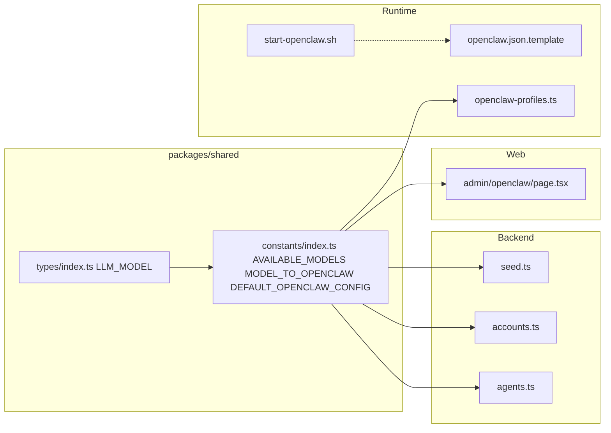

# Model list update: Minimax default, Haiku fallback, Kimi, GPT-5 Nano

## 1. Context and goal

- **Goal:** Replace the current model list (Claude Haiku 4.5 as default, GPT-5 Nano) with a new ordered list used everywhere:
  1. **Default:** minimax/minimax-m2.5
  2. **Fallback (second):** Claude Haiku 4.5
  3. **Third:** moonshotai/kimi-k2.5
  4. **Last:** GPT-5 Nano
- **Constraints:** Keep a single source of truth in `@packages/shared`; preserve validation (backend and seed use `AVAILABLE_MODELS`); runtime script and JSON template must stay in sync with the new primary/fallbacks; no breaking change to existing stored `openclawConfig.model` values for Haiku/GPT-5 Nano (they remain valid).
- **Internal identifiers (value):** Use short ids consistent with existing style: `minimax-m2.5`, `claude-haiku-4.5`, `kimi-k2.5`, `gpt-5-nano`. OpenClaw provider/model strings: `minimax/minimax-m2.5`, `anthropic/claude-haiku-4.5`, `moonshotai/kimi-k2.5`, `openai/gpt-5-nano`.

---

## 2. Codebase research summary

- **[packages/shared/src/types/index.ts](packages/shared/src/types/index.ts):** Defines `LLM_MODEL` (e.g. `CLAUDE_HAIKU_4_5`, `GPT_5_NANO`) and `LLMModel`. Add `MINIMAX_M2_5`, `KIMI_K2_5` here.
- **[packages/shared/src/constants/index.ts](packages/shared/src/constants/index.ts):** Defines `AVAILABLE_MODELS` (order + labels), `MODEL_TO_OPENCLAW`, `OPENCLAW_FALLBACK_MODEL`, `DEFAULT_OPENCLAW_CONFIG.model`. This is the single source of truth for “which models” and “default model”.
- **[packages/backend/convex/lib/constants.ts](packages/backend/convex/lib/constants.ts):** Does **not** define LLM models; only re-exports task status, document type, etc. No change.
- **Backend usage:** [agents.ts](packages/backend/convex/agents.ts), [accounts.ts](packages/backend/convex/accounts.ts), [seed.ts](packages/backend/convex/seed.ts) import `AVAILABLE_MODELS` and/or `DEFAULT_OPENCLAW_CONFIG` from `@packages/shared` and validate or apply default model. No literal model enums in Convex; validation is against `AVAILABLE_MODELS.map(m => m.value)`.
- **[apps/web/.../admin/openclaw/page.tsx](<apps/web/src/app/(dashboard)/[accountSlug]/admin/openclaw/page.tsx>):** Uses `AVAILABLE_MODELS` and `DEFAULT_OPENCLAW_CONFIG.model` for the default model selector; `getModelProviderLabel()` returns "Anthropic" / "OpenAI" / "Other". Add Minimax and Moonshot AI for the new models.
- **[apps/runtime/src/openclaw-profiles.ts](apps/runtime/src/openclaw-profiles.ts):** Uses `MODEL_TO_OPENCLAW` and `mapModelToOpenClaw()`; no hardcoded model names. Adding new entries to `MODEL_TO_OPENCLAW` is enough.
- **[apps/runtime/openclaw/start-openclaw.sh](apps/runtime/openclaw/start-openclaw.sh):** Hardcodes Vercel AI Gateway primary/fallbacks and legacy Anthropic/OpenAI primary/fallbacks. Must be updated to the new order (primary = minimax-m2.5, fallbacks = haiku, kimi-k2.5, gpt-5-nano) and to register all four models in `config.agents.defaults.models`. Legacy path (no Vercel key) currently only configures Anthropic and OpenAI; optional: add Minimax/Moonshot provider blocks if env vars (e.g. `MINIMAX_API_KEY`, `MOONSHOT_API_KEY`) are used later.
- **[apps/runtime/openclaw/openclaw.json.template](apps/runtime/openclaw/openclaw.json.template):** Static JSON with same structure; update `agents.defaults.model.primary`, `model.fallbacks`, and `models` to match.
- **Tests:** [packages/shared/src/constants/**tests**/constants.test.ts](packages/shared/src/constants/__tests__/constants.test.ts) asserts default model is `claude-haiku-4.5` and has "Recommended"; [apps/runtime/src/openclaw-profiles.test.ts](apps/runtime/src/openclaw-profiles.test.ts) asserts `mapModelToOpenClaw` for haiku and gpt-5-nano. Update to new default and add assertions for minimax-m2.5 and kimi-k2.5.

---

## 3. High-level design

- **Data flow:** All consumers get model list and default from `@packages/shared`. Backend validates `model` against `AVAILABLE_MODELS`; seed and agents use `DEFAULT_OPENCLAW_CONFIG.model` for new agents/defaults. Runtime resolves Convex model id → OpenClaw provider/model via `MODEL_TO_OPENCLAW`; the shell script and template define gateway-level primary/fallbacks independently (no import from shared) and must be updated to the same order.

---

## 4. File and module changes

### 4.1 [packages/shared/src/types/index.ts](packages/shared/src/types/index.ts)

- Add to `LLM_MODEL`: `MINIMAX_M2_5: "minimax-m2.5"`, `KIMI_K2_5: "kimi-k2.5"`.
- Keep `CLAUDE_HAIKU_4_5`, `GPT_5_NANO`.
- `LLMModel` stays derived from `LLM_MODEL` (no change to type definition).

### 4.2 [packages/shared/src/constants/index.ts](packages/shared/src/constants/index.ts)

- **AVAILABLE_MODELS:** Replace with four entries in this order:  
  (1) `minimax-m2.5` — label e.g. "Minimax M2.5 (Recommended)",  
  (2) `claude-haiku-4.5` — "Claude Haiku 4.5",  
  (3) `kimi-k2.5` — "Moonshot Kimi K2.5",  
  (4) `gpt-5-nano` — "GPT-5 Nano".
- **MODEL_TO_OPENCLAW:** Add `[LLM_MODEL.MINIMAX_M2_5]: "minimax/minimax-m2.5"`, `[LLM_MODEL.KIMI_K2_5]: "moonshotai/kimi-k2.5"`; keep existing Haiku and GPT-5 Nano entries.
- **OPENCLAW_FALLBACK_MODEL:** Leave as `"anthropic/claude-haiku-4.5"` (second in list = fallback).
- **DEFAULT_OPENCLAW_CONFIG.model:** Set to `LLM_MODEL.MINIMAX_M2_5`.

### 4.3 [packages/shared/src/constants/**tests**/constants.test.ts](packages/shared/src/constants/__tests__/constants.test.ts)

- In `describe("AVAILABLE_MODELS")`: change "includes the default model (claude-haiku-4.5)" to "includes the default model (minimax-m2.5)" and update the predicate to `m.value === "minimax-m2.5"`.
- Change "default model is marked as recommended" to use `minimax-m2.5` and expect that entry’s label to contain "Recommended".
- Optionally: add test that `AVAILABLE_MODELS.length >= 4` and that the first element’s value equals `DEFAULT_OPENCLAW_CONFIG.model`.
- Keep "has at least 2 model options" (still true) or tighten to "has exactly 4 model options" if desired.

### 4.4 [apps/web/src/app/(dashboard)/[accountSlug]/admin/openclaw/page.tsx](<apps/web/src/app/(dashboard)/[accountSlug]/admin/openclaw/page.tsx>)

- In `getModelProviderLabel(modelValue)`: add branches so that `minimax-m2.5` (or `modelValue.startsWith("minimax-")`) → `"Minimax"`, and `kimi-k2.5` (or `modelValue.startsWith("kimi-")`) → `"Moonshot AI"` (or "Moonshot"). Keep existing `claude-` → "Anthropic", `gpt-` → "OpenAI", and "Other" fallback.

### 4.5 [apps/runtime/openclaw/start-openclaw.sh](apps/runtime/openclaw/start-openclaw.sh)

- **Vercel AI Gateway block (hasVercelKey):**
  - Set `config.agents.defaults.model.primary` to `vercel-ai-gateway/minimax/minimax-m2.5` (or the correct gateway prefix if different for Minimax).
  - Set `config.agents.defaults.model.fallbacks` to `['vercel-ai-gateway/anthropic/claude-haiku-4.5', 'vercel-ai-gateway/moonshotai/kimi-k2.5', 'vercel-ai-gateway/openai/gpt-5-nano']`.
  - In `config.agents.defaults.models`, register all four with aliases (e.g. "Minimax M2.5", "Claude Haiku 4.5", "Moonshot Kimi K2.5", "GPT-5 Nano"); remove or keep the existing `delete` lines for sonnet/opus as needed.
- **Legacy block (no Vercel key):** Update so that when only Anthropic/OpenAI are configured, primary/fallbacks still reflect the desired order if possible (e.g. primary = minimax if `MINIMAX_API_KEY` is set, else haiku, etc.). If the codebase does not yet support Minimax/Moonshot env vars, document that and set primary to the first available of minimax → haiku → kimi → gpt-5-nano, or leave legacy as haiku + gpt-5-nano until env support is added. Prefer one clear behavior and document it.

### 4.6 [apps/runtime/openclaw/openclaw.json.template](apps/runtime/openclaw/openclaw.json.template)

- Update `agents.defaults.model.primary` to the new default (e.g. `vercel-ai-gateway/minimax/minimax-m2.5`).
- Update `agents.defaults.model.fallbacks` to the three fallbacks in order: haiku, kimi-k2.5, gpt-5-nano (with same gateway prefix as in start-openclaw.sh).
- Update `agents.defaults.models` so all four provider/model keys have the correct aliases.

### 4.7 [apps/runtime/src/openclaw-profiles.test.ts](apps/runtime/src/openclaw-profiles.test.ts)

- In `mapModelToOpenClaw` tests: add expectations for `minimax-m2.5` → `minimax/minimax-m2.5` and `kimi-k2.5` → `moonshotai/kimi-k2.5` (and with Vercel prefix when gateway enabled).
- Update any test that assumes "default" or "first" model to use `minimax-m2.5` where relevant.
- Keep existing haiku and gpt-5-nano assertions; ensure the test that builds config and expects `openai/gpt-5-nano` still passes (gpt-5-nano remains in the list).

### 4.8 Optional

- **[packages/backend/tests/factories.ts](packages/backend/__tests__/factories.ts):** The agent factory uses `model: "claude-sonnet-4-20250514"`, which is not in `AVAILABLE_MODELS`. Consider changing to a value from `AVAILABLE_MODELS` (e.g. `minimax-m2.5` or `gpt-5-nano`) for consistency; otherwise leave as-is if tests rely on an “external” model id.

---

## 5. Step-by-step tasks

1. **Shared types:** In `packages/shared/src/types/index.ts`, add `MINIMAX_M2_5: "minimax-m2.5"` and `KIMI_K2_5: "kimi-k2.5"` to `LLM_MODEL`.
2. **Shared constants:** In `packages/shared/src/constants/index.ts`, update `AVAILABLE_MODELS` to the four entries in order (minimax-m2.5 recommended, then haiku, kimi-k2.5, gpt-5-nano); add minimax and kimi to `MODEL_TO_OPENCLAW`; set `DEFAULT_OPENCLAW_CONFIG.model` to `LLM_MODEL.MINIMAX_M2_5`.
3. **Shared tests:** In `packages/shared/src/constants/__tests__/constants.test.ts`, update default model assertions to `minimax-m2.5` and recommended label; add/update tests for four models if desired.
4. **Web admin UI:** In `apps/web/.../admin/openclaw/page.tsx`, extend `getModelProviderLabel` for `minimax-` and `kimi-`.
5. **Runtime script:** In `apps/runtime/openclaw/start-openclaw.sh`, set Vercel block primary to minimax/minimax-m2.5 and fallbacks to [haiku, kimi-k2.5, gpt-5-nano]; register all four in `config.agents.defaults.models`; adjust legacy block as decided (new order or document limitation).
6. **Runtime template:** In `apps/runtime/openclaw/openclaw.json.template`, set primary, fallbacks, and `models` to match the script.
7. **Runtime tests:** In `apps/runtime/src/openclaw-profiles.test.ts`, add mapModelToOpenClaw cases for minimax-m2.5 and kimi-k2.5; fix default/first-model expectations.
8. **Smoke check:** Run `yarn typecheck` and shared + runtime tests; manually check admin OpenClaw page and default model selector.

---

## 6. Edge cases and risks

- **Existing accounts/agents:** Stored `openclawConfig.model` values (e.g. `claude-haiku-4.5`, `gpt-5-nano`) remain in `AVAILABLE_MODELS` and `MODEL_TO_OPENCLAW`; no migration needed. New defaults will use minimax-m2.5.
- **Vercel AI Gateway:** Confirm whether the gateway uses the same provider/id format for Minimax and Moonshot (e.g. `vercel-ai-gateway/minimax/minimax-m2.5`). If not, adjust prefix or path in start-openclaw.sh and template to match gateway docs.
- **Legacy runtime (no Vercel key):** If Minimax/Moonshot are not yet configured via env in the script, legacy mode may only offer Anthropic/OpenAI. Document and optionally add env-based branches later.
- **Seed:** Seed uses `DEFAULT_OPENCLAW_CONFIG` and `AVAILABLE_MODELS`; once shared is updated, it will apply the new default and valid set automatically.

---

## 7. Testing strategy

- **Unit:** Shared constants tests (default model, recommended label, MODEL_TO_OPENCLAW coverage); runtime `mapModelToOpenClaw` for all four models with and without Vercel gateway.
- **Manual:** Open dashboard → account → Admin → OpenClaw; open Default Model dropdown and confirm four options with Minimax M2.5 first and marked Recommended; save and confirm selected model persists.
- **Optional:** E2E or integration test that creates an agent and checks default `openclawConfig.model` is `minimax-m2.5`.

---

## 8. Rollout / migration

- No feature flag required; change is a default and list update.
- No DB migration; existing `model` values remain valid.
- After deploy, new agents and account defaults will use minimax-m2.5; existing agents keep their current model until changed by a user or seed.

---

## 9. TODO checklist

- Add `MINIMAX_M2_5` and `KIMI_K2_5` to `LLM_MODEL` in `packages/shared/src/types/index.ts`
- Update `AVAILABLE_MODELS`, `MODEL_TO_OPENCLAW`, and `DEFAULT_OPENCLAW_CONFIG.model` in `packages/shared/src/constants/index.ts`
- Update `packages/shared/src/constants/__tests__/constants.test.ts` for new default and four models
- Extend `getModelProviderLabel` in `apps/web/.../admin/openclaw/page.tsx` for Minimax and Moonshot
- Update Vercel block (primary, fallbacks, models) in `apps/runtime/openclaw/start-openclaw.sh`
- Update legacy block in `apps/runtime/openclaw/start-openclaw.sh` if needed; document if Minimax/Moonshot env not supported
- Update `apps/runtime/openclaw/openclaw.json.template` primary, fallbacks, and models
- Add/update `mapModelToOpenClaw` and default-model tests in `apps/runtime/src/openclaw-profiles.test.ts`
- Run `yarn typecheck` and relevant tests; manually verify admin OpenClaw default model UI
- (Optional) Set agent factory model in `packages/backend/__tests__/factories.ts` to a value from `AVAILABLE_MODELS`
