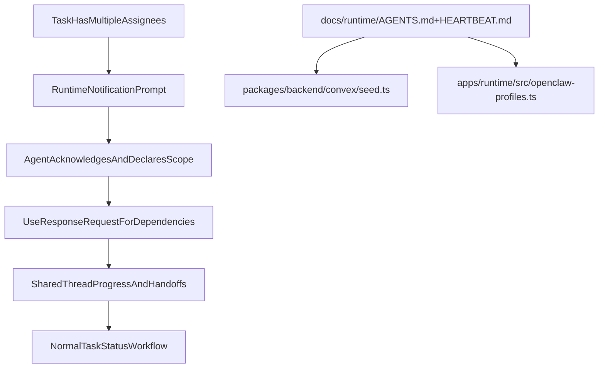

# Multi-Assignee Collaboration Protocol Plan

## 1. Context & goal

When a task has multiple assignees, agents currently receive assignment notifications but not a strict collaboration protocol, so they often work in parallel silos. We will update seed/runtime instruction content so multi-assignee tasks trigger explicit coordination behavior (role split, handoff, response_request usage, and thread-based progress visibility) without changing task schema or tenancy rules.

Key constraints:

- Preserve current task workflow invariants and permissions in Convex.
- Keep OpenClaw tooling rules intact (`response_request` is the notification mechanism).
- Avoid breaking existing runtime prompt behavior for single-assignee tasks.
- Keep backward compatibility for already-running runtimes (fallback defaults + docs + seed updates).

## 2. Codebase research summary

Main files reviewed:

- [packages/backend/convex/seed.ts](/Users/guillaumedieudonne/Desktop/mission-control/packages/backend/convex/seed.ts)
- [docs/runtime/AGENTS.md](/Users/guillaumedieudonne/Desktop/mission-control/docs/runtime/AGENTS.md)
- [docs/runtime/HEARTBEAT.md](/Users/guillaumedieudonne/Desktop/mission-control/docs/runtime/HEARTBEAT.md)
- [apps/runtime/src/openclaw-profiles.ts](/Users/guillaumedieudonne/Desktop/mission-control/apps/runtime/src/openclaw-profiles.ts)
- [apps/runtime/src/delivery/prompt.ts](/Users/guillaumedieudonne/Desktop/mission-control/apps/runtime/src/delivery/prompt.ts)
- [apps/runtime/src/delivery.test.ts](/Users/guillaumedieudonne/Desktop/mission-control/apps/runtime/src/delivery.test.ts)
- [packages/backend/convex/tasks.ts](/Users/guillaumedieudonne/Desktop/mission-control/packages/backend/convex/tasks.ts)
- [packages/backend/convex/service/tasks.ts](/Users/guillaumedieudonne/Desktop/mission-control/packages/backend/convex/service/tasks.ts)
- [docs/concept/openclaw-mission-control-initial-article.md](/Users/guillaumedieudonne/Desktop/mission-control/docs/concept/openclaw-mission-control-initial-article.md)
- [docs/concept/openclaw-mission-control-cursor-core-instructions.md](/Users/guillaumedieudonne/Desktop/mission-control/docs/concept/openclaw-mission-control-cursor-core-instructions.md)

What we learned:

- Multi-assignee storage/assignment already exists (`assignedAgentIds` supports many IDs).
- `assignFromAgent` is additive, which enables collaboration but does not prescribe it.
- Instructions are duplicated across three sources:
  - seeded docs (`seed.ts` constants),
  - runtime fallback defaults (`openclaw-profiles.ts`),
  - source docs (`docs/runtime/*.md`).
- Current wording says agents are a team but does not define operational behavior when two+ assignees share one task.

Assumptions to validate during implementation:

- Assumption A: Problem is primarily instruction quality, not assignment API logic.
- Assumption B: We should reinforce behavior both in static docs and per-notification prompt text.
- Assumption C: No schema or migration required.

## 3. High-level design

We add a single, explicit “multi-assignee collaboration protocol” and propagate it to all instruction surfaces the agent can receive.

Protocol content (target behavior):

- On assignment with 2+ assignees, each assignee posts short acknowledgment + owned sub-scope.
- Assignees must avoid duplicate work by declaring boundaries in the thread.
- Use `response_request` (not @mention) when explicit input is needed from another assignee.
- Before moving to `review`, assignee confirms dependencies/handoffs are complete.
- If blocked by another assignee, move to `blocked` with explicit dependency owner.

## 4. File & module changes

Existing files to touch:

- [docs/runtime/AGENTS.md](/Users/guillaumedieudonne/Desktop/mission-control/docs/runtime/AGENTS.md)
  - Add a dedicated section: “Working with Multiple Assignees”.
  - Define concrete rules for split ownership, dependency signaling, and no-duplication behavior.
  - Clarify that `response_request` is mandatory for actionable handoffs.
- [docs/runtime/HEARTBEAT.md](/Users/guillaumedieudonne/Desktop/mission-control/docs/runtime/HEARTBEAT.md)
  - Add heartbeat decision bullet for multi-assignee tasks (check teammate updates before starting new work).
  - Add stale-dependency handling guidance (block vs proceed).
- [packages/backend/convex/seed.ts](/Users/guillaumedieudonne/Desktop/mission-control/packages/backend/convex/seed.ts)
  - Update `DOC_AGENTS_CONTENT` and `DOC_HEARTBEAT_CONTENT` with the same protocol text.
  - Update `buildSoulContent()` role templates (at least `squad-lead`, `engineer`, `qa`; optionally `designer`/`writer`) to include multi-assignee coordination expectations.
  - Keep existing API/tool endpoint docs intact.
- [apps/runtime/src/openclaw-profiles.ts](/Users/guillaumedieudonne/Desktop/mission-control/apps/runtime/src/openclaw-profiles.ts)
  - Update `DEFAULT_AGENTS_MD` (and heartbeat default if needed) to mirror new protocol so Docker fallback remains aligned when docs files are absent.
- [apps/runtime/src/delivery/prompt.ts](/Users/guillaumedieudonne/Desktop/mission-control/apps/runtime/src/delivery/prompt.ts)
  - Add conditional prompt reinforcement when `task.assignedAgentIds.length > 1` and recipient is assigned.
  - Instruction should be short and operational (declare ownership, check thread, use `response_request` for dependencies).
- [apps/runtime/src/delivery.test.ts](/Users/guillaumedieudonne/Desktop/mission-control/apps/runtime/src/delivery.test.ts)
  - Add/adjust tests asserting multi-assignee prompt instructions are included for multi-assignee tasks and absent for single-assignee tasks.

New files to create:

- None expected.

## 5. Step-by-step tasks

1. **Workspace isolation setup**

- Create a feature worktree and branch (per project rule) and switch terminal/editor context to it.
- Verify no implementation is done in main repo path.

1. **Define collaboration protocol text once**

- Draft canonical wording in `docs/runtime/AGENTS.md` and `docs/runtime/HEARTBEAT.md`.
- Keep wording concise and deterministic so seeded/runtime copies can reuse it exactly.

1. **Propagate protocol into seed docs**

- Update `DOC_AGENTS_CONTENT` and `DOC_HEARTBEAT_CONTENT` in `packages/backend/convex/seed.ts`.
- Ensure seed-generated document titles/content remain unchanged except protocol additions.

1. **Propagate protocol into SOUL role templates**

- Update `buildSoulContent()` role sections in `packages/backend/convex/seed.ts` to add role-specific multi-assignee responsibilities:
  - `squad-lead`: assign explicit ownership and monitor handoffs.
  - `engineer`: claim sub-scope and avoid overlapping implementation.
  - `qa`: verify cross-assignee integration and missing handoffs.

1. **Update runtime fallback defaults**

- Mirror protocol changes in `apps/runtime/src/openclaw-profiles.ts` defaults to avoid drift when external docs files are unavailable.

1. **Add per-notification reinforcement**

- In `apps/runtime/src/delivery/prompt.ts`, add conditional multi-assignee instructions when task has 2+ assignees.
- Keep this additive and non-breaking to existing status/tool instructions.

1. **Update tests**

- Extend `apps/runtime/src/delivery.test.ts` with a multi-assignee case.
- Update any assertions impacted by prompt text changes.

1. **Verification and release notes alignment**

- Run runtime targeted tests for prompt formatting.
- Confirm seeded instruction strings and docs are aligned to avoid future drift.

## 6. Edge cases & risks

- **Instruction drift risk:** same guidance exists in multiple files; partial edits can reintroduce inconsistency.
  - Mitigation: apply identical protocol wording across docs/seed/defaults in one change.
- **Prompt verbosity risk:** too much extra prompt text can reduce model focus.
  - Mitigation: keep multi-assignee reinforcement short and conditional.
- **Behavior ambiguity risk:** assignees may still race if protocol is vague.
  - Mitigation: require explicit ownership declaration and dependency requests via `response_request`.
- **Backward compatibility risk:** existing tasks/agents keep old seeded docs until reseeded/profile sync.
  - Mitigation: runtime prompt reinforcement ensures immediate effect for active notifications.

## 7. Testing strategy

Unit tests:

- `apps/runtime/src/delivery.test.ts`
  - multi-assignee task includes collaboration instructions.
  - single-assignee task does not include multi-assignee block.

Integration/e2e checks (manual in runtime environment):

- Create a task with two assigned agents.
- Trigger assignment notification for both.
- Verify each prompt includes collaboration protocol language.
- Verify a `response_request`-based handoff is suggested and used.

Manual QA checklist:

- Two-agent assignment produces explicit ownership/handoff language.
- Task thread reflects divided ownership instead of duplicate parallel work.
- Status transitions (`in_progress`, `blocked`, `review`) remain unchanged.
- Single-assignee prompts remain concise and unaffected.

## 8. Rollout / migration

- No DB migration required.
- Deploy as normal runtime/backend release.
- For existing accounts:
  - Prompt-level reinforcement applies immediately.
  - Seeded docs/SOUL changes affect newly seeded or refreshed profiles.
- Optional follow-up: add a maintenance command to re-sync AGENTS/HEARTBEAT docs into existing agent workspaces if needed.

## 9. TODO checklist

### Setup

- Create isolated worktree and feature branch (`feat/multi-assignee-collab-protocol`).
- Verify implementation commands run from worktree path only.

### Documentation and seed content

- Add “Working with Multiple Assignees” section in `docs/runtime/AGENTS.md`.
- Add multi-assignee heartbeat guidance in `docs/runtime/HEARTBEAT.md`.
- Update `DOC_AGENTS_CONTENT` in `packages/backend/convex/seed.ts`.
- Update `DOC_HEARTBEAT_CONTENT` in `packages/backend/convex/seed.ts`.
- Update role-specific `buildSoulContent()` sections in `packages/backend/convex/seed.ts`.

### Runtime defaults and prompt

- Update `DEFAULT_AGENTS_MD` (and heartbeat default if touched) in `apps/runtime/src/openclaw-profiles.ts`.
- Add conditional multi-assignee reinforcement in `apps/runtime/src/delivery/prompt.ts`.

### Tests

- Add multi-assignee prompt test in `apps/runtime/src/delivery.test.ts`.
- Update existing prompt assertions impacted by text changes.
- Run targeted runtime tests and confirm pass.

### Validation and rollout

- Validate two-assignee behavior manually with one coordination handoff.
- Confirm single-assignee behavior remains unchanged.
- Document any account refresh/reseed note in release checklist.
