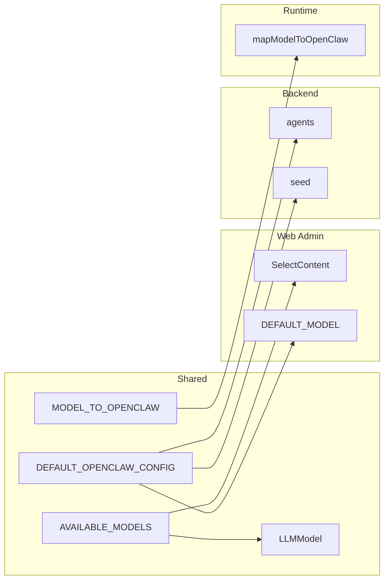

# Normalize model management in shared package

## Goal

Single source of truth in `@packages/shared` for:

- Which models are available (list + type)
- Human-readable labels
- Mapping to Vercel AI Gateway provider/model IDs

Then have runtime, web admin, and backend consume shared only (no duplicate lists or maps).

## Vercel AI Gateway model IDs (from [vercel.com/ai-gateway/models](https://vercel.com/ai-gateway/models))

| Display name     | Internal ID (value) | Gateway ID (provider/model)   |
| ---------------- | ------------------- | ----------------------------- |
| Claude 4.5 Haiku | `claude-haiku-4.5`  | `anthropic/claude-haiku-4.5`  |
| Sonnet 4.5       | `claude-sonnet-4.5` | `anthropic/claude-sonnet-4.5` |
| GPT-5 Mini       | `gpt-5-mini`        | `openai/gpt-5-mini`           |
| GPT-5 Nano       | `gpt-5-nano`        | `openai/gpt-5-nano`           |

Internal IDs are stored in Convex and in UI; the runtime maps them to gateway IDs when building OpenClaw profiles.

## Current state

- **Shared**: [packages/shared/src/constants/index.ts](packages/shared/src/constants/index.ts) has `AVAILABLE_MODELS` (old 4 models) and `DEFAULT_OPENCLAW_CONFIG.model`; [packages/shared/src/types/index.ts](packages/shared/src/types/index.ts) has `LLMModel` union.
- **Runtime**: [apps/runtime/src/openclaw-profiles.ts](apps/runtime/src/openclaw-profiles.ts) defines local `MODEL_MAP` and `mapModelToOpenClaw()`.
- **Web**: [apps/web/src/app/(dashboard)/[accountSlug]/admin/openclaw/page.tsx](<apps/web/src/app/(dashboard)/[accountSlug]/admin/openclaw/page.tsx>) uses hardcoded `DEFAULT_MODEL` and hardcoded `<SelectItem>` list (including `gemini-2.0-flash`, which is not in shared or runtime map).
- **Backend**: [packages/backend/convex/agents.ts](packages/backend/convex/agents.ts) has `getDefaultOpenclawConfig()` with hardcoded model; [packages/backend/convex/seed.ts](packages/backend/convex/seed.ts) and schema use string for `model` (no enum). [packages/backend/convex/lib/behavior_flags.ts](packages/backend/convex/lib/behavior_flags.ts) and [AgentBehaviorFlagsCard](<apps/web/src/app/(dashboard)/[accountSlug]/agents/[agentId]/_components/AgentBehaviorFlagsCard.tsx>) already import `DEFAULT_OPENCLAW_CONFIG` from shared.

## Implementation plan

### 1. Shared package: single source of truth

**Files:** [packages/shared/src/constants/index.ts](packages/shared/src/constants/index.ts), [packages/shared/src/types/index.ts](packages/shared/src/types/index.ts).

- **Constants**
  - Replace `AVAILABLE_MODELS` with the four new entries (value + label). **Default/recommended model: Claude 4.5 Haiku.**
    - `{ value: "claude-haiku-4.5", label: "Claude 4.5 Haiku (Recommended)" }`
    - `{ value: "claude-sonnet-4.5", label: "Sonnet 4.5" }`
    - `{ value: "gpt-5-mini", label: "GPT-5 Mini" }`
    - `{ value: "gpt-5-nano", label: "GPT-5 Nano" }`
  - Add `MODEL_TO_OPENCLAW: Record<LLMModel, string>` mapping each internal ID to Vercel AI Gateway `provider/model` string (e.g. `"claude-haiku-4.5"` → `"anthropic/claude-haiku-4.5"`). Type it so keys are exactly the values from `AVAILABLE_MODELS`.
  - Update `DEFAULT_OPENCLAW_CONFIG.model` to `**"claude-haiku-4.5"**` (default LLM = Haiku).
- **Types**
  - Update `LLMModel` to the union of the four new values (can derive from `AVAILABLE_MODELS` for a single source, e.g. `(typeof AVAILABLE_MODELS)[number]["value"]`).

Export `MODEL_TO_OPENCLAW` (and optionally a small helper like `mapModelToOpenClaw(model: string): string | undefined`) from shared so the runtime can use it without duplicating the map.

### 2. Runtime: use shared mapping

**File:** [apps/runtime/src/openclaw-profiles.ts](apps/runtime/src/openclaw-profiles.ts).

- Remove local `MODEL_MAP`.
- Import `MODEL_TO_OPENCLAW` (and helper if added) from `@packages/shared`. Ensure runtime package has `@packages/shared` in dependencies if not already.
- Implement `mapModelToOpenClaw(model: string | undefined)` by: if missing/empty return `undefined`; otherwise return `MODEL_TO_OPENCLAW[model as LLMModel] ?? undefined` so unknown legacy IDs (e.g. old `claude-sonnet-4-20250514`) fall back to gateway default instead of breaking.

### 3. Web admin: use shared list and default

**File:** [apps/web/src/app/(dashboard)/[accountSlug]/admin/openclaw/page.tsx](<apps/web/src/app/(dashboard)/[accountSlug]/admin/openclaw/page.tsx>).

- Remove local `DEFAULT_MODEL`; use `DEFAULT_OPENCLAW_CONFIG.model` from `@packages/shared` for initial default and when no `agentDefaults.model` is set.
- Replace hardcoded `<SelectItem>` list with a map over `AVAILABLE_MODELS` from shared (e.g. `AVAILABLE_MODELS.map((m) => <SelectItem key={m.value} value={m.value}>{m.label}</SelectItem>)`).
- When saving defaults, keep sending `selectedModel` as-is (values will now be the new IDs). If existing account has `agentDefaults.model` set to an old ID (e.g. `claude-sonnet-4-20250514`), the Select will show that value only if it’s in the list; otherwise consider initializing to shared default when the stored value is not in `AVAILABLE_MODELS`.

### 4. Backend: use shared default and optional validation

**Files:** [packages/backend/convex/agents.ts](packages/backend/convex/agents.ts), [packages/backend/convex/seed.ts](packages/backend/convex/seed.ts).

- In `agents.ts`: remove local `getDefaultOpenclawConfig()` and use `DEFAULT_OPENCLAW_CONFIG` from `@packages/shared` (spread or assign) wherever the default is needed. If the default is mutable (e.g. includes non-readonly fields), use a copy (e.g. `{ ...DEFAULT_OPENCLAW_CONFIG }`) so shared export is not mutated.
- In `seed.ts`: replace hardcoded `model: "claude-sonnet-4-20250514"` in `defaultOpenclawConfig` / seed OpenClaw config with `DEFAULT_OPENCLAW_CONFIG.model` from shared.
- Schema and `accounts` validator keep `model` as `v.string()`; no enum change required. Optionally add a runtime check when updating agent/account defaults that `model` is in `AVAILABLE_MODELS.map(m => m.value)` if you want strict validation.

### 5. Backward compatibility and migration

- **Existing data**: Agents and account defaults may still have old model values (e.g. `claude-sonnet-4-20250514`, `gpt-4o`). The runtime’s `mapModelToOpenClaw` will return `undefined` for those, so OpenClaw/gateway will use its own default (or you can add a small legacy map in shared/runtime for one-time migration: e.g. `claude-sonnet-4-20250514` → `anthropic/claude-sonnet-4.5`). Plan: implement mapping only for the four new IDs; document that existing agents with old model IDs will fall back to gateway default until defaults are re-saved or agents are updated.
- **Optional legacy map**: If you want existing stored values to keep working without re-saving, add in shared (or runtime) a `LEGACY_MODEL_TO_OPENCLAW` and in `mapModelToOpenClaw` check legacy first, then `MODEL_TO_OPENCLAW`. This can be a follow-up.

## Data flow (after change)

## Files to touch (summary)

| Location | File                                     | Change                                                                              |
| -------- | ---------------------------------------- | ----------------------------------------------------------------------------------- |
| Shared   | `packages/shared/src/constants/index.ts` | New `AVAILABLE_MODELS`, `MODEL_TO_OPENCLAW`, update `DEFAULT_OPENCLAW_CONFIG.model` |
| Shared   | `packages/shared/src/types/index.ts`     | Update `LLMModel` to the four new values (or derive from AVAILABLE_MODELS)          |
| Runtime  | `apps/runtime/src/openclaw-profiles.ts`  | Import shared map, remove local MODEL_MAP, use shared in mapModelToOpenClaw         |
| Web      | `apps/web/.../admin/openclaw/page.tsx`   | Use AVAILABLE_MODELS for select, DEFAULT_OPENCLAW_CONFIG.model for default          |
| Backend  | `packages/backend/convex/agents.ts`      | Use DEFAULT_OPENCLAW_CONFIG from shared instead of getDefaultOpenclawConfig         |
| Backend  | `packages/backend/convex/seed.ts`        | Use DEFAULT_OPENCLAW_CONFIG.model from shared in seed OpenClaw config               |

No schema or API contract change; `model` remains a string. Adding optional validation against `AVAILABLE_MODELS` in backend is optional and can be done in a later step.
