# Implement Orchestrator Assignee Remediation (A+B)

## 1) Context & goal

When the orchestrator creates a task with assignees, the orchestrator can remain in `assignedAgentIds` due to a create-then-assign flow mismatch between runtime HTTP fallback and backend auto-assignment semantics. We will implement both fixes:

- **A:** make HTTP `/agent/task-create` behavior match runtime `task_create` tool behavior.
- **B:** add first-class backend support for passing assignees at creation time so create is atomic and does not rely on merge-based follow-up assignment.

Key constraints:

- Preserve multi-tenant/account validation and orchestrator-only assignment guards.
- Preserve existing status requirement invariants (`assigned`/`in_progress` require assignees).
- Keep non-orchestrator auto-assignment behavior unless explicit initial assignees are provided.
- Avoid regressions in notification/subscription side effects.

## 2) Codebase research summary

Inspected modules:

- [apps/runtime/src/tooling/agentTools.ts](apps/runtime/src/tooling/agentTools.ts)
- [apps/runtime/src/health.ts](apps/runtime/src/health.ts)
- [packages/backend/convex/service/actions.ts](packages/backend/convex/service/actions.ts)
- [packages/backend/convex/service/tasks.ts](packages/backend/convex/service/tasks.ts)
- [apps/runtime/src/tooling/agentTools.test.ts](apps/runtime/src/tooling/agentTools.test.ts)
- [apps/runtime/src/**tests**/health-agent-endpoints.test.ts](apps/runtime/src/__tests__/health-agent-endpoints.test.ts)
- [packages/backend/convex/service/tasks.test.ts](packages/backend/convex/service/tasks.test.ts)
- [packages/backend/convex/service/actions.test.ts](packages/backend/convex/service/actions.test.ts)

What we learned:

- `createFromAgent` auto-assigns creator when requested status is `assigned|in_progress` and no assignees are present.
- `assignFromAgent` merges (`existing + new`) and does not remove existing assignees.
- `task_create` tool path already downgrades orchestrator `assigned|in_progress` to `inbox` and removes explicit orchestrator self-assignment.
- HTTP fallback path (`/agent/task-create`) does not apply that normalization, causing divergence.
- Backend action `createTaskFromAgent` currently cannot accept initial `assignedAgentIds`, forcing non-atomic create then assign.

## 3) High-level design

We unify semantics across runtime and backend by making create optionally accept initial assignees and by normalizing orchestrator HTTP fallback input.

```mermaid
flowchart LR
  orchestrator[OrchestratorTaskCreate] --> runtimeHttp[RuntimeTaskCreateEndpoint]
  runtimeHttp --> normalize[NormalizeStatusAndAssignees]
  normalize --> createAction[createTaskFromAgentAction]
  createAction --> createMutation[createFromAgentMutation]
  createMutation --> taskRow[TaskInsertedWithFinalAssignees]
  taskRow --> optionalAssign[OptionalAssignCallOnlyWhenNeeded]
```

Target behavior:

- If orchestrator provides `assigneeSlugs`, runtime resolves IDs and passes them directly into create action (`assignedAgentIds`).
- Backend create mutation uses provided `assignedAgentIds` as source of truth at create time.
- Auto-assign creator remains only as fallback when create status requires assignees and no assignees were explicitly provided.
- HTTP and tool paths produce identical assignee results.

## 4) File & module changes

### Runtime

- [apps/runtime/src/health.ts](apps/runtime/src/health.ts)
  - Add helper parity with tool path for orchestrator task-create normalization:
    - normalize status (`assigned|in_progress -> inbox` for orchestrator create flow)
    - remove orchestrator from explicit assignee set
  - Pass optional `assignedAgentIds` to `api.service.actions.createTaskFromAgent`.
  - Skip follow-up `assignTaskFromAgent` when create call already receives explicit assignees (or keep only for compatibility fallback path if needed).
  - Keep existing auth/validation and slug resolution behavior.
- [apps/runtime/src/tooling/agentTools.ts](apps/runtime/src/tooling/agentTools.ts)
  - Update `task_create` execution path to pass resolved `assigneeIds` into create action.
  - Preserve existing normalization helpers and orchestrator self-filtering.
  - Keep separate assign call only for backward compatibility branch if create API omits `assignedAgentIds` (to be removed once fully migrated).
- [apps/runtime/src/tooling/agentTools.test.ts](apps/runtime/src/tooling/agentTools.test.ts)
  - Update/create assertions verifying create call carries `assignedAgentIds`.
  - Assert assign action is not called when assignees are provided in create payload.
  - Keep status normalization assertion (`assigned -> inbox`) for orchestrator.
- [apps/runtime/src/**tests**/health-agent-endpoints.test.ts](apps/runtime/src/__tests__/health-agent-endpoints.test.ts)
  - Add focused tests for `/agent/task-create` behavior (new integration-style unit tests with mocked `getConvexClient`, orchestrator identity, and action payload assertions).
  - Verify orchestrator create with `status: assigned` and assignee slugs sends `status: inbox` and `assignedAgentIds` excluding orchestrator.

### Backend Convex

- [packages/backend/convex/service/actions.ts](packages/backend/convex/service/actions.ts)
  - Extend `createTaskFromAgent` args with optional `assignedAgentIds: v.optional(v.array(v.id("agents")))`.
  - Forward `assignedAgentIds` to internal `createFromAgent` mutation.
  - Keep existing service-token, account, and behavior-flag guards unchanged.
- [packages/backend/convex/service/tasks.ts](packages/backend/convex/service/tasks.ts)
  - Extend `createFromAgent` args with optional `assignedAgentIds`.
  - In creation logic:
    - seed `assignedAgentIds` from provided arg when present.
    - validate all provided agent IDs belong to same account.
    - only auto-assign creator when status requires assignees and resulting assignee set is empty.
  - Keep `validateStatusRequirements` enforcement intact.
  - Ensure subscription behavior for initial assignees remains correct (`ensureSubscribed` for each initial assignee), not only for creator.
- [packages/backend/convex/service/tasks.test.ts](packages/backend/convex/service/tasks.test.ts)
  - Add tests for create-time assignee semantics:
    - explicit assignees prevent creator auto-assignment.
    - creator auto-assignment still occurs when required and no explicit assignees.
    - invalid cross-account assignee IDs rejected.
- [packages/backend/convex/service/actions.test.ts](packages/backend/convex/service/actions.test.ts)
  - Add action-level argument forwarding tests for new `assignedAgentIds` field.

## 5) Step-by-step tasks

1. **Prep and isolation**

- Create a dedicated worktree and branch for this feature before implementation.
- Confirm local runtime/backend test commands to run in that worktree.

1. **Backend contract extension**

- Update `createTaskFromAgent` action schema and pass-through in [packages/backend/convex/service/actions.ts](packages/backend/convex/service/actions.ts).
- Update `createFromAgent` args and handler in [packages/backend/convex/service/tasks.ts](packages/backend/convex/service/tasks.ts) to support explicit `assignedAgentIds`.

1. **Backend create semantics hardening**

- Implement assignee validation against account membership for initial assignees.
- Preserve fallback creator auto-assignment only when needed.
- Update initial subscription behavior for all initial assignees.

1. **Runtime tool path alignment (B usage)**

- In [apps/runtime/src/tooling/agentTools.ts](apps/runtime/src/tooling/agentTools.ts), pass `assignedAgentIds` directly to create action.
- Keep orchestrator status normalization + self-filter helper behavior.
- Remove or gate post-create assign call when create already includes assignees.

1. **Runtime HTTP fallback parity (A)**

- In [apps/runtime/src/health.ts](apps/runtime/src/health.ts), replicate orchestrator normalization behavior currently only in tool path.
- Pass normalized status and filtered `assignedAgentIds` to create action.
- Avoid immediate follow-up assign when already provided at create.

1. **Runtime test updates**

- Update [apps/runtime/src/tooling/agentTools.test.ts](apps/runtime/src/tooling/agentTools.test.ts) for new action payload and call-count expectations.
- Add targeted `/agent/task-create` tests in [apps/runtime/src/**tests**/health-agent-endpoints.test.ts](apps/runtime/src/__tests__/health-agent-endpoints.test.ts) with mocked convex calls.

1. **Backend test additions**

- Extend [packages/backend/convex/service/tasks.test.ts](packages/backend/convex/service/tasks.test.ts) with creation-assignee matrix tests.
- Extend [packages/backend/convex/service/actions.test.ts](packages/backend/convex/service/actions.test.ts) for argument validation/forwarding.

1. **Verification pass**

- Run runtime tests (`agentTools`, health endpoint tests) and backend service tests.
- Add one manual validation scenario: orchestrator create via tool and via HTTP fallback both produce assignees without orchestrator (unless intentionally assigned and allowed by policy).

## 6) Edge cases & risks

- **Cross-account assignee IDs**: must fail creation early in backend mutation.
- **Empty explicit assignee list with required status**: should still auto-assign creator (existing fallback behavior).
- **Orchestrator explicitly included in assignee slugs**: runtime should filter it out for delegated creates.
- **Subscription side effects**: adding initial assignees at creation must subscribe assignees similarly to assign flow.
- **Behavior drift between tool and HTTP**: parity logic should be centralized/shared where practical to avoid future divergence.

## 7) Testing strategy

- **Unit tests (runtime):**
  - `task_create` payload composition (`status` normalization, `assignedAgentIds` forwarding).
  - No redundant `assignTaskFromAgent` call when create includes assignees.
  - Orchestrator self-removal from assignee set.
- **Unit/integration tests (backend service layer):**
  - `createFromAgent` with explicit assignees and status requiring assignees.
  - fallback auto-assign creator branch.
  - invalid agent/account validation branch.
- **Manual QA checklist:**
  - Create via `task_create` as orchestrator with `status=in_progress`, `assigneeSlugs=[engineer]` -> task assignees only `engineer`.
  - Create via HTTP `/agent/task-create` same payload -> same result.
  - Non-orchestrator create `status=in_progress` with no assignees -> creator auto-assigned.
  - Blocked/review/done creation behavior unchanged.

## 8) Rollout / migration

No schema migration is required. Rollout can be standard deployment, but include:

- Short-term monitoring of task creation logs in runtime (`[task-create]`) and Convex errors for invalid assignee IDs.
- Optional temporary debug logging for payload parity in non-production environments.
- If unexpected regressions appear, safe fallback is to keep create without `assignedAgentIds` and use assign path (current behavior).

## 9) TODO checklist

### Setup

- Create feature worktree and branch dedicated to this remediation.
- Confirm local test commands for runtime and backend packages.

### Backend

- Extend `createTaskFromAgent` args with optional `assignedAgentIds` in [packages/backend/convex/service/actions.ts](packages/backend/convex/service/actions.ts).
- Forward `assignedAgentIds` from action to mutation in [packages/backend/convex/service/actions.ts](packages/backend/convex/service/actions.ts).
- Extend `createFromAgent` args and logic in [packages/backend/convex/service/tasks.ts](packages/backend/convex/service/tasks.ts).
- Validate provided assignee IDs belong to the task account in [packages/backend/convex/service/tasks.ts](packages/backend/convex/service/tasks.ts).
- Ensure initial assignees are subscribed when set at creation in [packages/backend/convex/service/tasks.ts](packages/backend/convex/service/tasks.ts).

### Runtime

- Update `task_create` execution path to send `assignedAgentIds` at create time in [apps/runtime/src/tooling/agentTools.ts](apps/runtime/src/tooling/agentTools.ts).
- Keep orchestrator status normalization and self-filtering consistent in [apps/runtime/src/tooling/agentTools.ts](apps/runtime/src/tooling/agentTools.ts).
- Update `/agent/task-create` HTTP flow to apply same normalization in [apps/runtime/src/health.ts](apps/runtime/src/health.ts).
- Pass normalized status and filtered `assignedAgentIds` to create action in [apps/runtime/src/health.ts](apps/runtime/src/health.ts).
- Remove/gate redundant post-create assign call when create payload already includes assignees in runtime paths.

### Tests

- Update `task_create` tests for create payload and assign call behavior in [apps/runtime/src/tooling/agentTools.test.ts](apps/runtime/src/tooling/agentTools.test.ts).
- Add health endpoint tests covering `/agent/task-create` orchestrator parity in [apps/runtime/src/**tests**/health-agent-endpoints.test.ts](apps/runtime/src/__tests__/health-agent-endpoints.test.ts).
- Add backend tests for `createFromAgent` assignee semantics in [packages/backend/convex/service/tasks.test.ts](packages/backend/convex/service/tasks.test.ts).
- Add backend tests for action arg forwarding in [packages/backend/convex/service/actions.test.ts](packages/backend/convex/service/actions.test.ts).

### Validation

- Run all touched test suites and fix failures.
- Perform manual tool vs HTTP fallback parity checks for orchestrator-created delegated tasks.
