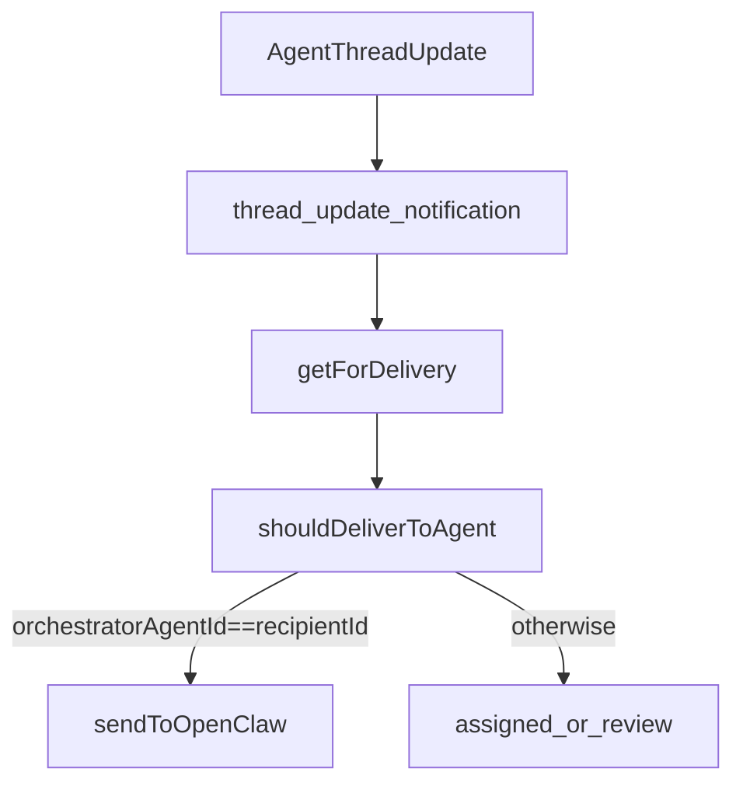

# Orchestrator Subscription Refactor Plan

## 1. Context & goal

We need to replace regex-based “lead/PM” detection with an explicit, per-account orchestrator identity that matches the concept doc’s team workflow: the lead adds context, assigns work, reviews, and closes. The orchestrator must reliably receive agent thread updates and review signals, while still being assignable to tasks. This must preserve multi‑tenancy and keep runtime delivery loop safe from agent‑to‑agent reply loops.

Concept alignment (docs/concept):

- The lead is a first‑class team member who reviews and closes work; this plan encodes that role explicitly, not by inference.
- Collaboration happens inside a single task thread; lead must be subscribed so agent replies always reach them.

Constraints:

- Multi‑tenant: all data scoped by `accountId`.
- Runtime delivery must remain idempotent and avoid reply loops.
- No regex for lead/orchestrator detection in runtime.
- Orchestrator must be configurable via UI (Agents view).

## 2. Codebase research summary

Files inspected:

- [docs/concept/openclaw-mission-control-initial-article.md](docs/concept/openclaw-mission-control-initial-article.md) — lead reviews/closes; shared‑brain workflow.
- [packages/backend/convex/schema.ts](packages/backend/convex/schema.ts) — account settings shape.
- [packages/backend/convex/accounts.ts](packages/backend/convex/accounts.ts) — settings validator + update mutation.
- [packages/backend/convex/subscriptions.ts](packages/backend/convex/subscriptions.ts) — `ensureSubscribed` helper.
- [packages/backend/convex/tasks.ts](packages/backend/convex/tasks.ts) — task create/assign flows.
- [packages/backend/convex/messages.ts](packages/backend/convex/messages.ts) — user message flow.
- [packages/backend/convex/service/messages.ts](packages/backend/convex/service/messages.ts) — agent message flow.
- [packages/backend/convex/service/notifications.ts](packages/backend/convex/service/notifications.ts) — delivery context payload.
- [apps/runtime/src/delivery.ts](apps/runtime/src/delivery.ts) — agent delivery filter.
- [apps/web/src/app/(dashboard)/[accountSlug]/agents/page.tsx](<apps/web/src/app/(dashboard)/[accountSlug]/agents/page.tsx>) — agent roster page.
- [apps/web/src/app/(dashboard)/[accountSlug]/agents/[agentId]/page.tsx](<apps/web/src/app/(dashboard)/[accountSlug]/agents/[agentId]/page.tsx>) — agent detail page (admin actions).
- [apps/web/src/components/agents/AgentCard.tsx](apps/web/src/components/agents/AgentCard.tsx) — roster card UI.
- [apps/web/src/components/providers/AccountProvider.tsx](apps/web/src/components/providers/AccountProvider.tsx) — provides account (including settings).

Patterns to reuse:

- `ensureSubscribed()` for idempotent subscriptions.
- `service/notifications.getForDelivery` to pass extra context to runtime (already extended once).
- Account settings via `accounts.settings` validator + update mutation.
- Admin-only UI actions pattern in agent detail page (dropdown + dialogs).

## 3. High-level design

Add an explicit `orchestratorAgentId` under account settings. Use that to:

- Auto‑subscribe the orchestrator to task threads.
- Allow orchestrator delivery for agent-authored `thread_update` notifications without regex.
- Expose UI to set/clear orchestrator from the Agents view (admin only).

Data flows:

- **UI flow**: Admin selects “Set as Orchestrator” on an agent → `api.accounts.update` writes `settings.orchestratorAgentId` → `AccountProvider` provides the setting to UI → roster/agent pages show orchestrator badge.
- **Task flow**: Task created/assigned → `ensureOrchestratorSubscribed` adds lead subscription → `thread_update` notifications are created → runtime delivery allows orchestrator recipient when `context.orchestratorAgentId === recipientId`.

Mermaid (delivery decision):

## 4. File & module changes

### Backend (Convex)

- [packages/backend/convex/schema.ts](packages/backend/convex/schema.ts)
  - Add `settings.orchestratorAgentId?: Id<"agents">` to account settings schema.
- [packages/backend/convex/accounts.ts](packages/backend/convex/accounts.ts)
  - Extend `accountSettingsValidator` to accept `orchestratorAgentId: v.optional(v.id("agents"))`.
  - Allow updates via `accounts.update` (admin only), merging into `settings`.
- [packages/backend/convex/subscriptions.ts](packages/backend/convex/subscriptions.ts)
  - Add helper `ensureOrchestratorSubscribed(ctx, accountId, taskId)`:
    - Load account → read `settings.orchestratorAgentId`.
    - If set, fetch agent; ensure `agent.accountId === accountId`.
    - Call `ensureSubscribed(ctx, accountId, taskId, "agent", orchestratorAgentId)`.
    - Add JSDoc on the helper.
- [packages/backend/convex/tasks.ts](packages/backend/convex/tasks.ts)
  - Call `ensureOrchestratorSubscribed` in `create` (after task insert) and in `assign` (after updates) to ensure lead follows tasks even if not creator.
- [packages/backend/convex/messages.ts](packages/backend/convex/messages.ts)
  - Call `ensureOrchestratorSubscribed` after message insert so legacy tasks still get lead subscription.
- [packages/backend/convex/service/messages.ts](packages/backend/convex/service/messages.ts)
  - Call `ensureOrchestratorSubscribed` after agent message insert; remove regex-based lead logic.
- [packages/backend/convex/service/notifications.ts](packages/backend/convex/service/notifications.ts)
  - Include `orchestratorAgentId` in the delivery context result (from account settings).
- [packages/backend/convex/seed.ts](packages/backend/convex/seed.ts)
  - When seeding the PM/Squad Lead agent, set `accounts.settings.orchestratorAgentId` to that agent.
- [packages/backend/convex/agents.ts](packages/backend/convex/agents.ts)
  - If deleting an agent that matches `orchestratorAgentId`, clear the setting to avoid dangling references.

### Runtime

- [apps/runtime/src/delivery.ts](apps/runtime/src/delivery.ts)
  - Replace regex lead detection with explicit `context.orchestratorAgentId === recipientId`.
  - Keep `sourceNotificationType === "thread_update"` loop guard.
  - Ensure assigned agents still get updates; orchestrator receives updates even when not assigned.

### Frontend (UI)

- [apps/web/src/app/(dashboard)/[accountSlug]/agents/[agentId]/page.tsx](<apps/web/src/app/(dashboard)/[accountSlug]/agents/[agentId]/page.tsx>)
  - Add admin-only action: “Set as Orchestrator” / “Remove Orchestrator”.
  - Use `useMutation(api.accounts.update)` to set `settings.orchestratorAgentId`.
  - Show current orchestrator state (badge/label) on the detail header.
- [apps/web/src/components/agents/AgentCard.tsx](apps/web/src/components/agents/AgentCard.tsx)
  - Optional: show “Orchestrator” badge when `account.settings.orchestratorAgentId === agent._id`.
- [apps/web/src/app/(dashboard)/[accountSlug]/agents/page.tsx](<apps/web/src/app/(dashboard)/[accountSlug]/agents/page.tsx>)
  - Pass account settings to cards if needed for the badge (via `useAccount()`).

## 5. Step-by-step tasks

1. **Schema + settings**

- Update [packages/backend/convex/schema.ts](packages/backend/convex/schema.ts) to add `settings.orchestratorAgentId`.
- Update [packages/backend/convex/accounts.ts](packages/backend/convex/accounts.ts) validator + mutation to accept/store it.
- Run Convex typegen (`npx convex dev --once`).

1. **Subscription helper**

- Add `ensureOrchestratorSubscribed` in [packages/backend/convex/subscriptions.ts](packages/backend/convex/subscriptions.ts) with JSDoc and agent/account check.

1. **Wire into task lifecycle**

- Call `ensureOrchestratorSubscribed` in `tasks.create` and `tasks.assign`.

1. **Wire into message flows**

- Call `ensureOrchestratorSubscribed` in `messages.create` and `service/messages.createFromAgent`.
- Remove any regex-based lead logic from agent message flow.

1. **Expose orchestrator to runtime**

- In [packages/backend/convex/service/notifications.ts](packages/backend/convex/service/notifications.ts), include `orchestratorAgentId` in `getForDelivery` return.

1. **Runtime filter update**

- Update [apps/runtime/src/delivery.ts](apps/runtime/src/delivery.ts) to use `context.orchestratorAgentId === recipientId` instead of regex.

1. **Agent deletion safety**

- In [packages/backend/convex/agents.ts](packages/backend/convex/agents.ts), clear `settings.orchestratorAgentId` if deleting the orchestrator agent.

1. **UI: set orchestrator**

- In [apps/web/src/app/(dashboard)/[accountSlug]/agents/[agentId]/page.tsx](<apps/web/src/app/(dashboard)/[accountSlug]/agents/[agentId]/page.tsx>):
  - Fetch `account` from `useAccount()` to get current `settings.orchestratorAgentId`.
  - Add admin-only action button or dropdown item:
    - If this agent is orchestrator → “Remove Orchestrator”.
    - Else → “Set as Orchestrator”.
  - On click, call `api.accounts.update` with `settings: { orchestratorAgentId: agent._id }` or `settings: { orchestratorAgentId: undefined }` (clear).
  - Show success/error toasts following existing UI patterns.
- Optional roster badge in [apps/web/src/components/agents/AgentCard.tsx](apps/web/src/components/agents/AgentCard.tsx).

1. **Seed + docs**

- Update [packages/backend/convex/seed.ts](packages/backend/convex/seed.ts) to store `orchestratorAgentId` for the PM/Squad Lead agent.
- Optionally add a short note in [docs/runtime/AGENTS.md](docs/runtime/AGENTS.md) about orchestrator auto‑subscription.

## 6. Edge cases & risks

- **Orchestrator not set**: `ensureOrchestratorSubscribed` should no‑op when missing.
- **Duplicate subscriptions**: `ensureSubscribed` is idempotent; safe to call from tasks/messages.
- **Lead assigned to tasks**: assigned delivery still works; orchestrator subscription is additive (no duplicate `thread_update` due to unique subscription index).
- **Legacy tasks**: message‑level auto‑subscribe ensures orchestrator is added even if tasks predate the setting.
- **Loop prevention**: keep `sourceNotificationType === "thread_update"` guard.
- **Orchestrator deleted**: clear `orchestratorAgentId` on agent removal to avoid dangling references.

## 7. Testing strategy

- **Unit (if infra exists)**:
  - `ensureOrchestratorSubscribed` no‑ops when unset; subscribes when set.
  - Clear orchestrator on agent delete.
- **Integration**:
  - Create task → agent reply → orchestrator receives `thread_update`.
  - Task assigned to lead → lead receives updates (assigned + orchestrator).
  - Missing orchestratorAgentId → behavior matches current (no extra delivery).
- **Manual QA**:
  - Create task as user; verify lead auto‑subscribed.
  - Assign to QA; QA reply triggers lead notification.
  - Task moves to `review` and lead receives thread update.
  - Admin can set/remove orchestrator in Agents UI; badge updates.

## 8. Rollout / migration

- **Backfill**: for existing accounts, set `orchestratorAgentId` once (admin script or dashboard). If needed, a one‑off migration can set it to the agent with slug `squad-lead` in each account.
- **Safe rollout**: deploy backend first (schema + helpers), then runtime filter update.

## 9. TODO checklist

- **Backend**
  - Add `orchestratorAgentId` to `accounts.settings` in schema and validators.
  - Implement `ensureOrchestratorSubscribed` helper with JSDoc.
  - Call `ensureOrchestratorSubscribed` in tasks and messages (user + agent).
  - Include `orchestratorAgentId` in `service/notifications.getForDelivery`.
  - Update seed to set orchestrator for demo account.
  - Clear orchestrator setting on agent deletion.
- **Runtime**
  - Replace lead regex in delivery filter with explicit `orchestratorAgentId` check.
- **Frontend**
  - Add “Set as Orchestrator” action in agent detail page (admin only).
  - Optional orchestrator badge in agent roster cards.
- **Docs / QA**
  - Optional: note orchestrator auto‑subscription in AGENTS.md.
  - Manual QA for agent reply → lead notification and review loop.
