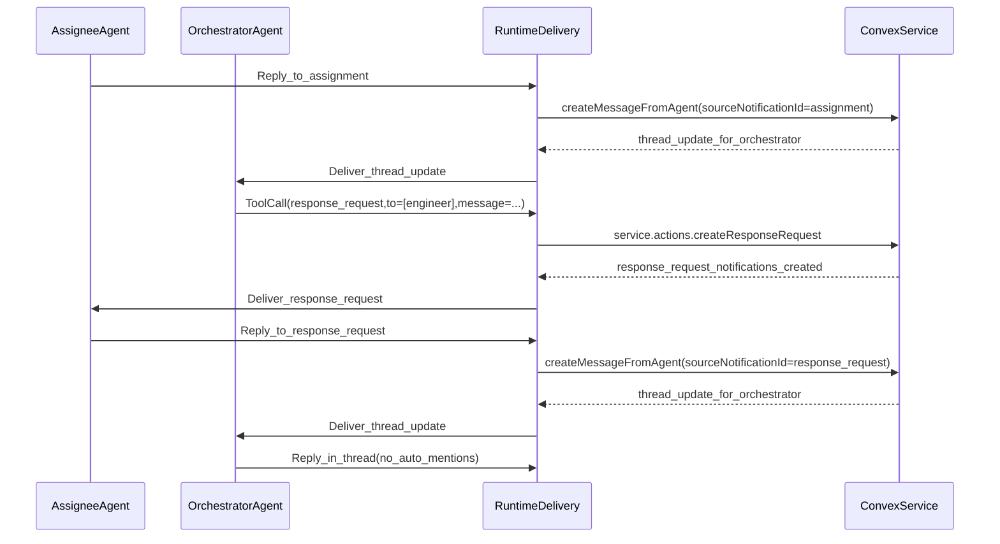

# Orchestrator/Assignee Infinite-Loop Fix

## 1. Context & goal

Today the **orchestrator agent** is auto-subscribed to all task threads and receives agent-authored `thread_update` notifications, which is correct for oversight. However, the runtime currently **injects @mentions into orchestrator replies** in some cases, which can generate `mention` notifications and cause a ping‑pong loop (orchestrator → assignee → orchestrator → …).

**Goal**: Stop accidental infinite loops while preserving the ability for any agent to explicitly request a response from another agent.

**Constraints**

- Multi-tenancy: all writes scoped by `accountId`.
- Delivery must remain idempotent / retry-safe.
- No hidden “auto-pings” to agents; follow-up requests must be explicit.

**Acceptance criteria**

- Orchestrator replying in a thread **does not** automatically notify assignees unless the orchestrator explicitly requests it.
- A new agent tool exists to request a response from other agents; it is **available to all agents** when `canMentionAgents` is enabled.
- Requests are **deduped** (no spam on retries or repeated calls without an intervening response).
- Existing `thread_update` loop guards remain intact.

## 2. Codebase research summary

Files inspected:

- Concept: [docs/concept/openclaw-mission-control-initial-article.md](docs/concept/openclaw-mission-control-initial-article.md), [docs/concept/openclaw-mission-control-cursor-core-instructions.md](docs/concept/openclaw-mission-control-cursor-core-instructions.md)
- Runtime delivery: [apps/runtime/src/delivery.ts](apps/runtime/src/delivery.ts)
- Runtime tools: [apps/runtime/src/tooling/agentTools.ts](apps/runtime/src/tooling/agentTools.ts), [apps/runtime/src/tooling/taskStatusTool.ts](apps/runtime/src/tooling/taskStatusTool.ts)
- Convex service context: [packages/backend/convex/service/notifications.ts](packages/backend/convex/service/notifications.ts)
- Convex message write-back + mention notifications: [packages/backend/convex/service/messages.ts](packages/backend/convex/service/messages.ts), [packages/backend/convex/lib/notifications.ts](packages/backend/convex/lib/notifications.ts)
- Types/validators: [packages/backend/convex/schema.ts](packages/backend/convex/schema.ts), [packages/backend/convex/lib/validators.ts](packages/backend/convex/lib/validators.ts), [packages/shared/src/types/index.ts](packages/shared/src/types/index.ts)
- UI mapping of notification types: [apps/web/src/app/(dashboard)/[accountSlug]/notifications/page.tsx](<apps/web/src/app/(dashboard)/[accountSlug]/notifications/page.tsx>)

What matters:

- Runtime already has a good loop guard for agent-authored `thread_update` using `sourceNotificationType`.
- `sourceNotificationType` is computed in Convex from the agent message’s `sourceNotificationId`.
- The loop is mainly enabled by runtime **auto-inserting mentions** before `createMessageFromAgent`, which creates `mention` notifications that bypass the `thread_update` guard.

Key evidence (current behavior):

```206:229:apps/runtime/src/delivery.ts
if (taskId && textToPost) {
  const trimmed = textToPost.trim();
  const finalContent = applyAutoMentionFallback(trimmed, context);
  // ...
  await client.action(api.service.actions.createMessageFromAgent, {
    agentId: context.agent._id,
    taskId,
    content: finalContent,
    serviceToken: config.serviceToken,
    accountId: config.accountId,
    sourceNotificationId: notification._id,
  });
}
```

And the existing thread_update loop guard:

```321:356:apps/runtime/src/delivery.ts
function shouldDeliverToAgent(context: any): boolean {
  const notificationType = context?.notification?.type;
  const messageAuthorType = context?.message?.authorType;

  if (notificationType === "thread_update" && messageAuthorType === "agent") {
    const sourceNotificationType = context?.sourceNotificationType;
    if (sourceNotificationType === "thread_update") return false;
    // ... orchestrator/reviewer/assignee gating ...
  }

  return true;
}
```

## 3. High-level design

### 3.1 Core change

- **Remove auto-mention fallback entirely** (no injection of agent mentions or user mentions).
- Introduce an explicit agent tool `**response_request**` (name can be `response_request` or `request_response`; pick one and keep consistent) that creates a dedicated Convex notification type `response_request` for one or more target agents.

### 3.2 Why this works

- Without injected mentions, orchestrator replies won’t generate `mention` notifications automatically.
- The existing `sourceNotificationType === "thread_update"` guard continues to prevent `thread_update` ping‑pong.
- When a response is needed, the orchestrator (or any agent) explicitly calls `response_request`, creating a targeted notification that is always delivered.

### 3.3 Data flow



## 4. File & module changes

### Runtime

- [apps/runtime/src/delivery.ts](apps/runtime/src/delivery.ts)
  - Remove `applyAutoMentionFallback(...)` usage and the entire fallback implementation (and its helpers) since we chose **remove_all**.
  - Update `formatNotificationMessage()` guidance:
    - When recipient is the orchestrator and notification is `thread_update`, explicitly state: “If you need an assignee to respond, use the `response_request` tool. Otherwise, they will not be notified.”
    - Update the “Mentionable agents” section to prefer the tool over @mentions.
  - Pass `canMentionAgents` into tool-schema selection so the tool is offered only when allowed.
- [apps/runtime/src/tooling/agentTools.ts](apps/runtime/src/tooling/agentTools.ts)
  - Add `RESPONSE_REQUEST_TOOL_SCHEMA` and include it in `getToolSchemasForCapabilities()` when `canMentionAgents` is true (and optionally when `hasTaskContext` is true).
  - Extend `executeAgentTool()` to handle `name === "response_request"`.
- New file: `apps/runtime/src/tooling/responseRequestTool.ts`
  - Export the tool schema and an `executeResponseRequestTool()` that calls the Convex service action.

### Backend (Convex)

- [packages/backend/convex/schema.ts](packages/backend/convex/schema.ts)
  - Add `v.literal("response_request")` to `notificationTypeValidator`.
- [packages/backend/convex/lib/validators.ts](packages/backend/convex/lib/validators.ts)
  - Add `v.literal("response_request")` to `notificationTypeValidator`.
- [packages/shared/src/types/index.ts](packages/shared/src/types/index.ts)
  - Add `| "response_request"` to `NotificationType`.
- [packages/backend/convex/notifications.ts](packages/backend/convex/notifications.ts)
  - Update its local `notificationTypeValidator` union to include `response_request`.
- [packages/backend/convex/service/actions.ts](packages/backend/convex/service/actions.ts)
  - Add `createResponseRequestNotifications` action (service-only):
    - Inputs: `{ accountId, serviceToken, requesterAgentId, taskId, recipientSlugs: string[], message: string }`.
    - Auth: `requireServiceAuth`, verify account match, verify requester agent belongs to account.
    - Gate: require `resolveBehaviorFlags(requesterAgent, account).canMentionAgents === true`.
    - Resolve recipient slugs → agent IDs (via `internal.service.agents.listInternal`).
    - Call internal mutation to insert notifications with dedupe.
- [packages/backend/convex/service/notifications.ts](packages/backend/convex/service/notifications.ts)
  - Add internal mutation `createResponseRequestNotificationsInternal`:
    - Inserts one `notifications` row per recipient:
      - `type: "response_request"`
      - `recipientType: "agent"`
      - `recipientId: <agentId>`
      - `taskId`
      - `title: "<RequesterName> requested a response"`
      - `body: <message>`
    - **Dedupe rule** (per recipient):
      - Find latest `response_request` notification for `(accountId, recipientId, taskId)`.
      - If it exists and there is **no agent message** by that recipient on the task **after** that notification’s `createdAt`, skip creating a new one.
      - (Optional) Also apply a cooldown window (e.g. 5 minutes) to avoid rapid re-requests even if messages exist.

### Web

- [apps/web/src/app/(dashboard)/[accountSlug]/notifications/page.tsx](<apps/web/src/app/(dashboard)/[accountSlug]/notifications/page.tsx>)
  - Add icon/color entries for `response_request` to satisfy `Record<NotificationType, …>` typing (even though users likely won’t receive this type).

### Docs

- [docs/runtime/AGENTS.md](docs/runtime/AGENTS.md)
  - Update orchestrator “Mentions” guidance to prefer the `response_request` tool for agent follow-ups.
  - Add a short explicit rule: “No auto-mentions exist; if you need a reply from another agent, you must @mention them or use the tool (preferred).”
- [packages/backend/convex/seed.ts](packages/backend/convex/seed.ts)
  - Update the embedded AGENTS content (the same section as `docs/runtime/AGENTS.md`) for consistency.

## 5. Step-by-step tasks

1. **Remove runtime auto-mention injection**

- Update `apps/runtime/src/delivery.ts` to stop modifying agent output content.
- Delete unused helper functions once no longer referenced.

1. **Add the new notification type everywhere it’s declared**

- Update `packages/backend/convex/schema.ts`, `packages/backend/convex/lib/validators.ts`, `packages/backend/convex/notifications.ts`, and `packages/shared/src/types/index.ts`.
- Update `apps/web/.../notifications/page.tsx` type maps.

1. **Backend: createResponseRequest service API**

- Add service action in `packages/backend/convex/service/actions.ts`.
- Add internal mutation in `packages/backend/convex/service/notifications.ts` with dedupe logic.

1. **Runtime: add `response_request` tool**

- Add schema + executor in `apps/runtime/src/tooling/responseRequestTool.ts`.
- Wire into `apps/runtime/src/tooling/agentTools.ts` (schema list + `executeAgentTool`).
- Update `apps/runtime/src/delivery.ts` tool selection to include this tool when allowed.

1. **Prompt + docs alignment**

- Update `formatNotificationMessage()` guidance to teach the orchestrator and agents to use the tool.
- Update `docs/runtime/AGENTS.md` and seed AGENTS content.

1. **Manual QA pass**

- Reproduce the loop scenario; confirm it no longer happens.
- Validate explicit follow-up requests still work.

## 6. Edge cases & risks

- **Invalid recipient slugs**: action should return a clear error listing unknown slugs; tool returns `{ success:false, error }` so the agent can report BLOCKED.
- **Requester tries to ping agents without permission**: enforce `canMentionAgents` gating.
- **Dedupe too aggressive**: may block legitimate repeated follow-ups. Mitigation: “response exists” check (message after request) and a short cooldown.
- **Notification explosion**: cap `recipientSlugs` to a reasonable max (e.g. 5–10) and error if exceeded.
- **Schema change requires typegen**: Convex codegen must run for TS types to update.

## 7. Testing strategy

- **Manual QA (required)**
  - **Loop regression**: engineer replies → orchestrator replies (no tool) → ensure engineer receives _no new agent notification_.
  - **Explicit request**: orchestrator uses `response_request` tool → engineer receives `response_request` notification → replies → orchestrator receives thread_update.
  - **Dedupe**: call `response_request` twice without an intervening engineer message → only one notification created.
  - **Permissions**: disable `canMentionAgents` for an agent → ensure tool not offered (runtime) and backend rejects if called anyway.
- **Optional** (if we want automated coverage later)
  - Add a small unit-test harness (Vitest) for the dedupe decision logic by extracting it into a pure helper function.

## 8. Rollout / migration

- No data migration needed.
- Deploy order:
  - Convex schema + actions first (so runtime tool calls succeed).
  - Runtime changes next.
- Consider adding a temporary env flag to re-enable the old behavior during rollout if needed; otherwise remove entirely.

## 9. TODO checklist

### Backend

- Add `response_request` to notification validators (`schema.ts`, `lib/validators.ts`, `notifications.ts`).
- Add `service.actions.createResponseRequestNotifications` (service auth + behavior-flag gate).
- Add internal mutation to insert notifications with dedupe.

### Runtime

- Remove `applyAutoMentionFallback` injection and delete related helpers.
- Add `response_request` tool schema + executor.
- Offer tool only when `canMentionAgents` (and task context exists).
- Update orchestrator prompt guidance inside `formatNotificationMessage()`.

### Web

- Add `response_request` icon/color mapping in notifications page.

### Docs

- Update `docs/runtime/AGENTS.md` follow-up guidance.
- Update `packages/backend/convex/seed.ts` embedded AGENTS content.

### QA

- Run the manual QA checklist for loop regression + dedupe + permissions.
