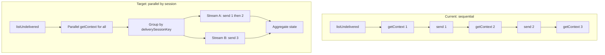

## Enhancement Summary

**Deepened on:** 2026-02-20  
**Sections enhanced:** All tasks, Invariants, and new sections (Research insights, Edge cases, Async safety).  
**Research agents used:** architecture-strategist, performance-oracle, security-sentinel, julik-frontend-races-reviewer, pattern-recognition-specialist, data-integrity-guardian, explore.

### Key Improvements

1. **runSessionStream must never reject:** Top-level try/catch in `runSessionStream`; on any uncaught exception, call `markNotificationDeliveryEnded` for the current notification, merge a failed outcome, and return (so `Promise.allSettled` only sees fulfilled results and aggregation stays exact).
2. **consecutiveFailures semantics:** When any failure this cycle (`agg.failed > 0` or any rejected stream), increment `state.consecutiveFailures` by 1 only (one consecutive failing cycle). Do not set it from `agg.failed` or number of rejected streams.
3. **Batched context fetch:** Run `getNotificationForDelivery` in batches of 15 (not all 50 at once) to bound Convex/network load; preserve order when zipping with notifications.
4. **Concurrency cap and timeout:** Cap concurrent session streams at 10 (required); process session groups in batches of 10. Wrap each `runSessionStream` in a per-stream timeout (e.g. `deliveryStreamTimeoutMs` = 2× OpenClaw request timeout) so one stuck stream does not block the cycle.
5. **processOneNotification and state:** Do not call `markDeliveredAndLog` from inside `processOneNotification` (it mutates `state.deliveredCount`). Use a Convex-only “mark delivered” helper or a variant that does not increment state; caller applies `outcome.delivered` to `state.deliveredCount`. Skip path: `markDeliveredAndLog` already increments; do not double-increment.

### New Considerations Discovered

- **noResponseFailures prune:** `_getNoResponseRetryDecision` can prune entries; if called from multiple streams concurrently, make prune safe (e.g. prune only in main flow after allSettled, or guard with single-flight).
- **Missing deliverySessionKey:** If context has agent but `deliverySessionKey` is missing, mark delivered and skip (defensive); do not add to deliverable list.
- **Crash after Convex “delivered”:** If a stream crashes after marking delivered but before returning, Convex is correct (notification not redelivered); only `state.deliveredCount` may be one short. Document as acceptable.
- **lastErrorMessage:** Keep “pick one” (e.g. first failure) for backoff; optionally add a bounded `lastErrorMessages[]` (cap 5) for debugging only.

---

# Parallel Delivery by Session — Implementation Plan

> **For Claude:** REQUIRED SUB-SKILL: Use superpowers:executing-plans to implement this plan task-by-task.

**Goal:** Parallelize the delivery loop so notifications targeting different OpenClaw sessions (different tasks or system session) are processed concurrently, allowing one agent to work on several tasks in parallel. Notifications that share the same session are still processed sequentially to respect OpenClaw session affinity.

**Architecture:** (1) After listing undelivered notifications, fetch delivery context for each in parallel (Promise.all). (2) Apply existing skip logic to obtain a list of deliverable items; group them by `deliverySessionKey`. (3) Run one async "session stream" per group: within a group, process notifications in order; across groups, run streams in parallel. (4) Extract per-notification processing into a function that returns outcome deltas (delivered, failed, exhaustedCount, terminalSkipCount, lastError) and only mutates `state.noResponseFailures` (keyed by notification id). (5) Main cycle aggregates deltas and updates shared state once after all streams settle. Retry (no-response throw) is handled inside the stream: catch, call markNotificationDeliveryEnded, return failed delta, and stop that stream for this cycle.

**Tech Stack:** Node.js, TypeScript, Convex client, existing [apps/runtime/src/delivery.ts](apps/runtime/src/delivery.ts) and [apps/runtime/src/delivery/](apps/runtime/src/delivery/) modules, Vitest for tests.

---

## Flow (current vs target)



- **Grouping key:** `ctx.deliverySessionKey` (from backend [packages/backend/convex/service/actions.ts](packages/backend/convex/service/actions.ts) via `ensureRuntimeSession`). Task notifications get `task:{taskId}:agent:...`; system notifications get `system:agent:...`. So different tasks = different keys = parallel streams.

---

## Task 1: Introduce outcome type and pure “process one” function

**Files:**

- Modify: [apps/runtime/src/delivery.ts](apps/runtime/src/delivery.ts)

**Step 1: Define a `DeliveryOutcome` type**

Add near the top (after existing types) a type for the result of processing one notification, so we can aggregate without mutating shared counters from inside parallel streams:

```ts
/** Result of processing one notification; streams return aggregated deltas. */
export interface DeliveryOutcome {
  delivered: number;
  failed: number;
  requiredNotificationRetryExhaustedCount: number;
  noResponseTerminalSkipCount: number;
  lastErrorMessage: string | null;
}
```

**Step 2: Add a helper that returns zero outcome**

```ts
function zeroOutcome(): DeliveryOutcome {
  return {
    delivered: 0,
    failed: 0,
    requiredNotificationRetryExhaustedCount: 0,
    noResponseTerminalSkipCount: 0,
    lastErrorMessage: null,
  };
}
```

**Step 3: Extract “process one notification” into an async function**

Extract the logic that currently runs inside the `for (const notification of notifications)` loop (from after skip checks and markNotificationRead through persistMessageAndMaybeAdvanceTask or markDeliveredAndLog, including no-response handling and catch that calls markNotificationDeliveryEnded) into a new async function, e.g.:

`processOneNotification(client, config, notification, ctx, toolCapabilities, canModifyTaskStatus, isOrchestrator): Promise<DeliveryOutcome>`

- **Contract:** It must not mutate `state.deliveredCount`, `state.failedCount`, `state.consecutiveFailures`, `state.lastErrorAt`, `state.lastErrorMessage`, `state.requiredNotificationRetryExhaustedCount`, `state.noResponseTerminalSkipCount`. It may mutate `state.noResponseFailures` (per-notification key). On success or skip it returns an outcome with delivered: 1 or 0 and failed: 0. On retry (no-response) it throws; caller will catch, call markNotificationDeliveryEnded, and return outcome with failed: 1. On any other throw, caller catches, calls markNotificationDeliveryEnded, returns outcome with failed: 1 and lastErrorMessage set. **It must not call `markDeliveredAndLog`** (that function increments `state.deliveredCount`). Use a Convex-only helper (e.g. `markNotificationDeliveredInConvex`) that only runs the Convex action, or a variant of `markDeliveredAndLog` that does not increment state; the caller applies `outcome.delivered` to `state.deliveredCount`.
- **Implementation:** Move the block that starts with `try { await client.action(api.service.actions.markNotificationRead, ...) }` and ends with `await persistMessageAndMaybeAdvanceTask(...)` or the various mark-delivered/continue paths into this function. Replace all `state.deliveredCount++`, `state.failedCount++`, `state.requiredNotificationRetryExhaustedCount++`, `state.noResponseTerminalSkipCount++`, and `state.lastError*` updates with building and returning the corresponding DeliveryOutcome. For success/skip paths that currently call `markDeliveredAndLog`, call only the Convex mark-delivered action (no state increment).
- **Retry path:** When `noResponseOutcome.action === "retry"`, throw (do not call clearNoResponseRetry; same as today). Caller will catch and return `{ ...zeroOutcome(), failed: 1, lastErrorMessage: noResponseOutcome.reason }` after calling markNotificationDeliveryEnded.

**Step 4: Keep the existing loop temporarily**

Leave `_runOnePollCycle` still using the existing `for (const notification of notifications)` loop but have each iteration call `processOneNotification` and then apply the returned outcome to `state` (increment deliveredCount, failedCount, etc.). This preserves current behavior and verifies the extraction. Run tests.

**Step 5: Commit**

```bash
git add apps/runtime/src/delivery.ts
git commit -m "refactor(delivery): extract processOneNotification and DeliveryOutcome for parallel delivery"
```

---

## Task 2: Fetch contexts in parallel and group by session

**Files:**

- Modify: [apps/runtime/src/delivery.ts](apps/runtime/src/delivery.ts)

**Step 1: Add parallel fetch and grouping**

In `_runOnePollCycle`, after `listUndeliveredNotifications`:

- **Batched context fetch:** Do not run all N (≤50) calls at once. Process in **batches of 15** (e.g. chunk notifications into size 15): for each chunk, `contextsChunk = await Promise.all(chunk.map(n => client.action(getNotificationForDelivery, ...)))`, then push results into `contexts` in order. Preserves order and bounds Convex/network concurrency.
- Zip notifications with contexts. For each pair, apply the same skip logic as today: null context → skip (notification stays undelivered; do not add to deliverable list). If context has agent: check missing task, shouldDeliverToAgent, stale thread_update; if any skip, call markDeliveredAndLog for that notification and continue. If all checks pass, require `ctx.deliverySessionKey` to be defined; if missing, call markDeliveredAndLog and continue (defensive). Otherwise push `{ notification, ctx }` to a deliverable list. If context exists but no agent, call markDeliveredAndLog and continue.
- Group the deliverable list by `ctx.deliverySessionKey` (string). Use a `Map<string, Array<{ notification, ctx }>>`. Each key is a session; each value is the list of notifications for that session (order preserved). When building stream promises, only run a stream for groups with at least one item (ignore empty groups).

**Step 2: Apply skip-only state updates**

`markDeliveredAndLog` already increments `state.deliveredCount`; do not add a separate increment (no double-increment). Before running parallel streams, state already reflects all skip deliveries. Run parallel streams only for the grouped deliverable items.

**Step 3: Commit**

```bash
git add apps/runtime/src/delivery.ts
git commit -m "feat(delivery): fetch contexts in parallel and group deliverable by deliverySessionKey"
```

---

## Task 3: Run session streams in parallel and aggregate outcomes

**Files:**

- Modify: [apps/runtime/src/delivery.ts](apps/runtime/src/delivery.ts)

**Step 1: Implement a single session stream**

Add an async function, e.g. `runSessionStream(client, config, sessionKey, items): Promise<DeliveryOutcome>`, where `items` is `Array<{ notification, ctx }>`. It loops over `items` in order. For each item it calls `processOneNotification(...)`. If the call resolves, it merges the returned outcome into a local aggregate (add delivered, failed, exhaustedCount, terminalSkipCount; keep one lastErrorMessage). If the call throws (retry or any error), catch, call `markNotificationDeliveryEnded` for that notification, merge in `{ failed: 1, lastErrorMessage }`, then return the aggregated outcome immediately (do not process further items in this session this cycle). **Guarantee no rejection:** Wrap the entire body of `runSessionStream` in a top-level try/catch; on any uncaught exception (e.g. from `markNotificationDeliveryEnded`), call `markNotificationDeliveryEnded` for the current notification if any, merge a single failed outcome into the aggregate, and return that aggregate (do not rethrow). This ensures `Promise.allSettled` only sees fulfilled results and no counts are lost.

**Step 2: Replace the per-notification loop with parallel streams**

In `_runOnePollCycle`, after grouping:

- **Concurrency cap:** Process session groups in **batches of 10** (`deliveryMaxConcurrentSessions`). `sessionEntries = Array.from(groupBySession.entries())`; for each batch of 10, run streams and aggregate. **Per-stream timeout:** Wrap each `runSessionStream(...)` in `withTimeout(..., deliveryStreamTimeoutMs)` (e.g. 2× OpenClaw request timeout); on timeout treat as one failed outcome so the cycle completes.
- For each fulfilled result, add its DeliveryOutcome to the global aggregate (sum delivered, failed, requiredNotificationRetryExhaustedCount, noResponseTerminalSkipCount; pick one lastErrorMessage, e.g. first failure by stream order). For each rejected (timeout or unexpected throw), merge one failed outcome with the error message.
- Apply to `state`: `state.deliveredCount += agg.delivered`, `state.failedCount += agg.failed`, `state.requiredNotificationRetryExhaustedCount += agg.requiredNotificationRetryExhaustedCount`, `state.noResponseTerminalSkipCount += agg.noResponseTerminalSkipCount`. If `agg.failed > 0` or any stream rejected: set `state.lastErrorAt = Date.now()`, `state.lastErrorMessage = agg.lastErrorMessage`, and **`state.consecutiveFailures += 1`** (increment by 1 only — one consecutive failing cycle; do not set to `agg.failed` or number of rejected streams). If no failures, leave `state.consecutiveFailures` at 0 (set at start of try).

**Step 3: Ensure poll-level failure and backoff unchanged**

Leave the outer try/catch of the poll cycle as is: on throw (e.g. from listUndelivered or a bug), set consecutiveFailures, recordFailure, and return backoff delay. Only the inner “process notifications” path is parallelized.

**Step 4: Run tests**

Run `npm test -- apps/runtime -- --testPathPattern="delivery"`. Fix any regressions (e.g. double count, missing lastErrorMessage).

**Step 5: Commit**

```bash
git add apps/runtime/src/delivery.ts
git commit -m "feat(delivery): run session streams in parallel and aggregate DeliveryOutcome"
```

---

## Task 4: Tests for parallel delivery

**Files:**

- Modify: [apps/runtime/src/delivery-loop.test.ts](apps/runtime/src/delivery-loop.test.ts)

**Step 1: Test two notifications with different session keys are processed in parallel**

- Mock `listUndeliveredNotifications` to return two notifications (e.g. n1, n2).
- Mock `getNotificationForDelivery`: for n1 return a context with `deliverySessionKey: "task:t1:agent:a:acc:v1"`, for n2 with `deliverySessionKey: "task:t2:agent:a:acc:v1"` (same agent, different tasks).
- Mock `sendToOpenClaw` to resolve after a short delay (e.g. 50ms) so that if processing were sequential the total time would be ~100ms; if parallel, ~50ms. Record call times.
- Run `_runOnePollCycle(config)` and assert both notifications are marked delivered (markNotificationDelivered called for both) and that the two sendToOpenClaw calls overlap in time (e.g. second call started before first resolved), or assert total cycle time is close to one delay rather than two.

**Step 2: Test two notifications with same session key are processed sequentially**

- List returns two notifications; both get the same deliverySessionKey from getNotificationForDelivery.
- Mock sendToOpenClaw to resolve in order and push to an array. Assert the two calls happen in order (second call after first resolves).

**Step 3: Test retry in one stream does not block another stream**

- List returns two notifications with different session keys. For the first session, mock sendToOpenClaw to return empty text (no-response) so processOneNotification throws (retry). For the second, return normal text.
- After \_runOnePollCycle: first notification should have markNotificationDeliveryEnded called (and not markNotificationDelivered); second should be marked delivered. State.failedCount should be 1, deliveredCount 1.

**Step 4: Run tests**

Run `npm test -- apps/runtime/src/delivery-loop.test.ts -v`. All tests pass.

**Step 5: Commit**

```bash
git add apps/runtime/src/delivery-loop.test.ts
git commit -m "test(delivery): parallel by session and sequential within session"
```

**Research insight (Promise.allSettled):** Use `Promise.allSettled` so one failed stream does not prevent others from completing; when aggregating, always branch on `result.status === "fulfilled"` vs `"rejected"` so no result or error is dropped (MDN, 2024).

---

## Task 5: Concurrency cap, per-stream timeout, and docs

**Files:**

- Modify: [apps/runtime/src/delivery.ts](apps/runtime/src/delivery.ts)
- Modify: [apps/runtime/src/config.ts](apps/runtime/src/config.ts)

**Step 1: Concurrency cap and per-stream timeout (required)**

- **Cap:** Add `deliveryMaxConcurrentSessions = 10` to config (and env). Process session groups in batches of 10 as in Task 3; do not run all N streams at once when N > 10.
- **Per-stream timeout:** Add `deliveryStreamTimeoutMs` (e.g. 2× `openclawRequestTimeoutMs` or 60_000). Wrap each `runSessionStream(...)` in `withTimeout(promise, deliveryStreamTimeoutMs, label)` so one stuck stream does not block the cycle; on timeout treat as one failed outcome.
- **Context fetch batch size:** Optionally add `deliveryContextFetchBatchSize = 15` to config; use it in Task 2 for the getNotificationForDelivery batch size.

**Step 2: JSDoc and comments**

- In `_runOnePollCycle`, add a short comment that delivery is parallelized by `deliverySessionKey` so one agent can work on multiple tasks at once; within a session, notifications are processed in order.
- Ensure `DeliveryOutcome` and `processOneNotification` have clear JSDoc for future maintainers.

**Step 3: Commit (if changed)**

```bash
git add apps/runtime/src/delivery.ts apps/runtime/src/config.ts
git commit -m "chore(delivery): optional concurrency cap and docs for parallel delivery"
```

---

## Invariants to preserve

- **Session affinity:** No concurrent sends to the same OpenClaw session; grouping by `deliverySessionKey` and processing each group sequentially guarantees this.
- **State:** `state.noResponseFailures` is the only module-level state mutated inside parallel session streams; all mutations are keyed by notification id, so streams do not contend on the same key. All other counters and lastError are updated once in the main cycle from aggregated DeliveryOutcome. `processOneNotification` must not call `markDeliveredAndLog` (it increments `state.deliveredCount`); use a Convex-only mark-delivered or a variant that does not touch state.
- **Retry:** No-response retry still throws from processOneNotification; the stream catches, calls `markNotificationDeliveryEnded` for that notification first (so Convex records attempt ended and notification stays undelivered), then merges failed outcome and returns. On any throw, the stream always calls `markNotificationDeliveryEnded` before returning the failed outcome.
- **Skip logic and order:** Skipped notifications (null context, missing task, shouldDeliverToAgent false, stale, missing agent, missing deliverySessionKey) are never added to the deliverable list and never passed to `processOneNotification`; they are marked delivered via `markDeliveredAndLog` during the zip/group phase only. Only deliverable items are grouped and run through session streams.

---

## Edge cases

- **Missing deliverySessionKey:** If context has agent but `ctx.deliverySessionKey` is missing, mark delivered and skip (defensive).
- **Null context:** Already in plan; notification stays undelivered, not added to deliverable.
- **Empty groups:** Only run a stream for groups with `items.length > 0`.
- **Multiple stream failures:** When aggregating, pick one `lastErrorMessage` (e.g. first failure by stream order) for backoff; optionally keep a bounded `lastErrorMessages[]` (cap 5) for debugging only.
- **Stream never rejects:** `runSessionStream` has top-level try/catch and returns an outcome on any exception so `Promise.allSettled` only sees fulfilled results.
- **Crash after Convex “delivered”:** If a stream crashes after marking delivered but before returning, Convex is correct (notification not redelivered); only `state.deliveredCount` may be one short. Document as acceptable.

---

## Async safety (race-condition review)

- **noResponseFailures:** No two streams mutate the same notification id (each notification is in one group). Only potential race is prune inside `_getNoResponseRetryDecision` when called from multiple streams; make prune safe (e.g. prune only in main flow after allSettled, or guard with single-flight).
- **Aggregated counters:** Main flow does not read or write them until after `await Promise.allSettled(...)` and then applies the aggregate once; no interleaving. No mutex or atomic increment needed.
- **Health reads:** `getDeliveryState()` during in-flight streams may see counts from before this cycle; acceptable stale read.
- **Rejected promise:** Each rejected stream contributes exactly one failed outcome to the aggregate; document in code.

---

## Async safety (race-condition review)

- **Same-key noResponseFailures:** Two streams never mutate the same notification id — each notification appears in exactly one group, and within a group processing is sequential. So no concurrent get/set for the same key from streams.
- **Aggregated counters (deliveredCount, failedCount, etc.):** No interleaving in the main flow. The main loop does not read or write these until after `await Promise.allSettled(...)`; it then applies the aggregated outcome once. No mutex or atomic increment needed for these.
- **Stale read from health:** `getDeliveryState()` (e.g. from health) may run while streams are in flight and will see counts from before this cycle's aggregation. Acceptable for health/metrics; document if you need "current cycle" semantics.
- **noResponseFailures prune race:** `_getNoResponseRetryDecision` has a prune path (when map size ≥ limit) that reads the whole map, sorts, and deletes many keys. That path can run concurrently from two streams (different notification ids), so two pruners can interleave (double delete, or one prune removing the other's entry). Make prune safe: either run prune only in the main flow once per cycle (e.g. after allSettled), or guard the prune block with a short mutex/single-flight so only one prune runs at a time.
- **Promise.allSettled semantics:** Using `Promise.allSettled` for session streams is correct so one stream rejection (e.g. bug) does not prevent aggregating outcomes from the others; document that a rejected promise is treated as one failed outcome when merging.

---

## Summary

| Task | What                                                                                                                                                                                   |
| ---- | -------------------------------------------------------------------------------------------------------------------------------------------------------------------------------------- |
| 1    | Introduce `DeliveryOutcome` and `processOneNotification`; stop mutating shared counters inside the per-notification path; keep existing loop calling it and applying outcome to state. |
| 2    | Fetch all contexts in parallel; apply skip logic; group deliverable items by `deliverySessionKey`.                                                                                     |
| 3    | Run one `runSessionStream` per group in parallel; aggregate outcomes and apply to state once; handle stream rejections.                                                                |
| 4    | Tests: parallel across sessions, sequential within session, retry in one stream does not block the other.                                                                              |
| 5    | Optional concurrency cap and JSDoc.                                                                                                                                                    |

Plan complete. Execute task-by-task; run tests after each task.

---

## Architecture review (additions)

### 1. Grouping by deliverySessionKey and session affinity

- **Correctness:** Backend sets `deliverySessionKey` only for agent notifications (in `getNotificationForDelivery`); task notifications get `task:{taskId}:agent:{slug}:{accountId}:v{gen}`, system get `system:agent:{slug}:{accountId}:v{gen}`. Different tasks or system vs task ⇒ different keys ⇒ correct parallelism.
- **Recommendation:** When building the deliverable list, **require `ctx.deliverySessionKey`** before pushing `{ notification, ctx }`. If context has agent and passes skip checks but `deliverySessionKey` is missing (defensive), treat as skip: call `markDeliveredAndLog` and do not add to deliverable. This avoids running a stream with an undefined key and matches the current “throw if missing” behavior by failing safe.
- **Session affinity:** One stream per group, sequential within group ⇒ no concurrent sends to the same OpenClaw session. Preserved.

### 2. Aggregation of DeliveryOutcome (Promise.allSettled, rejected promises)

- **Risk:** If `runSessionStream` throws (e.g. bug, or `markNotificationDeliveryEnded` throws), the promise rejects. The plan says to treat rejection as “one failure”. But that stream may have already processed some notifications (e.g. 1 delivered, then 2nd throws). With only a rejection we lose the delivered count and under-count failures.
- **Recommendation:** **`runSessionStream` must never reject.** Wrap the entire stream body in a try/catch: on any uncaught exception, call `markNotificationDeliveryEnded` for the current notification (if any), merge a failed outcome into the aggregate, and **return** the aggregated outcome (do not rethrow). Then `Promise.allSettled` will only see fulfilled results and aggregation is exact. Document this contract in JSDoc.
- **Rejected handling (defensive):** If a stream ever does reject (e.g. future code change), when processing `Promise.allSettled` results treat rejection as `{ failed: 1, lastErrorMessage: error.message }` and add to aggregate. Prefer fixing the stream so it never rejects rather than relying on this.

### 3. State application: double-counting and lost updates

- **No double-count:** Skip path updates `state.deliveredCount` before streams run; streams only see deliverable items and return outcomes for those. Applying `agg.delivered` once adds exactly the deliveries from streams. HEARTBEAT_OK and other “post-send skip” paths are inside `processOneNotification` and contribute to that notification’s outcome (e.g. delivered: 1). Correct.
- **consecutiveFailures:** Current code only increments `consecutiveFailures` in the **outer** catch (poll-level failure: listUndelivered failed, etc.). Per-notification failures do **not** change it. **Do not** set or increment `state.consecutiveFailures` when applying the aggregated outcome. Only set `state.lastErrorAt` and `state.lastErrorMessage` when `agg.failed > 0`. This preserves backoff semantics (backoff only on poll-level errors).
- **Shared mutable state:** Only `noResponseFailures` is mutated inside streams (by notification id). Each notification belongs to exactly one group ⇒ no two streams touch the same notification id ⇒ no race. Safe.

### 4. runSessionStream: skip vs deliverable items

- **Clarification:** `runSessionStream` should process **only deliverable items** (post–skip-logic list). Skip items are handled before grouping: they get `markDeliveredAndLog` and `state.deliveredCount` increment in Task 2. They are never added to the grouped map. So streams never see “skip” items; they only see items that will be sent to OpenClaw. In-stream outcomes (HEARTBEAT_OK, terminalSkip, exhausted) are still returned by `processOneNotification` as part of the outcome; no change needed.

---

## Edge cases to add to the plan

1. **Missing `deliverySessionKey`:** When zipping notifications with contexts, if context exists and has agent and passes skip checks but `ctx.deliverySessionKey` is undefined, call `markDeliveredAndLog` and do not add to deliverable (do not run a stream with undefined key).
2. **Null context:** Already specified: do not add to deliverable; notification stays undelivered (no `markDeliveredAndLog`).
3. **Empty groups:** When building stream promises, iterate only over groups that have `items.length > 0` (no-op if no empty groups, but avoids pointless promises).
4. **`lastErrorMessage` with multiple failures:** Define a deterministic rule when aggregating (e.g. “first non-null `lastErrorMessage` when iterating fulfilled results in a fixed order”, or “first by session key sort order”). Document in code so multiple failing streams don’t leave non-deterministic last error.
5. **Stream never rejects:** In Task 3, add an explicit step: wrap the full body of `runSessionStream` in try/catch; on uncaught throw, call `markNotificationDeliveryEnded` for the current notification (if any), merge `{ failed: 1, lastErrorMessage }` into the aggregate, return the aggregate (do not rethrow). This guarantees no lost counts from rejected promises.
6. **consecutiveFailures:** In Task 3 Step 2, when applying aggregated outcome to state, **do not** set or increment `state.consecutiveFailures`. Only update `lastErrorAt` and `lastErrorMessage` when `agg.failed > 0`. Leave `consecutiveFailures` to the existing outer catch (poll-level only).
