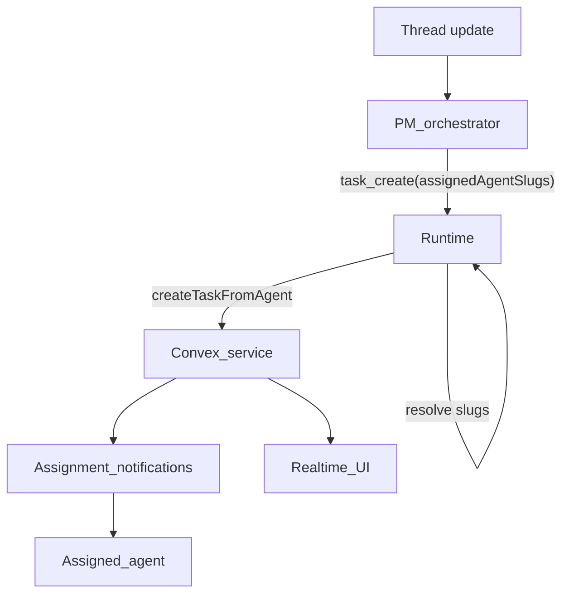

# PM Task Creation & Assignment Plan

#### 1. Context & goal

We want the orchestrator (PM/Squad Lead) to proactively create follow‑up tasks when new work is identified in threads (like the Phase 2 roadmap example) and assign those tasks to the right agent(s) immediately. This requires extending the agent task_create tool to accept assignee slugs, wiring the runtime to resolve slugs to agent IDs, and updating backend service task creation to persist assignments and notify assignees. Constraints: Convex auth/tenancy invariants, existing behavior flags (canCreateTasks), and no cross‑account access. Backwards compatibility is required (task_create without assignees must still work).

Assumptions:

- “PM” refers to the orchestrator agent (Squad Lead) in this repo.
- Assignments should target agents (by slug) rather than human users.
- When assignees are provided and no status is given, initial status should auto‑start to `in_progress` for agent assignees, matching current assignment behavior.

#### 2. Codebase research summary

Files inspected:

- [docs/runtime/AGENTS.md](docs/runtime/AGENTS.md) — current tool usage and orchestrator guidance.
- [packages/backend/convex/seed.ts](packages/backend/convex/seed.ts) — seed SOUL content and AGENTS doc copy; Squad Lead already has canCreateTasks true.
- [packages/backend/convex/lib/behavior_flags.ts](packages/backend/convex/lib/behavior_flags.ts) — effective behavior flag resolution.
- [packages/backend/convex/service/actions.ts](packages/backend/convex/service/actions.ts) — `createTaskFromAgent` action (no assignee support yet).
- [packages/backend/convex/service/tasks.ts](packages/backend/convex/service/tasks.ts) — `createFromAgent` internal mutation and status validation.
- [packages/backend/convex/tasks.ts](packages/backend/convex/tasks.ts) — user assignment logic and notifications (reference behavior).
- [packages/backend/convex/lib/notifications.ts](packages/backend/convex/lib/notifications.ts) — assignment notification helper.
- [apps/runtime/src/tooling/agentTools.ts](apps/runtime/src/tooling/agentTools.ts) — task_create tool schema and execution.
- [apps/runtime/src/delivery.ts](apps/runtime/src/delivery.ts) — tool dispatch and prompt formatting.
- [apps/runtime/src/openclaw-profiles.ts](apps/runtime/src/openclaw-profiles.ts) — embedded AGENTS.md fallback content.
- [apps/web/src/app/(dashboard)/[accountSlug]/admin/openclaw/page.tsx](<apps/web/src/app/(dashboard)/[accountSlug]/admin/openclaw/page.tsx>) and [apps/web/src/app/(dashboard)/[accountSlug]/agents/[agentId]/components/AgentBehaviorFlagsCard.tsx](<apps/web/src/app/(dashboard)/[accountSlug]/agents/[agentId]/_components/AgentBehaviorFlagsCard.tsx>) — behavior flag controls.

Key findings:

- The orchestrator already has `canCreateTasks` enabled by seed, but `task_create` cannot assign other agents.
- Runtime tool schemas are the source of truth; `executeAgentTool` is the only tool executor.
- Backend `createFromAgent` doesn’t emit assignment notifications for non‑creator assignees.

#### 3. High-level design

- Extend the `task_create` tool schema with `assignedAgentSlugs` (array of agent slugs from the mentionable list).
- Runtime resolves `assignedAgentSlugs` → agent IDs (from delivery context) and passes `assignedAgentIds` to Convex `createTaskFromAgent`.
- Backend `createTaskFromAgent`/`createFromAgent` accepts assigned agent IDs, validates account ownership, sets a consistent initial status, writes assignments, subscribes assignees, and emits assignment notifications.
- Update orchestrator guidance (SOUL/AGENTS) and runtime prompt hints to encourage proactive task creation with assignees.

Mermaid flow (agent‑driven creation):

#### 4. File & module changes

Existing files to touch:

- [apps/runtime/src/tooling/agentTools.ts](apps/runtime/src/tooling/agentTools.ts)
  - Add `assignedAgentSlugs` to `TASK_CREATE_TOOL_SCHEMA` with clear description.
  - Extend `executeAgentTool` to accept `mentionableAgents` and resolve slugs to IDs; validate unknown slugs and deduplicate.
  - Pass `assignedAgentIds` into `createTaskFromAgent` action call.
- [apps/runtime/src/delivery.ts](apps/runtime/src/delivery.ts)
  - Pass `context.mentionableAgents` into `executeAgentTool`.
  - Optionally add a short prompt hint for task_create assignment (if tools include task_create).
- [packages/backend/convex/service/actions.ts](packages/backend/convex/service/actions.ts)
  - Extend `createTaskFromAgent` args to include `assignedAgentIds` (optional).
  - Validate each agent belongs to the account before calling internal mutation.
- [packages/backend/convex/service/tasks.ts](packages/backend/convex/service/tasks.ts)
  - Accept `assignedAgentIds` (optional), compute initial status based on assignees if status not provided.
  - Create assignment notifications for non‑creator assignees and ensure subscriptions.
  - Log assignment activity metadata when assignees are present (either in task_created meta or an additional task_updated activity).
- [docs/runtime/AGENTS.md](docs/runtime/AGENTS.md)
  - Add explicit guidance: use `task_create` when new work is identified; include `assignedAgentSlugs` to assign owners.
- [packages/backend/convex/seed.ts](packages/backend/convex/seed.ts)
  - Update Squad Lead SOUL “Default operating procedure” to explicitly create follow‑up tasks and assign owners when a new roadmap/phase is identified.
  - Keep `DOC_AGENTS_CONTENT` in sync with the updated AGENTS.md wording.
- [apps/runtime/src/openclaw-profiles.ts](apps/runtime/src/openclaw-profiles.ts)
  - Update `DEFAULT_AGENTS_MD` fallback text to mirror updated assignment guidance.

New files to create:

- None (keep changes localized).

#### 5. Step-by-step tasks

1. Extend the task_create tool schema in `agentTools.ts` and add slug resolution logic in `executeAgentTool` (including validation/error messaging for unknown slugs).
2. Update `delivery.ts` to pass `mentionableAgents` into `executeAgentTool`, and add a concise prompt hint for using `assignedAgentSlugs` when task_create is available.
3. Add optional `assignedAgentIds` to the `createTaskFromAgent` action and propagate into `service/tasks.createFromAgent` with account ownership validation.
4. Update `service/tasks.createFromAgent` to compute initial status based on assignees, persist assignments, subscribe assignees, and send assignment notifications.
5. Update orchestrator guidance in `docs/runtime/AGENTS.md`, `packages/backend/convex/seed.ts` (SOUL + DOC_AGENTS_CONTENT), and `apps/runtime/src/openclaw-profiles.ts` fallback content.
6. Add or update runtime tests for task_create assignment mapping and prompt content; add backend unit tests for any new pure helper logic.

#### 6. Edge cases & risks

- Unknown/typoed assignee slugs: return a clear tool error so the agent can retry with valid slugs.
- Duplicate slugs or mixed formats (`@engineer`, `Engineer`): normalize and deduplicate before sending to backend.
- Status conflicts (e.g., `inbox` with assignees): auto‑correct to `in_progress`/`assigned` or return explicit validation error.
- Behavior flags: if `canCreateTasks` is false, task_create won’t be available; ensure PM has it enabled via agent or account defaults.
- Notification storms: avoid sending assignment notifications to the creating agent when they are auto‑assigned.

#### 7. Testing strategy

Unit tests:

- Runtime: add tests around slug normalization and mapping in `executeAgentTool` (valid slugs, unknown slugs, duplicates).
- Runtime: update `delivery.test.ts` if prompt text is changed to include assignment guidance.
- Backend: if a pure helper is introduced for initial status/assignment resolution, add tests in `packages/backend/convex/lib`.

Integration/E2E:

- Simulate an orchestrator thread update → task_create with assignees → verify assignment notification delivered to the target agent.

Manual QA:

- From a PM agent thread, create a task with `assignedAgentSlugs: ["engineer"]` and confirm:
  - task appears in Kanban and the agent’s assigned task list
  - assignment notification is delivered
  - status auto‑starts as `in_progress` when agent assigned
- Create a task without assignees and ensure it stays in inbox.
- Attempt with an invalid slug and ensure error is surfaced in the agent reply.

#### 8. Rollout / migration

- Backwards compatible: `assignedAgentSlugs` is optional; existing task_create calls remain valid.
- Deploy backend first (accept new args), then runtime (send new args).
- No data migration required.

#### 9. TODO checklist

Backend

- Extend `createTaskFromAgent` args to accept `assignedAgentIds` and validate account ownership.
- Update `service/tasks.createFromAgent` to set initial status based on assignees, persist assignments, and emit assignment notifications/subscriptions.
- Add assignment activity metadata when assignees are present (new or existing activity entry).

Runtime

- Add `assignedAgentSlugs` to `TASK_CREATE_TOOL_SCHEMA` and resolve slugs → IDs in `executeAgentTool`.
- Pass `mentionableAgents` into `executeAgentTool` from `delivery.ts` and add prompt hint for assignments.

Docs

- Update `docs/runtime/AGENTS.md` with task_create assignment guidance and proactive creation triggers.
- Sync Squad Lead SOUL + `DOC_AGENTS_CONTENT` in `packages/backend/convex/seed.ts`.
- Update `DEFAULT_AGENTS_MD` in `openclaw-profiles.ts` to match docs.

Tests

- Add runtime unit tests for slug mapping and task_create execution paths.
- Update `delivery.test.ts` if prompt wording changes.
- Add backend unit tests for any new helper functions used to compute initial status/assignees.
