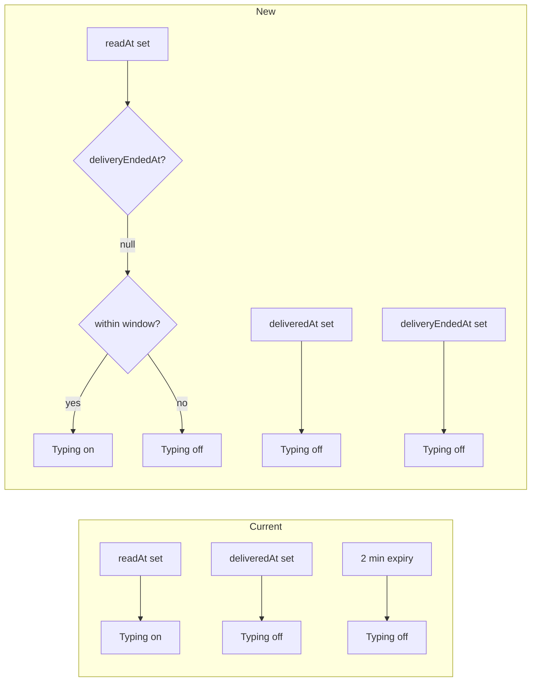

# Precise Typing Indicator Stop

## 1. Context and goal

Today the typing indicator is considered "on" when a notification has `readAt` set, `deliveredAt` null, and `now - readAt <= TYPING_WINDOW_MS` (2 minutes). It turns off when:

- The runtime sets `deliveredAt` (message posted or skip), or
- The 2-minute window expires.

When delivery **fails** (e.g. OpenClaw error, network error, or retry throw), the runtime does not call `markNotificationDelivered`, so the notification stays in "typing" until the window expires. That makes the indicator inaccurate: the agent is not typing after a failure.

**Goal:** Turn off the typing indicator as soon as the delivery loop has finished for that notification in any terminal way: (1) message delivered or skipped (already done via `deliveredAt`), (2) no-reply / terminal skip (already done via `deliveredAt` when we give up or post fallback), (3) **delivery error** (new: signal "delivery ended" so typing stops immediately, without marking as delivered so the notification can still be retried).

**Constraints:** No change to retry semantics: failed notifications must remain in `listUndeliveredForAccount` (filtered only by `deliveredAt`). Multi-tenancy and auth unchanged.

---

## 2. Codebase research summary

**Files inspected:**

- [packages/shared/src/constants/index.ts](packages/shared/src/constants/index.ts) — `TYPING_WINDOW_MS = 2 * 60 * 1000`; keep as safety net.
- [packages/backend/convex/notifications.ts](packages/backend/convex/notifications.ts) — `isInTypingWindow(readAt, deliveredAt, now)` and `listAgentIdsTypingByTask` / `listAgentIdsTypingByAccount` use it; `listAgentReceiptsByTask` returns readAt/deliveredAt.
- [packages/backend/convex/schema.ts](packages/backend/convex/schema.ts) — `notifications` table has `readAt`, `deliveredAt`; need optional `deliveryEndedAt`.
- [packages/backend/convex/service/notifications.ts](packages/backend/convex/service/notifications.ts) — `markRead`, `markDelivered`, `clearTypingStateForAccount`; need `markDeliveryEnded` and to clear `deliveryEndedAt` in `markRead` when retrying.
- [packages/backend/convex/service/actions.ts](packages/backend/convex/service/actions.ts) — `markNotificationRead`, `markNotificationDelivered`; need `markNotificationDeliveryEnded`.
- [apps/runtime/src/delivery.ts](apps/runtime/src/delivery.ts) — Calls `markNotificationRead` before OpenClaw; calls `markNotificationDelivered` on all success/skip paths; on `catch` (lines 514–524) does not call any mark, so typing lingers.
- [apps/web/src/components/tasks/TaskThread.tsx](apps/web/src/components/tasks/TaskThread.tsx) — Uses `listAgentIdsTypingByTask` and receipts; no change needed if backend typing queries are updated.
- [apps/web/src/components/tasks/AgentsSidebar.tsx](apps/web/src/components/tasks/AgentsSidebar.tsx) — Uses `listAgentIdsTypingByTask` / `listAgentIdsTypingByAccount`; no change needed.

**Patterns to follow:** Existing service auth and account validation in `markNotificationRead` / `markNotificationDelivered`; idempotent mutations; Convex snake_case in backend.

---

## 3. High-level design

**New field:** `notifications.deliveryEndedAt` (optional number). Semantics: "the runtime finished processing this notification for this attempt (success or failure); do not show typing."

**Typing condition (backend):** Agent is "typing" only when:

- `readAt != null`
- `deliveredAt == null`
- `deliveryEndedAt == null` (or undefined)
- `now - readAt <= TYPING_WINDOW_MS`

So typing stops when: (1) `deliveredAt` is set (current behavior), or (2) `deliveryEndedAt` is set (new: used on delivery failure), or (3) the window expires.

**Retry behavior:** `listUndeliveredForAccount` continues to filter only by `deliveredAt === undefined`, so notifications with `deliveryEndedAt` set but not delivered are still retried. When the runtime picks up a notification again, it calls `markNotificationRead`, which will set `readAt` and **clear** `deliveryEndedAt`, so typing can show again for the retry.

**Runtime:** In the delivery loop `catch` block (after logging the failure), call a new service action `markNotificationDeliveryEnded` (best effort; log and continue on failure so the poll loop keeps running).

---

## 4. File and module changes

**Backend (Convex)**

- [packages/backend/convex/schema.ts](packages/backend/convex/schema.ts)
  - Add to `notifications` table: `deliveryEndedAt: v.optional(v.number())` with short JSDoc (delivery loop ended for this attempt; typing stops; retry can clear it via markRead).
- [packages/backend/convex/service/notifications.ts](packages/backend/convex/service/notifications.ts)
  - Add internal mutation `markDeliveryEnded`: args `{ notificationId }`; idempotent: if notification exists and `deliveredAt` is null, set `deliveryEndedAt: Date.now()` (if already set, no-op). Do not set if already delivered.
  - Update `markRead`: when setting `readAt`, also set `deliveryEndedAt: undefined` so retries show typing again.
- [packages/backend/convex/service/actions.ts](packages/backend/convex/service/actions.ts)
  - Add action `markNotificationDeliveryEnded`: args `notificationId`, `serviceToken`, `accountId`; validate service token and account; verify notification belongs to account; call `markDeliveryEnded`. Return `{ success: boolean }`.
- [packages/backend/convex/notifications.ts](packages/backend/convex/notifications.ts)
  - Update `isInTypingWindow`: add parameter `deliveryEndedAt`; return false if `deliveryEndedAt != null`. Signature: `isInTypingWindow(readAt, deliveredAt, deliveryEndedAt, now)`.
  - Update `listAgentIdsTypingByTask`: pass `n.deliveryEndedAt` into `isInTypingWindow`.
  - Update `listAgentIdsTypingByAccount`: same.
  - Optionally add `deliveryEndedAt` to the object returned by `listAgentReceiptsByTask` for consistency (UI can use it if needed later).

**Runtime**

- [apps/runtime/src/delivery.ts](apps/runtime/src/delivery.ts)
  - In the inner `catch` block (around line 514), after logging the failure, call `api.service.actions.markNotificationDeliveryEnded` with the same notificationId, serviceToken, accountId. Wrap in try/catch; on failure log warning and continue (do not rethrow).

**Frontend**

- No changes required. Task thread and agents sidebar already use `listAgentIdsTypingByTask` and `listAgentIdsTypingByAccount`; backend will exclude notifications with `deliveryEndedAt` set.

**Tests**

- [packages/backend/convex/notifications.ts](packages/backend/convex/notifications.ts) — If there are unit tests for typing queries, add cases: notification with `deliveryEndedAt` set should not be typing.
- [packages/backend/convex/lib/notifications.test.ts](packages/backend/convex/lib/notifications.test.ts) or similar — Cover `isInTypingWindow` with `deliveryEndedAt` (false when set).
- [apps/runtime/src/delivery.test.ts](apps/runtime/src/delivery.test.ts) — Optionally assert that on delivery error the runtime calls `markNotificationDeliveryEnded` (mock Convex action).

---

## 5. Step-by-step tasks

1. **Schema:** Add `deliveryEndedAt: v.optional(v.number())` to `notifications` in [packages/backend/convex/schema.ts](packages/backend/convex/schema.ts). No new index (typing queries filter in memory).
2. **Internal mutation:** In [packages/backend/convex/service/notifications.ts](packages/backend/convex/service/notifications.ts), add `markDeliveryEnded` (idempotent, only set when deliveredAt is null).
3. **markRead:** In the same file, in `markRead`, when patching `readAt`, also set `deliveryEndedAt: undefined`.
4. **Service action:** In [packages/backend/convex/service/actions.ts](packages/backend/convex/service/actions.ts), add `markNotificationDeliveryEnded` (validate token + account, then call `markDeliveryEnded`).
5. **Typing logic:** In [packages/backend/convex/notifications.ts](packages/backend/convex/notifications.ts), extend `isInTypingWindow` to accept and check `deliveryEndedAt`; update `listAgentIdsTypingByTask` and `listAgentIdsTypingByAccount` to pass it.
6. **Runtime catch:** In [apps/runtime/src/delivery.ts](apps/runtime/src/delivery.ts), in the catch block for a single notification, call `markNotificationDeliveryEnded` (best effort, try/catch, log on failure).
7. **Tests:** Add or update tests for `isInTypingWindow` with `deliveryEndedAt` and for typing queries; optionally for delivery.ts calling the new action on error.

---

## 6. Edge cases and risks

- **Retries:** Clearing `deliveryEndedAt` in `markRead` ensures that when the same notification is fetched again, typing can show again. Correct.
- **Race:** If the runtime crashes after setting `readAt` but before calling `markNotificationDeliveryEnded` on error, typing will still expire after TYPING_WINDOW_MS. No change to current safety net.
- **listUndelivered:** Does not filter on `deliveryEndedAt`, so failed notifications remain eligible for retry. Intended.
- **clearTypingStateForAccount:** Still clears `readAt` on undelivered notifications when runtime goes offline. No need to set `deliveryEndedAt` there; clearing readAt is enough to stop typing.

---

## 7. Testing strategy

- **Unit:** `isInTypingWindow(null, null, 123, now)` → false; `isInTypingWindow(now-1e3, null, null, now)` with window 2min → true; with `deliveryEndedAt` set → false. Typing list queries exclude notifications that have `deliveryEndedAt` set.
- **Integration:** Run runtime, force a delivery error (e.g. invalid gateway), then verify via Convex dashboard or query that the notification has `deliveryEndedAt` set and no longer appears in typing lists.
- **Manual QA:** Trigger a scenario that causes delivery to fail; confirm typing indicator disappears shortly after the failure (and optionally reappears on retry when the runtime reads the notification again).

---

## 8. Rollout / migration

- **Migration:** None. New optional field; existing rows have `deliveryEndedAt` undefined and behave as today (typing only stops on deliveredAt or window).
- **Rollout:** Deploy backend first (schema + mutations + typing logic), then runtime (call new action on catch). No feature flag required.

---

## 9. Relationship to streaming typing plan

The existing [.cursor/plans/todo/streaming_typing_indicators_99b1219b.plan.md](.cursor/plans/todo/streaming_typing_indicators_99b1219b.plan.md) introduces `responseStartedAt` so typing **starts** only when the agent actually begins responding. This plan only makes typing **stop** precisely (on delivery end or error). The two are independent: implement this plan first for precise stop; the streaming plan can later add precise start. If both are implemented, typing would be: start when `responseStartedAt` is set (or keep current `readAt` if streaming plan not done), stop when `deliveredAt` or `deliveryEndedAt` is set or window expires.

---

## 10. TODO checklist

**Backend**

- Add `deliveryEndedAt` to notifications schema in [packages/backend/convex/schema.ts](packages/backend/convex/schema.ts).
- Add internal mutation `markDeliveryEnded` in [packages/backend/convex/service/notifications.ts](packages/backend/convex/service/notifications.ts).
- In `markRead`, clear `deliveryEndedAt` when setting `readAt` in [packages/backend/convex/service/notifications.ts](packages/backend/convex/service/notifications.ts).
- Add service action `markNotificationDeliveryEnded` in [packages/backend/convex/service/actions.ts](packages/backend/convex/service/actions.ts).
- Extend `isInTypingWindow` with `deliveryEndedAt` and update `listAgentIdsTypingByTask` and `listAgentIdsTypingByAccount` in [packages/backend/convex/notifications.ts](packages/backend/convex/notifications.ts).

**Runtime**

- In [apps/runtime/src/delivery.ts](apps/runtime/src/delivery.ts), call `markNotificationDeliveryEnded` in the inner catch block (best effort, try/catch).

**Tests**

- Add/update tests for `isInTypingWindow` with `deliveryEndedAt` and for typing list queries excluding `deliveryEndedAt`.
- Optionally add delivery.test.ts assertion that delivery error triggers `markNotificationDeliveryEnded`.

**QA**

- Manual: cause delivery failure and confirm typing stops; optionally confirm typing reappears on retry.
