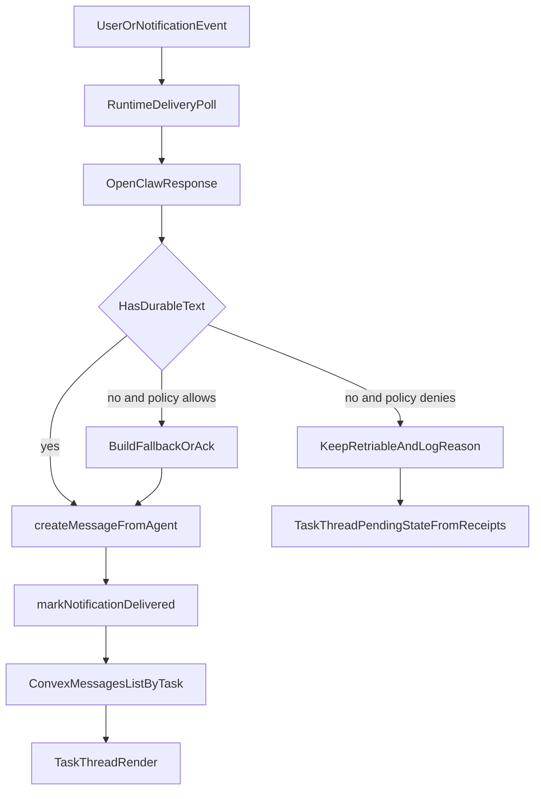

# Reliable Final Agent Messages Plan

## 0. Setup & scope confirmation

- **Requested outcome:** make the latest agent/designer message show up reliably in thread UI.
- **Chosen scope:** `runtime_plus_ui` (runtime/backend durability + UI fallback).
- **Assumption A:** the thread message source of truth remains Convex `messages.listByTask`.
- **Assumption B:** we should not re-introduce broad fallback spam in every notification type.

### Feature setup checklist

- Requirements / scope documented
- User stories / acceptance criteria identified
- Feature branch created (assumed handled outside this planning step)
- Development environment ready (assumed handled outside this planning step)

## 1. Context & goal

We need to prevent the case where an agent run completes but no durable message is written, causing the UI thread to miss the final response. The fix should guarantee durable persistence semantics in runtime delivery paths and provide a UI-level pending fallback so users still see progress if persistence is delayed. Constraints: multi-tenant safety (`accountId` boundaries), idempotent message writes (`sourceNotificationId`), no noisy thread spam, and preserving current Convex real-time model as primary source of truth.

## 2. Codebase research summary

Main files reviewed:

- `[apps/runtime/src/delivery.ts](apps/runtime/src/delivery.ts)`
- `[apps/runtime/src/gateway.ts](apps/runtime/src/gateway.ts)`
- `[apps/runtime/src/delivery.test.ts](apps/runtime/src/delivery.test.ts)`
- `[apps/runtime/src/gateway.test.ts](apps/runtime/src/gateway.test.ts)`
- `[packages/backend/convex/service/actions.ts](packages/backend/convex/service/actions.ts)`
- `[packages/backend/convex/service/messages.ts](packages/backend/convex/service/messages.ts)`
- `[packages/backend/convex/messages.ts](packages/backend/convex/messages.ts)`
- `[packages/backend/convex/notifications.ts](packages/backend/convex/notifications.ts)`
- `[apps/web/src/components/tasks/TaskThread.tsx](apps/web/src/components/tasks/TaskThread.tsx)`

What we learned:

- Runtime currently may **mark notification delivered even when no message was persisted** (`taskId` exists but `textToPost` becomes null).
- `NO_RESPONSE_FALLBACK_NOTIFICATION_TYPES` is currently empty, so fallback persistence is effectively disabled for most cases.
- Agent message durability already has backend idempotency when `sourceNotificationId` is provided via `createMessageFromAgent`.
- UI thread renders only from Convex `messages.listByTask`; there is no dedicated ephemeral thread-message channel in web.
- Existing tests already cover no-reply detection/policies; they should be extended rather than creating a new test style.

## 3. High-level design

### Architecture changes

- **Runtime layer:** enforce a stronger completion contract: for task-scoped agent deliveries, either persist a durable thread message (real reply, orchestrator ack, or bounded fallback) or keep the notification retriable; avoid silent delivered-without-message outcomes.
- **Backend layer:** keep existing idempotent write path (`createMessageFromAgent` + `sourceNotificationId`) and add targeted observability for skipped/forced fallback cases.
- **Frontend layer:** keep Convex as source of truth but add a small pending-state UX derived from agent receipts/timeouts to avoid “nothing happened” gaps.

### Data flow

## 4. File & module changes

### Existing files to update

- `[apps/runtime/src/delivery.ts](apps/runtime/src/delivery.ts)`
  - Introduce explicit delivery outcome handling for task notifications (`persisted`, `fallback_persisted`, `deferred_retry`, `skipped_non_task`).
  - Prevent `markNotificationDelivered` for task notifications when no durable message exists and no approved fallback was applied.
  - Narrow and formalize no-reply sentinel handling (prefer strict `NO_REPLY`; keep compatibility via feature-guarded policy if needed).
  - Add structured logs for: response classification, fallback usage, and delivered-without-message prevention.
- `[apps/runtime/src/gateway.ts](apps/runtime/src/gateway.ts)`
  - Align `receiveFromOpenClaw` persistence path with idempotent semantics by supporting/pass-through `sourceNotificationId` when available.
  - Harden parsing fallback behavior for non-empty unknown response payloads to reduce false-empty outcomes.
- `[apps/runtime/src/delivery.test.ts](apps/runtime/src/delivery.test.ts)`
  - Add tests for “task notification is not marked delivered unless durable message path chosen.”
  - Add tests for strict no-reply sentinel policy and fallback gating.
  - Add tests for tool-result failure path producing deterministic retry/fallback behavior.
- `[apps/runtime/src/gateway.test.ts](apps/runtime/src/gateway.test.ts)`
  - Add tests for unknown-but-non-empty response parsing behavior and webhook persistence contract changes.
- `[apps/web/src/components/tasks/TaskThread.tsx](apps/web/src/components/tasks/TaskThread.tsx)`
  - Add a UI pending banner/row when receipts indicate an agent has read/is processing but no new persisted agent message appears within a short window.
  - Ensure pending state clears automatically when a new persisted agent message arrives.
  - Keep existing read/typing logic intact; layer pending state without changing message source of truth.
- `[apps/web/src/components/tasks/MessageItem.tsx](apps/web/src/components/tasks/MessageItem.tsx)`
  - Add optional visual treatment for pending/system placeholder row if rendered as a thread item.
- `[apps/web/src/components/tasks/TaskThread.test.tsx](apps/web/src/components/tasks/TaskThread.test.tsx)` *(or nearest existing thread test file)*
  - Cover pending state visibility/clearance and non-regression for normal persisted agent replies.

### New files to create (if needed)

- `[apps/web/src/components/tasks/TaskThreadPendingState.tsx](apps/web/src/components/tasks/TaskThreadPendingState.tsx)`
  - Small presentational component for “agent response is being finalized” state.
- `[apps/runtime/src/delivery-outcome.ts](apps/runtime/src/delivery-outcome.ts)` *(optional refactor)*
  - Helper type/constants to keep delivery decision logic testable and readable.

## 5. Step-by-step tasks

1. **Codify acceptance criteria in tests first (runtime)**
  - Update `[apps/runtime/src/delivery.test.ts](apps/runtime/src/delivery.test.ts)` with red tests for durable-message-or-retry behavior.
2. **Refactor delivery decision branches**
  - Implement explicit outcome enum/state in `[apps/runtime/src/delivery.ts](apps/runtime/src/delivery.ts)`.
  - Ensure task notifications are only marked delivered after successful `createMessageFromAgent` (or explicit non-task skip path).
3. **Tighten no-reply policy**
  - Restrict sentinel matching to intended values and keep backward compatibility via documented guard where required.
4. **Harden tool follow-up failure handling**
  - In `[apps/runtime/src/delivery.ts](apps/runtime/src/delivery.ts)`, make tool-result failure deterministic: retry first, fallback/ack only by policy, never silent deliver.
5. **Align webhook persistence semantics**
  - Update `[apps/runtime/src/gateway.ts](apps/runtime/src/gateway.ts)` and tests so callback path can stay idempotent with optional `sourceNotificationId`.
6. **Add runtime observability**
  - Add concise structured logs/counters for skipped, retried, fallback-persisted, and persisted outcomes.
7. **Implement UI pending fallback**
  - Add pending state logic in `[apps/web/src/components/tasks/TaskThread.tsx](apps/web/src/components/tasks/TaskThread.tsx)`, optionally extracting `[apps/web/src/components/tasks/TaskThreadPendingState.tsx](apps/web/src/components/tasks/TaskThreadPendingState.tsx)`.
8. **Add UI tests**
  - Validate pending indicator appears on delayed persistence and disappears when persisted agent message arrives.
9. **Regression checks**
  - Run runtime and web test suites focused on delivery/thread components; verify no mention/notification loop regressions.

## 6. Edge cases & risks

- **Legit short responses (`NO`, `ok`, etc.)** could be misclassified as no-reply.
  - Mitigation: strict sentinel policy and tests for short valid replies.
- **Fallback spam risk** if fallback policy is too broad.
  - Mitigation: keep fallback policy narrowly scoped by notification type and task status.
- **Duplicate messages on retry** if idempotency key is missing.
  - Mitigation: consistently pass `sourceNotificationId` where available.
- **Delivered-but-missing regressions** if a non-task path is accidentally treated like task path.
  - Mitigation: explicit branch separation and tests.
- **UI false pending state** during brief Convex propagation delays.
  - Mitigation: grace window + clear-on-new-agent-message behavior.

## 7. Testing strategy

- **Unit tests (runtime)**
  - `delivery` decision helpers and no-reply classification.
  - Retry/fallback/delivered transitions for task notifications.
  - Tool-call follow-up failure outcomes.
- **Unit tests (gateway)**
  - Unknown JSON/non-empty response parse handling.
  - Callback persistence guards (empty/heartbeat suppression still intact).
- **UI tests**
  - `TaskThread` pending-state lifecycle (show, persist arrives, clear).
  - No regression for typing/read indicators.
- **Manual QA**
  - Trigger agent with normal final reply and verify it appears in thread.
  - Trigger no-reply/placeholder path and verify deterministic retry/fallback behavior.
  - Simulate delayed persistence and verify pending state is visible then removed after message persists.

## 8. Rollout / migration

- No schema migration required.
- Roll out behind a runtime behavior flag if possible (or staged deploy per account runtime).
- Monitor logs for: `persisted`, `fallback_persisted`, `retry_no_message`, `prevented_delivered_without_message`.
- Keep quick rollback path by toggling the new strict outcome policy if unexpected noise appears.

## 9. TODO checklist

### Runtime

- Add red tests for durable-message-or-retry invariant in `[apps/runtime/src/delivery.test.ts](apps/runtime/src/delivery.test.ts)`
- Refactor delivery branches to explicit outcome state in `[apps/runtime/src/delivery.ts](apps/runtime/src/delivery.ts)`
- Ensure task notifications are never marked delivered without durable message persistence
- Tighten no-reply sentinel handling and add regression coverage
- Harden tool-results failure path to deterministic retry/fallback behavior
- Add structured logs/counters for delivery outcomes
- Align webhook persistence idempotency path in `[apps/runtime/src/gateway.ts](apps/runtime/src/gateway.ts)`

### Backend/Convex contract

- Verify `createMessageFromAgent` is always invoked with `sourceNotificationId` when applicable
- Add/adjust tests to confirm idempotent behavior on retries

### Frontend

- Add pending response UI state in `[apps/web/src/components/tasks/TaskThread.tsx](apps/web/src/components/tasks/TaskThread.tsx)`
- Create `[apps/web/src/components/tasks/TaskThreadPendingState.tsx](apps/web/src/components/tasks/TaskThreadPendingState.tsx)` if extraction improves clarity
- Update `[apps/web/src/components/tasks/MessageItem.tsx](apps/web/src/components/tasks/MessageItem.tsx)` only if needed for pending row rendering
- Add tests for pending-state show/clear behavior

### Validation & rollout

- Run targeted runtime + web tests locally
- Validate manual scenarios for normal replies, no-reply, and delayed persistence
- Deploy in staged manner and watch new delivery outcome logs
- Remove/relax temporary safeguards only after stable observation window

