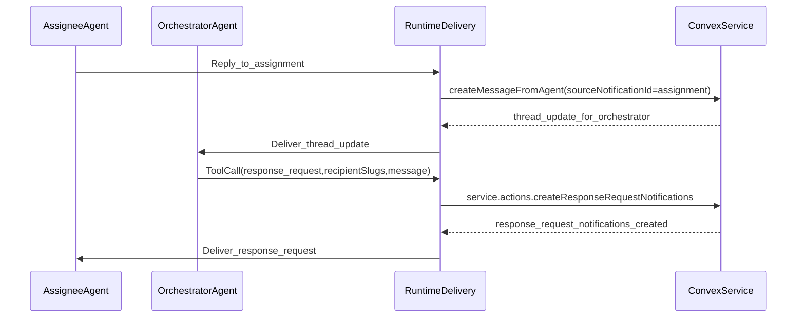

#### 1. Context & goal

- Stop orchestrator/assignee ping‑pong by removing runtime auto‑mention injection and using an explicit `response_request` tool for agent‑to‑agent follow‑ups.
- Enforce **tool‑only** agent pings: agent-authored messages must not generate agent @mention notifications.
- Start fresh and ignore the old stash; keep the solution minimal and maintainable.

#### 2. Codebase research summary

- Inspected runtime delivery and tool plumbing: [apps/runtime/src/delivery.ts](apps/runtime/src/delivery.ts), [apps/runtime/src/tooling/agentTools.ts](apps/runtime/src/tooling/agentTools.ts), [apps/runtime/src/health.ts](apps/runtime/src/health.ts).
- Inspected agent message write‑back and notification creation: [packages/backend/convex/service/messages.ts](packages/backend/convex/service/messages.ts), [packages/backend/convex/lib/notifications.ts](packages/backend/convex/lib/notifications.ts).
- Inspected notification type definitions and UI mapping: [packages/backend/convex/schema.ts](packages/backend/convex/schema.ts), [packages/backend/convex/lib/validators.ts](packages/backend/convex/lib/validators.ts), [packages/backend/convex/notifications.ts](packages/backend/convex/notifications.ts), [packages/shared/src/types/index.ts](packages/shared/src/types/index.ts), [apps/web/src/components/dashboard/NotificationBell.tsx](apps/web/src/components/dashboard/NotificationBell.tsx).
- Current loop trigger lives in runtime auto‑mention fallback:

```
487:515:apps/runtime/src/delivery.ts
if (taskId && textToPost && shouldPostMessage) {
  const trimmed = textToPost.trim();
  const finalContent = applyAutoMentionFallback(
    trimmed,
    context as DeliveryContext,
  );
  // ... createMessageFromAgent ...
}
```

- Agent mentions are parsed for all agent messages; even when notifications are suppressed, `hasAgentMentions` currently suppresses thread_update for agents, which conflicts with tool‑only behavior:

```
288:378:packages/backend/convex/service/messages.ts
const allowAgentMentionsForNotifications =
  args.allowAgentMentions && !suppressAgentNotifications;
const mentionsForNotifications = isOrchestratorChat
  ? []
  : allowAgentMentionsForNotifications
    ? mentions
    : mentions.filter((m) => m.type === "user");
// ...
const hasAgentMentions =
  suppressAgentNotifications ||
  mentions.some((mention) => mention.type === "agent");
await createThreadNotifications(..., hasAgentMentions, ...);
```

#### 3. High-level design

- Remove auto‑mention injection entirely in runtime; no text mutation before `createMessageFromAgent`.
- Introduce a new `response_request` notification type and a runtime tool that creates these notifications for target agent slugs.
- Tool‑only policy for agent pings:
  - Agent-authored messages can still include @mentions in content for readability, but **agent mention notifications are never created**.
  - Thread updates should not be suppressed purely because an agent @mention token appears when agent mentions are disallowed.
- Gate the tool by existing `canMentionAgents` behavior flag (repurposed as “can request agent responses”).
- Add HTTP fallback endpoint for `response_request` to keep parity with `openclawClientToolsEnabled=false` mode.



#### 4. File & module changes

- Runtime
  - [apps/runtime/src/delivery.ts](apps/runtime/src/delivery.ts)
    - Remove `applyAutoMentionFallback` and all helper functions (`extractMentionTokens`, `shouldAutoMentionUser`, etc.).
    - Update prompt guidance: remove “mention other agents”; add “use response_request tool” and list valid agent slugs for recipient selection.
    - Add HTTP fallback capability label for response_request and tool usage instructions when tools enabled.
  - [apps/runtime/src/tooling/agentTools.ts](apps/runtime/src/tooling/agentTools.ts)
    - Add `RESPONSE_REQUEST_TOOL_SCHEMA` and include it in `getToolCapabilitiesAndSchemas` when `canMentionAgents` and `hasTaskContext`.
    - Add `executeResponseRequestTool` logic to call `api.service.actions.createResponseRequestNotifications`.
  - [apps/runtime/src/tooling/agentTools.test.ts](apps/runtime/src/tooling/agentTools.test.ts)
    - Extend tests to assert the new tool is listed only when permitted.
  - [apps/runtime/src/health.ts](apps/runtime/src/health.ts)
    - Add `/agent/response-request` endpoint mirroring other tool fallbacks.
- Backend (Convex)
  - [packages/backend/convex/schema.ts](packages/backend/convex/schema.ts)
    - Add `response_request` to `notificationTypeValidator`.
    - Add indexes for dedupe: notifications by task+recipient+createdAt; messages by task+author+createdAt.
  - [packages/backend/convex/lib/validators.ts](packages/backend/convex/lib/validators.ts)
    - Add `response_request` to `notificationTypeValidator`.
  - [packages/backend/convex/notifications.ts](packages/backend/convex/notifications.ts)
    - Update local notification type validator to include `response_request`.
  - [packages/backend/convex/service/actions.ts](packages/backend/convex/service/actions.ts)
    - Add `createResponseRequestNotifications` action with service auth, account validation, `canMentionAgents` gate, and slug resolution via `internal.service.agents.listInternal`.
  - [packages/backend/convex/service/notifications.ts](packages/backend/convex/service/notifications.ts)
    - Add internal mutation to insert `response_request` notifications with dedupe per `(accountId, taskId, recipientId)`.
  - [packages/backend/convex/service/messages.ts](packages/backend/convex/service/messages.ts)
    - Compute `hasAgentMentions` based on `allowAgentMentionsForNotifications` so agent @mentions do not suppress thread_update when tool‑only.
- Shared/UI/Docs
  - [packages/shared/src/types/index.ts](packages/shared/src/types/index.ts)
    - Add `response_request` to `NotificationType`.
  - [apps/web/src/components/dashboard/NotificationBell.tsx](apps/web/src/components/dashboard/NotificationBell.tsx)
    - Add icon + color mapping for `response_request`.
  - [docs/runtime/AGENTS.md](docs/runtime/AGENTS.md) and [packages/backend/convex/seed.ts](packages/backend/convex/seed.ts)
    - Update agent guidance: do not @mention agents; use `response_request` tool for follow‑ups.

#### 5. Step-by-step tasks

1. **Schema + types**: add `response_request` to validators/types and add the new indexes in [packages/backend/convex/schema.ts](packages/backend/convex/schema.ts); run Convex typegen.
2. **Backend action + dedupe**: implement `createResponseRequestNotifications` action and internal mutation; resolve slugs; enforce `canMentionAgents`; add dedupe logic using the new indexes.
3. **Tool plumbing**: add response_request tool schema + executor; include in capability selection; add tool tests.
4. **Runtime prompt + cleanup**: remove auto‑mention fallback and helper functions; update `formatNotificationMessage` to teach tool‑only follow‑ups and include HTTP fallback.
5. **Tool‑only mention behavior**: update `createFromAgent` to avoid suppressing thread_update due to ignored agent mentions.
6. **UI + docs**: update NotificationBell mappings and AGENTS guidance/seed content.

#### 6. Edge cases & risks

- **Unknown recipient slugs**: action should return a clear error listing missing slugs; tool should surface `success:false` with message.
- **Over‑dedupe**: if no new reply after a request, we should suppress duplicate response_request; ensure the “agent replied after request” check is correct and indexed.
- **Tools disabled**: if `openclawClientToolsEnabled=false`, use HTTP fallback `/agent/response-request` and avoid advertising the tool.
- **Agent @mentions in content**: ensure they do not suppress thread_update when tool‑only (adjust `hasAgentMentions`).

#### 7. Testing strategy

- **Manual QA**
  - Loop regression: assignee replies → orchestrator replies without tool → no new agent notification.
  - Tool flow: orchestrator uses response_request → target agent receives response_request → replies → orchestrator receives thread_update.
  - Dedupe: repeat response_request without target reply → only one notification.
  - Tool-only: agent @mentions another agent in message → no agent mention notification is created.
- **Unit tests**
  - Extend [apps/runtime/src/tooling/agentTools.test.ts](apps/runtime/src/tooling/agentTools.test.ts) to verify tool inclusion/omission.
  - Optional: extract dedupe decision into a helper and unit test it.

#### 8. Rollout / migration

- Deploy backend schema/actions first; run `npx convex dev --once` to update generated types.
- Deploy runtime changes next (tool + prompt + HTTP fallback).
- No data migration required.

#### 9. TODO checklist

- Backend
  - Add `response_request` to notification validators + shared types
  - Add notifications/messages indexes for dedupe
  - Add `createResponseRequestNotifications` action + internal mutation
  - Adjust agent message handling for tool‑only mentions
- Runtime
  - Add response_request tool schema + executor
  - Update prompt text for tool‑only flow and add HTTP fallback
  - Remove auto‑mention fallback code and helpers
  - Add HTTP `/agent/response-request` endpoint
- Web
  - Add NotificationBell icon/color mapping
- Docs
  - Update AGENTS.md + seed content to use response_request tool
- Tests
  - Extend agentTools tests for response_request
  - Manual QA checklist executed
