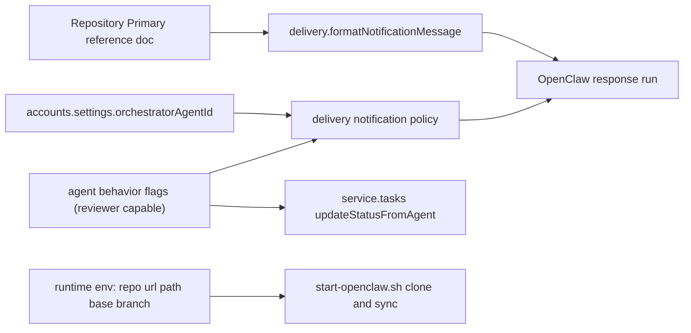

# Runtime Neutrality and Orchestrator Semantics Plan

## Phase 0: Setup

### Requirements and scope

- Ensure runtime-delivered prompts describe only general application behavior and do not hardcode this repository's identity.
- Keep orchestrator as the single coordination authority (account-configured), not role-name-based matching.
- Preserve rule: if no QA reviewer exists, orchestrator can close in review; if QA reviewer exists, only reviewer can close.
- Make local runtime/openclaw bootstrap fork-safe (no hardcoded upstream repo URL/path).

### User stories and acceptance criteria

- As a fork maintainer, I can change seed agents/repo metadata and runtime still works without editing source code constants.
- As orchestrator, I am identified by `accounts.settings.orchestratorAgentId`, not by strings like "squad lead".
- As runtime agent, prompt text never contains hardcoded `openclaw-mission-control`, `git checkout dev`, or `[accountSlug]` examples.
- As operator, bootstrap scripts can clone/use any repo URL and workspace repo path via config/env.
- All existing behavior remains backward compatible for accounts that still use current role names.

### Assumptions

- Assumption A: `orchestratorAgentId` is required operationally and set for active accounts.
- Assumption B: Review workflow statuses remain unchanged (`assigned`, `in_progress`, `review`, `done`, `blocked`).
- Assumption C: QA/reviewer semantics should remain compatible with existing QA-role accounts during migration.

### Feature setup checklist

- Requirements / scope documented
- User stories and acceptance criteria clear
- Feature branch created (implementation step)
- Development environment ready for implementation tests

## 1) Context & goal

We will decouple runtime behavior from repository-specific and agent-name-specific assumptions by removing hardcoded repo/branch/framework text from prompt assembly, standardizing orchestrator language, and making reviewer logic explicit and backward-compatible. The goal is fork portability: a fork that changes seed agents/repo metadata should run correctly without hidden references to this project.

Key constraints:

- Maintain current runtime safety/loop-prevention behavior.
- Keep backwards compatibility with existing seeded data and role strings.
- Avoid breaking account-level orchestration and tool permissions.

## 2) Codebase research summary

### Runtime prompt and policy paths reviewed

- [apps/runtime/src/delivery.ts](apps/runtime/src/delivery.ts)
- [apps/runtime/src/delivery.test.ts](apps/runtime/src/delivery.test.ts)
- [apps/runtime/src/openclaw-profiles.ts](apps/runtime/src/openclaw-profiles.ts)
- [apps/runtime/src/openclaw-profiles.test.ts](apps/runtime/src/openclaw-profiles.test.ts)
- [apps/runtime/src/heartbeat.ts](apps/runtime/src/heartbeat.ts)
- [apps/runtime/src/gateway.ts](apps/runtime/src/gateway.ts)
- [apps/runtime/src/tooling/agentTools.ts](apps/runtime/src/tooling/agentTools.ts)
- [apps/runtime/src/health.ts](apps/runtime/src/health.ts)

### Backend contract and workflow paths reviewed

- [packages/backend/convex/service/notifications.ts](packages/backend/convex/service/notifications.ts)
- [packages/backend/convex/service/tasks.ts](packages/backend/convex/service/tasks.ts)
- [packages/backend/convex/lib/behavior_flags.ts](packages/backend/convex/lib/behavior_flags.ts)
- [packages/backend/convex/schema.ts](packages/backend/convex/schema.ts)
- [packages/backend/convex/accounts.ts](packages/backend/convex/accounts.ts)
- [packages/shared/src/constants/index.ts](packages/shared/src/constants/index.ts)

### Infra/docs/seed paths reviewed

- [apps/runtime/openclaw/start-openclaw.sh](apps/runtime/openclaw/start-openclaw.sh)
- [apps/runtime/docker-compose.runtime.yml](apps/runtime/docker-compose.runtime.yml)
- [apps/runtime/.env.example](apps/runtime/.env.example)
- [scripts/runtime-docker-up.sh](scripts/runtime-docker-up.sh)
- [docs/runtime/AGENTS.md](docs/runtime/AGENTS.md)
- [docs/runtime/HEARTBEAT.md](docs/runtime/HEARTBEAT.md)
- [docs/runtime/runtime-docker-compose.md](docs/runtime/runtime-docker-compose.md)
- [packages/backend/convex/seed.ts](packages/backend/convex/seed.ts)

### Key findings to implement

- Hardcoded repo path/branch/framework hints exist in `delivery.ts` prompt text.
- Role matching still includes `squad lead` and QA regex heuristics in runtime and backend.
- Startup bootstrap script hardcodes upstream repo URL/path.
- Seed/manual defaults contain explicit project identity and `squad lead` language.

## 3) High-level design

### Architecture approach

- Keep orchestrator authority by ID (`orchestratorAgentId`) as the source of truth.
- Introduce explicit reviewer semantics in behavior flags (with compatibility fallback) to avoid role-name coupling.
- Move repo-specific details to configurable metadata (env/doc/seed), not runtime hardcoded prompt strings.
- Keep runtime prompt focused on app behavior and tool usage, not repository branding.

### Data flow

### Existing components to reuse

- `resolveBehaviorFlags()` in backend as central flag resolver.
- `orchestratorAgentId` from `getNotificationForDelivery` and health endpoint checks.
- Existing tool-capability enforcement in `agentTools.ts` and `/agent/*` handlers in `health.ts`.

## 4) File & module changes

### Runtime: prompt neutrality and orchestrator wording

- [apps/runtime/src/delivery.ts](apps/runtime/src/delivery.ts)
  - Remove hardcoded repository identity and branch specifics from `formatNotificationMessage` (`openclaw-mission-control`, `dev`, App Router `[accountSlug]` examples).
  - Replace fixed example slugs (`qa`, `squad-lead`) with neutral placeholders (`reviewer-slug`, `agent-slug`).
  - Replace wording "squad lead"/"lead" with "orchestrator".
  - Keep one-branch-per-task rule optional/configurable but not tied to a specific base branch string unless sourced from config.
  - Update reviewer detection to stop depending on `squad lead` text.
- [apps/runtime/src/delivery.test.ts](apps/runtime/src/delivery.test.ts)
  - Update expectations to assert no hardcoded repo/branch/framework strings.
  - Add tests for orchestrator wording and neutral examples.
  - Add tests for reviewer detection behavior after refactor.
- [apps/runtime/src/openclaw-profiles.ts](apps/runtime/src/openclaw-profiles.ts)
  - Convert embedded `DEFAULT_AGENTS_MD` to generic/fork-safe wording (no project name/url/path hardcoding in fallback content).
  - Replace all "squad lead" references with "orchestrator".
  - Keep QA-orchestrator closure rule but in neutral language.
- [apps/runtime/src/openclaw-profiles.test.ts](apps/runtime/src/openclaw-profiles.test.ts)
  - Update assertions for new default AGENTS text.
  - Add non-regression checks that generated workspace docs still include required workflow rules.

### Backend: reviewer semantics hardening (backward compatible)

- [packages/backend/convex/schema.ts](packages/backend/convex/schema.ts)
  - Extend `behaviorFlags` (agent + account defaults) with optional reviewer capability flag (e.g. `isReviewer`).
- [packages/shared/src/constants/index.ts](packages/shared/src/constants/index.ts)
  - Add default value for new reviewer flag in `DEFAULT_OPENCLAW_CONFIG.behaviorFlags`.
- [packages/backend/convex/lib/behavior_flags.ts](packages/backend/convex/lib/behavior_flags.ts)
  - Extend `BehaviorFlags` type and resolver to include reviewer flag.
  - Add helper to resolve reviewer status with fallback logic for legacy role strings.
- [packages/backend/convex/service/notifications.ts](packages/backend/convex/service/notifications.ts)
  - Include reviewer metadata in `mentionableAgents` payload (e.g. `isReviewer`) so runtime does not need role-name regex.
- [packages/backend/convex/service/tasks.ts](packages/backend/convex/service/tasks.ts)
  - Replace direct QA role/slug checks with shared reviewer-resolution helper.
  - Preserve current enforcement behavior (reviewer-only close when reviewer present; orchestrator close when none).

### Seed/docs alignment

- [packages/backend/convex/seed.ts](packages/backend/convex/seed.ts)
  - Replace hardcoded "squad lead" terms with "orchestrator".
  - Ensure seeded docs remain the place for repo-specific guidance (with optional template/env substitution strategy).
- [docs/runtime/AGENTS.md](docs/runtime/AGENTS.md)
  - Rename "squad lead" wording to "orchestrator" everywhere.
  - Keep repo-specific info here (this is the correct place), but normalize language so it is clearly editable by forks.

### Bootstrap and infra forkability

- [apps/runtime/openclaw/start-openclaw.sh](apps/runtime/openclaw/start-openclaw.sh)
  - Replace hardcoded `REPO_URL` and `WRITABLE_REPO_DIR` with env-driven values and safe defaults.
  - Keep clone/sync behavior intact while allowing forks to set their own repo source.
- [apps/runtime/.env.example](apps/runtime/.env.example)
  - Document new repo/bootstrap env vars (`REPO_URL`, `WRITABLE_REPO_DIR`, optional base branch/prefix vars if used by prompt templates).
- [apps/runtime/docker-compose.runtime.yml](apps/runtime/docker-compose.runtime.yml)
  - Pass through new env vars to `openclaw-gateway` and runtime containers.
- [scripts/runtime-docker-up.sh](scripts/runtime-docker-up.sh)
  - Keep behavior; make failure/help text refer to resolved compose path/env consistently.
- [docs/runtime/runtime-docker-compose.md](docs/runtime/runtime-docker-compose.md)
  - Add documentation for new env vars and fork-safe setup path.

## 5) Step-by-step tasks

1. Define reviewer capability contract and naming

- Choose field name (`isReviewer`) and update TypeScript types/interfaces first.
- Confirm backward-compat fallback rules in code comments and tests.

1. Update backend schema and shared defaults

- Edit `schema.ts` and shared defaults/constants for new behavior flag.
- Ensure validator updates are backward compatible (optional field).

1. Implement reviewer resolution helper in backend

- Add helper in `behavior_flags.ts` that resolves reviewer capability from explicit flag, then legacy fallback regex.
- Unit test helper logic with explicit true/false/undefined and legacy roles.

1. Refactor backend task close authorization

- Update `service/tasks.ts` to use helper for "reviewer exists" and "agent is reviewer" checks.
- Preserve orchestrator fallback path when no reviewer exists.
- Add/extend tests for `updateStatusFromAgent` done-path authorization.

1. Extend delivery payload reviewer metadata

- Update `service/notifications.ts` `mentionableAgents` shape to include reviewer metadata.
- Keep payload backward compatible for runtime consumers.

1. Refactor runtime delivery reviewer logic

- Update `delivery.ts` to consume reviewer metadata from payload and remove `squad lead` role coupling.
- Keep orchestrator checks strictly ID-based.

1. Remove repo-specific hardcoded text from runtime prompt builder

- In `delivery.ts`, remove hardcoded repo path/name/base-branch/framework examples.
- Keep only generic behavior instructions and repositoryDoc-driven context.
- Ensure no direct references to `openclaw-mission-control`, `git checkout dev`, or `[accountSlug]` remain.

1. Normalize orchestrator naming in runtime prompts/manual defaults

- Update `delivery.ts` and `openclaw-profiles.ts` text from "squad lead"/"lead" to "orchestrator".
- Replace slug examples that imply specific seeded agents with neutral placeholders.

1. Make bootstrap repo source configurable

- Update `start-openclaw.sh` to consume `REPO_URL` and `WRITABLE_REPO_DIR`.
- Validate default behavior still works when env not set.

1. Update env and compose plumbing

- Add env keys to `.env.example` and pass through in `docker-compose.runtime.yml`.
- Update related docs and script messaging.

1. Align seeded/docs language

- Update `seed.ts` and `docs/runtime/AGENTS.md` wording to orchestrator terminology and clear separation of app behavior vs repo metadata.

1. Expand automated tests

- Runtime tests: `delivery.test.ts`, `openclaw-profiles.test.ts`, `agentTools.test.ts` (as needed).
- Backend tests: add/extend tests for reviewer authorization behavior.
- Add string-level regression assertions to prevent reintroducing hardcoded repo identifiers in runtime prompt assembly.

1. Validation pass and release prep

- Run targeted test suites for runtime and backend.
- Verify no lint/type regressions in touched modules.
- Prepare migration/release notes for new reviewer flag and fallback behavior.

## 6) Edge cases & risks

- Reviewer flag unset on existing accounts
  - Mitigation: fallback to legacy role heuristics so behavior remains stable.
- No orchestrator configured
  - Mitigation: explicit error path (already present in backend); add clear docs and runtime logs.
- Repo metadata missing after removing hardcoded prompt text
  - Mitigation: prompt should explicitly handle missing repository context and request/mark blocked rather than guessing.
- Fork bootstrap misconfiguration (`REPO_URL` invalid or clone fails)
  - Mitigation: fail with actionable startup message and keep runtime health diagnostics clear.
- String-only changes in manuals can drift from runtime enforcement
  - Mitigation: add unit tests for policy-critical prompt fragments and keep policy-enforcement in code paths authoritative.

## 7) Testing strategy

### Unit tests

- `delivery` policy tests:
  - reviewer recipient logic uses orchestrator/reviewer metadata, not `squad lead` literal.
  - prompt string snapshots/contains checks to ensure no hardcoded repo identifiers.
- `openclaw-profiles` default manual generation tests:
  - fallback manual is generic and orchestrator terminology is correct.
- backend reviewer authorization tests:
  - with reviewer configured, non-reviewer cannot set `done`.
  - without reviewer configured, orchestrator can set `done`.

### Integration tests

- runtime tool endpoints (`/agent/task-*`) still enforce orchestrator-only actions correctly.
- notification delivery flow still builds valid prompt and handles no-response/retry logic unchanged.

### Manual QA checklist

- Start runtime+gateway with custom `REPO_URL` and non-default repo path; verify clone and doc sync.
- Trigger assignment notification and inspect constructed prompt for generic content.
- Create account with reviewer agent and verify `done` authorization behavior.
- Remove reviewer capability and verify orchestrator close path works.
- Run fork simulation: change seeded agent names/slugs and confirm runtime does not reference old names.

## 8) Rollout / migration

- Deploy as backward-compatible migration:
  - Optional reviewer flag introduced first.
  - Fallback to legacy role regex maintained initially.
- After one release cycle and data backfill confidence, optionally remove legacy regex fallback in a follow-up PR.
- Add release notes:
  - new env vars for repo bootstrap
  - orchestrator terminology standardization
  - reviewer flag behavior and compatibility fallback
- Monitor runtime logs for:
  - increased `Forbidden` errors on task close
  - bootstrap clone failures
  - prompt build failures due to missing repository context

## 9) TODO checklist

### Backend

- Extend `behaviorFlags` schema with reviewer capability flag.
- Extend shared defaults/types for reviewer capability.
- Implement reviewer resolution helper with legacy fallback.
- Refactor `service/tasks.ts` done-authorization to use helper.
- Extend `service/notifications.ts` delivery payload with reviewer metadata.
- Add backend tests for reviewer/orchestrator close-path behavior.

### Runtime

- Refactor `delivery.ts` to remove hardcoded repo/branch/framework strings.
- Refactor `delivery.ts` reviewer logic to avoid role-name coupling to `squad lead`.
- Replace `squad lead` wording with `orchestrator` across runtime prompt text.
- Make `DEFAULT_AGENTS_MD` fallback in `openclaw-profiles.ts` generic/fork-safe.
- Update runtime tests (`delivery.test.ts`, `openclaw-profiles.test.ts`) for new wording and neutrality checks.

### Bootstrap / Infra

- Add env-driven repo bootstrap variables in `start-openclaw.sh`.
- Document new vars in `apps/runtime/.env.example`.
- Wire env vars in `apps/runtime/docker-compose.runtime.yml`.
- Update script messaging in `scripts/runtime-docker-up.sh` for configurable compose path behavior.

### Docs / Seed

- Update `docs/runtime/AGENTS.md` terminology to `orchestrator`.
- Update `packages/backend/convex/seed.ts` seeded docs to remove `squad lead` naming and keep repo metadata in doc layer.
- Update `docs/runtime/runtime-docker-compose.md` with fork-safe bootstrap guidance.

### Validation / Release

- Run targeted runtime and backend tests for changed modules.
- Run lint/typecheck for touched areas.
- Prepare changelog/migration notes and rollback guidance.
