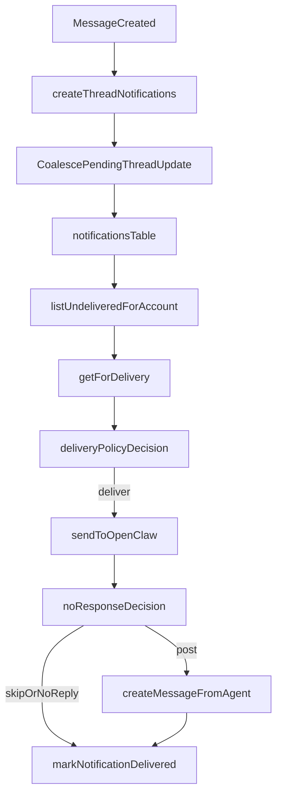

# Runtime Delivery Simplification Plan

## 0) Setup checklist

- Requirements and scope documented from user direction.
- Primary behavior choice confirmed: simplify policies (not strict parity).
- Scope confirmed: cross-layer (`apps/runtime` + `packages/backend/convex` + docs/tests).
- Orchestrator behavior confirmed: keep informed, silent by default unless real action is needed.
- Validate local test/dev environment before implementation (`npm` workspace tests + runtime docker profile).

Assumptions to keep explicit:

- Assumption A: Orchestrator should still receive task updates, but should not auto-post acknowledgments for routine agent updates.
- Assumption B: Explicit coordination should happen via `response_request`, and human escalation remains tied to blocked/escalation conditions.
- Assumption C: Some behavior change is acceptable if it removes noisy/looping outputs and improves determinism.

## 1) Context & goal

The delivery pipeline has accumulated policy logic (retry rules, no-response handling, orchestrator acknowledgments, loop-prevention, prompt assembly) directly inside `delivery.ts`, making it hard to reason about and easy to regress. We will simplify behavior and architecture so that (1) routine updates do not create noisy orchestrator messages, (2) no-response handling has deterministic terminal outcomes (no infinite reprocessing), and (3) notification creation is coalesced upstream to reduce runtime/model churn. Constraints: preserve multi-tenant safety, avoid full-table scans, keep critical action paths reliable (`assignment`, `mention`, `response_request`), and ensure docs/tests remain aligned.

## 2) Codebase research summary

Main files audited:

- Runtime delivery core: `[apps/runtime/src/delivery.ts](apps/runtime/src/delivery.ts)`
- Runtime gateway helpers: `[apps/runtime/src/gateway.ts](apps/runtime/src/gateway.ts)`
- Heartbeat interactions: `[apps/runtime/src/heartbeat.ts](apps/runtime/src/heartbeat.ts)`
- Runtime tests: `[apps/runtime/src/delivery.test.ts](apps/runtime/src/delivery.test.ts)`, `[apps/runtime/src/gateway.test.ts](apps/runtime/src/gateway.test.ts)`
- Notification creation: `[packages/backend/convex/lib/notifications.ts](packages/backend/convex/lib/notifications.ts)`
- Message creation call sites: `[packages/backend/convex/messages.ts](packages/backend/convex/messages.ts)`, `[packages/backend/convex/service/messages.ts](packages/backend/convex/service/messages.ts)`
- Task status/assignment emitters: `[packages/backend/convex/tasks.ts](packages/backend/convex/tasks.ts)`, `[packages/backend/convex/service/tasks.ts](packages/backend/convex/service/tasks.ts)`
- Service notification retrieval context: `[packages/backend/convex/service/notifications.ts](packages/backend/convex/service/notifications.ts)`
- Notification table/indexes: `[packages/backend/convex/schema.ts](packages/backend/convex/schema.ts)`
- Runtime behavior docs: `[docs/runtime/AGENTS.md](docs/runtime/AGENTS.md)`, `[docs/runtime/HEARTBEAT.md](docs/runtime/HEARTBEAT.md)`, `[docs/runtime/runtime-reliability-recovery-checklist.md](docs/runtime/runtime-reliability-recovery-checklist.md)`, `[docs/runtime/runtime-docker-compose.md](docs/runtime/runtime-docker-compose.md)`

What we learned:

- `startDeliveryLoop()` currently mixes orchestration and policy-heavy branching.
- No-response handling is fragmented across runtime and gateway utilities.
- Orchestrator synthetic acknowledgment logic is a direct source of noisy thread messages.
- Notification creation is mostly append-only; `thread_update` has no coalescing, so bursts create multiple orchestrator-triggering notifications.
- `response_request` already has dedupe semantics and is a good pattern to preserve.
- Tests cover many branches but are difficult to maintain due large decision surfaces and shared retry state helpers.

## 3) High-level design

We will implement a cross-layer simplification with three principles:

- **Deterministic outcomes**: each notification reaches a terminal state (delivered/skipped/fallback) without unbounded retry loops.
- **Orchestrator silent-by-default**: orchestrator remains informed via notifications but no synthetic routine progress acknowledgments are auto-posted.
- **Upstream coalescing**: reduce duplicate runtime work by coalescing pending agent `thread_update` notifications per task+recipient.

Target data flow:

Policy simplification matrix (implementation target):

- `thread_update` and passive `status_change`: no synthetic orchestrator ack; no fallback post for routine no-response; mark delivered on terminal no-response.
- `assignment`, `mention`, `response_request`: keep retry budget; on exhausted retries produce one deterministic fallback outcome (single path), then mark delivered.
- Keep loop prevention and orchestrator chat restrictions from `shouldDeliverToAgent`, but simplify nested exception branching and move to dedicated policy module.

## 4) File & module changes

### Existing files to modify

- `[apps/runtime/src/delivery.ts](apps/runtime/src/delivery.ts)`
  - Reduce file to orchestration only: polling, service calls, send/execute, persist/mark-delivered.
  - Remove inline synthetic orchestrator acknowledgment branches from no-response path.
  - Replace ad-hoc nested branching with policy function returns (`retry`, `skip`, `post`, `fallback`, `terminal`).
  - Ensure terminal no-response path does not leave notifications in perpetual retry cycles.
- `[apps/runtime/src/gateway.ts](apps/runtime/src/gateway.ts)`
  - Remove no-response classification duplication if moved to shared runtime delivery module.
  - Keep transport/parsing responsibilities (`sendToOpenClaw`, `sendOpenClawToolResults`, response body parsing).
- `[apps/runtime/src/heartbeat.ts](apps/runtime/src/heartbeat.ts)`
  - Import shared no-response helper(s) from new module to avoid drift with delivery behavior.
  - Keep heartbeat-specific policy unchanged except helper wiring.
- `[apps/runtime/src/delivery.test.ts](apps/runtime/src/delivery.test.ts)`
  - Reframe tests around a compact policy matrix and terminal outcomes.
  - Add tests for simplified no-response terminal behavior and orchestrator silent-default policy.
  - Remove/update tests asserting synthetic orchestrator ack behavior for routine updates.
- `[apps/runtime/src/gateway.test.ts](apps/runtime/src/gateway.test.ts)`
  - Update imports/expectations if no-response helpers are moved.
  - Keep placeholder parsing coverage where still relevant.
- `[packages/backend/convex/lib/notifications.ts](packages/backend/convex/lib/notifications.ts)`
  - Add `thread_update` coalescing for agent recipients: upsert existing undelivered notification per `(taskId, recipientId, type=thread_update)` instead of always inserting a new row.
  - Keep mention/assignment/status behavior intact initially unless explicitly needed by simplification acceptance tests.
- `[packages/backend/convex/messages.ts](packages/backend/convex/messages.ts)`
  - No major behavior redesign; ensure call signature compatibility if `createThreadNotifications` API adds explicit coalescing options.
- `[packages/backend/convex/service/messages.ts](packages/backend/convex/service/messages.ts)`
  - Same as user message path: keep parity and update callsite if helper signature evolves.
- `[packages/backend/convex/lib/notifications.test.ts](packages/backend/convex/lib/notifications.test.ts)`
  - Add coalescing tests for `thread_update` (same recipient/task, multiple rapid messages => single undelivered notification record updated).
- `[docs/runtime/AGENTS.md](docs/runtime/AGENTS.md)`
  - Update orchestrator communication expectations: informed by updates, but no required routine acknowledgment replies.
- `[docs/runtime/runtime-reliability-recovery-checklist.md](docs/runtime/runtime-reliability-recovery-checklist.md)`
  - Update reliability gates to reflect simplified terminal no-response policy and coalesced thread update behavior.
- `[docs/runtime/runtime-docker-compose.md](docs/runtime/runtime-docker-compose.md)`
  - Update delivery behavior section to reflect simplified handling and reduced noisy write-backs.

### New files to create

- `[apps/runtime/src/delivery/policy.ts](apps/runtime/src/delivery/policy.ts)`
  - `shouldDeliverToAgent` decision helpers (or extracted rule subsets).
  - No-response policy evaluators and retry eligibility by notification type.
  - Terminal action enum/union for delivery engine.
  - JSDoc documenting policy matrix and invariants.
- `[apps/runtime/src/delivery/no-response.ts](apps/runtime/src/delivery/no-response.ts)`
  - Unified `NO_REPLY` signal detection and placeholder classification helpers currently split between delivery/gateway.
  - Optional shared fallback text builders for required notification terminal failure.
- `[apps/runtime/src/delivery/prompt.ts](apps/runtime/src/delivery/prompt.ts)`
  - Move `formatNotificationMessage()` and helper formatting functions.
  - Remove duplicate instruction insertion and simplify orchestrator directive set.
- `[apps/runtime/src/delivery/policy.test.ts](apps/runtime/src/delivery/policy.test.ts)`
  - Focused unit tests for compact matrix decisions independent of full loop integration.

## 5) Step-by-step tasks (atomic, junior-friendly)

1. **Create branch and baseline test snapshot**

- Create a dedicated branch from current base.
- Run targeted tests and store baseline command output for comparison.
- Files: no code change yet.

1. **Define policy matrix in code-first doc comments**

- Add a small policy map (notification type -> retry/no-retry, synthetic post allowed, terminal behavior).
- Place in new `[apps/runtime/src/delivery/policy.ts](apps/runtime/src/delivery/policy.ts)`.
- Include JSDoc with invariant: every processed notification reaches terminal state.

1. **Extract no-response primitives**

- Move/centralize no-response signal and placeholder detection to `[apps/runtime/src/delivery/no-response.ts](apps/runtime/src/delivery/no-response.ts)`.
- Update imports in `delivery.ts`, `gateway.ts`, `heartbeat.ts`.
- Keep function names stable where possible or provide temporary re-exports.

1. **Refactor `delivery.ts` to use policy decisions**

- Replace nested no-response branches with a single decision function return.
- Remove synthetic orchestrator routine ack path for passive `thread_update` handling.
- Ensure exhausted retries for required notifications produce one deterministic terminal action and always call `markNotificationDelivered`.
- Ensure passive notification no-response does not requeue forever.

1. **Extract prompt construction**

- Move `formatNotificationMessage()` and related formatting helpers into `[apps/runtime/src/delivery/prompt.ts](apps/runtime/src/delivery/prompt.ts)`.
- Remove duplicated orchestrator instruction insertion and simplify message directives for silent-default orchestration.

1. **Implement backend `thread_update` coalescing**

- In `[packages/backend/convex/lib/notifications.ts](packages/backend/convex/lib/notifications.ts)`, add helper:
  - Find latest undelivered `thread_update` for same `taskId` + `recipientId` (agent recipients).
  - If found: patch existing notification (`messageId`, `title`, `body`, `createdAt`, optional `readAt` reset policy).
  - Else: insert new notification.
- Update both call paths through `messages.ts` and `service/messages.ts` compatibility as needed.

1. **Harden terminal behavior invariants**

- Audit `continue` paths in `[apps/runtime/src/delivery.ts](apps/runtime/src/delivery.ts)` and ensure intentional non-delivery states are explicit and observable.
- Add logs/metrics counters for:
  - coalesced thread updates,
  - terminal no-response skip,
  - required notification exhausted retries.

1. **Rewrite and expand runtime tests**

- Add unit tests for new `policy.ts` decisions.
- Update `delivery.test.ts` for simplified behavior:
  - orchestrator silent default on routine updates,
  - no infinite requeue for terminal no-response,
  - required notification retry budget then terminal action.
- Keep/adjust loop prevention and orchestrator chat routing tests.

1. **Add backend coalescing tests**

- In `notifications.test.ts`, add cases verifying only one undelivered `thread_update` remains per task+recipient while `messageId` advances.
- Validate no regression for mention/assignment/status creation.

1. **Update documentation and reliability checklist**

- Update runtime docs to match simplified policy and explicit escalation behavior.
- Add a concise “delivery policy matrix” section in docs.
- Ensure examples mention `response_request` as explicit coordination trigger.

1. **Integration validation pass**

- Run runtime + backend test suites affected by these changes.
- Execute manual QA flow in local docker profile with orchestrator + engineer conversation replay.
- Verify reduced orchestrator chatter and guaranteed required-response handling.

1. **Release guardrails and fallback plan**

- Document rollback strategy (re-enable legacy policy module via quick revert commit if needed).
- Record monitoring checks for first deployment window (notification volume, no-response terminal counts, delivery errors).

## 6) Edge cases & risks

- **Risk: dropping meaningful updates via coalescing**
  - Mitigation: coalesce only undelivered `thread_update` for agent recipients; retain latest message context.
- **Risk: race between runtime reading and backend coalescing patch**
  - Mitigation: design coalescing as idempotent best-effort; runtime still processes valid notification IDs.
- **Risk: orchestrator misses needed coordination moments**
  - Mitigation: keep delivery to orchestrator, remove only synthetic routine ack posting; preserve explicit `response_request` handling and blocked/escalation instructions.
- **Risk: terminal no-response hides failures**
  - Mitigation: emit structured logs/metrics and (for required notification types) preserve a deterministic terminal fallback outcome.
- **Risk: docs drift from behavior**
  - Mitigation: docs update mandatory in same change set; checklist gate references code symbols.
- **Risk: test brittleness from shared mutable retry state**
  - Mitigation: isolate policy tests and reset retry state per test block.

## 7) Testing strategy

### Unit tests

- Runtime policy matrix unit tests in new `policy.test.ts`.
- No-response helper tests in new `no-response` test file or moved gateway tests.
- Backend notification coalescing unit tests in `lib/notifications.test.ts`.

### Integration tests

- Delivery loop behavior in `delivery.test.ts` with matrix-driven scenarios:
  - passive update no-response terminal skip,
  - required notification retry then terminal action,
  - orchestrator chat routing and review-role routing.
- Backend + runtime integration path (notification creation -> retrieval context -> delivery result) for one end-to-end scenario per type.

### Manual QA checklist

- Post multiple rapid engineer updates on one task and verify orchestrator receives at most one pending update at a time.
- Verify orchestrator does not auto-post routine “ack” messages.
- Trigger `response_request` and ensure orchestrator/target agent responds when needed.
- Force no-response from agent on `assignment` and verify deterministic terminal handling (no endless retries).
- Confirm blocked flow still escalates correctly and prompts required action.

## 8) Rollout / migration

- No destructive data migration expected.
- If coalescing uses existing indexes, no schema migration needed; if index optimization is later required, add as separate migration PR.
- Deployment safety:
  - land in 2 PRs if needed:
    1. runtime policy/module split,
    2. backend coalescing + doc/test alignment.
- Observability to add/track:
  - `delivery.no_response_terminal_skip_count`
  - `delivery.required_notification_retry_exhausted_count`
  - `notifications.thread_update_coalesced_count`
- Rollback:
  - quick revert of policy module wiring in runtime;
  - quick revert of backend coalescing helper.

## 9) TODO checklist

### Backend

- Add `thread_update` coalescing helper in `[packages/backend/convex/lib/notifications.ts](packages/backend/convex/lib/notifications.ts)`.
- Update `createThreadNotifications()` to upsert pending undelivered agent thread updates.
- Validate callsites in `[packages/backend/convex/messages.ts](packages/backend/convex/messages.ts)` and `[packages/backend/convex/service/messages.ts](packages/backend/convex/service/messages.ts)`.
- Add/adjust tests in `[packages/backend/convex/lib/notifications.test.ts](packages/backend/convex/lib/notifications.test.ts)`.

### Runtime

- Create `[apps/runtime/src/delivery/policy.ts](apps/runtime/src/delivery/policy.ts)` with explicit policy matrix and JSDoc invariants.
- Create `[apps/runtime/src/delivery/no-response.ts](apps/runtime/src/delivery/no-response.ts)` and migrate helper usage.
- Create `[apps/runtime/src/delivery/prompt.ts](apps/runtime/src/delivery/prompt.ts)` and move formatting logic.
- Refactor `[apps/runtime/src/delivery.ts](apps/runtime/src/delivery.ts)` to orchestrate only and remove synthetic routine orchestrator ack behavior.
- Ensure terminal no-response paths always resolve notification state (no perpetual requeue loops).
- Align `[apps/runtime/src/gateway.ts](apps/runtime/src/gateway.ts)` and `[apps/runtime/src/heartbeat.ts](apps/runtime/src/heartbeat.ts)` imports with new helper modules.

### Tests

- Add matrix-driven unit tests for policy decisions in `[apps/runtime/src/delivery/policy.test.ts](apps/runtime/src/delivery/policy.test.ts)`.
- Update `[apps/runtime/src/delivery.test.ts](apps/runtime/src/delivery.test.ts)` for simplified policy and terminal behavior.
- Update `[apps/runtime/src/gateway.test.ts](apps/runtime/src/gateway.test.ts)` for moved no-response helpers.
- Run targeted backend/runtime test suites and verify no regressions.

### Docs

- Update orchestrator messaging expectations in `[docs/runtime/AGENTS.md](docs/runtime/AGENTS.md)`.
- Update reliability gates in `[docs/runtime/runtime-reliability-recovery-checklist.md](docs/runtime/runtime-reliability-recovery-checklist.md)`.
- Update delivery behavior notes in `[docs/runtime/runtime-docker-compose.md](docs/runtime/runtime-docker-compose.md)`.

### Validation & rollout

- Run manual QA scenarios for orchestrator silent-default + required response guarantees.
- Record metrics/log checks and rollback steps in implementation PR description.
