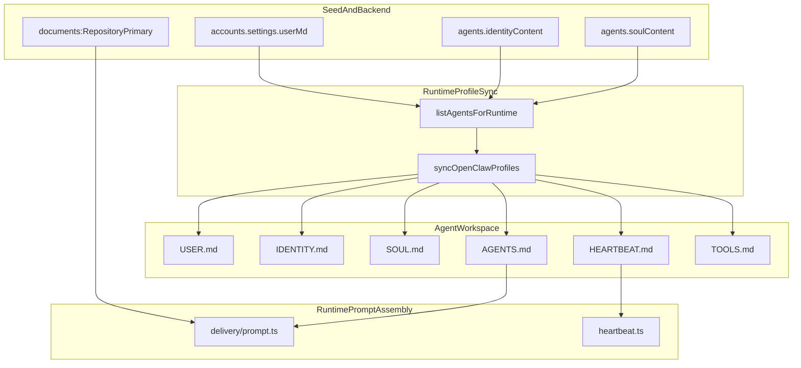

# USER + IDENTITY Prompt Layering Refactor

## Phase 0: Setup checklist (must be done before implementation)

- Requirements / scope documented (this plan).
- Acceptance criteria defined (below).
- Ensure runtime + Convex dev environment is ready and run.

Implementation acceptance criteria:

- Every synced agent workspace has `USER.md` and `IDENTITY.md` in addition to `SOUL.md`, `AGENTS.md`, `HEARTBEAT.md`, `TOOLS.md`.
- `USER.md` is account-shared and editable from Settings UI (admin/owner).
- Existing accounts/agents are migrated immediately (selected rollout: migrate-all-now).
- Static prompt layers no longer hardcode Mission Control repo details in runtime prompt builders.
- AGENTS contract is cleaned: repo-specific instructions removed from static AGENTS and moved to seed-owned content.
- Prompt logic no longer depends on hardcoded role/slug names (`qa`, `squad-lead`) for review/close permissions.

## 1. Context & goal

We are doing a major prompt architecture refactor to make the runtime open-source-ready and forkable: platform behavior (task orchestration, status semantics, tool contract, multi-assignee protocol) must stay static and deterministic in runtime code/docs, while account/agent persona and repo-specific instructions must be seed-owned and editable in the right place. We will add account-shared `USER.md`, per-agent `IDENTITY.md`, clean AGENTS ownership boundaries, and migrate existing data immediately.

Key constraints:

- Multi-tenant safety and account isolation remain unchanged.
- Backward compatibility: existing agents with missing new fields still receive effective USER/IDENTITY via fallback.
- Prompt size and determinism: validate and cap new editable text.
- UI permissions: only admin/owner can persist USER profile changes.

## 2. Codebase research summary

Main files audited:

- Runtime prompt/materialization:
  - [apps/runtime/src/openclaw-profiles.ts](apps/runtime/src/openclaw-profiles.ts)
  - [apps/runtime/src/delivery/prompt.ts](apps/runtime/src/delivery/prompt.ts)
  - [apps/runtime/src/delivery/policy.ts](apps/runtime/src/delivery/policy.ts)
  - [apps/runtime/src/heartbeat.ts](apps/runtime/src/heartbeat.ts)
  - [apps/runtime/src/config.ts](apps/runtime/src/config.ts)
  - [apps/runtime/src/agent-sync.ts](apps/runtime/src/agent-sync.ts)
- Backend data + seed:
  - [packages/backend/convex/schema.ts](packages/backend/convex/schema.ts)
  - [packages/backend/convex/accounts.ts](packages/backend/convex/accounts.ts)
  - [packages/backend/convex/agents.ts](packages/backend/convex/agents.ts)
  - [packages/backend/convex/service/agents.ts](packages/backend/convex/service/agents.ts)
  - [packages/backend/convex/service/actions.ts](packages/backend/convex/service/actions.ts)
  - [packages/backend/convex/service/notifications.ts](packages/backend/convex/service/notifications.ts)
  - [packages/backend/convex/seed.ts](packages/backend/convex/seed.ts)
  - [packages/backend/convex/lib/behavior_flags.ts](packages/backend/convex/lib/behavior_flags.ts)
- Frontend:
  - [apps/web/src/app/(dashboard)/[accountSlug]/settings/page.tsx](<apps/web/src/app/(dashboard)/[accountSlug]/settings/page.tsx>)
  - [apps/web/src/app/(dashboard)/[accountSlug]/admin/openclaw/page.tsx](<apps/web/src/app/(dashboard)/[accountSlug]/admin/openclaw/page.tsx>)
  - [apps/web/src/app/(dashboard)/[accountSlug]/agents/[agentId]/\_components/AgentBehaviorFlagsCard.tsx](<apps/web/src/app/(dashboard)/[accountSlug]/agents/[agentId]/_components/AgentBehaviorFlagsCard.tsx>)
- Docs/tests:
  - [docs/runtime/AGENTS.md](docs/runtime/AGENTS.md)
  - [docs/runtime/HEARTBEAT.md](docs/runtime/HEARTBEAT.md)
  - [apps/runtime/src/openclaw-profiles.test.ts](apps/runtime/src/openclaw-profiles.test.ts)
  - [apps/runtime/src/delivery.test.ts](apps/runtime/src/delivery.test.ts)
  - [apps/runtime/src/delivery/policy.test.ts](apps/runtime/src/delivery/policy.test.ts)

What we learned:

- Workspace files are written only in `syncOpenClawProfiles`: currently `SOUL.md`, `AGENTS.md`, `HEARTBEAT.md`, `TOOLS.md`, and `skills/*/SKILL.md`.
- Prompt logic is duplicated in three places (`DEFAULT_*` runtime constants, `seed.ts` doc constants, `docs/runtime/*`) and has Mission Control-specific hardcoding.
- Delivery prompt includes hardcoded repo path/worktree/branch conventions and static strings tied to this repository.
- Review/close permissions rely on hardcoded role/slug heuristics (`qa`, `squad lead`) instead of explicit behavior configuration.
- Settings UI already has a strong pattern for account-level editable settings via `accounts.update`.

## 3. High-level design

### Prompt ownership model

- **Static runtime contract (code-owned):** task lifecycle semantics, tool usage protocol, notification policies, heartbeat orchestration, multi-assignee coordination mechanics.
- **Seed-owned account/agent context:** repo-specific workflow instructions, account USER profile, per-agent identity/persona.
- **Materialized agent workspace files:** generated by runtime profile sync from effective backend data.

### AGENTS separation target

Static `AGENTS.md` keeps platform invariants only. Remove repo-specific and seed-specific content from static AGENTS and keep it in seed-owned docs/fields.

Remove from static AGENTS:

- `## Primary repository`
- `### Task worktree (required)`
- `## Runtime ownership (critical)`
- `### Creating a PR`
- `#### One branch per task`
- Any hardcoded `openclaw-mission-control` URLs/paths/base branch examples.

Keep in static AGENTS:

- `## Non-negotiable rules`
- `## Task state rules`
- `## Working with multiple assignees`
- `## Capabilities and tools`
- `## How to update task status`
- `## Communication rules`
- `## Safety / secrets`

## 4. File & module changes

### Backend schema and APIs

- [packages/backend/convex/schema.ts](packages/backend/convex/schema.ts)
  - Add `accounts.settings.userMd?: string` (account-shared USER).
  - Add `agents.identityContent?: string` (per-agent IDENTITY).
  - Extend `behaviorFlags` with explicit review/close capabilities (replace role-name heuristics):
    - `canReviewTasks: boolean`
    - `canMarkDone: boolean`
- [packages/backend/convex/accounts.ts](packages/backend/convex/accounts.ts)
  - Extend `accountSettingsValidator` to accept `userMd`.
  - Merge `settings.userMd` safely in `update` without clobbering unrelated settings.
  - Add server-side length validation for `userMd` (hard cap, deterministic error).
- [packages/backend/convex/agents.ts](packages/backend/convex/agents.ts)
  - Extend `create`/`update` args to include optional `identityContent`.
  - Extend `updateOpenclawConfig` behavior flags schema for `canReviewTasks` and `canMarkDone`.
  - Add migration mutation for immediate rollout on existing data (account-scoped admin mutation).
- [packages/backend/convex/lib/behavior_flags.ts](packages/backend/convex/lib/behavior_flags.ts)
  - Update `BehaviorFlags` type with new review/close flags.
  - Keep resolution order: agent override -> account defaults -> shared default.
- [packages/backend/convex/service/agents.ts](packages/backend/convex/service/agents.ts)
  - Include effective `userMd` and `identityContent` in runtime payload.
  - Compute fallback identity content when absent (pure helper function).
- [packages/backend/convex/service/actions.ts](packages/backend/convex/service/actions.ts)
  - Update `AgentForRuntimePayload` shape for new effective fields.
  - Ensure type-safe pass-through for runtime profile sync.
- [packages/backend/convex/seed.ts](packages/backend/convex/seed.ts)
  - Add seed builders:
    - `buildUserContent(...)` (account-shared default USER template)
    - `buildIdentityContent(...)` (per-agent IDENTITY template)
  - During seed run, set `accounts.settings.userMd` if missing.
  - During seed run, set/refresh `agents.identityContent` for seed agents.
  - Re-split seed docs so repo-specific guidance is seed-owned; AGENTS seed doc becomes platform-only reference.
  - Update `ensureDocs` management logic for all prompt-critical managed docs (not AGENTS-only special-case).
- [packages/shared/src/types/index.ts](packages/shared/src/types/index.ts)
  - Extend `OpenClawConfig.behaviorFlags` interface with review/close flags.
- [packages/shared/src/constants/index.ts](packages/shared/src/constants/index.ts)
  - Extend `DEFAULT_OPENCLAW_CONFIG.behaviorFlags` with deterministic defaults for new flags.

### Runtime profile sync and prompt assembly

- [apps/runtime/src/openclaw-profiles.ts](apps/runtime/src/openclaw-profiles.ts)
  - Extend `AgentForProfile` with `effectiveUserMd` and `effectiveIdentityContent`.
  - Write `USER.md` and `IDENTITY.md` per agent with `writeIfChanged`.
  - Update docs/comments to reflect all workspace files.
  - Keep embedded defaults minimal and platform-only where fallback is unavoidable.
- [apps/runtime/src/agent-sync.ts](apps/runtime/src/agent-sync.ts)
  - Type alignment for expanded runtime payload.
- [apps/runtime/src/delivery/types.ts](apps/runtime/src/delivery/types.ts)
  - Extend `effectiveBehaviorFlags` type for new review/close flags.
- [apps/runtime/src/delivery/policy.ts](apps/runtime/src/delivery/policy.ts)
  - Remove role/slug heuristic helpers from control decisions.
  - Base review delivery + done gating on explicit behavior flags and orchestrator identity.
- [apps/runtime/src/delivery.ts](apps/runtime/src/delivery.ts)
  - Compute `canMarkDone` from explicit effective flags + task status.
  - Remove dependency on QA slug/role inference.
- [apps/runtime/src/delivery/prompt.ts](apps/runtime/src/delivery/prompt.ts)
  - Remove hardcoded Mission Control repo/worktree/base-branch text.
  - Keep only static behavior instructions (status/tool semantics).
  - Depend on seed-provided repository context document for repo-specific workflow.
- [apps/runtime/src/heartbeat.ts](apps/runtime/src/heartbeat.ts)
  - Verify heartbeat prompt stays platform/static only; remove any role-name assumptions.
- [apps/runtime/src/config.ts](apps/runtime/src/config.ts)
  - If needed, add explicit env surface for optional USER/IDENTITY static fallback paths.
  - Keep backward compatibility defaults.

### Frontend (Settings + behavior flags)

- [apps/web/src/app/(dashboard)/[accountSlug]/settings/page.tsx](<apps/web/src/app/(dashboard)/[accountSlug]/settings/page.tsx>)
  - Add `Agent Profile` tab for account-shared `USER.md` editing.
  - Add local state hydration from `account.settings.userMd`.
  - Add save handler (`api.accounts.update`) and admin-only save capability.
  - Show read-only state for non-admin members.
- [apps/web/src/app/(dashboard)/[accountSlug]/admin/openclaw/page.tsx](<apps/web/src/app/(dashboard)/[accountSlug]/admin/openclaw/page.tsx>)
  - Add migration trigger button for prompt scaffold migration (immediate rollout).
  - Extend default behavior flag controls for `canReviewTasks` and `canMarkDone`.
- [apps/web/src/app/(dashboard)/[accountSlug]/agents/[agentId]/\_components/AgentBehaviorFlagsCard.tsx](<apps/web/src/app/(dashboard)/[accountSlug]/agents/[agentId]/_components/AgentBehaviorFlagsCard.tsx>)
  - Add per-agent override controls for new review/close flags.
- [apps/web/src/lib/settings-validation.ts](apps/web/src/lib/settings-validation.ts)
  - Add client validator for USER markdown length and basic sanity checks.

### Documentation updates

- [docs/runtime/AGENTS.md](docs/runtime/AGENTS.md)
  - Remove repo-specific sections listed above; keep platform contract only.
- [docs/runtime/HEARTBEAT.md](docs/runtime/HEARTBEAT.md)
  - Ensure heartbeat instructions remain platform/static and role-agnostic.
- [docs/runtime/runtime-docker-compose.md](docs/runtime/runtime-docker-compose.md)
  - Document that runtime now writes `USER.md` and `IDENTITY.md` per workspace.
- [apps/runtime/README.md](apps/runtime/README.md)
  - Update profile sync section and prompt ownership explanation.
- New docs:
  - [docs/runtime/USER_TEMPLATE.md](docs/runtime/USER_TEMPLATE.md)
  - [docs/runtime/IDENTITY_TEMPLATE.md](docs/runtime/IDENTITY_TEMPLATE.md)
  - [docs/runtime/PROMPT_LAYERING_AUDIT.md](docs/runtime/PROMPT_LAYERING_AUDIT.md)
    - Inventory all prompt/guidance sources and ownership rules.

## 5. Step-by-step tasks (atomic)

1. **Worktree setup + branch isolation**

- Create and switch to feature worktree (`feat/seed-user-identity`) and verify `pwd` is worktree path.

2. **Schema extension commit**

- Update `schema.ts` for `settings.userMd`, `agents.identityContent`, and new behavior flags.
- Regenerate Convex types.

3. **Shared config/type alignment commit**

- Extend shared `OpenClawConfig` types and `DEFAULT_OPENCLAW_CONFIG.behaviorFlags`.
- Update shared constant tests.

4. **Backend settings API commit**

- Extend `accounts.update` validator + merge logic for `userMd` and validation bounds.

5. **Backend agent API + migration commit**

- Extend `agents.create`/`agents.update` for `identityContent`.
- Extend `updateOpenclawConfig` behavior flags.
- Add account-scoped admin migration mutation returning counts.

6. **Seed ownership refactor commit**

- Add USER/IDENTITY seed builders.
- Seed `settings.userMd` defaults and `identityContent` for seed agents.
- Reassign repo-specific instructions to seed-managed docs.
- Update managed-doc sync logic in `ensureDocs`.

7. **Runtime payload expansion commit**

- Extend `service/agents.listForRuntime` + `service/actions.listAgentsForRuntime` to return effective USER/IDENTITY.

8. **Profile sync file materialization commit**

- Update `openclaw-profiles.ts` to write `USER.md` and `IDENTITY.md` with idempotent writes.
- Update `agent-sync.ts` type usage.

9. **Delivery/policy decoupling commit**

- Remove role/slug QA/reviewer heuristics.
- Base review/done behavior on explicit behavior flags.
- Update `delivery.ts`, `delivery/policy.ts`, and `delivery/types.ts`.

10. **AGENTS separation commit**

- Remove repo-specific sections from static AGENTS docs and runtime defaults.
  - Remove hardcoded repo/worktree constants and Mission Control-specific wording from `delivery/prompt.ts`.
  - Keep task/orchestrator/tool behavior static.

11. **Settings UI USER editor commit**

- Add new settings tab and save flow for `USER.md` account content.
  - Add client-side validation and admin-only write behavior.

12. **Admin migration + behavior flags UI commit**

- Add migration button in OpenClaw admin page.
  - Surface new behavior flags in admin defaults and per-agent override card.

13. **Prompt audit documentation commit**

- Add `PROMPT_LAYERING_AUDIT.md`, `USER_TEMPLATE.md`, `IDENTITY_TEMPLATE.md`.
  - Update runtime docs and docker-compose docs.

14. **Test updates commit**

- Runtime tests, policy tests, delivery tests, profile sync tests, shared constant tests.
  - Add migration-focused tests for backend helpers/mutation behavior.

15. **Manual QA + rollout runbook commit**

- Execute migration in target account(s), verify workspace files and UI behavior, and document runbook.

## 6. Edge cases & risks

- Missing new fields on existing data:
  - Mitigation: migration + runtime effective fallback builders.
- Prompt bloat from large `USER.md`:
  - Mitigation: enforce max bytes in backend validation; show UI limits.
- Drift between static AGENTS docs and runtime fallback constants:
  - Mitigation: add tests asserting prohibited repo-specific tokens are absent in static AGENTS and delivery prompt.
- Breaking review/close workflow while removing role heuristics:
  - Mitigation: migrate explicit behavior flags for existing QA/orchestrator setups; add targeted policy tests.
- Managed seed docs overriding user-edited reference docs:
  - Mitigation: define managed titles explicitly and document behavior; provide migration report output.
- Duplicate reference docs title ambiguity:
  - Mitigation: resolve repository/global docs deterministically (latest active document, ignore deleted).

## 7. Testing strategy

### Unit tests to update/add

- Runtime:
  - [apps/runtime/src/openclaw-profiles.test.ts](apps/runtime/src/openclaw-profiles.test.ts)
    - Assert `USER.md` and `IDENTITY.md` writes, idempotence, fallback behavior.
  - [apps/runtime/src/delivery.test.ts](apps/runtime/src/delivery.test.ts)
    - Assert removal of hardcoded repo strings in static prompt content.
    - Assert done/review behavior follows flags rather than role names.
  - [apps/runtime/src/delivery/policy.test.ts](apps/runtime/src/delivery/policy.test.ts)
    - Rewrite reviewer/QA tests to behavior-flag-based expectations.
  - [apps/runtime/src/heartbeat.test.ts](apps/runtime/src/heartbeat.test.ts)
    - Keep static behavior assertions valid after wording changes.
- Shared:
  - [packages/shared/src/constants/**tests**/constants.test.ts](packages/shared/src/constants/__tests__/constants.test.ts)
    - Include new behavior flag expectations.
- Backend:
  - Add tests around migration/default builders (new test file near convex lib/helpers).

### Integration/manual QA checklist

- Seed + migration:
  - Run seed and migration on an existing account.
  - Verify `accounts.settings.userMd` exists.
  - Verify each seed agent has `identityContent`.
- Runtime sync:
  - Enable profile sync, wait one sync interval, verify workspace has `USER.md` + `IDENTITY.md` per agent.
- UI:
  - Edit USER text in Settings as admin, save, verify persistence and propagation to workspace after sync.
  - Confirm non-admin cannot save.
- Delivery behavior:
  - Trigger assignment/thread_update/review flows and verify no hardcoded repo assumptions in generated prompts.
  - Verify review/done logic uses explicit behavior flags.

## 8. Rollout / migration

- Deployment order:
  1. Deploy backend schema + API changes.
  2. Deploy frontend Settings/Admin updates.
  3. Deploy runtime profile sync + prompt logic changes.
- Immediate migration (selected):
  - Run migration mutation for each production account (or all owned accounts via scripted loop).
  - Capture output counts (`accountsUpdated`, `agentsUpdated`, `docsUpdated`).
- Runtime propagation:
  - Trigger runtime restart or wait for next `AGENT_SYNC_INTERVAL` to materialize `USER.md`/`IDENTITY.md`.
- Observability:
  - Add temporary logs for profile sync write operations and migration summary.
  - Verify no spike in delivery failures after policy change.

## 9. TODO checklist

### Backend

- Add `settings.userMd` and `agents.identityContent` to schema.
- Extend behavior flags with `canReviewTasks` and `canMarkDone` across schema/shared/backend validators.
- Update `accounts.update` to accept/validate/persist `userMd`.
- Update `agents.create`/`agents.update` to support `identityContent`.
- Add migration mutation for existing account data.
- Update seed builders for USER and IDENTITY and managed seed docs.
- Update runtime payload (`listForRuntime`) to include effective USER/IDENTITY.

### Runtime

- Write `USER.md` and `IDENTITY.md` in profile sync.
- Refactor delivery policy to remove role/slug QA heuristics.
- Refactor delivery prompt to remove hardcoded Mission Control repo details.
- Ensure static AGENTS/HEARTBEAT remain behavior-only and repo-agnostic.

### Frontend

- Add Settings tab/editor for account-shared USER content.
- Gate USER save by admin/owner permission.
- Add migration trigger UI for immediate rollout.
- Extend behavior flags UI for review/done capabilities.

### Docs

- Update static AGENTS doc and list removed sections explicitly in changelog/docs.
- Add `USER_TEMPLATE.md` and `IDENTITY_TEMPLATE.md`.
- Add `PROMPT_LAYERING_AUDIT.md` documenting static vs seed ownership.
- Update runtime README + docker-compose docs with new workspace files and migration steps.

### Tests & QA

- Update runtime tests (`openclaw-profiles`, `delivery`, `delivery/policy`, `heartbeat`).
- Update shared constant tests for new behavior flags.
- Add backend migration/helper tests.
- Run manual end-to-end QA: seed -> migrate -> edit USER -> runtime sync -> notification flow.
- Validate no hardcoded Mission Control repo strings remain in static prompt builders.
